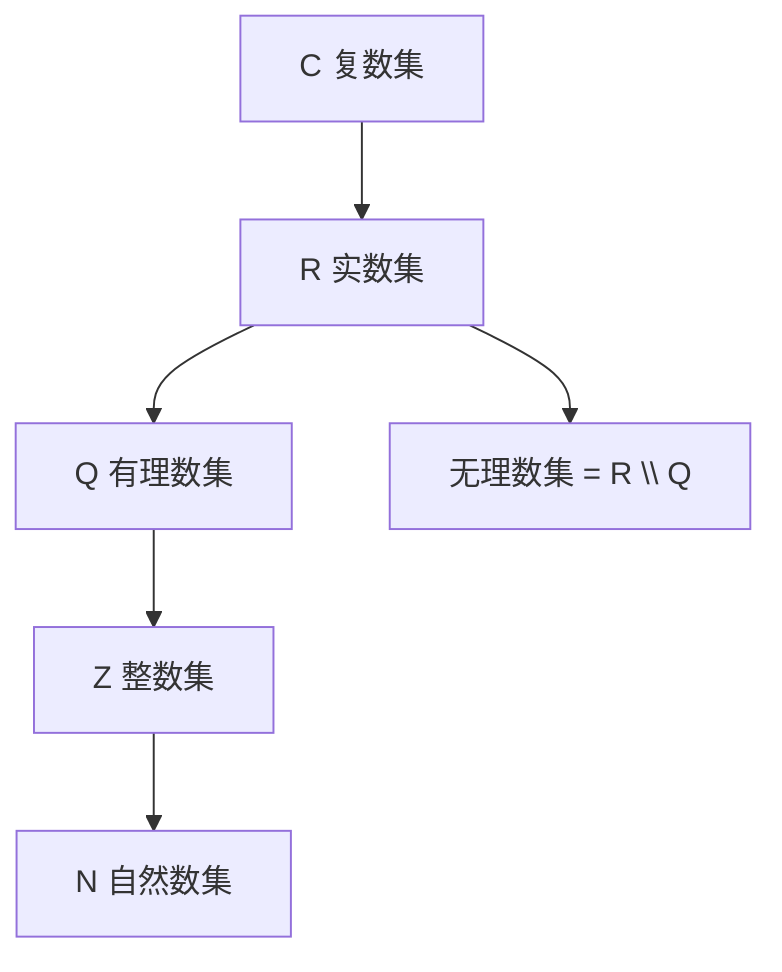
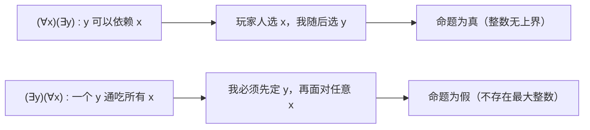
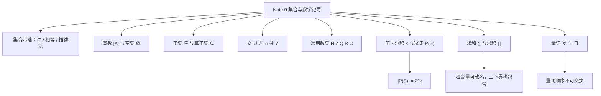

# Note 0 集合与数学记号复习

> 本笔记对应 CS 70《离散数学与概率论》Fall 2026 Course Notes Note 0: *Review of Sets and Mathematical Notation*。Note 0 是整门课的"语言基础"：它不讨论深奥定理，而是把后面所有笔记都要用到的**集合语言**和**数学记号**一次性交代清楚。因此本文的重点是"看懂符号、会用符号"。

---

## 0. 为什么先学集合？

数学的每个分支都要先约定"我们在讨论什么对象"。集合（set）就是用来框定研究对象的最基本工具：**一个集合就是一堆被明确划定范围的对象的整体**。

> **定义（集合）**：集合是一个**定义良好（well defined）**的对象的汇集；其中的对象称为该集合的**元素（element）**或**成员（member）**。

**⚠️ 注意**："定义良好"是关键词。它意味着对任意一个对象，我们都能明确判断"它是不是这个集合的元素"，不能出现模棱两可的情况。例如"所有很大的数"就不是一个定义良好的集合，因为"很大"没有明确标准。

元素的种类没有任何限制：可以是数字、字母、人、城市，甚至可以**是另一个集合**。

**约定**：集合通常用**大写字母**表示，通过"列出元素并用花括号包起来"来描述。

**例**：我们可以用文字描述集合 $A$ 为"前五个素数构成的集合"，也可以直接写出来：

$$A = \{2, 3, 5, 7, 11\}$$

### 0.1 属于与不属于

- 若 $x$ 是 $A$ 的元素，记作 $x \in A$；
- 若 $y$ 不是 $A$ 的元素，记作 $y \notin A$。

### 0.2 集合相等

> **定义（集合相等）**：两个集合 $A$ 与 $B$ 相等，记作 $A = B$，当且仅当它们含有**完全相同的元素**。

**⚠️ 注意（易错点）**：集合中元素的**顺序不重要**，元素的**重复也不重要**。因此

$$\{\text{red}, \text{white}, \text{blue}\} = \{\text{blue}, \text{white}, \text{red}\} = \{\text{red}, \text{white}, \text{white}, \text{blue}\}$$

这三个写法表示的是**同一个集合**。这与"数列"完全不同——数列中 $\{1,2\}$ 与 $\{2,1\}$ 是两种不同的排列，而作为集合它们相等。

### 0.3 用规则描述集合

有时候把元素全部列出来并不现实（甚至不可能），于是我们用"满足某条件的对象"来描述集合。例如全体有理数构成集合 $\mathbb{Q}$：

$$\mathbb{Q} = \left\{\frac{a}{b} \;\middle|\; a, b \text{ 是整数},\; b \neq 0\right\}$$

这句话用中文读出来是："**所有这样的分数 $a/b$ 所构成的集合：其中分子 $a$ 是整数，分母 $b$ 是非零整数。**"

这里 `|` 左边的 $\frac{a}{b}$ 说明"元素长什么样"，右边的 $a,b$ 是整数、$b \neq 0$ 说明"必须满足什么条件"。

**⚠️ 注意**：条件 $b \neq 0$ 绝不能省。数学中除以零没有定义，若允许 $b = 0$，上面这个集合的描述就失效了。

### 0.4 为什么分母不能为 0（补充说明）

**补充说明**：由 $b = 0$ 出发，任何"$a/0 = c$"的说法都会推出 $a = c \cdot 0 = 0$；也就是说，若 $a \neq 0$ 则无解，若 $a = 0$ 则任何 $c$ 都"成立"。这两种情况都破坏了"$a/b$ 是一个确定的数"这一前提，所以分母必须非零。这正是上面定义中写 $b \neq 0$ 的原因。

**✅ 本节要点总结**
- 集合 = 定义良好的一堆对象；元素可以是任何东西，包括集合。
- $x \in A$ 表示属于，$x \notin A$ 表示不属于。
- 集合相等只看元素是否相同，**顺序与重复无关**。
- 复杂集合可用"描述法" $\{\text{元素形式} \mid \text{条件}\}$ 定义，条件必须写全（如 $b \neq 0$）。

---

## 1. 基数（Cardinality）

> **定义（基数）**：集合的大小称为它的**基数（cardinality）**，记作 $|A|$。它是集合中元素的**个数**。

**例**：若 $A = \{1, 2, 3, 4\}$，则 $|A| = 4$。

### 1.1 空集

一个集合的基数可以是 $0$。这样的集合是**唯一**的，称为**空集（empty set）**，记作

$$\emptyset \quad (\text{也常写作 } \{\})$$

**⚠️ 注意**：空集只有一个，它不含有任何元素。不要把 $\emptyset$ 与 $\{\emptyset\}$ 混为一谈：后者**含有一个元素**（这个元素恰好是空集），所以 $|\{\emptyset\}| = 1$ 而 $|\emptyset| = 0$。

### 1.2 无限集

集合也可以含有**无限多个**元素，例如全体整数构成的集合、全体素数构成的集合、全体奇数构成的集合。

**⚠️ 注意**：本课程后续会区分"可数无限"与"不可数无限"，届时"基数"的含义会被推广到无限集上。在 Note 0 这一阶段，$|A|$ 只对有限集给出一个具体的数。**补充说明**：不要把无限集的基数简单写成"$\infty$"当作数字来运算，那不是本课程的做法。

**✅ 本节要点总结**
- 基数 $|A|$ 就是元素个数。
- 空集唯一，记作 $\emptyset$ 或 $\{\}$，基数为 $0$。
- 集合可以是无限的（如 $\mathbb{Z}$、素数集、奇数集）。

---

## 2. 子集与真子集（Subsets and Proper Subsets）

> **定义（子集）**：若集合 $A$ 的每一个元素也都属于集合 $B$，则称 $A$ 是 $B$ 的**子集**，记作
> $$A \subseteq B$$
> 等价地，也可写作 $B \supseteq A$，并称 $B$ 是 $A$ 的**超集（superset）**。

> **定义（真子集）**：若 $A$ 是 $B$ 的子集，且 $A$ **至少缺少 $B$ 中一个元素**（即 $A$ 被严格包含于 $B$），则称 $A$ 是 $B$ 的**真子集**，记作
> $$A \subset B$$

**例**：取 $B = \{1, 2, 3, 4, 5\}$。

- $\{1,2,3\}$ 既是 $B$ 的子集，又是 $B$ 的**真**子集；
- $\{1,2,3,4,5\}$ 是 $B$ 的子集，但**不是** $B$ 的真子集（因为它没有缺少任何元素）。

**⚠️ 注意（最容易错的一点）**：一个集合**永远是它自己的子集**（$A \subseteq A$ 恒成立），但**永远不是它自己的真子集**（$A \subset A$ 不成立）。判断真子集时，多问一句："有没有漏掉元素？"

### 2.1 关于子集的基本性质

> **性质 2.1（空集的性质）**
> - 空集是任何**非空**集合 $A$ 的**真子集**：$\{\} \subset A$；
> - 空集是**任何**集合 $B$ 的**子集**：$\{\} \subseteq B$；
> - **每个**集合 $A$ 都是它自己的子集：$A \subseteq A$。

**这几条为什么成立（补充说明）**：

1. "空集是任何集合的子集"之所以成立，是因为子集的定义是"$A$ 的**每一个**元素都属于 $B$"。空集里根本没有元素，所以不存在"反例元素"来破坏这个条件——条件**空真（vacuously true）**地成立。
2. 一旦 $B$ 非空，$B$ 中至少有一个元素是空集所没有的，于是"至少缺少一个元素"这一条也满足，故空集是 $B$ 的**真**子集。若 $B = \emptyset$，则"缺少元素"这一条不成立，所以 $\emptyset$ 不是 $\emptyset$ 的真子集。

**✅ 本节要点总结**
- $A \subseteq B$：$A$ 的每个元素都在 $B$ 里。
- $A \subset B$：在 $A \subseteq B$ 的基础上，$B$ 中还剩了元素没被 $A$ 取到。
- $A \subseteq A$ 恒真；$A \subset A$ 恒假。
- $\emptyset \subseteq B$ 对任意 $B$ 成立；$\emptyset \subset A$ 只对非空 $A$ 成立。

---

## 3. 交集与并集（Intersections and Unions）

> **定义（交集）**：集合 $A$ 与集合 $B$ 的**交集**，记作 $A \cap B$，是**同时属于 $A$ 和 $B$** 的所有元素构成的集合。

> **定义（不相交）**：若 $A \cap B = \emptyset$，则称 $A$ 与 $B$ 是**不相交的（disjoint）**。

> **定义（并集）**：集合 $A$ 与集合 $B$ 的**并集**，记作 $A \cup B$，是**属于 $A$、或属于 $B$、或同时属于两者**的所有元素构成的集合。

**⚠️ 注意**：并集定义里的"或"是**包含或（inclusive or）**，即"两者都算"；这与日常语言中"或"有时表示"二选一"不同。请牢记 $A \cup B$ 包含 $A \cap B$ 中的元素。

**例**：设 $A$ 是全体正偶数构成的集合，$B$ 是全体正奇数构成的集合。则

$$A \cap B = \emptyset, \qquad A \cup B = \mathbb{Z}^{+}$$

即全体正整数构成的集合。（这里 $\mathbb{Z}^{+}$ 表示正整数集合。）

### 3.1 交集与并集的基本性质

> **性质 3.1（交换律与单位元性质）**
> - $A \cup B = B \cup A$
> - $A \cup \emptyset = A$
> - $A \cap B = B \cap A$
> - $A \cap \emptyset = \emptyset$

**这四条怎么理解（补充说明）**：

- 前两条关于并集、后两条关于交集，结构一一对应。
- $A \cup B = B \cup A$ 与 $A \cap B = B \cap A$ 说明 $\cup$ 与 $\cap$ 都满足**交换律**：两个集合谁写在前面不影响结果。
- $A \cup \emptyset = A$：并集是"合并"，空集什么都没提供，所以结果还是 $A$。这说明 $\emptyset$ 是并集运算的**单位元**。
- $A \cap \emptyset = \emptyset$：交集要"两边都有"，空集里没有任何元素，所以交集必然为空。

**✅ 本节要点总结**
- $A \cap B$：两边都有的元素；$A \cup B$：两边任意一边有的元素（"或"含"两者都算"）。
- $A \cap B = \emptyset$ 时称 $A$、$B$ 不相交。
- $\cup$ 与 $\cap$ 都满足交换律；$\emptyset$ 是 $\cup$ 的单位元，是 $\cap$ 的"零元"。

---

## 4. 补集（Complements）

> **定义（相对补集 / 差集）**：设 $A$ 与 $B$ 是两个集合，则 $A$ 在 $B$ 中的**相对补集**，或称 $B$ 与 $A$ 的**差集**，记作 $B - A$ 或 $B \setminus A$，定义为"属于 $B$ 但不属于 $A$"的元素构成的集合：
> $$B \setminus A = \{x \in B \mid x \notin A\}$$

**例 1**：若 $B = \{1,2,3\}$，$A = \{3,4,5\}$，则 $B \setminus A = \{1,2\}$。

**例 2**：若 $\mathbb{R}$ 是实数集，$\mathbb{Q}$ 是有理数集，则 $\mathbb{R} \setminus \mathbb{Q}$ 就是**无理数集**。

**⚠️ 注意**：$B \setminus A$ 与 $A \setminus B$ 一般**不相等**，差集不满足交换律。上例中 $A \setminus B = \{4,5\} \neq \{1,2\} = B \setminus A$。

### 4.1 补集的重要性质

> **性质 4.1**
> - $A \setminus A = \emptyset$
> - $A \setminus \emptyset = A$
> - $\emptyset \setminus A = \emptyset$

**这四条怎么理解（补充说明）**：

- $A \setminus A = \emptyset$：把 $A$ 里"属于 $A$ 的部分"全删掉，什么也不剩。
- $A \setminus \emptyset = A$：从 $A$ 里删掉空集里的元素（没有元素），等于什么都没删。
- $\emptyset \setminus A = \emptyset$：$B \setminus A$ 的元素**必须来自 $B$**；$B = \emptyset$ 时没有来源，结果只能为空。

**✅ 本节要点总结**
- $B \setminus A = \{x \in B \mid x \notin A\}$，即"$B$ 中不属于 $A$ 的那些元素"。
- 差集**不满足交换律**：$A \setminus B$ 与 $B \setminus A$ 通常不同。
- $A \setminus A = \emptyset$，$A \setminus \emptyset = A$，$\emptyset \setminus A = \emptyset$。

---

## 5. 几个重要的数集（Some Important Sets）

数学中有一些集合被使用得极其频繁，因此拥有专用符号。它们包括：

| 符号 | 名称 | 内容 |
| :--- | :--- | :--- |
| $\mathbb{N}$ | 自然数集（natural numbers） | $\{0, 1, 2, 3, \dots\}$ |
| $\mathbb{Z}$ | 整数集（integers） | $\{\dots, -2, -1, 0, 1, 2, \dots\}$ |
| $\mathbb{Q}$ | 有理数集（rational numbers） | $\left\{\frac{a}{b} \;\middle|\; a, b \in \mathbb{Z},\; b \neq 0\right\}$ |
| $\mathbb{R}$ | 实数集（real numbers） | 全体实数 |
| $\mathbb{C}$ | 复数集（complex numbers） | 全体复数 |

**⚠️ 注意**：这里 $\mathbb{Q}$ 的定义把"$a,b$ 是整数"改写成了 $a, b \in \mathbb{Z}$，这只是换了一种更紧凑的写法，含义完全一样。请务必习惯 $\in$ 与集合符号混用的这种表达。

**图意说明**：这张图刻画的是各数集之间的**包含关系**（箭头从"大集合"指向"被包含的子集"）。注意两点：$\mathbb{R} \setminus \mathbb{Q}$（无理数集）与 $\mathbb{Q}$ 不相交但共同构成 $\mathbb{R}$；本题中约定自然数集包含 $0$，故 $\mathbb{N} \subset \mathbb{Z}$（真子集）。

### 5.1 关于自然数是否包含 0

> 💡 **补充注释（原文脚注）**：有些人把自然数定义为集合 $\{1, 2, 3, \dots\}$，即不包含 $0$。这纯粹是一个**约定（convention）**问题。**在本课程中，我们假定 $0$ 是自然数**，即 $\mathbb{N} = \{0,1,2,\dots\}$。

**⚠️ 注意**：阅读其他教材或论文时，若遇到 $\mathbb{N}$，请先确认该书的约定。这是"记号相同、含义可能不同"的典型陷阱。

**✅ 本节要点总结**
- $\mathbb{N}$（含 $0$）、$\mathbb{Z}$、$\mathbb{Q}$、$\mathbb{R}$、$\mathbb{C}$ 是本课程最常用的五个数集。
- 包含链：$\mathbb{N} \subseteq \mathbb{Z} \subseteq \mathbb{Q} \subseteq \mathbb{R} \subseteq \mathbb{C}$。
- 本课程约定 $0 \in \mathbb{N}$。

---

## 6. 笛卡尔积与幂集（Products and PowerSets）

### 6.1 笛卡尔积

> **定义（笛卡尔积 / 叉积）**：两个集合 $A$ 与 $B$ 的**笛卡尔积（Cartesian product）**，也称**叉积（cross product）**，记作 $A \times B$，是"第一个分量取自 $A$、第二个分量取自 $B$"的所有**有序对**构成的集合：
> $$A \times B = \{(a, b) \mid a \in A,\; b \in B\}$$

**例 1**：若 $A = \{1,2,3\}$，$B = \{u, v\}$，则

$$A \times B = \{(1,u), (1,v), (2,u), (2,v), (3,u), (3,v)\}$$

**例 2**：

$$\mathbb{N} \times \mathbb{N} = \{(0,0), (1,0), (0,1), (1,1), (2,0), \dots\}$$

即"全体自然数对"构成的集合。

**⚠️ 注意**：$A \times B$ 的元素是**有序对**，不是集合。因此 $(1, u) \neq (u, 1)$。这就意味着一般情况下 $A \times B \neq B \times A$（笛卡尔积不满足交换律）。另外要注意 $|A \times B| = |A| \cdot |B|$（上面例 1 中 $3 \times 2 = 6$ 个有序对）。

### 6.2 幂集

> **定义（幂集）**：给定集合 $S$，$S$ 的**幂集（power set）**记作 $\mathcal{P}(S)$，是 **$S$ 的所有子集**构成的集合：
> $$\mathcal{P}(S) = \{T \mid T \subseteq S\}$$

**例**：若 $S = \{1,2,3\}$，则

$$\mathcal{P}(S) = \{\{\},\ \{1\},\ \{2\},\ \{3\},\ \{1,2\},\ \{1,3\},\ \{2,3\},\ \{1,2,3\}\}$$

**关键结论**：

> **性质 6.1（幂集的基数）**：若 $|S| = k$，则 $|\mathcal{P}(S)| = 2^{k}$。

**为什么是 $2^k$（补充说明）**：构造 $S$ 的一个子集，等价于对 $S$ 中的**每一个**元素独立地回答"要，还是不要"。共有 $k$ 个元素，每个元素有 $2$ 种选择，由乘法原理得 $2^k$ 种不同的选择组合，每一种组合恰好对应一个子集。这就是原文留下"[Why?]"让你思考的地方。

**⚠️ 注意**：$\{\}$（空集）与 $S$ 本身**都**必须是 $\mathcal{P}(S)$ 的元素，这一点最容易漏掉。例中 $|S| = 3$，$|\mathcal{P}(S)| = 2^3 = 8$，正好是列出的 8 个元素。

**✅ 本节要点总结**
- $A \times B = \{(a,b) \mid a \in A, b \in B\}$，元素是**有序对**；$|A \times B| = |A|\cdot|B|$。
- $\mathcal{P}(S) = \{T \mid T \subseteq S\}$，即"所有子集"构成的集合。
- $|S| = k \Rightarrow |\mathcal{P}(S)| = 2^k$；$\emptyset$ 与 $S$ 自身都属于 $\mathcal{P}(S)$。

---

## 7. 数学记号：求和与求积（Sums and Products）

当要对大量项做加法或乘法时，我们有一套**紧凑记号**，从而不必写"点点点"。

### 7.1 求和记号 $\sum$

要写 $1 + 2 + \cdots + n$ 而又不想写"$\cdots$"，我们写成

$$\sum_{i=1}^{n} i$$

**记号读法（逐步拆解）**：

1. $\sum$ 是大写希腊字母 sigma，表示"求和"；
2. 下方的 $i = 1$ 称为**下界**，表示求和变量 $i$ 从 $1$ 开始；
3. 上方的 $n$ 称为**上界**，表示 $i$ 取到 $n$ 为止（**包含** $n$）；
4. 右侧的 $i$ 是**被求和的表达式**，把 $i = 1, 2, \dots, n$ 依次代入并全部相加。

更一般地，$f(m) + f(m+1) + \cdots + f(n)$ 可以写作

$$\sum_{i=m}^{n} f(i)$$

**例**：

$$\sum_{i=5}^{n} i^{2} = 5^{2} + 6^{2} + \cdots + n^{2}$$

**⚠️ 注意（易错点）**：求和变量 $i$ 只是一个"临时名字"（哑变量），把 $i$ 换成 $j$ 或 $k$ 不改变结果：

$$\sum_{i=1}^{n} i = \sum_{j=1}^{n} j = \sum_{k=1}^{n} k$$

但求和变量**与上下界、与被加表达式必须一致**，写错就会出现"下标对不上"的错误。

### 7.2 求积记号 $\prod$

类似地，要写乘积 $f(m) f(m+1) \cdots f(n)$，我们使用记号

$$\prod_{i=m}^{n} f(i)$$

**例**：

$$\prod_{i=1}^{n} i = 1 \cdot 2 \cdots n$$

这就是**前 $n$ 个正整数之积**，通常记作 $n!$（$n$ 的阶乘）。

**⚠️ 注意**：$\prod$ 的上下界写法与 $\sum$ 完全一致，唯一的区别是"把各项**相乘**"而非相加。初学者常见的错误是把 $\prod$ 也当成求和来算。

**✅ 本节要点总结**
- $\sum_{i=m}^{n} f(i) = f(m) + f(m+1) + \cdots + f(n)$，上下界**都包含**。
- $\prod_{i=m}^{n} f(i) = f(m) f(m+1) \cdots f(n)$。
- $\prod_{i=1}^{n} i = 1 \cdot 2 \cdots n = n!$。
- 下标（哑变量）可以改名，但必须与上下界和表达式保持一致。

---

## 8. 全称量词与存在量词（Universal and Existential Quantifiers）

### 8.1 全称量词 $\forall$

考虑如下命题：

> 对所有的自然数 $n$，$n^{2} + n + 41$ 是素数。

这里 $n$ 被"量化"到自然数集 $\mathbb{N}$ 中的任意元素上。用记号写就是

$$(\forall n \in \mathbb{N})\,(n^{2} + n + 41 \text{ 是素数})$$

其中 $\forall$ 是**全称量词（universal quantifier）**，读作"**对所有**"。

**这个命题是真的吗？**

1. 如果你代入较小的 $n$，会发现 $n^{2} + n + 41$ 确实都是素数（例如 $n = 0$ 得 $41$，$n = 1$ 得 $43$，$n = 2$ 得 $47$……看起来毫无破绽）；
2. 但再多想一步，就能找到**更大的** $n$ 使它不是素数（原文反问道："你能找到一个吗？"）；
3. 因此命题 $(\forall n \in \mathbb{N})(n^{2} + n + 41 \text{ 是素数})$ 是**假的**。

**补充说明（原文留白处的答案）**：取 $n = 40$，则

$$n^{2} + n + 41 = 40^{2} + 40 + 41 = 1600 + 40 + 41 = 1681 = 41 \times 41$$

不是素数。事实上 $n = 41$ 时 $41^2 + 41 + 41 = 41(41+1+1) = 41 \times 43$ 也不是素数。

**⚠️ 注意（本课程反复强调的教训）**：**"对很多小数值成立"不能证明"对所有值成立"**。反例只需要一个，而这个反例可能藏在很大的数值处。这正是下一份笔记（Note 1）要引入"证明"的根本动机。

### 8.2 存在量词 $\exists$

**存在量词（existential quantifier）** $\exists$ 读作"**存在**"，用于如下命题：

$$(\exists x \in \mathbb{Z})\,(x < 2 \text{ 且 } x^{2} = 4)$$

这个命题说：存在一个整数 $x$，它小于 $2$，但它的平方等于 $4$。这是一个**真**命题（取 $x = -2$ 即可验证：$-2 < 2$ 且 $(-2)^2 = 4$）。

**⚠️ 注意**：验证一个存在性命题为真的标准做法是**给出一个具体的例子（构造性证明）**。这里 $x = 2$ 虽然满足 $x^2 = 4$，但不满足 $x < 2$，所以不能选它；必须选 $x = -2$。**只看一个"部分符合"的例子是不够的**。

### 8.3 同时使用两种量词：顺序至关重要

我们也可以在同一命题中使用两种量词：

1. $(\forall x \in \mathbb{Z})(\exists y \in \mathbb{Z})(y > x)$
2. $(\exists y \in \mathbb{Z})(\forall x \in \mathbb{Z})(y > x)$

**逐句解释**：

- 第 1 句：对任意给定的整数 $x$（"任意"），都存在（"存在"）一个比它更大的整数 $y$。用日常语言说就是"**给定一个整数，我们总能找到一个更大的整数**"。这个命题**为真**。
- 第 2 句：存在（"存在"）一个整数 $y$，它比**所有**整数 $x$ 都大。用日常语言说就是"**存在一个最大的整数**"。这个命题**为假**。

> **定理 8.1（量词顺序不可交换）**：$(\forall x)(\exists y)\,P(x,y)$ 与 $(\exists y)(\forall x)\,P(x,y)$ 一般**不等价**。

**⚠️ 注意（务必牢记）**：两个量词的**书写顺序不同**，含义可以完全不同。判断这类命题时，请**从左往右按顺序读**：

- 先读到 $\forall x$，就意味着"$x$ 是任意给定的，由对手（外部）选定"；
- 再读到 $\exists y$，就意味着"$y$ 由我来挑，而且我可以在看到 $x$ 之后才挑"。

所以第 1 句里 $y$ **可以依赖于** $x$；而第 2 句里 $y$ 必须在**所有** $x$ 之前就选定，因此必须"一个 $y$ 通吃所有 $x$"——对整数而言这不可能。

**图意说明**：核心差别在于"**选择 $y$ 的时机**"。允许 $y$ 依赖 $x$，条件就容易满足；要求 $y$ 先于 $x$ 固定，条件就苛刻得多。这在后续笔记中讨论极限、连续性、博弈等概念时会反复出现。

**✅ 本节要点总结**
- $\forall$ 读作"对所有"，$\exists$ 读作"存在"。
- $(\forall n \in \mathbb{N})(n^2 + n + 41 \text{ 是素数})$ 是**假**的；"小数值全对"不等于"全对"，$n = 40$ 即为反例。
- $(\exists x \in \mathbb{Z})(x < 2 \text{ 且 } x^2 = 4)$ 是**真**的，取 $x = -2$。
- 量词的**顺序不能随意交换**：$(\forall x)(\exists y)$ 与 $(\exists y)(\forall x)$ 含义不同。判断时从左往右读，注意"谁先选"。

---

## 9. 全篇总结

**一页速查**：

- **属于与包含**：$x \in A$（元素与集合），$A \subseteq B$（集合与集合）。二者层次不同，不可混写。
- **空集**：唯一，$\emptyset \subseteq B$ 恒真，$\emptyset \subset A$ 需 $A \neq \emptyset$。
- **运算**：$\cup$（或，含两者）、$\cap$（且）、$\setminus$（属于前者不属于后者）。
- **数集链**：$\mathbb{N} \subseteq \mathbb{Z} \subseteq \mathbb{Q} \subseteq \mathbb{R} \subseteq \mathbb{C}$，且本课程约定 $0 \in \mathbb{N}$。
- **组合记数**：$|A \times B| = |A||B|$，$|\mathcal{P}(S)| = 2^{|S|}$。
- **记号**：$\sum$ 求和、$\prod$ 求积，上下界均包含。
- **量词**：$\forall$"对所有"、$\exists$"存在"；顺序改变会改变含义，$(\forall x)(\exists y) \neq (\exists y)(\forall x)$。
- **最重要的观念**：检验"对所有"的命题时，个别（甚至很多个）例子成立**毫无证明力**——这正是接下来 Note 1"证明"一讲要解决的问题。
