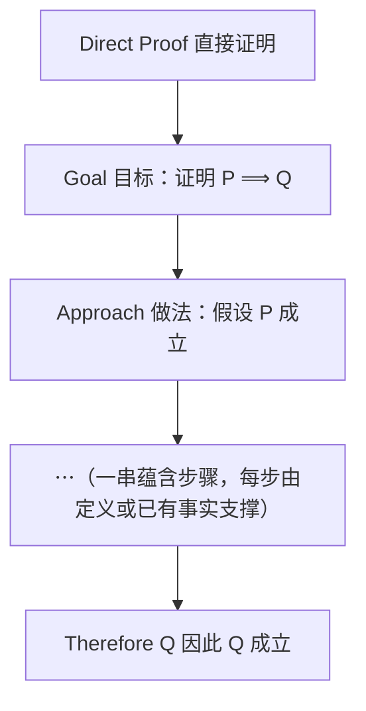

# Note 1 证明与直接证明法

> 本笔记对应 CS 70《离散数学与概率论》Fall 2026 Course Notes Note 1: *Proofs*（第 1–3 节）。Note 0 教我们"怎么把话说明白"，Note 1 教我们"怎么把话说牢"——即如何用**有限步的严格推理**，去保证一条涉及**无穷多个情形**的命题确实为真。本文的核心是**直接证明法（direct proof）**。

---

## 1. 为什么要证明（Proofs）

在科学中，我们通过**实验积累证据**来支持一个论断的有效性。数学则不同，它追求一种**更绝对的确定性**。**数学证明（mathematical proof）**提供了一种保证某个命题为真的手段。

证明非常强大，而且在某些方面**很像计算机程序**。事实上，这两个概念之间有着深刻的历史联系（我们会在本课程后面谈到）：大约一个世纪以前，人们正是在探索"数学证明"这一想法的过程中，催生了计算机的发明。

### 1.1 我们想证明什么样的"与计算机科学相关"的命题？

原文给出两个例子：

1. **程序 $P$ 是否在每一个输入上都停机？**
2. **程序 $P$ 是否正确地计算函数 $f(x)$？** 也就是说，对每一个 $x$，它是否在输入 $x$ 时输出 $f(x)$？

> **⚠️ 注意**：这两条命题都涉及程序在**无穷多个输入**上的行为。对这样的命题，我们可以尝试通过"在 $x$ 的很多取值上测试它成立"来提供证据。但遗憾的是，这**无法保证**命题对我们没有测试过的那无穷多个 $x$ 也成立！要想确定命题为真，我们必须给出**严格的证明**。

### 1.2 什么是证明？

> **定义（证明）**：一个**证明（proof）**是一个**有限的步骤序列**，其中每一步称为一次**逻辑演绎（logical deduction）**，它确立了我们所期望命题的真理性。

**这句话的灵魂在于"有限"**：

> **证明的力量恰恰在于：用有限的手段，我们可以保证一个含有无穷多个情形的命题为真。**

**逐步拆解这个"力量"从何而来**：

1. 命题本身覆盖无穷多个情形（如"对每个整数 $x$"）；
2. 我们不可能逐一检查无穷多个情形；
3. 但证明只写了**有限多行**；
4. 每一行都由逻辑规则保证"若前面为真，则这一行必为真"；
5. 于是只要**起点（公理）**为真、**每一步**都合规，终点就必然为真——无穷多个情形被一次性覆盖。

### 1.3 证明的典型结构

更具体地说，一个证明通常按如下方式组织。回忆一下，有一些命题是我们**不加证明就接受**的，它们被称为**公理（axioms）**或**公设（postulates）**（我们总得有个起点）。

从这些公理出发，一个证明由一串**逻辑演绎**组成：这些演绎是"应用逻辑规则的简单步骤"。它们产生一串命题，其中**只要前面的命题为真，后一个命题就必然为真**。

这一性质由**逻辑规则**来保证：每个命题都由前面的命题推出。

这些逻辑规则是对"传统上被认为构成人类思维基础的规律"的形式化提炼。它们在计算机的设计中起着核心作用，从**数字逻辑设计（digital logic design）**，即数字电路设计背后的基本原理开始，就已经如此。在更高级的层面上，这些逻辑规则在**人工智能**中扮演着不可或缺的角色——人工智能的终极目标之一，就是在计算机上模拟人类思维。

### 1.4 本笔记的组织结构

> **Organization of this note.** We begin in Section 2 by setting notation and stating basic mathematical facts used throughout this note. We then introduce our first proof technique: Direct proof (Section 3).
>
> **译文**：本笔记的组织安排如下。我们先在第 2 节中确定记号、陈述全篇都会用到的基本数学事实。然后我们介绍第一种证明技巧：直接证明（第 3 节）。

**✅ 本节要点总结**
- 科学靠实验证据，数学靠**证明**追求绝对确定性。
- 证明 = **有限的**逻辑演绎序列；其威力在于用有限步骤锁定无穷多情形。
- 证明从**公理/公设**（不加证明而接受）出发，每一步都是应用逻辑规则的简单步骤。
- 逻辑规则是数字电路设计与人工智能的基石。
- 本笔记路线：第 2 节记号与基本事实 $\rightarrow$ 第 3 节直接证明。

---

## 2. 记号与基本事实（Notation and basic facts）

在本笔记中，我们使用下列记号与基本数学事实。

- 令 $\mathbb{Z}$ 表示**整数集**，即
  $$\mathbb{Z} = \{\dots, -2, -1, 0, 1, 2, \dots\}$$
- 令 $\mathbb{N}$ 表示**自然数集**
  $$\mathbb{N} = \{0, 1, 2, \dots\}$$
- 回忆一下：**两个整数之和或之积仍是整数**，也就是说，**整数集对加法和乘法封闭（closed under addition and multiplication）**。
- **自然数集同样对加法和乘法封闭。**

**⚠️ 注意（"封闭"是什么意思）**："$S$ 对运算封闭"意味着：只要你从 $S$ 中取元素做这个运算，结果**仍然落在 $S$ 里面**，绝不会跑到 $S$ 外面去。整数相加、相乘永远是整数，所以封闭。但整数**相除**就不封闭了（$1 \div 2 = 0.5 \notin \mathbb{Z}$），这正说明"封闭"是逐运算讨论的性质。

### 2.1 整除（divisibility）

> **定义（整除）**：给定整数 $a$ 和 $b$，我们说 **$a$ 整除 $b$**（记作 $a \mid b$），**当且仅当**存在一个整数 $q$ 使得 $b = aq$。

**例**：$2 \mid 10$，因为存在整数 $q = 5$ 使得 $10 = 5 \cdot 2$。（注意原文此处把 $q$ 的值写为 $5$，并写成 $10 = 5\cdot 2$，本质上是在说 $10 = 2 \times 5$，即 $q = 5$ 满足 $b = aq$。）

**⚠️ 注意（三个必须辨析的记号）**：

| 记号 | 读法 | 含义 | 两侧是什么 |
| :--- | :--- | :--- | :--- |
| $a \mid b$ | $a$ 整除 $b$ | 存在整数 $q$ 使 $b = aq$ | 两个**整数**之间的关系 |
| $a / b$ | $a$ 除以 $b$ | 做除法运算，得到一个数 | 一个**数值** |
| $a \nmid b$ | $a$ 不整除 $b$ | 不存在这样的整数 $q$ | 关系不成立 |

同时请牢记："$a \mid b$"谈的是**"$b$ 能否被 $a$ 整份地分掉"**，而 $a$ 的地位是"除数"。所以 $2 \mid 10$ 为真，但 $10 \mid 2$ 为假。**整除关系不对称**。

**补充说明（关于 $q$ 的存在性）**：定义里"存在一个整数 $q$"这句话，就是后面证明中"设 $b = q_1 a$"这类写法的**合法依据**——一旦知道 $a \mid b$，我们就被允许写出"存在某个整数 $q$ 满足 $b = aq$"，并为它起个名字。

### 2.2 素数（prime）

> **定义（素数）**：我们说自然数 $p \geq 2$ 是**素数（prime）**，如果它**只能被 $1$ 和它自身整除**。

**⚠️ 注意**：定义中 $p \geq 2$ 这个条件是必需的。按此定义，$1$ 不是素数（它只有一个正因数），$0$ 和负数也不是素数。素数从 $2, 3, 5, 7, 11, \dots$ 开始。

### 2.3 定义记号 $:=$

最后，我们使用记号 $:=$ 来表示**定义**。例如 $q := 6$ 就是把变量 $q$ 定义为取值 $6$。

**⚠️ 注意**：$:=$ 与 $=$ 不同。$q := 6$ 是在**规定**"从今往后 $q$ 就代表 $6$"；而 $q = 6$ 是在**断言**"$q$ 的值等于 $6$"（这句话可能是真的，也可能是假的）。在数学写作中，前者是命名，后者是命题。

**✅ 本节要点总结**
- $\mathbb{Z} = \{\dots,-2,-1,0,1,2,\dots\}$，$\mathbb{N} = \{0,1,2,\dots\}$。
- $\mathbb{Z}$ 与 $\mathbb{N}$ 都对**加法、乘法封闭**（对除法不封闭）。
- $a \mid b \iff \exists q \in \mathbb{Z},\ b = aq$；整除关系**不对称**。
- 素数：$p \geq 2$ 且只被 $1$ 与自身整除（故 $1$ 不是素数）。
- $:=$ 表示**定义**（命名），$\neq$ 表示**断言**（可能有真假）。

---

## 3. 直接证明（Direct Proof）

有了预备的记号，我们现在讨论几种常见的证明技巧，它们覆盖了现实世界中**很大一部分**实际证明。我们的第一种技巧叫作**直接证明（direct proof）**。

> **在整个这一节中，请始终牢记：我们的目标是给出清晰、简洁的证明。**

### 3.1 第一个例子：整除对加法保持

> **定理 1.1**：对任意 $a, b, c \in \mathbb{Z}$，若 $a \mid b$ 且 $a \mid c$，则 $a \mid (b + c)$。

> **Concept check!** 令 $P(x,y)$ 表示"$x \mid y$"。请说服自己：上面这句话等价于
> $$(\forall a,b,c \in \mathbb{Z})\ \bigl(P(a,b) \wedge P(a,c)\bigr) \Longrightarrow P(a, b+c)$$

**逐句对照（补充说明）**："对任意 $a,b,c \in \mathbb{Z}$"对应全称量词 $\forall a,b,c \in \mathbb{Z}$；"若 $a\mid b$ 且 $a \mid c$"对应前提 $P(a,b) \wedge P(a,c)$；"则 $a \mid (b+c)$"对应结论 $P(a, b+c)$。中间的"若……则……"正是蕴含 $\Longrightarrow$。

### 3.2 直接证明的一般套路

从宏观上看，直接证明是这样进行的。对每个 $x$，我们要证明的命题形如 $P(x) \Longrightarrow Q(x)$。直接证明的作法是：**先假设 $P(x)$ 对某个一般（generic）的 $x$ 成立，最终通过一串蕴含推出 $Q(x)$。**

**图意说明**：这张结构图就是直接证明的"骨架"。关键有两点：一是**只假设 $P$**（不额外假设别的东西），二是中间的每一步都必须是**合法的逻辑演绎**，最后落到 $Q$。原文图中"$\vdots$"那三点代表中间可能有很多步，但步骤数必须是**有限**的。

### 3.3 定理 1.1 的证明

> **证明（Proof of Theorem 1.1）**

**证明：**

1. **假设前提**：假设 $a \mid b$ 且 $a \mid c$。
2. **把"整除"还原为"存在整数倍"**：由整除的定义可知，存在整数 $q_1$ 和 $q_2$ 使得
   $$b = q_1 a, \qquad c = q_2 a$$
   （依据：$a \mid b$ 的定义就是"$\exists q,\ b = aq$"，我们把这两个 $q$ 分别命名为 $q_1$、$q_2$。）
3. **做代数变形**：于是
   $$b + c = q_1 a + q_2 a = (q_1 + q_2) a$$
   （依据：把第 2 步的两个等式相加，再提取公因子 $a$。）
4. **说明系数仍是整数**：由于 $\mathbb{Z}$ 对加法封闭，我们断定 $(q_1 + q_2) \in \mathbb{Z}$。
   （依据：第 2 节中"整数集对加法封闭"这一基本事实。正是这一步让我们有资格把 $q_1 + q_2$ 当作整除定义中那个"存在的整数 $q$"。）
5. **回到整除的定义**：既然 $b + c = (q_1 + q_2)a$ 且 $(q_1 + q_2)$ 是整数，按定义就有 $a \mid (b+c)$，这正是我们所求。

**证毕。** $\blacksquare$

**容易吧？但等一下——量词去哪儿了？**

原文提醒我们：前面说定理 1.1 等价于 $(\forall a,b,c \in \mathbb{Z})\,(P(a,b) \wedge P(a,c)) \Longrightarrow P(a,b+c)$。那么在上面的证明里，我们在哪儿遇到了 $\forall$ 这个量词呢？

> **关键洞察**：这个证明**没有对 $a$、$b$、$c$ 假定任何具体的取值**；我们的证明对**任意的** $a, b, c \in \mathbb{Z}$ 都成立！因此，我们确实证明了所期望的结论。

**⚠️ 注意（这是本节最重要的"隐性步骤"）**：直接证明中那个"取一般的 $x$"的假设，**就是全称量词的引入方式**。原文把这个道理藏在证明之后，但它其实是整个直接证明法能够成立的理由：只要你从未用到 $a,b,c$ 的任何特殊性质，你的推理就对所有 $a,b,c$ 有效。请养成习惯：写直接证明时用"设 $a,b,c$ 为任意整数"这样的开场，而**不要**写"设 $a = 2, b = 6$"。

> **Concept check!** 请给出下面命题的直接证明：对任意 $a, b, c \in \mathbb{Z}$，若 $a \mid b$ 且 $a \mid c$，则 $a \mid (b - c)$。

**补充说明（这道练习题的做法）**：模仿上面的证明。假设 $a \mid b$ 且 $a \mid c$，则存在整数 $q_1, q_2$ 使得 $b = q_1 a$、$c = q_2 a$。于是 $b - c = q_1 a - q_2 a = (q_1 - q_2)a$。因为 $\mathbb{Z}$ 对**减法**也封闭（减法可看作"加上相反数"，而整数对加法封闭、每个整数都有相反数），所以 $(q_1 - q_2) \in \mathbb{Z}$，故 $a \mid (b-c)$。

### 3.4 稍难一点的例子：被 9 整除

> **定理 1.2**：设 $0 < n < 1000$ 是整数。若 $n$ 的各位数字之和能被 $9$ 整除，则 $n$ 能被 $9$ 整除。

**注意，这个命题等价于**

$$(\forall n \in \mathbb{Z}^{+})\ (n < 1000) \Longrightarrow (\text{$n$ 的各位数字之和可被 } 9 \text{ 整除} \Longrightarrow n \text{ 可被 } 9 \text{ 整除})$$

其中 $\mathbb{Z}^{+}$ 表示**正整数集** $\{1, 2, \dots\}$。

**现在的证明过程与前面类似**：我们先对 $n$ 的一个**一般取值**假设"$n$ 的各位数字之和能被 $9$ 整除"，然后进行一串蕴含，最后推出 $n$ 本身能被 $9$ 整除。

> **证明（Proof of Theorem 1.2）**

**证明：**

1. **把 $n$ 写成十进制形式**：设 $n$ 的十进制写法为 $n = abc$，即
   $$n = 100a + 10b + c$$
   （依据：十进制按位权展开。这里 $a$ 是百位数字，$b$ 是十位数字，$c$ 是个位数字。）
2. **假设前提并写成等式**：假设 $n$ 的各位数字之和能被 $9$ 整除，即
   $$\exists k \in \mathbb{Z}\ \text{使得}\ a + b + c = 9k \tag{1}$$
   （依据：整除的定义——"和能被 9 整除"就是说这个和可以写成 $9$ 的整数倍。）
3. **在等式 (1) 两边同加 $99a + 9b$**：得到
   $$100a + 10b + c = n = 9k + 99a + 9b = 9(k + 11a + b)$$
   （依据：左边 $a+b+c + 99a + 9b = 100a + 10b + c$，这正是 $n$；右边提取公因子 $9$。）
4. **得出结论**：我们断定 $n$ 能被 $9$ 整除。
   （依据：第 3 步给出了 $n = 9(k + 11a + b)$，且 $k + 11a + b$ 是整数——它是整数 $k$、$a$、$b$ 经加法与整数倍组合而成，由整数对加法、乘法的封闭性可知其为整数。于是按整除定义 $9 \mid n$。）

**证毕。** $\blacksquare$

**这一段变形技巧的关键（补充说明）**：第 3 步为什么要加 $99a + 9b$？因为这样加，**左边正好凑成 $100a + 10b + c$**（即 $n$），而**右边每一项都能提出因子 $9$**。这正是直接证明里"把结论所需要的形式**主动构造出来**"的常见手法：目标是得到 $n = 9 \times (\text{整数})$，于是就朝着这个形式去改写等式。

**⚠️ 注意**：定理 1.2 的证明中**每一步都必须说明系数是整数**。若忘了说明 $(k + 11a + b) \in \mathbb{Z}$，就不算完整——整除定义要求那个乘数必须是整数。

### 3.5 逆命题（converse）

**定理 1.2 的逆命题是否也成立？** 回忆一下：$P \Longrightarrow Q$ 的**逆命题（converse）**是 $Q \Longrightarrow P$。

定理 1.2 的逆命题说的是：对任意整数 $0 < n < 1000$，若 $n$ 能被 $9$ 整除，则 $n$ 的各位数字之和能被 $9$ 整除。

> **定理 1.3（定理 1.2 的逆命题）**：设 $0 < n < 1000$ 是整数。若 $n$ 能被 $9$ 整除，则 $n$ 的各位数字之和能被 $9$ 整除。

> **证明（Proof）**

**证明：** 假设 $n$ 能被 $9$ 整除。我们对 $n$ 的各位数字沿用定理 1.2 证明中使用的记号（即 $n = 100a + 10b + c$）。推导如下：

$$
\begin{aligned}
n \text{ 能被 } 9 \text{ 整除} &\Longrightarrow n = 9l \quad \text{其中 } l \in \mathbb{Z} && \text{（整除定义）}\\[2pt]
&\Longrightarrow 100a + 10b + c = 9l && \text{（代入 } n \text{ 的十进制展开）}\\[2pt]
&\Longrightarrow 99a + 9b + (a + b + c) = 9l && \text{（把 } 100a+10b+c \text{ 拆成 } 99a+9b+(a+b+c)\text{）}\\[2pt]
&\Longrightarrow a + b + c = 9l - 99a - 9b && \text{（把 } 99a+9b \text{ 移到右边）}\\[2pt]
&\Longrightarrow a + b + c = 9(l - 11a - b) && \text{（右边提取公因子 } 9\text{）}\\[2pt]
&\Longrightarrow a + b + c = 9k \quad \text{其中 } k = l - 11a - b \in \mathbb{Z} && \text{（令 } k := l - 11a - b\text{，由整数封闭性 } k \in \mathbb{Z}\text{）}
\end{aligned}
$$

我们由此断定 $a + b + c$ 能被 $9$ 整除。**证毕。** $\blacksquare$

**⚠️ 注意（这是本题最容易被忽略的一步）**：最后一行必须明确写出 $k = l - 11a - b \in \mathbb{Z}$。如果 $k$ 不是整数，"$a+b+c = 9k$"就**不能**推出"$a+b+c$ 能被 $9$ 整除"。这正是整除定义中"存在**整数** $q$"这一要求的具体体现。

**补充说明（定理 1.3 为何不能照抄定理 1.2）**：注意定理 1.3 的证明**不是**把定理 1.2 的证明倒过来写，而是重新做了一遍同方向的推导。$P \Longrightarrow Q$ 为真**并不自动**意味着 $Q \Longrightarrow P$ 为真——逆命题永远要单独证明。

### 3.6 本节的"寓意"：如何证明等价

现在来到本节的**寓意（moral of this story）**。我们已经证明了定理 1.2 和它的逆命题定理 1.3。这意味着：

> "**$n$ 的各位数字之和能被 $9$ 整除**"**当且仅当**"$n$ 能被 $9$ 整除"；换句话说，这两个命题是**逻辑等价的（logically equivalent）**。

> **关键教训**：每当你想要证明一个**等价关系** $P \Longleftrightarrow Q$ 时，**永远**要通过**分别**证明 $P \Longrightarrow Q$ 和 $Q \Longrightarrow P$ 来完成（正如我们在这里所做的那样）。

**图意说明**：证明"当且仅当"时，必须**两个方向各走一遍**，缺一不可。图中两个实线箭头分别对应定理 1.2 与定理 1.3；没有这两个箭头，就不能画中间那条双向等价线。

**⚠️ 注意（常见错误）**：

1. 只证了 $P \Longrightarrow Q$ 就宣称"$P$ 当且仅当 $Q$"；
2. 用同一个证明"反过来读"当作逆命题的证明（除非每一步都恰好可逆，否则无效）；
3. 把**逆命题**（$Q \Longrightarrow P$）与**否命题**（$\neg P \Longrightarrow \neg Q$）搞混。对定理 1.2 而言，否命题与逆命题恰好同真，但这两者是不同的命题，一般不能互换。

**✅ 本节要点总结**
- **直接证明**的套路：假设 $P$ 对一般的 $x$ 成立 $\rightarrow$ 一串合法蕴含 $\rightarrow$ 推出 $Q$。
- 直接证明中"设 $x$ 为任意"就是**全称量词的引入**；绝不可代入选定的特殊值。
- **定理 1.1**：$a \mid b \wedge a \mid c \Longrightarrow a \mid (b+c)$。关键两步是"把整除还原为 $b = q_1a,\ c = q_2a$"与"用整数对加法封闭说明 $q_1+q_2 \in \mathbb{Z}$"。
- **定理 1.2**：$n$ 的各位数字和可被 $9$ 整除 $\Longrightarrow 9 \mid n$。技巧是在等式两边加 $99a+9b$，把 $n$ 直接凑出来。
- **定理 1.3**（逆命题）：$9 \mid n \Longrightarrow n$ 的各位数字和可被 $9$ 整除。
- **核心教训**：要证 $P \Longleftrightarrow Q$，必须**分别**证明 $P \Longrightarrow Q$ 与 $Q \Longrightarrow P$。
