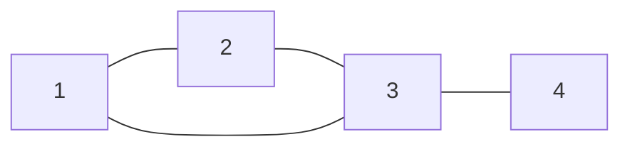
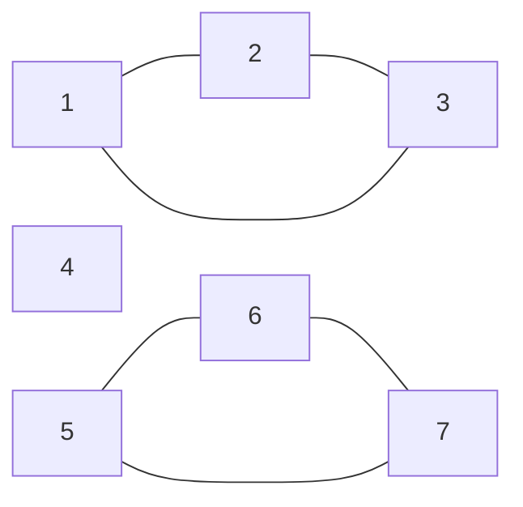
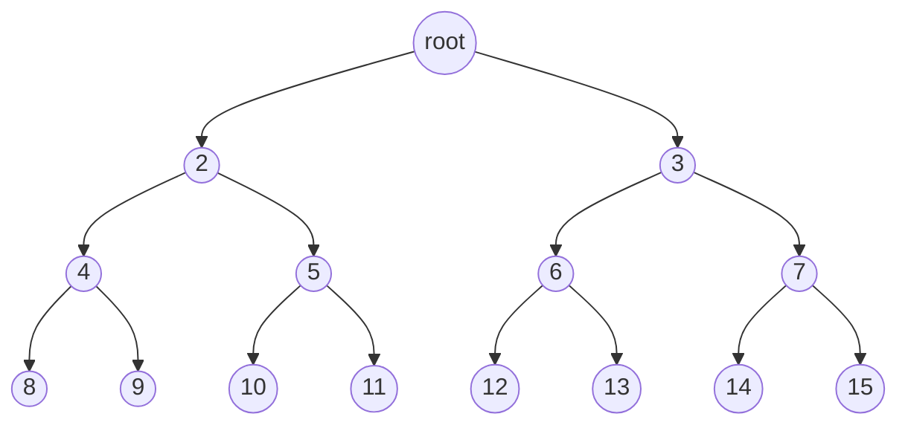
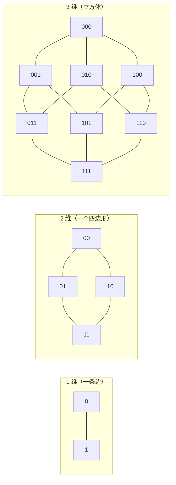
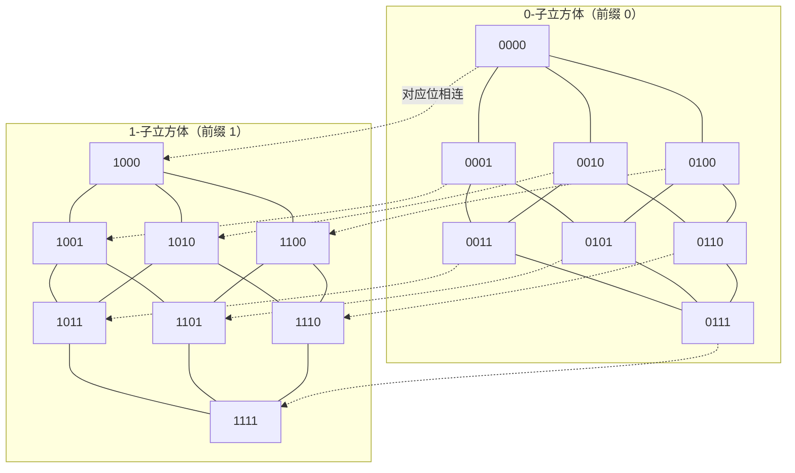
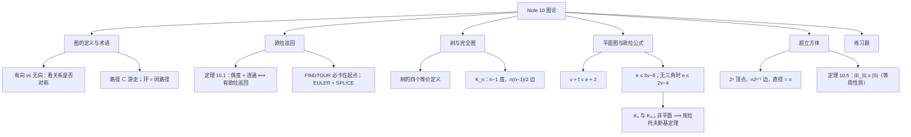

# Note 10 图论：欧拉回路、树、平面图与超立方体

> 本笔记对应 CS 70《离散数学与概率论》Fall 2026 Course Notes Note 10（第 1–6 节）。至此课程从"数"转向**结构**。图论是计算机科学中最基础的工具之一：**互联网、大脑、地图、社交网络，背后都是一个"网络"（图）**。本讲从 1736 年柯尼斯堡七桥问题出发，依次建立图的定义、欧拉定理、树与完全图、平面图与欧拉公式，最后研究兼具"强连通"与"低直径"的**超立方体**。

---

## 1. 图论导引（Graph Theory: An Introduction）

**计算机科学中最基本的想法之一是"抽象（abstraction）"**：用一个简单的模型去**抓住某个复杂情境的本质或核心**。

**我们可能要处理的一些规模最大、最复杂的实体包括**：互联网、大脑、地图与社交网络。**在每一种情形下，都存在一个底层的"网络"或图**，它抓住了那些帮助我们更深入理解这些实体的重要特征。

- **互联网**：这个网络或图规定了网页之间如何相互链接；
- **大脑**：它是神经元之间的互连网络。

**我们可以在图论这个优美的框架中描述这些想法**——这正是本讲的主题。

### 1.1 起源：柯尼斯堡七桥问题

**值得注意的是，图论起源于几个世纪前普鲁士柯尼斯堡（今俄罗斯加里宁格勒）居民的一项简单的傍晚消遣。**

**普雷格尔河（Pregel river）穿过这座城市**（见原文 Figure 1 左图），把柯尼斯堡分成两岸 $A$ 与 $D$、以及岛屿 $B$ 与 $C$。**连接岛屿与陆地的是七座桥。**

**当城中居民傍晚散步时，许多人会尝试解决这样一个挑战**：**选出一条路线，恰好一次走过这七座桥中的每一座，并回到出发点。**

**补充说明（原文 Figure 1 的含义）**：这张图有左右两幅，是**同一件事的两种表示**：

- **(a) 柯尼斯堡城**：画出了河流、四块陆地 $A$、$B$、$C$、$D$，以及连接它们之间的七座桥（每条桥都是一条弧线）。
- **(b) 建模桥连接情况的（多）图**：把每块陆地 $A, B, C, D$ 替换成一个**点**（画成小圆圈），把每座桥替换成一条**线段**。于是 $A$ 与 $B$ 之间画两条线段、$B$ 与 $D$ 之间画两条线段，等等。

**这张图的核心信息是**：**"城市地图"这个几何对象，可以被完全压扁成一张只有"点与连接关系"的抽象图**——而七桥问题的可解性只依赖于后者的连接结构，与桥有多长、岛有多大毫无关系。

**1736 年，卓越的数学家欧拉（Leonhard Euler）证明了这项任务是不可能的。**

**他是怎么做到的？**

**关键在于认识到**：为了选择这样一条路线，**Figure 1a 可以被 Figure 1b 替换**——每块陆地 $A, B, C, D$ 被替换成一个点（画成小圆圈），每座桥被替换成一条线段。

**有了这个抽象，选择一条路线的任务就可以重述如下**：**不抬笔、且不重复走过任何线段，把所有的线段都描一遍并回到出发点。**

**不可能性的证明很简单：**

1. **在这些描线规则下，笔进入每个点的次数必须等于它离开该点的次数**（因为每次"进入"之后都必须"离开"，除非那是终点——但终点就是起点）；
2. **因此，与该点相连的线段数目必须是偶数**；
3. **但在 Figure 1b 中，每个点相连的线段数目都是奇数**（核对：$A$ 连 $3$ 座桥、$B$ 连 $5$ 座、$C$ 连 $3$ 座、$D$ 连 $3$ 座），**所以这样的描线无法完成。**

**事实上欧拉做得更多：他给出了可以完成这种描线的精确条件。** 正因如此，**欧拉通常被誉为图论的发明者。**

### 1.2 形式化定义

> **定义（无向图）**：形式上，一个**（无向）图**由**顶点集 $V$** 与**边集 $E$** 定义。顶点对应 Figure 1 中的点，边对应对应顶点之间的线段。

**在 Figure 1 中**，

$$V = \{A, B, C, D\}, \qquad E = \{\{A,B\},\ \{A,B\},\ \{A,C\},\ \{B,C\},\ \{B,D\},\ \{B,D\},\ \{C,D\}\}$$

**然而要注意，这里的 $E$ 是一个多重集（multiset，即一个元素可以出现多次的集合）。** 这是因为在柯尼斯堡的例子中，**一对河岸之间存在多座桥**。

> **注意**：除非另有说明，**我们通常不允许一对顶点之间有多条边**，即我们要求 $E$ 是一个**集合**而非多重集。**因此任意一对顶点之间要么有 $0$ 条边、要么有 $1$ 条边。**

> **定义（有向图）**：更一般地，我们也可以定义**有向图（directed graph）**。**如果无向图中的一条边代表一条街道，那么有向图中的一条边就代表一条单行道。**
>
> 为形式化这一点，令 $V$ 是图 $G$ 的顶点集。那么**有向边集 $E$ 是 $V \times V$ 的一个子集**，即 $E \subseteq V \times V$。（回忆 $U \times V$ 表示集合 $U$ 与 $V$ 的**笛卡尔积**，定义为 $U \times V = \{(u,v) : u \in U \text{ 且 } v \in V\}$。）
>
> **例**：如果 $V = \{1,2,3,4\}$ 且 $E = \{(1,2), (1,3), (1,4)\}$，那么对应的图是 Figure 2 中的 $G_1$。

**补充说明（原文 Figure 2 的含义）**：Figure 2 画了两个图。

- **$G_1$（有向图）**：四个顶点 $1,2,3,4$，从顶点 $1$ 出发有三条**带箭头**的边分别指向 $2$、$3$、$4$；顶点 $2,3,4$ 之间没有边。
- **$G_2$（无向图）**：五个顶点 $1,2,3,4,5$，边不带箭头，其中顶点 $3$ 位于中间，$1,2,4,5$ 分别连到它上面（一个"星形"）。

**注意 $G_1$ 中每条边都由箭头指明了方向**；因此例如 $(1,2) \in E$ 但 $(2,1) \notin E$。**有向图适合建模单向关系，例如两地之间的单行道。**

**另一方面**，**如果每条边都是双向的**，即 $(u,v) \in E$ **当且仅当** $(v,u) \in E$，**那么我们称该图是"无向的"**。**对无向图，我们放弃有序对记号，而简单地用集合 $\{u,v\}$ 表示 $u$ 与 $v$ 之间的边。**

**无向图自然地建模像"两地之间的双向街道"这样的关系**；**一个例子就是 Figure 2 中的 $G_2$**。为简单起见，**画无向图的边时我们省略箭头。**

**无论哪种情况**，一个图都被形式地指定为一个**有序对**

$$G = (V, E)$$

其中 $V$ 是顶点集、$E$ 是边集（有向或无向）。

> **Concept check!** 图 $G_2$ 的顶点集与边集 $V$ 和 $E$ 分别是什么？

**补充说明（答案，结合 Figure 2 中 $G_2$ 的星形结构）**：$V = \{1,2,3,4,5\}$，$E = \{\{1,3\}, \{2,3\}, \{3,4\}, \{3,5\}\}$（即中心顶点 $3$ 与其余四个顶点各连一条边）。**请注意这里的边是集合（无向、无序），因此 $\{1,3\}$ 与 $\{3,1\}$ 是同一条边。**

### 1.3 社交网络例子：有向 vs 无向

**让我们用一个社交网络的例子继续讨论**——图论在其中扮演着根本性的角色。

**假设你想建模一个社交网络**，其中**顶点对应人**，而**边对应人与人之间的下述关系**：

> 我们说 **Alex 认识（recognizes）Bridget**，如果 Alex 知道 Bridget 是谁（但 Bridget 不一定知道 Alex 是谁）。

**我们会用有向图来建模这种情况**，因为这个关系**不对称**。

**另一方面**，如果我们想建模的关系是"**Alex 与 Bridget 互相认识**"，那么我们就会用**无向图**。

**⚠️ 注意（"选有向还是无向"的判据）**：判断标准只有一条——**关系是否对称**。**对称 $\Rightarrow$ 无向；不对称 $\Rightarrow$ 有向。** 在 CS70 的题目中，"谁认识谁""谁关注谁""谁击败过谁"都是有向的；"谁和谁是朋友""两地之间有无道路"通常是无向的。

### 1.4 关联、邻居、度

**引入一些进一步的有用术语**：

> **定义（关联、邻居、度、孤立点）**
> - 我们说边 $e = \{u,v\}$（或 $e = (u,v)$）**关联（incident）**于顶点 $u$ 与 $v$，并说 $u$ 与 $v$ 是**邻居（neighbors）**或**相邻的（adjacent）**。
> - 若 $G$ 是无向的，则顶点 $u \in V$ 的**度（degree）**是与 $u$ 关联的边的数目，即
>   $$\mathrm{degree}(u) = \left|\{v \in V : \{u,v\} \in E\}\right|$$
> - **度为 $0$ 的顶点 $u$ 称为孤立顶点（isolated vertex）**，因为没有边把 $u$ 与图的其余部分相连。

> **Concept check!** 在我们的无向社交网络（其中边 $\{u,v\}$ 意味着 $u$ 与 $v$ 互相认识）中，一个顶点的**度**代表什么？**孤立顶点**应当如何解释？

**补充说明（答案）**：度 = **这个人认识的人数**（在这个"互相认识"的对称关系里，也就是朋友数）。**孤立顶点 = 一个谁都不认识、也没有人认识他的人**——他与整个社交网络完全隔绝。

> **定义（入度与出度）**：另一方面，**有向图因为边有方向，有两种不同的"度"的概念**。具体地说，
> - 顶点 $u$ 的**入度（in-degree）**是从其他顶点指向 $u$ 的边的数目；
> - $u$ 的**出度（out-degree）**是从 $u$ 指向其他顶点的边的数目。

> **Concept check!** 在我们的有向社交网络（其中边 $(u,v)$ 意味着 $u$ 认识 $v$）中，一个顶点的入度与出度分别代表什么？

**补充说明（答案）**：**出度 = 这个人所认识的人数**（他"知道是谁"的人有多少）；**入度 = 认识这个人的人数**（即有多少人知道他是谁）。**这就是"名人"与"粉丝"的差别**：名人入度极大而出度极小；狂热粉丝则相反。

### 1.5 关于自环

**最后**，我们目前的图定义允许形如 $\{u,u\}$（或 $(u,u)$）的边，即**自环（self-loop）**。

**然而，在我们的社交网络中，这不会给我们任何有趣的信息**（它意味着 A 认识他自己！）。

**因此，在这里以及本课程笔记的一般约定中，我们假设图没有自环**，除非另有说明。

### 1.6 路径、游走与环（Paths, Walks, and Cycles）

**令 $G = (V,E)$ 是一个无向图。**

> **定义（路径）**：$G$ 中的一条**路径（path）**是一串边
> $$\{v_1,v_2\},\ \{v_2,v_3\},\ \dots,\ \{v_{n-2},v_{n-1}\},\ \{v_{n-1},v_n\}$$
> 在这种情况下，我们说 **$v_1$ 与 $v_n$ 之间存在一条路径**。

**例**：假设下面的图 $G_3$ 建模一个住宅街区，其中每个顶点对应一栋房子，而两栋房子 $u$ 与 $v$ 是邻居当且仅当存在一条从 $u$ 直通 $v$ 的道路。



**补充说明（原文图 $G_3$ 的结构）**：原文中 $G_3$ 有四个顶点 $1,2,3,4$，边为 $\{1,2\},\{2,3\},\{3,4\},\{1,3\}$（顶点 $1$ 在左上、$4$ 在右上、$2$ 在左下、$3$ 在右下）。**把它画成上面的 Mermaid 图只是为了展示同样的连接关系；布局无关紧要。**

> **Concept check!** 在 $G_3$ 中从房子 $2$ 到房子 $4$ 的**最短路径**是什么？如果假设不重复访问任何房子，**最长路径**呢？

**补充说明（答案）**：**最短路径**是 $2 \to 3 \to 4$（长度 $2$ 条边）；也可走 $2 \to 1 \to 3 \to 4$（长度 $3$），但不是最短的。**最长简单路径**是 $2 \to 1 \to 3 \to 4$（用到全部四个顶点，长度 $3$ 条边）。

**在本课程中，我们假设路径是简单的（simple），意思是 $v_1, \dots, v_n$ 互不相同。**

**这在我们的住房例子 $G_3$ 中完全说得通**：如果你想从房子 $2$ 经房子 $1$ 开车到 $4$，**你为什么要不止一次地访问房子 $1$ 呢？**

> **定义（环 / 回路）**：一个**环（cycle）**（或**回路 circuit**）是一串边
> $$\{v_1,v_2\},\ \{v_2,v_3\},\ \dots,\ \{v_{n-2},v_{n-1}\},\ \{v_{n-1},v_n\},\ \{v_n,v_1\}$$
> 其中 $v_1, \dots, v_n$ **互不相同**。**因此一个环就是一条从 $v_1$ 到 $v_n$ 的路径，再加上把我们从 $v_n$ 带回 $v_1$ 的那条边 $\{v_n,v_1\}$。**

> **Concept check!** 请给出 $G_3$ 中一条从房子 $1$ 出发的环。

**补充说明（答案）**：$1 \to 2 \to 3 \to 1$（用到边 $\{1,2\},\{2,3\},\{3,1\}$），三个顶点互不相同 ✓。

> **定义（游走与巡回）**：现在假设你的目标不是尽快从 $2$ 到 $4$，而是**悠闲地散步**，路线是
> $$\{2,1\},\ \{1,2\},\ \{2,3\},\ \{3,4\}$$
> **这样一串顶点可以重复出现的边序列，称为从 $2$ 到 $4$ 的一条游走（walk）。**
>
> **与"路径 ↔ 环"的关系类似**，一个**巡回（tour）**是**起点与终点相同的游走**。例如，$\{2,1\},\{1,3\},\{3,4\},\{4,1\},\{1,2\}$ 就是一个巡回。

**补充说明（检查那个巡回）**：这条游走的顶点序列是 $2 \to 1 \to 3 \to 4 \to 1 \to 2$：起点 $2$、终点 $2$ ✓。**注意顶点 $1$ 出现了两次，所以它是巡回而不是环。**

#### 1.6.1 术语速查表

**下面是所有这些术语的简明总结：**

| 术语 | 顶点不重复 | 边不重复 | 起点 = 终点 |
| :--- | :---: | :---: | :---: |
| **游走 Walk** | | | |
| **路径 Path** | ✓ | ✓ | |
| **巡回 Tour** | | | ✓ |
| **环 Cycle** | ✓$^{*}$ | ✓ | ✓ |

**（$^{*}$ 除了起点与终点之外）**

**⚠️ 注意（这张表怎么读）**：表里"打勾"表示该项**必须满足**。请注意两点容易出错的地方：

1. **路径（Path）在表里有两项打勾**：顶点不重复、边不重复。**顶点不重复本身就蕴含边不重复**（若一条边走两次，则它的两个端点各出现两次），所以"路径"的严格定义只需"顶点互异"。
2. **环（Cycle）的"顶点不重复"带星号**：内部顶点 $v_1,\dots,v_n$ 互不相同，但**起点与终点是同一个顶点**——这是"闭合"的代价。**因此环不是路径**（路径要求起点≠终点，否则退化成一条平凡路径）。

> **说明（Remark）**：在本课程中，我们会尽力提醒你这些术语定义中的微妙之处；**只要你理解了其中的想法，就不必过于担心形式定义。**

### 1.7 连通性（Connectivity）

**本讲讨论的许多内容都围绕"连通性"这一概念展开。**

> **定义（连通）**：如果**任意两个不同的顶点之间都存在一条路径**，则称一个图是**连通的（connected）**。

**例**：我们上面的住宅网络 $G_3$ 是连通的，因为可以从任何一栋房子经由某条直通道路的序列开车到任何另一栋房子。

**另一方面**，下面的网络是**不连通**的：



**补充说明（原文那幅不连通图的三个连通分量）**：原文的图中，顶点 $1,2,3$ 构成一个三角形，顶点 $4$ 孤立，顶点 $5,6,7$ 构成另一个三角形。**这就给出三个连通分量**。

> **Concept check!** 在我们的住宅网络中，一个**不连通的顶点**代表什么？**为什么你不会想这样设计一个街区？**

**补充说明（答案）**：它代表**一栋没有任何直通道路连到其他房子的房子**——你根本无法开车离开或到达它。**从城市规划的角度看，这样的一栋房子等于被隔绝了**（如果你住这种房子，那就意味着你与外界毫无道路联系）。

> **定义（连通分量）**：注意**任何图（即使是连通性缺失的图）总是由一族连通分量（connected components）组成**，即顶点集 $V_1, \dots, V_k$，使得每个集合 $V_i$ 中的所有顶点都相互连通。

**例**：上面的图不连通，但它由三个连通分量构成：

$$V_1 = \{1,2,3\}, \qquad V_2 = \{4\}, \qquad V_3 = \{5,6,7\}$$

**⚠️ 注意（孤立点也是一个连通分量）**：$V_2 = \{4\}$ 是一个**只含单个顶点、不含任何边**的连通分量。**因此"连通分量的个数"与"孤立顶点的个数"不是一回事**，但每个孤立顶点确实自成一个连通分量。

**✅ 本节要点总结**
- **图 $G = (V,E)$**：$V$ 是顶点集，$E$ 是边集。**无向图**的边是无序对 $\{u,v\}$；**有向图**的边是有序对 $(u,v) \in V \times V$。
- 柯尼斯堡七桥问题是图论的起点：**"能否一笔画"被抽象成"图是否有欧拉巡回"**。
- 本课程默认：**不允许平行边**（$E$ 是集合而非多重集）、**不允许自环**。
- **度**（无向）= 关联边数；**入度/出度**（有向）= 指向/指出该点的边数；度为 $0$ 者为**孤立顶点**。
- **路径**（顶点互异）$\subset$ **游走**（顶点可重复）；**环** = 闭合的路径；**巡回** = 闭合的游走。
- **连通**：任意两顶点间有路径；不连通的图由若干**连通分量**组成。
- **选有向还是无向，只看关系是否对称。**

---

## 2. 重访七桥问题：欧拉巡回（Eulerian Tours）

**有了图论的形式化基础之后，我们准备重访柯尼斯堡七桥问题。**

**这个问题到底在问什么？** 它说：**给定一个图 $G$（在这里，$G$ 是柯尼斯堡的一个抽象），$G$ 中是否存在一条恰好使用每条边一次的游走？**

> **定义（欧拉游走）**：我们称图中任何这样的游走为一条**欧拉游走（Eulerian walk）**。
> **（相比之下，按定义，一条普通的游走可以随意多次访问每条边或每个顶点。）**

> **定义（欧拉巡回）**：此外，如果一条欧拉游走是**闭合的**，即它**终止于它的起点**，那么它被称为**欧拉巡回（Eulerian tour）**。

**因此，柯尼斯堡七桥问题就是：给定一个图 $G$，它是否有一条欧拉巡回？**

**我们现在用图 $G$ 的若干更简单的性质给出这一点的精确刻画。** 为此，**定义偶度图（even degree graph）为一个所有顶点都具有偶数度的图**。

> **定理 10.1（欧拉定理，1736）**：一个无向图 $G = (V,E)$ **有欧拉巡回，当且仅当 $G$ 是偶度图，并且（除可能的孤立顶点外）连通。**

**⚠️ 注意（定理的两个条件都是必需的）**：

- **只有偶度、不连通**：例如两个不相连的三角形。每个顶点的度都是 $2$（偶数），但你无法用一条游走走完两个三角形的所有边。
- **只有连通、不是偶度**：这就是柯尼斯堡七桥图——每个顶点度数都是奇数，所以不存在欧拉巡回。

**补充说明（"除可能的孤立顶点外"这个限定词的作用）**：孤立顶点度数为 $0$（偶数），且它与任何边都不相干，**根本不可能出现在任何游走里**。所以要求"整图连通"是过强的；正确的说法是"**把所有孤立顶点去掉之后连通**"。

### 2.1 定理 10.1 的证明

> **证明（Proof）**

**证明：为证明这一点，我们必须确立两个方向：当且仅当。**

#### 2.1.1 仅当（Only if）：有欧拉巡回 $\Rightarrow$ 连通 + 偶度

**我们对正向给出直接证明**，即：**若 $G$ 有欧拉巡回，则它连通且是偶度的。**

**假设 $G$ 有欧拉巡回。** 这意味着**每一个有边与之关联的顶点（即每一个非孤立顶点）必定位于该巡回上**，因此**与巡回上的所有其他顶点相连通**。**这证明了图是连通的（除孤立顶点外）。**

**接下来，我们通过证明"关联于一个顶点的所有边都可以两两配对"来证明每个顶点都有偶数度。**

1. **注意每次巡回沿一条边进入一个顶点，它都会沿另一条不同的边离开。** 我们可以把这两条边配成一对（**它们在巡回中不会再被走过**）。
2. **唯一的例外是起点**：在那里，第一条离开它的边无法按上述方式配对。
3. **但注意**，按定义，**该巡回必定终止于起点**。因此，**我们可以把（离开起点的）第一条边与（进入起点的）最后一条边配成一对**。
4. **于是所有与巡回上任何顶点相邻的边都可以配对，因此每个顶点都有偶数度。**

**⚠️ 注意（第 3 步是全部难点）**：如果巡回**不是闭合的**（即只是欧拉游走而非巡回），起点与终点就不同，那条"第一条离开起点的边"与"最后一条进入终点的边"就无法配对，于是**恰好起点与终点可以是奇度**。**这正是"欧拉游走存在 $\iff$ 至多两个奇度顶点"这条更一般定理的来源**——而定理 10.1 是它的闭合特例。

#### 2.1.2 当（If）：连通 + 偶度 $\Rightarrow$ 有欧拉巡回

**我们给出一个递归算法来寻找欧拉巡回，并用归纳法证明它正确地输出一条欧拉巡回。**

**我们先从一个有用的子程序开始**：$\mathrm{FINDTOUR}(G, s)$，**它找出 $G$ 中的一条巡回（不一定欧拉）。**

**$\mathrm{FINDTOUR}$ 非常简单**：它只是从顶点 $s \in V$ 开始走，**每一步都选择与当前顶点关联的任意一条未走过的边**，**直到因为"没有相邻的未走过边"而卡住为止。**

**我们现在证明 $\mathrm{FINDTOUR}$ 事实上必定会在原始顶点 $s$ 处卡住。**

> **断言 10.1**：$\mathrm{FINDTOUR}(G, s)$ **必定在 $s$ 处卡住。**

> **证明（Proof of claim）**

**证明：** 一个关于游走长度的简单归纳证明表明：

- 当 $\mathrm{FINDTOUR}$ **进入任何顶点 $v \neq s$ 时，它已经走过奇数条关联于 $v$ 的边**；
- 而当它**进入 $s$ 时，它已经走过偶数条关联于 $s$ 的边**。

**由于 $G$ 中每个顶点都有偶数度**，这意味着**每次它进入 $v \neq s$ 时，都至少还有一条关联于 $v$ 的未走过的边**，因此**游走不可能卡住**。**所以它唯一可能卡住的顶点就是 $s$。**

**形式证明留作练习。**

**证毕。** $\blacksquare$

**补充说明（为什么奇偶性是这样）**：每次"进入并离开"一个顶点就用掉两条边。游走在 $v$ 处停留时，用掉的边数就是**进入次数 + 离开次数**；在任一时刻，进入次数与离开次数至多差 $1$（因为只有当前这一步可能是"只进未出"）。**若当前正停在 $v \neq s$ 上，则进入比离开恰好多 $1$，用掉的边数是奇数；若停在 $s$ 上，则进入与离开相等（或相差特定的偶数），用掉的边数是偶数。** 因为 $\deg(v)$ 是偶数，奇数 $<$ 偶数，所以必定还有剩余的边可用。

**算法 $\mathrm{FINDTOUR}(G, s)$ 返回它在 $s$ 处卡住时所走过的那条巡回。**

**注意：虽然 $\mathrm{FINDTOUR}(G, s)$ 总能成功地找到一条巡回，但它并不总是返回欧拉巡回**（它可能提前封闭，遗漏了一部分边）。

**我们现在给出一个递归算法 $\mathrm{EULER}(G, s)$，它输出一条从 $s$ 开始、到 $s$ 结束的欧拉巡回。**

**$\mathrm{EULER}(G, s)$ 调用另一个子程序 $\mathrm{SPLICE}(T, T_1, \dots, T_k)$**：

- 它接受若干条**边不相交**的巡回 $T, T_1, \dots, T_k$（$k \geq 1$）作为输入，**条件是在巡回 $T$ 与每条巡回 $T_1, \dots, T_k$ 都相交**（即 $T$ 与每个 $T_i$ 共享一个顶点）；
- **过程 $\mathrm{SPLICE}(T, T_1, \dots, T_k)$ 输出一条单一的巡回 $T'$，它走过 $T, T_1, \dots, T_k$ 中的所有边**，即**它把所有巡回拼接在一起**；
- **拼接后的巡回 $T'$ 是这样得到的**：遍历 $T$ 的边，**每当它到达一个与其他某条巡回 $T_i$ 相交的顶点 $s_i$ 时，就绕道从 $s_i$ 出发走完 $T_i$、再回到 $s_i$，然后才继续遍历 $T$。**

**算法 $\mathrm{EULER}(G, s)$ 给出如下：**

```text
Function Euler(G, s)
    T = FindTour(G, s)
    Let G1, ..., Gk be the connected components
        when the edges in T are removed from G
    Let si be the first vertex in T that intersects Gi
    Output Splice(T, Euler(G1, s1), ..., Euler(Gk, sk))
end Euler
```

**我们用对 $G$ 的规模作归纳来证明 $\mathrm{EULER}(G, s)$ 输出 $G$ 中的一条欧拉巡回。** 无论我们把"规模"理解为顶点数还是边数，同一个证明都成立。为具体起见，**这里我们用 $G$ 的边数 $m$。**

> **证明（Proof，续）**

**证明：**

- **基础情形**：$m = 0$，这意味着 $G$ 是空的（它没有边），**所以没有巡回可找**。
- **归纳假设**：$\mathrm{EULER}(G, s)$ 对任何**至多有 $m \geq 0$ 条边的偶度连通图** $G$ 输出一条欧拉巡回。
- **归纳步**：假设 $G$ 有 $m+1$ 条边。
  1. 回忆 $T = \mathrm{FINDTOUR}(G,s)$ 是一条巡回，**因此它在每个顶点处都有偶数度**（依据：由 2.1.1 同样的配对论证）。
  2. 当我们从 $G$ 中删去 $T$ 的边时，**剩下的就是一个边数少于 $m$ 的偶度图**，但它**可能是非连通的**。
  3. 令 $G_1, \dots, G_k$ 为它的连通分量。**每个这样的连通分量都是偶度的，并且（在孤立顶点之外）连通。**
  4. **此外，$T$ 与每个 $G_i$ 都相交**，而且当我们遍历 $T$ 时，存在第一个与 $G_i$ 相交的顶点，记作 $s_i$。
  5. **由归纳假设**，$\mathrm{EULER}(G_i, s_i)$ 输出 $G_i$ 的一条欧拉巡回。
  6. **现在按 $\mathrm{SPLICE}$ 的定义**，它把这些单独的巡回拼接成一条大巡回，**其边之并恰好是 $G$ 的所有边**，因此它就是一条欧拉巡回。

**证毕。** $\blacksquare$

**⚠️ 注意（第 4 步"$T$ 与每个 $G_i$ 都相交"为什么成立）**：这是**连通性**起作用的地方。$G$ 连通而 $T$ 是 $G$ 的一个子图；删掉 $T$ 的边后，**每个非空连通分量 $G_i$ 必定通过某条被删掉的边（也就是 $T$ 的边）与 $T$ 相连**，否则 $G$ 就不连通了。**所以 $T$ 必定碰到每个 $G_i$**——这保证 $\mathrm{SPLICE}$ 的前提条件（每条 $T_i$ 与 $T$ 有公共顶点）得到满足。

> **Concept check!** 为什么定理 10.1 蕴含"柯尼斯堡七桥问题的答案是不行"？

**补充说明（答案）**：柯尼斯堡图的四个顶点 $A, B, C, D$ 的度数分别是 $3, 5, 3, 3$——**全都是奇数**。**欧拉定理要求所有顶点度数为偶，所以不存在欧拉巡回**，即不可能恰好一次走过七座桥并回到起点。**这正是欧拉 1736 年的结论。**

**✅ 本节要点总结**
- **欧拉游走**：恰好使用每条边一次的游走；**欧拉巡回**：闭合的欧拉游走。
- **定理 10.1（欧拉定理，1736）**：无向图有欧拉巡回 $\iff$ **所有顶点为偶度** 且**（除孤立顶点外）连通**。
- **仅当方向**：连通性来自"非孤立顶点都在巡回上"；偶度来自"进入与离开可两两配对"（**起点用首边配末边**）。
- **当方向**：$\mathrm{FINDTOUR}$ 必定卡在起点（**断言 10.1**，用奇偶性）；$\mathrm{EULER}$ 递归找出各分量的巡回，再用 $\mathrm{SPLICE}$ 拼接。
- **归纳证明**：对边数 $m$ 归纳；删掉 $T$ 后剩下"边数更少的偶度图"（可能非连通），**连通性保证 $T$ 与每个分量相交**。
- **七桥问题答案**：四个顶点度数 $3,5,3,3$ 全为奇，**故不存在欧拉巡回**。
- 一个更一般的版本（仅需改第二条）：**有向图有欧拉巡回 $\iff$ 每个顶点的入度等于出度，且（除孤立顶点外）连通。**

---

## 3. 树与完全图（Trees and Complete Graphs）

**在本节中我们介绍两个非常重要的特殊图类**，即**完全图**与**树**。**它们分别是所有连通图中的"极大"与"极小"**——其确切含义我们将在第 5 节更详细地讨论。

### 3.1 完全图（Complete Graphs）

**我们从最简单的一类图开始：完全图。这样的图为什么叫"完全"？** **因为它们包含尽可能多的边。** 换句话说，**在（无向）完全图中，每一对（不同的）顶点 $u$ 与 $v$ 都由一条边 $\{u,v\}$ 相连。**

**补充说明（原文配图的含义）**：原文画出了 $n = 2, 3, 4$ 个顶点的完全图 $K_2, K_3, K_4$：

- $K_2$：两个顶点、一条边；
- $K_3$：三个顶点两两相连，画成一个三角形；
- $K_4$：四个顶点两两相连，画成一个四边形加两条对角线。

**这里记号 $K_n$ 表示 $n$ 个顶点上唯一的完全图。** 形式上我们可以写

$$K_n = (V, E), \quad |V| = n, \quad E = \left\{\{v_i, v_j\} \;\middle|\; v_i \neq v_j \text{ 且 } v_i, v_j \in V\right\}$$

> **Concept check!**
> 1. **你能画出 $n = 5$ 个顶点的完全图 $K_5$ 吗？**
> 2. **$K_n$ 中每个顶点的度是多少？**

**补充说明（答案）**：

1. $K_5$ 是五个顶点两两相连，共有 $\binom{5}{2} = 10$ 条边（画出来是一个五边形加五条星形对角线）。
2. **每个顶点的度都是 $n - 1$**，因为它与其余 $n-1$ 个顶点各连一条边。**（这也是定理 10.1 的一个推论来源：$n-1$ 的奇偶性决定 $K_n$ 是否有欧拉巡回。）**

> **Exercise.** $K_n$ 中有多少条边？**（答案：$n(n-1)/2$。）** 请验证你上面画出的 $K_5$ 确实有这么多条边。

**补充说明（$n(n-1)/2$ 的来源）**：先数"有序对"：每个顶点发出 $n-1$ 条边，$n$ 个顶点共发出 $n(n-1)$ 个"端点计数"；**每条边被它的两个端点各数了一次**，所以边数是 $\frac{n(n-1)}{2}$。**这就是"每条边被数两次"这一基本计数法（与 Lemma 10.1 的 Proof 1 用的是同一招）。**

**最后，我们也可以引入完全有向图**，定义正如你所预期：**对任意一对顶点 $u$ 与 $v$，$(u,v)$ 与 $(v,u)$ 都属于 $E$。**

### 3.2 树（Trees）

> **定义（树）**：**树（tree）是一个不含环的连通图。**

**事实上，对于图 $G = (V,E)$ 何时是一棵树，有若干等价定义**，包括下面这些：

> **性质 3.1（树的四个等价定义）**
> 1. $G$ **连通**且**不含环**。
> 2. $G$ **连通**且有 $n - 1$ 条边（其中 $n = |V|$）。
> 3. $G$ **连通**，且**删去任何一条边都会使 $G$ 不连通**。
> 4. $G$ **不含环**，且**添加任何一条边都会产生一个环**。

**补充说明（四个定义分别在说什么）**：

| 定义 | 视角 | 直觉 |
| :--- | :--- | :--- |
| 1 | 结构 | 最基本：连通 + 无环 |
| 2 | 计数 | **边数恰好最少**（连通所需的最小边数） |
| 3 | 边的必要性 | **每条边都是"桥"**，删掉就断（极小的连通图） |
| 4 | 边的冗余性 | **再加一条边就必然出现环**（极大的无环图） |

**"定义 2 与定义 3 说它极小，定义 4 说它极大"——这正是本节开头所说"树是连通图中的极小者"的含义。** 第 5 节还会回到这一点。

**下面是树的三个例子：**

**补充说明（原文三幅图的含义）**：原文画出了三个树形图：一个简单的"路径"形（$1-2-3-4$ 式的链）、一个"Y"形（一个中心顶点连着三条长度不等的分支）、以及一个稍大的、有多个分支点的树。**三者的共同点是：都连通，且都没有环。**

> **Concept check!**
> 1. **请说服自己，上面这三个图都满足树的全部四个等价定义。**
> 2. **请给出一个不是树的图的例子。**

**补充说明（答案）**：

1. 对第一个"链形"图，设 $n$ 个顶点：它连通 ✓；无环 ✓；边数为 $n-1$ ✓；删去任何一条边都会把链断成两段 ✓；任意添加一条边都会形成唯一的一个环 ✓。
2. 反例很多：**一个三角形**（连通但有环，不满足定义 1、2、4）；**两个不相连的顶点**（无环但不连通，边数 $0 \neq 2-1 = 1$，不满足定义 1、2、3）；**一个环加一条外加的边**……

**注意，对任何给定的顶点数 $n$，可能的树的数量都非常大（确切地说是 $n^{n-2}$ 个）。** **这与完全图形成鲜明对照——对任何给定的 $n$，完全图都是唯一的。**

> 💡 **补充注释**：$n^{n-2}$ 这个数由 **Cayley 公式**给出（例如 $n = 4$ 时有 $4^2 = 16$ 棵不同的树，$n = 5$ 时有 $5^3 = 125$ 棵）。**注意这里"不同的树"指的是顶点标号不同、连接方式不同的树（标号树）。**

#### 3.2.1 为什么树重要？

**为什么树重要？** 一个原因是，**许多在图论上计算困难的（computationally intractable）问题——例如最大割（Maximum Cut）问题——在树上却容易解决。**

**另一个原因是，它们建模了对象之间许多类型的自然关系。** 为演示这一点，**我们引入有根树（rooted tree）的概念**，下面给出一个例子：



**补充说明（原文那棵有根树）**：原文画了一棵深度为 $3$ 的满二叉树：根在第 $0$ 层；第 $1$ 层是顶点 $1$（原文用 $1$ 作根）；第 $2$ 层是 $2, 3$；第 $3$ 层是 $4,5,6,7$；第 $4$ 层（即最底层）是 $8,9,10,11,12,13,14,15$。原文在图上标注了 `root`（根）、`internal nodes`（内部节点）、`leaves`（叶子）。**上面的 Mermaid 图呈现的是同样的"每层翻倍"的层次结构。**

> **定义（有根树的术语）**：在**有根树（rooted tree）**中，有一个指定的节点叫作**根（root）**，我们把它想象成位于树的顶端。
> - **最底部的节点称为叶子（leaves）**；
> - **中间的节点称为内部节点（internal nodes）**；
> - **注意在有根树中，根永远不是叶子。** 这特别地与**无根树**不同：**在无根树中，叶子是任何度为 $1$ 的顶点。**
> - **树的深度（depth）$d$ 是从根到叶子的最长路径的长度。**
> - **此外，树可以被看成分成若干层或级（layers/levels），其中第 $k$ 层（$k \in \{0,1,\dots,d\}$）是那些"通过与根之间恰含 $k$ 条边的路径相连"的顶点集合。**

**⚠️ 注意（"根永远不是叶子"是本课程的特殊约定）**：按上面的定义，叶子的含义是"最底部的节点"，因此**当树只有一个顶点时，那个唯一的顶点是根而不是叶子**。**这与无根树的习惯不同**（无根树中孤立单点度为 $0$，不是度为 $1$ 的叶子）。**考试与作业中请以本课程的定义为准。**

> **Concept check!**
> 1. **上面那棵树的深度是多少？**（**答案：3**）
> 2. **上面那棵树中哪些顶点在第 $0$ 层？第 $3$ 层呢？**

**补充说明（答案）**：

1. **深度为 $3$**：从根到最远叶子（例如顶点 $8$）的路径长度为 $3$ 条边。
2. **第 $0$ 层只有一个顶点——根**（原文图中的顶点 $1$）；**第 $3$ 层是 $\{4,5,6,7\}$**（即底部的叶子层；注意最底层的 $8..15$ 若按"$k$ 条边"计算则属于第 $4$ 层，而按原文的层次编号它们是"最底层"，**这正是原图编号容易看错的地方，请以"与根之间恰含 $k$ 条边"这一定义为准**）。

**⚠️ 注意（关于原文这个例子的层次编号）**：原文的图上用 $1$ 作根、$2..15$ 分层，共 $4$ 层节点。若按"第 $k$ 层 = 与根恰隔 $k$ 条边"的定义，则：

| 层 $k$ | 顶点 | 数量 |
| :---: | :--- | :---: |
| $0$ | $1$（根） | $1$ |
| $1$ | $2, 3$ | $2$ |
| $2$ | $4,5,6,7$ | $4$ |
| $3$ | $8,9,\dots,15$ | $8$ |

**因此深度 $d = 3$，第 $3$ 层是 $\{8,\dots,15\}$，而 $\{4,5,6,7\}$ 是第 $2$ 层。** 原文 Concept check 的答案"深度为 3"与我们这里的计算一致。

#### 3.2.2 有根树有什么用？

**有根树在哪里派得上用场？**

**考虑细菌细胞分裂的场景**：在这种情况下，**根可以表示一个单一的细菌，而每一个后续的层对应一次细胞分裂——细菌分裂成两个新细菌**。

**有根树也可以用来支持对有序元素集合的快速查找**，例如你可能在学习中已经遇到过的**二叉搜索树（binary search trees）**。

#### 3.2.3 定理 10.2：树的两个定义等价

**树的一个好处是归纳法在证明它们的性质时特别有效。** **让我们用一个恰当的例子来演示：我们将证明上面给出的树的前两个定义确实是等价的。**

> **定理 10.2**："**$G$ 连通且不含环**"与"**$G$ 连通且有 $n-1$ 条边**"是等价的。

> **证明（Proof）**

**证明：我们通过证明正向与反向两个方向来进行。**

##### 正向（Forward direction）

**我们用对 $n$ 的强归纳证明：若 $G$ 连通且不含环，则 $G$ 连通且有 $n-1$ 条边。**

**假设 $G = (V,E)$ 连通且不含环。**

- **基础情形（$n = 1$）**：此时 $G$ 是单个顶点，没有边。**因此该断言成立。**
- **归纳假设**：假设该断言对 $1 \leq n \leq k$ 成立。
- **归纳步**：我们证明 $n = k+1$ 时的断言。

  **从 $G$ 中删去一个任意顶点 $v \in V$ 及其关联的边**，把得到的图记作 $G'$。

  **显然，删去一个顶点不可能产生环；因此 $G'$ 不含环。** 然而，**删去 $v$ 可能使 $G'$ 变成不连通图**，在这种情况下归纳假设就无法整体地作用于 $G'$。**因此我们有两个情形要检查——要么 $G'$ 连通，要么 $G'$ 不连通。这里我们展示前一种情形**，因为它更简单并且抓住了证明的核心想法。**后一种情形留作下面的练习。**

  **所以假设 $G'$ 是连通的。** 那么 $G'$ 是一个有 $k$ 个顶点、连通且不含环的图，**因此我们可以把归纳假设作用于 $G'$，断定 $G'$ 连通且有 $k-1$ 条边。**

  **现在让我们把 $v$ 加回 $G'$ 以得到 $G$。有多少条边可以关联于 $v$？**

  **既然 $G'$ 是连通的**，那么**如果 $v$ 关联于多于一条边，$G$ 就会含有环**。**但按假设 $G$ 不含环！** 因此 **$v$ 必须只关联于一条边**，这意味着 $G$ 有 $(k-1) + 1 = k$ 条边，**正如所愿**。

**⚠️ 注意（"$v$ 关联两条边就出现环"的依据）**：若 $v$ 同时连到 $G'$ 中的两个顶点 $a$ 与 $b$，那么由 $G'$ 的连通性，$a$ 与 $b$ 之间在 $G'$ 内已有一条路径；**把这条路径与 $v\!-\!a$、$v\!-\!b$ 两条边接起来，就构成一个经过 $v$ 的环**，与"$G$ 无环"矛盾。**这一步是正向证明的关键，也是唯一用到"无环"的地方。**

##### 反向（Converse direction）

**我们用反证法证明：若 $G$ 连通且有 $n-1$ 条边，则 $G$ 连通且不含环。**

**假设 $G$ 连通、有 $n-1$ 条边，并且含有一个环。**

**那么，按环的定义，删去环中的任何一条边都不会使图 $G$ 不连通。** 换句话说，**我们可以删去环中的一条边，得到一个由 $n-2$ 条边组成的新连通图 $G'$。**

**然而，我们断言 $G'$ 必定是不连通的，这将给出我们想要的矛盾。** 这是因为**为了让一个图连通，它必须至少有 $n-1$ 条边**。**这是你必须在下面练习中证明的一个事实。**

**这就完成了反向证明。**

**证毕。** $\blacksquare$

> 💡 **补充注释（原文"生活教训"）**：这个证明教给你一个解决问题的通用范式——不论是在计算机科学研究中还是在日常生活中。具体地说，**当你面对一个困难问题（例如定理 10.2 的证明）时，先试着在可能的最简单情形下解决它（例如 $G'$ 连通的情形）。然后逐步把你的解法扩展到更困难的情形，直到你建立起一般性的断言（即 $G'$ 有 $t$ 个连通分量）。**

**✅ 本节要点总结**
- **完全图 $K_n$**：每对不同顶点之间都有边；每个顶点度为 $n-1$；边数为 $n(n-1)/2$；对给定 $n$ **唯一**。
- **完全有向图**：对每对 $u,v$，$(u,v)$ 与 $(v,u)$ **都**在 $E$ 中。
- **树**：不含环的连通图；有**四个等价定义**（连通无环 / 连通且 $n-1$ 条边 / 连通且每条边都是桥 / 无环且加边必成环）。
- 给定 $n$ 个顶点的树有 $n^{n-2}$ 棵（Cayley 公式），**远多于唯一的完全图**。
- **有根树**术语：根、叶子、内部节点、深度 $d$、第 $k$ 层（与根恰隔 $k$ 条边）；**本课程约定根永远不是叶子**；无根树中叶子 = 度为 $1$ 的顶点。
- **定理 10.2**：树的前两个定义等价。正向对 $n$ **强归纳**（删顶点、分"$G'$ 连通/不连通"两种情形，随后者留作练习）；反向用**反证法**（删环上一边仍连通，但 $n-2 < n-1$ 条边不可能连通）。

---

## 4. 平面图与欧拉公式（Planar Graphs and Euler's Formula）

> **定义（平面图）**：一个图是**平面图（planar）**，如果它可以被画在平面上而**没有任何交叉**。

**例如，下面展示的前四个图是平面的。** 注意**第一个与第二个图是同一个图，只是画法不同**。**尽管第二种画法有交叉，该图仍被认为是平面的，因为存在一种无交叉的画法。**

**其他三个图不是平面的。**

- 其中第一个是臭名昭著的"**三座房子–三口井图**"，也叫 $K_{3,3}$。（**这个记号表示存在两组顶点，每组三个，并且两组顶点之间的所有边都存在。**）
- 第二个是五个节点的"**完全**"图（每条边都存在），即 $K_5$。
- 第三个是**四维立方体**。

**我们很快就会看到如何证明这三个图都是非平面的。**

> **定义（二部图）**：一个有用的概念是**二部图（bipartite graph）** $G = (V,E)$ 的概念：**它是顶点被分成两组、并且边只出现在两组之间的图**。更形式化地，$V = L \cup R$ 且 $E \subseteq L \times R$。

**显然，$K_{3,3}$ 是二部图。** 此外，**四维立方体也是二部图**：**这来自"立方体中每条环的长度都是偶数"这一事实。** 我们稍后会展示这一等价性。

**⚠️ 注意（"二部"$\iff$"所有环长度为偶"）**：这是一个非常有用的判据。**直观理解**：沿着一个环走，每经过一条边就从 $L$ 跨到 $R$ 或从 $R$ 跨到 $L$；要回到出发的那一侧，跨的次数必须是偶数，所以环长必为偶。**逆命题也成立**（可用 BFS 给顶点按奇偶层染色证明）。

**补充说明（原文配图的含义）**：原文分两组画了图。

- **"平面图（Planar graphs）"一组**：四个图——第一个与第二个是同一个图（$K_4$ 的两种画法，其中一种画成"房子加对角线"、另一种画成四边形带两条交叉对角线但实际可重画成无交叉）；第三个是一个无交叉的六边形结构；第四个是立方体（$3$ 维立方体的平面画法）。
- **"非平面图（Non-planar graphs）"一组**：三个图——$K_{3,3}$（三座房子 $L$ 与三口井 $R$，九条边全部相连）、$K_5$（五个顶点两两相连）、以及四维立方体。

### 4.1 面与欧拉公式

**当一个平面图被画在平面上时，除了它的顶点（其数目在这里记作 $v$）与边（其数目记作 $e$）之外，还可以区分出该图的"面（faces）"**（更确切地说，是**该画法**的面）。

> **定义（面）**：**面是图把平面划分成的那些区域。** 其中**有一个区域是无限的（"外部"面）**，其余的都是有限的。**面的数目记作 $f$。**

**例如**，对第一个图有 $f = 4$，对第四个（立方体）有 $f = 6$。

> 关于平面图有一条基本而重要的事实：**欧拉公式（Euler's formula）**
> $$v + f = e + 2$$
> （**请对上面的图验证它。**）

**它有一段有趣的历史。** **古希腊人知道这个公式对所有的多面体（polyhedra）都成立**（例如请对立方体、四面体、八面体验证它），**但却无法证明它。**

**你怎么对多面体做归纳？你怎么应用归纳假设？"多面体减去一个顶点"或"减去一条边"是什么东西？**

**在 18 世纪，欧拉意识到这正是"因为定理太弱而无法用归纳法证明"的一个实例**——这是我们在学习归纳法时反复看到的现象。**为了证明这个定理，人们必须把多面体推广。而正确的推广就是平面图。**

> **Exercise.** 你能看出为什么平面图推广了多面体吗？**为什么所有（凸）多面体都是平面图？**

**补充说明（为什么凸多面体是平面图）**：把一个凸多面体放在空间中，任取一个**不在任何面上**的点作投影中心，把多面体的表面**透视投影**到一个平面上——**由于多面体是凸的，这样的投影不会产生交叉**（每个面投影成一个多边形区域，任意两个相邻面沿一条边相接）。**于是多面体的顶点、棱、面就分别变成了平面图的顶点、边、面**，这也解释了为什么 $v + f = e + 2$ 对多面体同样成立。

> **定理 10.3（欧拉公式）**：对每个**连通平面图**，$v + f = e + 2$。

> **证明（Proof）**

**证明：对 $e$ 作归纳。**

**当 $e = 0$ 时它当然成立**，此时 $v = f = 1$。

**现在取任意连通平面图 $G$。有两种情形要考虑：**

- **若 $G$ 是一棵树**，那么 $f = 1$（**把一棵树画在平面上不会划分平面**），且 $e = v - 1$。**所以公式成立**（$v + 1 = (v-1) + 2$ ✓）。
- **若 $G$ 不是树**，**找出一个环，并删去环中的任意一条边**。**这相当于把 $e$ 与 $f$ 各减少一**（依据：环上的一条边两侧是两个不同的面，删掉它就把这两个面**合并成一个**）。**由归纳假设，公式在较小的图中成立，因此它在原图中也必定成立。**

**证毕。** $\blacksquare$

**⚠️ 注意（为什么这确实是一个"对 $e$ 的归纳"）**：两种情形都让 $e$ **严格减小**（树的情形是归纳的**基础**——树的公式由 $e = v-1$ 与 $f=1$ 直接验证；非树的情形则把问题化归到一个 $e$ 更小的图）。**注意"删一条环上的边使 $f$ 减一"只在平面画法下成立**——这正是"平面性"这一假设的用处。

> **Exercise.** 当图**不连通**时会发生什么？**连通分量的个数如何进入这个公式？**

**补充说明（答案）**：若图有 $c$ 个连通分量，则欧拉公式推广为

$$v + f = e + 1 + c$$

**验证**：$c = 1$ 时即 $v+f = e+2$ ✓。**理解方式**：把 $c$ 个分量用 $c-1$ 条"虚拟边"连成一棵"树"（这样 $v$ 不变、$e$ 增加 $c-1$、$f$ 不变），对新图用 $c=1$ 的公式即可。

### 4.2 边数上界 $e \leq 3v - 6$

**取一个有 $f$ 个面的平面图，并考虑其中一个面。** 它有若干条**边（sides）**，也就是**按顺时针方向包围它的那些边**。

**注意一条边可能被计算两次**，如果它的**两侧是同一个面**——例如在树中就会发生这种情况（**这样的边称为"桥（bridges）"**）。**把第 $i$ 个面的边数记作 $s_i$。**

**现在，如果我们把所有 $s_i$ 加起来，必定得到 $2e$**，因为**每条边都被计算两次，一次是它右边的面、一次是它左边的面**（如果该边是桥，这两次可能对应同一个面）。

**由此我们断定：在任何平面图中，**

$$\sum_{i=1}^{f} s_i = 2e \tag{1}$$

**现在注意**，**由于我们不允许同一对节点之间有平行边**，并且**如果我们假设至少存在两条边**（于是至少有三个顶点），那么**每个面至少有 $3$ 条边**，即对所有 $i$ 有 $s_i \geq 3$。

**由此可得 $3f \leq 2e$。对 $f$ 解出并代入欧拉公式，我们得到**

$$e \leq 3v - 6$$

**补充说明（推导细节，请务必自己走一遍）**：由 $3f \leq \sum_i s_i = 2e$ 得 $f \leq \frac{2e}{3}$。代入 $v + f = e + 2$：

$$v + \frac{2e}{3} \geq e + 2 \;\Longrightarrow\; v - 2 \geq \frac{e}{3} \;\Longrightarrow\; e \leq 3v - 6$$

**（注意：我们用的是 $f \leq 2e/3$ 这个上界，代入后恰好给出 $e$ 的上界。）**

**这是一条重要的事实。**

1. **首先它告诉我们平面图是稀疏的（sparse）**：即它们不能有太多边。**一个 $1,000$ 个顶点的连通图可以有从一千到五十万条边之间的任意条数。这个不等式告诉我们，对平面图这个范围要小得多：介于 $999$ 与 $2,994$ 之间。**
   **（核对：$n-1 = 999$ 是树的下界，$3n-6 = 2994$ 是上界。）**
2. **它还告诉我们 $K_5$ 不是平面的**：**只需注意它有五个顶点和十条边**。（**核对：$3 \times 5 - 6 = 9 < 10$，违反上界 ✓。**）

**⚠️ 注意（$e \leq 3v-6$ 只是必要条件，不能用来直接证明非平面性以外的结论）**：$K_{3,3}$ 有 $v = 6$、$e = 9$，**它"轻松地"通过了这个平面性检验**（$3 \times 6 - 6 = 12 \geq 9$ ✓）。**所以这个不等式不足以证明 $K_{3,3}$ 非平面——我们必须想得更深一点。**

### 4.3 $K_{3,3}$ 非平面：更强的界 $e \leq 2v - 4$

**注意**，如果我们能把 $K_{3,3}$ 画在平面上，**那就不存在三角形**：**这是因为一个三角形将意味着两口井或两座房子彼此相连，而事实并非如此。**

**因此**，我们现在可以把由 (1) 得到的 $3f \leq 2e$ **加强为 $4f \leq 2e$**。**像以前一样对 $f$ 解出并代入欧拉公式，现在得出更强的结论**

$$e \leq 2v - 4$$

**这就说明 $K_{3,3}$ 确实是非平面的！**

**补充说明（推导与核对）**：

- **为什么每面至少 4 条边**：$K_{3,3}$ 是**二部图**，**二部图中不存在长度为奇数的环**，特别是**不存在三角形**。所以任何面的边数至少是 $4$（若某个面是三角形，那这个三角形就是一个 $3$-环）。
- **推导**：$4f \leq \sum_i s_i = 2e \Rightarrow f \leq e/2$；代入 $v + f = e + 2$ 得 $v + e/2 \geq e + 2 \Rightarrow v - 2 \geq e/2 \Rightarrow e \leq 2v - 4$。
- **核对 $K_{3,3}$**：$v = 6$、$e = 9$，而 $2 \times 6 - 4 = 8 < 9$。**违反上界，故非平面** ✓。

### 4.4 库拉托夫斯基定理（Kuratowski's Theorem）

**所以我们确立了 $K_5$ 与 $K_{3,3}$ 都是非平面的。** **这里面有更深的东西：在某种意义上，它们是仅有的非平面图。** 这一点由下面这个著名结果精确化，它归功于波兰数学家**库拉托夫斯基（Kuratowski）**（"$K$"就是他的姓氏首字母）。

> **定理 10.4（库拉托夫斯基定理）**：**一个图 $G$ 是非平面的，当且仅当它包含 $K_5$ 或 $K_{3,3}$。**

**这里的"包含（contains）"含义如下：** 对 $K_5$（或 $K_{3,3}$）的**每一个顶点 $v$**，我们需要**在 $G$ 中指认一个连通子图 $B_v$**，使得：

1. **这些 $B_v$ 互不共享任何顶点**（两两不交）；
2. **并且对 $K_5$（或 $K_{3,3}$）中的每一条边 $\{u,v\}$，都存在一条连接 $B_u$ 与 $B_v$ 的边**（**$B_u$ 与 $B_v$ 之间有多条边也没关系**）。

**我们可以把每个 $B_v$ 看成代表 $K_5$ 或 $K_{3,3}$ 的一个顶点，而如果我们把每个子图 $B_v$ "收缩（contract）"成单个顶点，它们就构成 $K_5$ 或 $K_{3,3}$ 的一个副本**（可能还带有一些额外的边）。

**为了看它在实践中如何运作，考虑 Figure 3 中所示的"$4$-立方体"。** 我们可以看出它是非平面的，因为它如所示地**包含 $K_{3,3}$**：

- **如果我们把 $K_{3,3}$ 一侧的顶点记作 $u_1, u_2, u_3$，把另一侧的顶点记作 $v_1, v_2, v_3$**；
- **那么三块红色的"顶点团（blobs）"就是子图 $B_{u_1}, B_{u_2}, B_{u_3}$，而三块绿色的团就是子图 $B_{v_1}, B_{v_2}, B_{v_3}$**（**注意每个这样的 $B$ 都是连通的，并且它们全都互不相交**）；
- **现在我们可以轻易检查出：每个 $B_{u_i}$ 与每个 $B_{v_j}$ 之间都有一条边相连**，即每块红色团与每块绿色团之间都有边——**这些边在图中以粗体显示**。（**注意，在这个 $4$-立方体中还有许多其他找出 $K_{3,3}$ 的方式。**）

**补充说明（原文 Figure 3 的含义）**：Figure 3 画出了 **$4$ 维立方体的平面画法**（$16$ 个顶点，画成两个"立方体"的嵌套并逐点相连），并在其上**用三块红色区域与三块绿色区域标出了六个互不相交的连通子图**，又**用粗体边标出"每块红团连到每块绿团"的那些边**。**这张图的作用是给出库拉托夫斯基定理"包含"一词的直观实例：把六块团各自收缩成一个点，就得到了一个 $K_{3,3}$。** 因此 $4$ 维立方体非平面。

> **Exercise.** 你能在同一个图中找出 $K_5$ 吗？**就像上面的 $K_{3,3}$ 一样，这有点棘手！**（**注意，要说明一个图非平面，我们只需说明它包含 $K_{3,3}$ 或 $K_5$ 中的一个；而 $4$-立方体恰好两个都包含！**）

**库拉托夫斯基定理的一个方向是显然的**：**如果一个图包含这两个非平面图之一，那么它本身当然也是非平面的。**

**另一个方向——即"在没有这些图的情况下我们可以把任何图画在平面上"——是困难的。** **如果你对证明感兴趣，可以 Google "proof of Kuratowski's theorem"。**

**⚠️ 注意（为什么"包含"必须用"子图收缩"而不是"子图"来定义）**：如果只要求"含有 $K_5$ 或 $K_{3,3}$ 作为**子图**"，定理就**不成立**——例如 $K_5$ 本身当然含 $K_5$ 作为子图，但你也可以从 $K_5$ 出发**细分（subdivide）**每条边、插入若干度为 $2$ 的顶点，得到一个大得多的图；它不含 $K_5$ 作为子图，**但显然仍然非平面**。**所以定理必须用"收缩后得到 $K_5$ 或 $K_{3,3}$"（等价的说法：含有它们的细分）来表述。**

**✅ 本节要点总结**
- **平面图**：能在平面上**无交叉**地画出；**有交叉的画法不代表图非平面**。
- **二部图**：$V = L \cup R$、$E \subseteq L \times R$；**等价于"所有环长度都是偶数"**；$K_{3,3}$ 与 $4$ 维立方体都是二部图。
- **欧拉公式（定理 10.3）**：连通平面图满足 $v + f = e + 2$（$f$ 为面数，含一个无限外面）；对 $e$ **归纳**证明（树为基，非树则删环上一边同时减 $e$ 与 $f$）。
- **不连通时**：$v + f = e + 1 + c$（$c$ 为连通分量数）。
- **历史**：古希腊人知道它对多面体成立但不会证——**因为"多面体"这个定理太弱，无法归纳；正确的推广是平面图**。
- **边的计数**：$\sum_{i=1}^{f} s_i = 2e$（每条边被两侧各数一次，桥会使同一面被数两次）。
- **上界 1**：$s_i \geq 3 \Rightarrow 3f \leq 2e \Rightarrow e \leq 3v - 6$；**据此 $K_5$ 非平面**（$v=5,e=10 > 9$）；平面图是**稀疏**的（$1000$ 顶点时 $999 \leq e \leq 2994$）。
- **上界 2**：无三角形时 $s_i \geq 4 \Rightarrow 4f \leq 2e \Rightarrow e \leq 2v - 4$；**据此 $K_{3,3}$ 非平面**（$v=6,e=9 > 8$）。
- **定理 10.4（库拉托夫斯基）**：$G$ 非平面 $\iff$ $G$ 含 $K_5$ 或 $K_{3,3}$（"含"= 可把互不相交的连通子图收缩成它们）。**一个方向显然，另一个方向困难**；$4$ 维立方体同时含 $K_{3,3}$ 与 $K_5$。

---

## 5. 连通性与超立方体（Connectivity and Hypercubes）

**正如我们所见，图是一种抽象而一般的构造，使我们能够表示对象之间的关系**，例如房子与道路。

**图的一个特别重要的应用**，是**表示互联网（或其他网络）上路由器之间的互连**。**要把一个数据包从一个节点发到另一个节点，我们需要在这个图中找到一条从源到目的地的路径。因此，为了能够把数据包从任何节点发到任何其他节点，我们需要图是连通的。**

**一个极小连通的图称为树，它是我们可以用来连接任何一组顶点的最有效（即边数最少）的图。** 更具体地说，**如果树形网络中任何一条边（连接）失效，那么网络就变得不连通，就有一些节点我们无法到达。**

**为避免这种情况，我们希望网络的连通性具有某种冗余或鲁棒性（robustness）。**

**在另一个极端是完全图**，它包含每对节点之间的连接。**这个网络的连通性好到极致**，如下面的练习所示。

> **Exercise.** 要让 $K_n$ 变得不连通，**最少必须删去多少条边**？【提示：要让它含有一个孤立顶点，需要删去多少条边？】

**补充说明（答案）**：要造出一个孤立顶点，**必须删去该顶点关联的全部 $n-1$ 条边**。而且删掉 $n-1$ 条边后，剩下的图是 $K_{n-1}$ 加一个孤立点，**确实不连通**。所以答案是 $n-1$。**（注意：删掉 $n-2$ 条边不够——被"清空"的顶点仍有 $1$ 条边，整图仍连通。）**

**然而，完全图作为网络架构完全不现实**，因为它包含**太多**的边：确切地说是 $\sim \dfrac{n(n-1)}{2}$ 条边。

**而在实践中，只要最大"节点到节点"距离（也叫网络的"直径（diameter）"）不太大，就没有必要在每一对节点之间建立直连。**

### 5.1 超立方体：兼顾鲁棒与稀疏

**在本节中，我们考察一族漂亮的图，叫作超立方体图（hypercube graphs）**，**它结合了两个世界的好处：它们具有鲁棒的连通性与小的直径，但又不使用太多的边。**

**我们已经讨论过完全图是一类顶点特别"连接良好"的图。然而，要实现这种强连通性需要大量的边**，这在图论的许多应用中是不可行的。

**考虑 Connection Machine 的例子**，它是 Thinking Machines 公司于 1980 年代设计的**大规模并行计算机**。**Connection Machine 的想法是让一百万个处理器并行工作，全部通过一个通信网络相连。**

**如果你要把这样每对处理器都用一根直连电线连接起来让它们通信**（即如果你用完全图来建模你的通信网络），**这将需要 $10^{12}$ 根电线！**

**因此 Connection Machine 的建造者决定改用 $20$ 维超立方体来建模他们的网络**，**这仍然允许很强的连通性，同时把网络中每个处理器的邻居数限制在 $20$。**

**本节就致力于研究这个特别有用的图类，即超立方体。**

### 5.2 定义

> **定义（$n$ 维超立方体）**：$n$ 维超立方体 $G = (V,E)$ 的**顶点集**为
> $$V = \{0,1\}^{n}$$
> 其中回忆 $\{0,1\}^n$ 表示**所有 $n$ 比特串**的集合。换句话说，**每个顶点由一个唯一的 $n$ 比特串标记**，例如 $00110\cdots0100$。
>
> **边集 $E$ 定义如下**：两个顶点 $x$ 与 $y$ 由边 $\{x,y\}$ 相连，**当且仅当 $x$ 与 $y$ 恰在一个比特位置上不同**。
>
> **例**：$x = 0000$ 与 $y = 1000$ 是邻居，但 $x = 0000$ 与 $y = 0011$ 不是。**更形式化地**，$x = x_1x_2\cdots x_n$ 与 $y = y_1y_2\cdots y_n$ 是邻居，**当且仅当存在 $i \in \{1,\dots,n\}$ 使得对所有 $j \neq i$ 有 $x_j = y_j$，而 $x_i \neq y_i$。**

**为了帮你可视化超立方体，我们在下面画出 $1$、$2$、$3$ 维的超立方体。**



**补充说明（原文三幅图的内容）**：原文画出了 $1$、$2$、$3$ 维超立方体：$1$ 维就是一条线段（两个顶点 $0$ 与 $1$）；$2$ 维是一个四边形，四个顶点标作 $00, 01, 10, 11$，相邻的标号差一个比特；$3$ 维是一个立方体，八个顶点标作 $000, 001, 010, 011, 100, 101, 110, 111$。

**我们还在此前讨论平面图时见过 $4$ 维立方体的图像**（例如见 Figure 3）。



**图意说明（$4$ 维立方体的递归构造）**：$4$ 维立方体由**两个 $3$ 维立方体副本**（$0$-子立方体与 $1$-子立方体）组成，再加上**八条"对应位相连"的虚线边**（把 $0x$ 与 $1x$ 连起来）。**图中虚线边正是"最高位翻一次"的那些边**——这就是下面的递归定义。

### 5.3 递归定义

**还有一种替代的、有用的方式来定义 $n$ 维超立方体：用递归定义。我们现在讨论它。**

> **定义（超立方体的递归构造）**：定义 **$0$-子立方体（$0$-subcube）**（相应地，**$1$-子立方体**）为**顶点标为 $0x$（其中 $x \in \{0,1\}^{n-1}$）**（相应地，标为 $1x$）的 $(n-1)$ 维超立方体。
>
> **那么，$n$ 维超立方体是通过在 $0$-子立方体中的每个顶点 $0x$ 与 $1$-子立方体中的对应顶点 $1x$ 之间放置一条边而得到的。**

> **Concept check!** **$0$-子立方体与 $1$-子立方体在上面画出的 $3$ 维超立方体中分别在哪里？你能利用它们以及上面的递归定义来画出 $4$ 维超立方体吗？**

**补充说明（答案）**：在 $3$ 维立方体中，**$0$-子立方体是"最高位为 $0$"的四个顶点 $\{000, 001, 010, 011\}$ 及其之间的边**（它们本身构成一个 $2$ 维正方形）；**$1$-子立方体是 $\{100, 101, 110, 111\}$** 及其之间的边（另一个正方形）。**这两个正方形之间的四条"对应边"（$000\!-\!100$、$001\!-\!101$、$010\!-\!110$、$011\!-\!111$）把立方体"封起来"。** 把同样的构造往上做一层，就得到 $4$ 维立方体。

> **Exercise.** 证明 $n$ 维超立方体有 $2^n$ 个顶点，并且它的**直径（任意两顶点之间路径的最大长度）是 $n$**。【提示：利用每个比特都有 $0$ 或 $1$ 两种可能取值这一事实。】**注意这个直径比顶点数小得多（指数级地小）！**

**补充说明（证明思路）**：

- **顶点数**：每个比特有 $2$ 种选择，$n$ 个比特独立选择，共有 $2^n$ 个 $n$ 比特串，**即 $2^n$ 个顶点**。
- **距离上界**：给定任意两个 $n$ 比特串 $x$ 与 $y$，**逐位比较**，把 $x$ 中与 $y$ 不同的那些比特**逐个翻转**，每翻一位正好走一条边，**因此走 $d(x,y)$ 步即可从 $x$ 到 $y$**，其中 $d(x,y)$ 是两者不同的比特位数（**汉明距离**）。特别地，取 $x = 00\cdots0$、$y = 11\cdots1$，需要且只需 $n$ 步。**所以直径恰为 $n$。**
- **距离下界**：每走一条边只改变一个比特，**从全 $0$ 到全 $1$ 至少要 $n$ 步**，所以直径不能小于 $n$。

### 5.4 超立方体的边数（Lemma 10.1）

**我们在本节开始时对超立方体的连通性赞不绝口；现在我们来正式考察这些主张。**

**让我们先热身，给出超立方体一条简单性质的两个证明。每个证明分别依赖我们的两种等价定义（直接定义与递归定义）之一。**

> **引理 10.1**：$n$ 维超立方体中**边**的总数是 $n2^{n-1}$。

> **证明 1（Proof 1）**

**证明 1：每个顶点的度是 $n$**，因为对任何 $x \in \{0,1\}^n$，**有 $n$ 个比特位置可以翻转**。

**由于每条边被计算两次（每个端点各一次），这给出总数为 $n2^{n}/2 = n2^{n-1}$ 条边。**

**证毕。** $\blacksquare$

> **证明 2（Proof 2）**

**证明 2：由超立方体的第二种（递归）定义**，可推出

$$E(n) = 2E(n-1) + 2^{n-1}, \qquad E(1) = 1$$

其中 $E(n)$ 表示 $n$ 维超立方体的边数。

**一个直接的归纳证明给出 $E(n) = n2^{n-1}$。**

**证毕。** $\blacksquare$

**补充说明（递归式怎么来的，以及归纳怎么算）**：

- **递归式**：$n$ 维立方体由两个 $(n-1)$ 维子立方体（各有 $E(n-1)$ 条边）加上 $2^{n-1}$ 条"对应边"构成，故 $E(n) = 2E(n-1) + 2^{n-1}$。
- **归纳验证**：设 $E(n-1) = (n-1)2^{n-2}$，则
  $$E(n) = 2(n-1)2^{n-2} + 2^{n-1} = (n-1)2^{n-1} + 2^{n-1} = n2^{n-1}$$
  **基础情形** $E(1) = 1 = 1\cdot 2^{0}$ ✓。

> **Exercise.** 请用归纳法证明上面证明 2 中的 $E(n) = n2^{n-1}$。

### 5.5 定理 10.5：超立方体的连通性（等周性质）

**让我们现在聚焦于连通性问题**，并证明 $n$ 维超立方体在下面这个意义上是**连接良好**的：**要把任意顶点子集 $S \subseteq V$ 与图的其余部分断开，必须删去大量的边。特别地，我们将看到被删去的边数必须与 $|S|$ 同阶。**

**在下面的定理中，回忆 $V - S = \{v \in V \mid v \notin S\}$ 是不在 $S$ 中的顶点集合。**

> **定理 10.5**：设 $S \subseteq V$ 满足 $|S| \leq |V - S|$（即 $|S| \leq 2^{n-1}$），并令 $E_S$ 为**连接 $S$ 与 $V - S$** 的边集，即
> $$E_S := \{\{u,v\} \in E \mid u \in S \text{ 且 } v \in V - S\}$$
> 则
> $$|E_S| \geq |S|$$

**⚠️ 注意（这条结论为什么叫"等周性质"）**：它说的是"**小集合的边界至少与它自己一样大**"——**这与几何中"等周不等式"的精神一致**（面积小的图形，周长/面积之比反而大）。**实际含义**：想用一个"小切口"把网络切成两半是**不划算**的——切下的顶点数不会超过切开的边数。**这正是超立方体"鲁棒"的精确表述。**

> **证明（Proof）**

**证明：我们对 $n$ 作归纳。**

#### 基础情形（$n = 1$）

**$1$ 维超立方体图有两个顶点 $0$ 与 $1$，以及一条边 $\{0,1\}$。** 我们还有假设 $|S| \leq 2^{1-1} = 1$，**所以有两种可能**：

- **若 $|S| = 0$**，则该断言平凡成立；
- **否则若 $|S| = 1$**，则 $S = \{0\}$ 且 $V - S = \{1\}$，或反之。**在两种情况下都有 $E_S = \{0,1\}$，故 $|E_S| = 1 = |S|$。**

#### 归纳步

**归纳假设**：假设该断言对 $1 \leq n \leq k$ 成立。

**归纳步**：我们证明 $n = k+1$ 时的断言。**回忆我们有假设 $|S| \leq 2^{k}$。**

**令 $S_0$（相应地 $S_1$）为 $S$ 中来自 $0$-子立方体（相应地 $1$-子立方体）的顶点。**

**我们可以不失一般性地假设 $|S_0| \geq |S_1|$**：如果不是，我们只需要在下面的论证中交换 $S_0$ 与 $S_1$ 的角色即可。

**我们有两个情形要检查：要么 $S$ 与 $0$-、$1$-子立方体的相交规模"相当均衡"，要么不均衡。**

> **情形 1：$|S_0| \leq 2^{k-1}$ 且 $|S_1| \leq 2^{k-1}$**
>
> 在这种情形下，**我们可以分别对 $0$- 与 $1$-子立方体应用归纳假设**。
>
> 这意味着：**只局限于 $0$-子立方体看，在 $|S_0|$ 与它在 $0$-子立方体中的补集之间至少有 $|S_0|$ 条边**；**类似地，在 $|S_1|$ 与它在 $1$-子立方体中的补集之间至少有 $|S_1|$ 条边**。
>
> **因此，$S$ 与 $V - S$ 之间的边总数至少是 $|S_0| + |S_1| = |S|$**，正如所愿。

> **情形 2：$|S_0| > 2^{k-1}$**
>
> 在这种情形下，**$S_0$ 不幸地太大了，无法应用归纳假设**。
>
> **然而注意**，由于 $|S| \leq 2^{k}$，我们有
> $$|S_1| = |S| - |S_0| \leq 2^{k} - |S_0| < 2^{k} - 2^{k-1} = 2^{k-1}$$
> **所以我们可以对 $S_1$ 应用归纳假设。** 与情形 1 一样，这使我们能够断定：**在 $1$-子立方体中，有至少 $|S_1|$ 条边在 $S$ 与 $V - S$ 之间穿过。**
>
> **那么 $0$-子立方体呢？** 这里我们**不能直接**应用归纳假设，**但有一个办法：稍微"加工"一下之后就能应用它。**
>
> **考虑集合 $V_0 - S_0$，其中 $V_0$ 是 $0$-子立方体中的顶点集合。** 注意
> $$|V_0| = 2^{k}, \qquad |V_0 - S_0| = |V_0| - |S_0| = 2^{k} - |S_0| < 2^{k} - 2^{k-1} = 2^{k-1}$$
> **因此我们可以对集合 $V_0 - S_0$ 应用归纳假设。** 这给出：**$S_0$ 与 $V_0 - S_0$ 之间的边数至少是 $2^{k} - |S_0|$。**
>
> **把我们目前在 $0$-子立方体与 $1$-子立方体上的计数相加**，我们断定：**在 $S$ 与 $V - S$ 之间至少有 $2^{k} - |S_0| + |S_1|$ 条穿过的边。**
>
> **然而回忆一下，我们的目标是证明穿过的边数至少是 $|S|$；因此我们离目标还差一些。**
>
> **但是还有一些边我们尚未计入**——**即 $E_S$ 中那些在 $0$- 与 $1$-子立方体之间穿过的边**。
>
> **由于在形如 $0x$ 的每个顶点与对应的顶点 $1x$ 之间都有一条边，我们断定 $E_S$ 中至少有 $|S_0| - |S_1|$ 条边穿过这两个子立方体之间。**
>
> **因此，穿过的边总数至少是**
> $$2^{k} - |S_0| + |S_1| + |S_0| - |S_1| = 2^{k} \geq |S|$$
> **正如所愿。**

**证毕。** $\blacksquare$

**逐步核对情形 2 的两个关键数字（补充说明）**：

**"$|S_0| - |S_1|$ 条跨子立方体边"是怎么来的？** $S_0$ 的每个顶点 $0x$ 都有一条"对应边"连到 $1x$。若 $1x \in S_1$，则这条边**两端都在 $S$ 内**，不计入 $E_S$；若 $1x \notin S_1$，则这条边**计入 $E_S$**。于是**跨子立方体的 $E_S$ 边数 = $|S_0| - |S_1|$**（前提是 $S_1$ 中每个顶点都能与 $S_0$ 中的某个对应顶点配上——这里用到 $|S_0| \ge |S_1|$）。

**最后的收尾**：由 $|S| \le 2^k$ 直接得 $2^k \ge |S|$，**所以情形 2 的估计不仅够用，还略有富余**。**注意这里并没有用到 $|S_0| > 2^{k-1}$ 这个条件之外的信息——情形 2 的结论甚至比情形 1 更强。**

**⚠️ 注意（为什么必须假设 $|S| \le 2^{n-1}$）**：如果 $S$ 超过一半顶点，那么"取补集"更小，把定理用到 $V-S$ 上会得到更好的界。**定理的假设 $|S| \le |V-S|$ 正是为了避开这种平凡情形**——它保证我们讨论的是"较小的一侧"。

**✅ 本节要点总结**
- **背景**：树是**极小连通**（一条边失效即断）；完全图**极其鲁棒但边太多**（$K_n$ 需 $\sim n(n-1)/2$ 条边，$10^6$ 个处理器用完全图需 $10^{12}$ 根线）。**超立方体兼顾两者**：Connection Machine 用 $20$ 维超立方体，每个处理器只需 $20$ 个邻居。
- **直接定义**：$V = \{0,1\}^n$；两点相邻 $\iff$ **恰有一个比特不同**。
- **递归定义**：$n$ 维立方体 = 两个 $(n-1)$ 维子立方体（前缀 $0$ 与 $1$）+ $2^{n-1}$ 条**对应边**（把 $0x$ 与 $1x$ 相连）。
- **顶点数与直径**：$2^n$ 个顶点；**直径恰为 $n$**（逐位翻转即可，且从全 $0$ 到全 $1$ 至少 $n$ 步）——**直径比顶点数指数级地小**。
- **引理 10.1**：边数为 $n2^{n-1}$。**证明 1**（度数为 $n$，每条边数两次）；**证明 2**（$E(n) = 2E(n-1) + 2^{n-1}$ 归纳）。
- **定理 10.5（等周性质）**：$|S| \le 2^{n-1}$ 时，$S$ 与其余部分之间的边数 $|E_S| \ge |S|$。对 $n$ 归纳，分两情形：
  - **情形 1**（两个子立方体都不超半）：分别用归纳假设，得 $|S_0| + |S_1| = |S|$；
  - **情形 2**（$|S_0| > 2^{k-1}$）：对 $S_1$ 用归纳假设，对**补集 $V_0 - S_0$** 用归纳假设，**再加上跨子立方体的 $|S_0| - |S_1|$ 条边**，总计 $2^k \ge |S|$。

---

## 6. 练习题（Practice Problems）

> **习题 1（de Bruijn 序列）**：一条 **de Bruijn 序列**是一个 $2^n$ 比特的**环形**序列，使得**每个长度为 $n$ 的串都恰好作为该序列的一个连续子串出现一次**。
>
> 例如，下面是 $n = 3$ 情形的一条 de Bruijn 序列：
>
> ```mermaid
> graph LR
>     a((0)) --> b((0))
>     b --> c((1))
>     c --> d((1))
>     d --> a
> ```
>
> **补充说明（原文图的内容）**：原文给出的是一个 $8$ 比特的环形序列，画成圆环，沿环依次读出为 `00010111`（循环），其八个长度为 $3$ 的子串依次是 $000, 001, 010, 101, 011, 111, 110, 100$——**恰好覆盖了从 $000$ 到 $111$ 的全部八个串**。
>
> **注意这里有八个长度为三的子串，每一个都对应一个从 $0$ 到 $7$ 的二进制数**，例如 $000$、$001$、$010$ 等等。
>
> **事实证明这样的序列可以从 de Bruijn 图生成**，它是一个有向图 $G = (V,E)$，**顶点集 $V = \{0,1\}^{n-1}$**，即所有 $n-1$ 比特串的集合。**每个顶点 $a_1a_2\cdots a_{n-1} \in V$ 有两条出边**：
> $$(a_1a_2\cdots a_{n-1},\ a_2a_3\cdots a_{n-1}0) \in E \quad\text{和}\quad (a_1a_2\cdots a_{n-1},\ a_2a_3\cdots a_{n-1}1) \in E$$
> **因此，每个顶点也有两条入边**：
> $$(0a_1a_2\cdots a_{n-2},\ a_1a_2\cdots a_{n-1}) \in E \quad\text{和}\quad (1a_1a_2\cdots a_{n-2},\ a_1a_2\cdots a_{n-1}) \in E$$
> **例如，$n = 4$ 时，顶点 $110$ 有两条出边分别指向 $100$ 与 $101$，并且有两条入边分别来自 $011$ 与 $111$。注意这些是有向边，并且自环是允许的。**
>
> **de Bruijn 序列由 de Bruijn 图中的一条欧拉巡回生成。欧拉定理（定理 10.1）可以修改以适用于有向图——我们唯一需要修改的是第二个条件，它现在应当说："对 $V$ 中的每个顶点 $v$，$v$ 的入度等于 $v$ 的出度。"显然 de Bruijn 图满足这个条件，因此它有欧拉巡回。**
>
> **要真正生成该序列**，从任意顶点出发，**我们沿巡回走，并在遍历每条边时把从右边移入的那个对应比特加进来**。
>
> **下面是 $n = 3$ 的 de Bruijn 图：**（原文画出四个顶点 $00, 01, 10, 11$，每个顶点两条出边：$00 \to 00, 00 \to 01$；$01 \to 10, 01 \to 11$；$10 \to 00, 10 \to 01$；$11 \to 10, 11 \to 11$。）
>
> **请找出该图的那条能生成上面给出的 de Bruijn 序列的欧拉巡回。**

**补充说明（参考答案与思路）**：

- **顶点数与边数**：$V = \{0,1\}^{n-1}$ 有 $2^{n-1}$ 个顶点；每个顶点出度 $2$、入度 $2$，所以 $|E| = 2 \cdot 2^{n-1} = 2^n$。
- **为什么每个长度 $n$ 的串恰好出现一次**：一条有向边 $(a_1\cdots a_{n-1},\ a_2\cdots a_{n-1}b)$ 可以自然地**记作 $n$ 比特串 $a_1a_2\cdots a_{n-1}b$**（即"从 $n-1$ 比特出发、把新比特 $b$ 移入右端"）。**$E$ 中的 $2^n$ 条边恰好与 $2^n$ 个 $n$ 比特串一一对应。** 因此**遍历每条边恰好一次（欧拉巡回）就等于让每个 $n$ 比特串恰好出现一次**，这正是 de Bruijn 序列的定义。**序列长度为 $2^n$ 比特**（注意环形序列的结尾会绕回开头）。
- **入度 = 出度**：每个顶点恰有两条出边（尾部移出一位后接 $0$ 或 $1$）与两条入边（前面接 $0$ 或 $1$）✓，故满足有向版欧拉定理的第二条；连通性也显然满足（任意 $n-1$ 比特串都可达）。
- **$n = 3$ 的答案**：以 $00$ 为起点，一条可行的欧拉巡回（写成 2 比特顶点序列）为
  $$00 \to 00 \to 01 \to 11 \to 11 \to 10 \to 01 \to 10 \to 00$$
  **依次把每条边对应的 3 比特串读出来**，得到
  $$000,\ 001,\ 011,\ 111,\ 110,\ 101,\ 010,\ 100$$
  **把每个串的最后一个比特依次写出**，就是 $0,0,0,1,0,1,1,1$，即原文那条环形序列 **`00010111`** ✓。**请核对这八个 3 比特串恰好各不相同、并且正是从 $000$ 到 $111$ 的全部八个串** ✓。
  
  **⚠️ 注意（环形序列与欧拉巡回的对应关系）**：序列长度是 $2^n = 8$ 个比特，而**读出的 3 比特串也有 8 个**——这不是矛盾：环形序列有 $8$ 个"起点位置"，每个位置向后取 $3$ 个比特就是一个子串（末尾会绕回开头）。**不同的欧拉巡回给出不同的（但等价的）de Bruijn 序列。**

> **习题 2（补全定理 10.2 的归纳部分）**：在这个问题中，我们补全定理 10.2 证明中的归纳部分。
>
> **(a)** 假设在证明中 $G'$ 有两个不同的连通分量 $G_1'$ 与 $G_2'$。请补全归纳步，证明 $G$ 连通且有 $n-1$ 条边。
> （**提示**：论证你可以把归纳假设分别作用于 $G_1'$ 与 $G_2'$。**注意这需要强归纳！**）
>
> **(b)** 更一般地，$G'$ 可能有 $t \geq 2$ 个不同的连通分量 $G_1'$ 到 $G_t'$——请把你上面的论证推广到这个设定，以补全定理 10.2 的证明。
>
> > 💡 **生活教训（Life lesson）**：这个问题教给你一个解决一般问题的范式，无论是在计算机科学研究中还是在日常生活中。**具体地说，当你面对一个困难问题（例如定理 10.2 的证明）时，先试着在可能的最简单情形下解决它（例如 $G'$ 连通的情形）。然后逐步把你的解法扩展到更困难的情形，直到你建立起一般性的断言（即 $G'$ 有 $t$ 个连通分量）。**

**补充说明（答案）**：

**(a)** 设 $G'$ 有 $n - 1$ 个顶点（因为从 $n$ 个顶点中删去了 $v$），分成两个连通分量 $G_1'$（$n_1$ 个顶点）与 $G_2'$（$n_2$ 个顶点），其中 $n_1 + n_2 = n - 1$ 且 $n_1, n_2 \geq 1$。

1. **两分量都无环**（它们是 $G'$ 的子图，而删顶点不产生环，故 $G'$ 无环）；
2. **两分量都连通**（按定义），且 $n_1, n_2 < n$，**于是可以对每个分量分别应用归纳假设**（**这正是需要强归纳的地方**——归纳假设要能用于**所有**$1 \le n_i \le n-1$ 的规模，而不只是 $n-1$）；
3. 得 $G_1'$ 有 $n_1 - 1$ 条边、$G_2'$ 有 $n_2 - 1$ 条边，**故 $G'$ 共有 $(n_1-1) + (n_2-1) = n - 3$ 条边**；
4. **$v$ 必须恰好连到每个分量中的各一个顶点**（而不是更多）：
   - **每个分量至少连一条**（否则该分量与 $G$ 的其余部分不连通，与 $G$ 连通矛盾）；
   - **每个分量至多连一条**（若 $v$ 与同一分量中的两个顶点 $a,b$ 都相连，则由该分量的连通性，$a$ 到 $b$ 在分量内有路径，**与 $a\!-\!v$、$v\!-\!b$ 一起构成环**，与"$G$ 无环"矛盾）；
5. **所以 $v$ 恰有 $t$ 条关联边**（此处 $t = 2$），$G$ 的边数为 $(n-3) + 2 = n - 1$ ✓，**且 $G$ 连通** ✓。

**(b)** 一般情形：$G'$ 有 $t$ 个连通分量 $G_1', \dots, G_t'$，顶点数分别为 $n_1, \dots, n_t$，$n_1 + \dots + n_t = n - 1$。**由与 (a) 完全相同的两步论证（每个 $n_i < n$ 故可用强归纳假设；$v$ 与每个分量恰好各连一条边）**，得

$$e(G) = \sum_{i=1}^{t}(n_i - 1) + t = (n-1) - t + t = n - 1$$

**且 $G$ 连通**（$v$ 与每个分量相连，而各分量自身连通）。**证毕。** $\blacksquare$

**⚠️ 注意（为什么"恰好各连一条"这一步是两半论证）**：**"至少一条"来自 $G$ 的连通性**；**"至多一条"来自 $G$ 的无环性**。**两半缺一不可**——少了前一半，某些分量会与 $v$ 失联；少了后一半，$v$ 可能连出多余的边而造出环、边数也会算错。

> **习题 3**：**请用对顶点数 $n$ 的归纳证明：任何连通图必定至少有 $n - 1$ 条边。**

**补充说明（答案）**：

- **基础情形（$n = 1$）**：单个顶点、$0$ 条边，而 $0 \geq 1 - 1 = 0$ ✓。
- **归纳假设**：任何有 $1 \leq n \leq k$ 个顶点的连通图至少有 $n - 1$ 条边。
- **归纳步**：设 $G$ 是有 $k+1$ 个顶点的连通图。

  **情形 A：$G$ 有某个顶点 $v$ 被删去后 $G' = G - v$ 仍连通。** 此时 $G'$ 有 $k$ 个顶点且连通，**由归纳假设 $e(G') \geq k - 1$**；又 $G$ 连通意味着 $v$ 至少关联一条边（$k+1 \geq 2$ 时），**故 $e(G) \geq (k-1) + 1 = k = (k+1) - 1$** ✓。

  **情形 B：删去任何顶点都会使图不连通**（即 $G$ 的每个顶点都是**割点**）。**这样的图是树**（事实上，若 $G$ 有环，删去环上某个非"关节"的顶点不会断开图）。**而树恰有 $n - 1$ 条边**（定理 10.2），故 $e(G) = k = (k+1)-1$ ✓。

  **（更简洁的做法：取 $G$ 的一棵生成树（spanning tree）$T$。** $T$ 连通且有 $k+1$ 个顶点，**由定理 10.2 它恰有 $k$ 条边**；而 $T$ 的边都是 $G$ 的边，**故 $e(G) \geq k = n - 1$** ✓。**这个做法顺带说明了"$n-1$ 条边"正是连通的临界值——树就是恰好取到这个下界的图。**）

**⚠️ 注意（这道题正是定理 10.2 反向证明里用到的那条事实）**：在定理 10.2 的反向证明中，我们删去环上一条边得到"有 $n-2$ 条边的连通图"，**并断言这不可能——依据正是本题的结论 $e \geq n-1$**。

---

## 7. 全篇总结



**核心结论速查表**

| 概念 | 关键结论 | 备注 |
| :--- | :--- | :--- |
| **图** | $G = (V,E)$；无向边 $\{u,v\}$，有向边 $(u,v) \in V\times V$ | 本课默认无平行边、无自环 |
| **度** | 无向：关联边数；有向：入度 / 出度 | 度为 $0$ = 孤立顶点 |
| **路径 / 游走 / 环 / 巡回** | 路径顶点互异；环 = 闭路径（起终点同一）；巡回 = 闭游走 | 见 1.6.1 的表格 |
| **连通性** | 任意两顶点间有路径；否则分解为连通分量 | 孤立点自成一个分量 |
| **欧拉巡回** | $\iff$ 所有顶点偶度 **且**（除孤立点外）连通 | 柯尼斯堡：$3,5,3,3$ 全奇 $\Rightarrow$ 无解 |
| **完全图 $K_n$** | 每顶点度 $n-1$；$n(n-1)/2$ 条边；给定 $n$ 唯一 | 完全有向图：双向边都有 |
| **树** | 四个等价定义；给定 $n$ 有 $n^{n-2}$ 棵 | 连通图的**极小**者 |
| **有根树** | 根、叶子、内部节点、深度 $d$、第 $k$ 层 | **本课约定根不是叶子** |
| **平面图** | $v + f = e + 2$；$e \leq 3v-6$；无三角形时 $e \leq 2v-4$ | 不连通时 $v+f = e+1+c$ |
| **库拉托夫斯基** | 非平面 $\iff$ 含 $K_5$ 或 $K_{3,3}$（可收缩得到） | $K_5$ 用 $3v-6$、$K_{3,3}$ 用 $2v-4$ 判定 |
| **超立方体** | $2^n$ 顶点；$n2^{n-1}$ 边；直径 $n$；$|E_S| \geq |S|$ | Connection Machine 用 $20$ 维 |

**贯穿全篇的三条主线**

1. **"一笔画"问题（欧拉）**：把几何问题抽象成图，用**奇偶性**（度数的奇偶）判定可解性；算法上 $\mathrm{FINDTOUR} + \mathrm{SPLICE}$ 给出构造。
2. **"极值图"问题**：**树**是连通图的**极小**者（$n-1$ 条边），**完全图**是**极大**者（$n(n-1)/2$ 条边），**平面图**则被卡在 $e \leq 3v-6$ 的**稀疏**区间内。**"极大/极小"的精确含义由定理 10.2 的四个等价定义给出。**
3. **"鲁棒性 vs 代价"问题**：完全图鲁棒但代价太高，树廉价但一断即散；**超立方体给出二者的最佳折中**——用 $n$ 个邻居换取直径 $n$ 与等周性质 $|E_S| \geq |S|$。

**与后续内容的衔接**：本讲建立了图的"语言"与几个基本定理。**下一讲**将用图论研究**匹配（matching）**与**网络流**等问题，并给出判定二部图、最大匹配等问题的算法。届时"二部图 $\iff$ 所有环长为偶"（4.1 节）与"连通图至少有 $n-1$ 条边"（习题 3）都会被反复用到。
