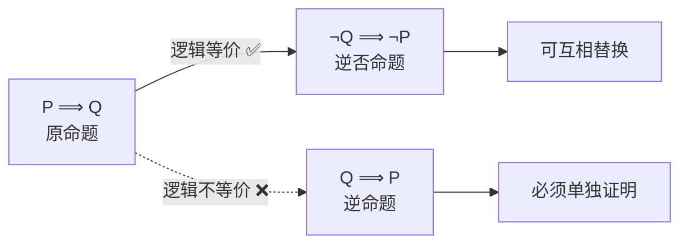
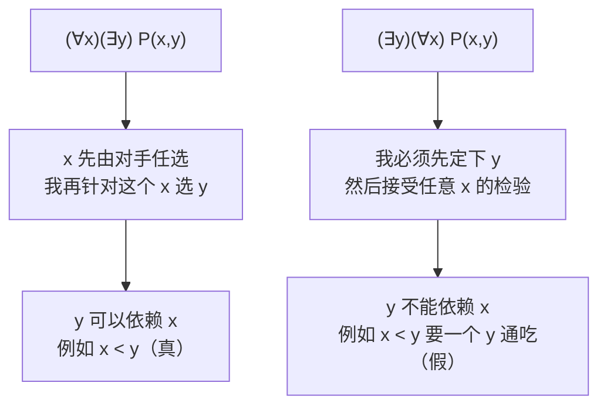
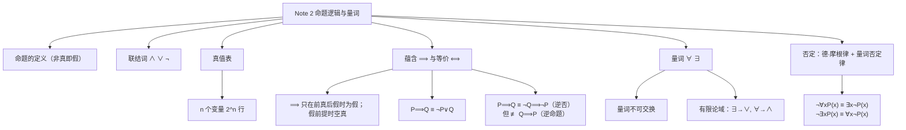

# Note 2 命题逻辑与量词

> 本笔记对应 CS 70《离散数学与概率论》Fall 2026 Course Notes Note 2: *Propositional Logic*。这份笔记要解决的是一个很实际的问题：**数学定理到底长什么样？** 只有先看懂定理的"逻辑外形"，才能对它做变形，变形成更容易证明的样子。Note 2 建立"语言与语法"，后面的 Note 3 才开始讲"怎么写证明"。

---

## 1. 命题逻辑（Propositional Logic）

要想熟练地处理数学命题，你必须理解**数学语言的基本框架**。本讲先学习：数学定理可能采取哪些**逻辑形式**，以及如何**操作**这些形式，使它们更容易被证明。接下来几讲我们会学习若干种不同的证明方法。

我们的第一块积木是**命题（proposition）**的概念。

> **定义（命题）**：一个**命题**就是一个**非真即假**的陈述句。

### 1.1 这些是命题

下面这些陈述都是命题：

1. $\sqrt{3}$ 是无理数。
2. $1 + 1 = 5$。
3. 尤利乌斯·凯撒在他十岁生日那天早餐吃了 2 个鸡蛋。

**⚠️ 注意**：命题**(2)** 是**假**的，但它依然是命题！命题的定义只要求"非真即假"，**不要求它实际上为真**。这是初学者最常犯的概念性错误——把"是命题"误解为"是真命题"。

命题 (3) 我们可能永远无法核实，但它要么真、要么假，所以它是命题。

### 1.2 这些不是命题

下面这些陈述明显不是命题：

4. $2 + 2$。
5. $x^2 + 3x = 5$。【$x$ 是什么？】

**(4)** 只是一个表达式，没有做出任何断言，因此谈不上真假。**(5)** 含有**自由变量** $x$——在 $x$ 取值确定之前，它既不为真也不为假，所以不是命题。

下面这些也不是命题（尽管有些书写它们是）：

6. 阿诺德·施瓦辛格**经常**吃西兰花。【"经常"是什么？】
7. 亨利八世**不受欢迎**。【"不受欢迎"是什么？】

> 命题中**不应该包含模糊的词语**。

**⚠️ 注意**：像"经常""不受欢迎""很大""差不多"这类词没有明确的判定标准，因此含有它们的句子无法被判定真假，不能作为命题。在写严格的数学证明时，必须把这类模糊表述换成精确定义（例如把"经常"换成"每月至少 20 次"）。

### 1.3 逻辑联结词

命题可以**组合**起来，形成更复杂的陈述。设 $P$ 与 $Q$ 是代表命题的变量（例如 $P$ 可以代表"$3$ 是奇数"）。最简单的组合方式是使用联结词"**且**""**或**""**非**"。

| 编号 | 名称 | 记号 | 读法 | 何时为真 |
| :--- | :--- | :--- | :--- | :--- |
| (1) | **合取（Conjunction）** | $P \wedge Q$ | "$P$ 且 $Q$" | 仅当 $P$ 与 $Q$ **都**为真 |
| (2) | **析取（Disjunction）** | $P \vee Q$ | "$P$ 或 $Q$" | 当 $P$ 与 $Q$ **至少一个**为真 |
| (3) | **否定（Negation）** | $\neg P$ | "非 $P$" | 当 $P$ **为假** |

像这样**含有变量**的陈述，称为**命题形式（propositional form）**。

**⚠️ 注意**：析取 $\vee$ 的"或"是**包含或（inclusive or）**——"至少一个为真"意味着"两个都真"也算真。这与日常口语中"你要么喝茶要么喝咖啡"（隐含二选一）不同。数学里除非明说"不可兼或（exclusive or, XOR）"，否则"或"一律是包含或。

### 1.4 排中律、重言式与矛盾式

有一条基本原理叫作**排中律（law of the excluded middle）**：

> **排中律**：对任意命题 $P$，要么 $P$ 为真，要么 $\neg P$ 为真（**但不能两者都真**）。

因此，**$P \vee \neg P$ 永远为真**，无论 $P$ 的真值是什么。

> **定义（重言式）**：一个**无论其变量取何真值都恒为真**的命题形式，称为**重言式（tautology）**。

> **定义（矛盾式）**：相反地，像 $P \wedge \neg P$ 这样**恒为假**的陈述，称为**矛盾式（contradiction）**。

**⚠️ 注意**：排中律中"但不能两者都真"这半句同样重要——它排除了"$P$ 与 $\neg P$ 同时为真"的可能。这条性质在 Note 3 的"反证法"中会被直接用到：反证法之所以有效，正是因为它依赖"若一个命题不是假的，那它就必须是真的"这种**非黑即白**的解读。

> **Concept check!** 令 $P$ 代表命题"$3$ 是奇数"，$Q$ 代表"$4$ 是奇数"，$R$ 代表"$4 + 5 = 49$"。那么 $P \wedge R$、$P \vee R$、$\neg Q$ 的值分别是什么？

**补充说明（这道自测题的答案）**：$P$ 为真（$3$ 是奇数），$Q$ 为假（$4$ 不是奇数），$R$ 为假（$4+5=9 \neq 49$）。于是

- $P \wedge R = \mathrm{T} \wedge \mathrm{F} = \mathbf{F}$（合取要求两者都真）；
- $P \vee R = \mathrm{T} \vee \mathrm{F} = \mathbf{T}$（析取只要一个真）；
- $\neg Q = \neg \mathrm{F} = \mathbf{T}$（否定把真值翻转）。

**✅ 本节要点总结**
- **命题** = 非真即假的陈述；为假不影响它是命题。
- **不是命题**的三种典型：无断言的表达式（$2+2$）、含自由变量（$x^2+3x=5$）、含模糊词（"经常""不受欢迎"）。
- 三个基本联结词：$\wedge$（且）、$\vee$（或，**包含或**）、$\neg$（非）。
- **排中律**：$P \vee \neg P$ 恒真；**重言式**恒真，**矛盾式**恒假。

---

## 2. 真值表（Truth Tables）

描述命题形式各种取值的一个有用工具是**真值表（truth table）**。

> **真值表与函数表完全一样**：你列出变量的**所有可能输入值**，再列出在这些输入下对应的**输出值**。（行的顺序无关紧要。）

### 2.1 合取与否定

**合取 $P \wedge Q$ 的真值表**：

| $P$ | $Q$ | $P \wedge Q$ |
| :---: | :---: | :---: |
| T | T | T |
| T | F | F |
| F | T | F |
| F | F | F |

**否定 $\neg P$ 的真值表**：

| $P$ | $\neg P$ |
| :---: | :---: |
| T | F |
| F | T |

**⚠️ 注意**：$2$ 个变量共有 $2^2 = 4$ 行，$3$ 个变量共有 $2^3 = 8$ 行。写真值表时**不要把任何一行漏掉**——真值表证明法的有效性完全依赖"穷尽所有情况"。

> **Concept check!** 请写出析取（OR）的真值表。

**补充说明（这道自测题的答案）**：

| $P$ | $Q$ | $P \vee Q$ |
| :---: | :---: | :---: |
| T | T | T |
| T | F | T |
| F | T | T |
| F | F | F |

可见 $\vee$ 与 $\wedge$ 的真值表**恰好相反**（$\vee$ 只有一个 F，$\wedge$ 只有一个 T），这正呼应了后面要讲的德·摩根律。

### 2.2 蕴含（Implication）

最重要也最微妙的命题形式是**蕴含**：

> **(4) 蕴含（Implication)**：$P \Longrightarrow Q$（读作"$P$ 蕴含 $Q$"），等同于"**如果 $P$，那么 $Q$**"。

其中 $P$ 称为蕴含的**假设（hypothesis）**，$Q$ 称为**结论（conclusion）**。

**补充说明**：$P$ 有时也称为**前件（antecedent）**，$Q$ 称为**后件（consequent）**。

我们在日常生活中经常遇到蕴含，例如：

- 如果你站在雨里，那么你会淋湿。
- 如果你通过了这门课，那么你会收到一份证书。

> **定理 2.1（蕴含何时为假）**：蕴含 $P \Longrightarrow Q$ **仅当 $P$ 为真且 $Q$ 为假时**才为假。

**套用上面的例子**：第一句只在"你站在雨里但没有淋湿"时为假；第二句只在"你通过了课程但没有收到证书"时为假。

**$P \Longrightarrow Q$ 的真值表**（最后一列稍后解释）：

| $P$ | $Q$ | $P \Longrightarrow Q$ | $\neg P \vee Q$ |
| :---: | :---: | :---: | :---: |
| T | T | T | T |
| T | F | F | F |
| F | T | T | T |
| F | F | T | T |

**注意：当 $P$ 为假时，$P \Longrightarrow Q$ 永远为真。**

> **定义（空真，vacuously true）**：当一个蕴含因为**假设为假**而"（在英语里）显得很傻地为真"时，我们说它是**空真**的。

这意味着许多在英语语境中听起来荒谬的陈述，在数学上却是真的。例如：

- "如果猪会飞，那么马会读书。"
- "如果 $14$ 是奇数，那么 $1 + 2 = 18$。"

**⚠️ 注意**：这两句话我们在日常生活中永远不会说，但在数学中完全自然。请务必接受"**假前提可以推出任何结论**"这一约定。它不是为了刁难人，而是为了让"$P \Longrightarrow Q$"成为一个**在 $P$ 为假时也有确定真值**的运算——否则真值表就会缺行，逻辑系统就会漏洞百出。

### 2.3 蕴含与"非 $P$ 或 $Q$"

**注意**：$P \Longrightarrow Q$ **逻辑等价于** $\neg P \vee Q$。这通过比较上面真值表的最后两列即可看出：对所有可能的 $P$、$Q$ 真值取值，$P \Longrightarrow Q$ 与 $\neg P \vee Q$ 取**相同的值**（即它们有相同的真值表）。我们把它写作

$$(P \Longrightarrow Q) \equiv (\neg P \vee Q)$$

**⚠️ 注意（重要工具）**：这个等价式是**消去蕴含**的标准手段。当你在证明中不知道如何处理"$\Longrightarrow$"时，把它改写成"$\neg P \vee Q$"往往能让逻辑结构变得清楚。另外注意，$P \Longrightarrow Q$ 中含 $P$ 的那一边是**否定**的：$\neg P \vee Q$。

### 2.4 蕴含的多种说法（务必全部掌握）

$P \Longrightarrow Q$ 是数学定理最常见的形态。下面是它的几种不同说法：

> **性质 2.2（$P \Longrightarrow Q$ 的等价说法）**
> 1. if $P$, then $Q$ —— 如果 $P$，那么 $Q$；
> 2. $Q$ if $P$ —— 如果 $P$ 则 $Q$；
> 3. $P$ only if $Q$ —— $P$ 仅当 $Q$（"$P$ 只有在 $Q$ 成立时才能成立"）；
> 4. $P$ is sufficient for $Q$ —— $P$ 是 $Q$ 的**充分条件**；
> 5. $Q$ is necessary for $P$ —— $Q$ 是 $P$ 的**必要条件**；
> 6. $Q$ unless not $P$ —— 除非非 $P$，否则 $Q$。

**⚠️ 注意（最容易读错的两个）**：

- **第 3 种**"$P$ only if $Q$"很多人会误读成 $Q \Longrightarrow P$。正确的理解是："$P$ 成立**只可能**在 $Q$ 成立的时候"，也就是"$P$ 一旦成立，$Q$ 必然成立"，即 $P \Longrightarrow Q$。
- **第 5 种**"$Q$ 是 $P$ 的必要条件"意思同样是 $P \Longrightarrow Q$：没有 $Q$ 就没有 $P$。请记住口诀——**充分条件在箭头左边，必要条件在箭头右边**。

### 2.5 当且仅当（iff）

如果 $P \Longrightarrow Q$ 与 $Q \Longrightarrow P$ **都**为真，我们就说"**$P$ 当且仅当 $Q$**"（缩写为"**$P$ iff $Q$**"）。形式上写作

$$P \Longleftrightarrow Q$$

**注意**：$P \Longleftrightarrow Q$ **仅当 $P$ 与 $Q$ 真值相同**（同真或同假）时为真。

**例**：令 $P$ 为"$3$ 是奇数"，$Q$ 为"$4$ 是奇数"，$R$ 为"$6$ 是偶数"。则下面这些全为真：

$$P \Longrightarrow R, \qquad Q \Longrightarrow P\ (\text{空真}), \qquad R \Longrightarrow P$$

因为 $P \Longrightarrow R$ 与 $R \Longrightarrow P$ 都成立，我们还得到 $P \Longleftrightarrow R$ 为真。

**逐条核对（补充说明）**：

- $P \Longrightarrow R$：$P$ 真（$3$ 是奇数），$R$ 真（$6$ 是偶数），故为真；
- $Q \Longrightarrow P$：$Q$ 假（$4$ 不是奇数），故蕴含**空真**；
- $R \Longrightarrow P$：$R$ 真、$P$ 真，故为真；
- 由前一条与第三条，$P$ 与 $R$ 互相蕴含，于是 $P \Longleftrightarrow R$ 为真。

### 2.6 逆否命题与逆命题

给定一个蕴含 $P \Longrightarrow Q$，我们还可以定义它的：

> **定义（逆否命题与逆命题）**
> **(a) 逆否命题（Contrapositive）**：$\neg Q \Longrightarrow \neg P$
> **(b) 逆命题（Converse）**：$Q \Longrightarrow P$

**例**：命题"如果你通过了这门课，那么你会收到一份证书"的

- **逆否命题**是"如果你没有收到证书，那么你没有通过这门课"；
- **逆命题**是"如果你收到了证书，那么你通过了这门课"。

**逆否命题与原命题说的是同一件事吗？逆命题呢？**

让我们看真值表：

| $P$ | $Q$ | $\neg P$ | $\neg Q$ | $P \Longrightarrow Q$ | $Q \Longrightarrow P$ | $\neg Q \Longrightarrow \neg P$ | $P \Longleftrightarrow Q$ |
| :---: | :---: | :---: | :---: | :---: | :---: | :---: | :---: |
| T | T | F | F | T | T | T | T |
| T | F | F | T | F | T | F | F |
| F | T | T | F | T | F | T | F |
| F | F | T | T | T | T | T | T |

**注意**：$P \Longrightarrow Q$ 与其逆否命题的真值表**处处相同**，因此它们**逻辑等价**：

$$(P \Longrightarrow Q) \equiv (\neg Q \Longrightarrow \neg P)$$

> **⚠️ 注意（本讲最重要的易错点）**：许多学生会把**逆否命题**与**逆命题**搞混。请牢记：
> - $P \Longrightarrow Q$ 与 $\neg Q \Longrightarrow \neg P$ **逻辑等价**（可以互相替换）；
> - $P \Longrightarrow Q$ 与 $Q \Longrightarrow P$ **不**等价（一般情况下不能互换）！

上面真值表的第 2 行就是反例：$P = \mathrm{T}, Q = \mathrm{F}$ 时，$P \Longrightarrow Q$ 为 F，而 $Q \Longrightarrow P$ 为 T。

**补充说明（为什么要关心逆否命题）**：当两个命题形式逻辑等价时，我们可以把它们看成"说的是同一件事"。下一讲（Note 3）会看到，这一点在证明定理时极其有用：**当一个蕴含难以直接证明时，我们可以改证它的逆否命题**——这就是"逆否证明法"的全部依据。

**图意说明**：实线箭头代表"可以随意互换"，虚线箭头代表"看起来很像但绝不能混用"。这张图是 Note 3 逆否证明法的合法性来源。

**✅ 本节要点总结**
- 真值表 = 列出全部输入组合及对应输出；$n$ 个变量有 $2^n$ 行。
- $\wedge$ 只在全真时为真；$\vee$ 只在全假时为假；$\neg$ 翻转真值。
- $P \Longrightarrow Q$ **只在 $P$ 真 $Q$ 假时为假**；$P$ 假时蕴含**空真**。
- 核心恒等式：$(P \Longrightarrow Q) \equiv (\neg P \vee Q)$。
- $P \Longrightarrow Q$ 的六种说法要全部认得，尤其"$P$ only if $Q$"和"$Q$ 是 $P$ 的必要条件"都是 $P \Longrightarrow Q$。
- $(P \Longrightarrow Q) \equiv (\neg Q \Longrightarrow \neg P)$（**逆否等价**）；但 $P \Longrightarrow Q \not\equiv Q \Longrightarrow P$（**逆命题不等价**）。
- $P \Longleftrightarrow Q$ 等价于"$P$ 与 $Q$ 真值相同"。

---

## 3. 量词（Quantifiers）

实际遇到的数学命题不会只由"$3$ 是奇数"这种简单命题拼成，而会像下面这样：

1. 对所有自然数 $n$，$n^2 + n + 41$ 是素数。
2. 如果 $n$ 是奇数，那么 $n^3$ 也是奇数。
3. 存在一个整数 $k$，它既是偶数又是奇数。

**本质上，这些命题一次性断言了关于大量（甚至无穷多个！）简单命题的事情。** 例如第一条断言的是：$0^2 + 0 + 41$ 是素数、$1^2 + 1 + 41$ 是素数，依此类推。最后一条则说：当 $k$ 取遍所有可能整数时，我们至少能找到一个满足该陈述的 $k$。

### 3.1 为什么它们算命题，而 $x^2 + 3x = 5$ 不算？

**为什么上面三个例子被视为命题，而我们此前说"$x^2 + 3x = 5$"不是？**

原因是：在这些例子中存在一个隐含的**论域（universe）**，我们正是**在该论域上进行量化**的。要用数学语言表达这些陈述，我们需要两个量词：

> **定义（量词）**
> - **全称量词（universal quantifier）** $\forall$：读作"**对所有**"；
> - **存在量词（existential quantifier）** $\exists$：读作"**存在**"。

**例 1**："某些哺乳动物会产卵。"在数学上，"某些"的意思是"**至少一个**"，所以这句话是在说"存在一个哺乳动物 $x$，使得 $x$ 会产卵"。若令论域 $U$ 为哺乳动物的集合，则可写作

$$(\exists x \in U)(x \text{ 会产卵})$$

**补充说明**：有时当论域很明显时，我们会省略 $U$，直接写 $\exists x (x \text{ 会产卵})$。

**例 2**："对所有自然数 $n$，$n^2 + n + 41$ 是素数"，可以取论域为自然数集（记作 $\mathbb{N}$）来表达：

$$(\forall n \in \mathbb{N})(n^2 + n + 41 \text{ 是素数})$$

### 3.2 谓词与命题公式

> **定义（谓词 / 命题公式）**：当一个陈述**含有一个变量**，且**用具体值替换该变量后**能使陈述变为真或假，我们就把它称为一个**谓词（predicate）**或**命题公式（propositional formula）**。

**例**："$n^2 + n + 41$ 是素数"就是一个以 $n$ 为变量的谓词。它对自然数 $n$ 的取值结果或真或假，取决于 $n$ 的值。也就是说，**给变量代入一个值，谓词就变成了一个命题**。具体来说：

- 当 $n = 1$ 时，得到"$43$ 是素数"，为**真**；
- 当 $n = 41$ 时，陈述"$41^2 + 41 + 41$ 是素数"为**假**，因为 $41^2 + 41 + 41$ 可以分解为 $41 \times 43$。

**⚠️ 注意**：这就是**谓词与命题的区别**。谓词本身不是命题（有自由变量，无真值），量化之后（$\forall n$ 或 $\exists n$ 把变量"约束住"）才成为命题。前面说 "$x^2+3x=5$ 不是命题"、而 "$(\forall n \in \mathbb{N})(n^2+n+41 \text{ 是素数})$ 是命题"，差别正在于此。

### 3.3 有限论域下的量词可以消去

**注意**：在**有限**论域中，我们可以不使用量词，而分别用**析取**与**合取**来表达存在量化与全称量化的命题。

例如，若论域 $U = \{1,2,3,4\}$，则

$$(\exists x \in U)P(x) \equiv P(1) \vee P(2) \vee P(3) \vee P(4)$$

$$(\forall x \in U)P(x) \equiv P(1) \wedge P(2) \wedge P(3) \wedge P(4)$$

**然而，在无限论域中（例如自然数集），这是不可能的。**

**⚠️ 注意（这个对照极其重要）**：

| 量词 | 有限论域下的等价形式 | 直觉 |
| :--- | :--- | :--- |
| $\exists$ | 一串 $\vee$（**或**） | "至少有一个" |
| $\forall$ | 一串 $\wedge$（**且**） | "每一个都" |

这个对照解释了为什么 $\forall$ 与 $\wedge$、$\exists$ 与 $\vee$ 在"否定律"中会相应配对（见第 4 节）。同时也说明了**证明为什么必须"有限"**：$\forall x \in \mathbb{N}$ 展开后是**无穷多个** $\wedge$，没有人能写完；所以我们必须借助逻辑推理，用有限步骤一次性覆盖它。

> **Concept check!** 请用量词表达下面两个陈述："对所有整数 $x$，$2x+1$ 是奇数"，以及"存在一个介于 $2$ 和 $4$ 之间的整数"。

**补充说明（这道自测题的答案）**：

- $(\forall x \in \mathbb{Z})(2x + 1 \text{ 是奇数})$；
- $(\exists x \in \mathbb{Z})(2 < x < 4)$（等价写法：$(\exists x \in \mathbb{Z})(x > 2 \wedge x < 4)$）。注意"$2 < x < 4$"这个连续不等式在数学中就是"$x > 2$ **且** $x < 4$"，所以它对应一个**合取**。

### 3.4 多个量词：量词不可交换

有些陈述可以含有**多个量词**。然而，正如我们将看到的，**量词不可交换（do not commute）**。

光靠思考英语句子就能看出这一点。考虑下面这个（颇为血腥的）例子：

- **(A)** "每次我在纽约坐地铁，都有人被捅。"
- **(B)** "存在某个人，使得每次我在纽约坐地铁，那个人都被捅。"

**第 (A) 句**说的是：每次我坐地铁时都有人被捅，但**每次可能是不同的人**。

**第 (B) 句**说的则是一件真正恐怖的事：存在某个倒霉的家伙 Joe，不幸到"每次我上纽约地铁，Joe 都在那里，又被捅了一次"。（可怜的 Joe 一看见我就会拔腿逃命。）

**用数学语言表述**：我们要在两个论域上量化：$T = \{$我坐地铁的时刻$\}$ 与 $P = \{$人$\}$。

- 第 (A) 句可写作：$(\forall t \in T)(\exists p \in P)(p \text{ 在时刻 } t \text{ 被捅})$；
- 第 (B) 句则是：$(\exists p \in P)(\forall t \in T)(p \text{ 在时刻 } t \text{ 被捅})$。

**看一个更数学化的例子。** 考虑

1. $(\forall x \in \mathbb{Z})(\exists y \in \mathbb{Z})(x < y)$
2. $(\exists y \in \mathbb{Z})(\forall x \in \mathbb{Z})(x < y)$

**第 1 句**说的是：给定一个整数，我总能找到一个更大的整数。**第 2 句**说的则是非常不同的东西：**存在一个最大的整数！** 第 1 句为真，第 2 句不是。

**⚠️ 注意（判断多量词命题的方法）**：量词的**书写顺序**决定了"**谁先选、谁后选**"：

- 在 $(\forall x)(\exists y)$ 中，$x$ 先被任意选定（相当于对手出招），$y$ 随后由我们挑选，因此 **$y$ 可以依赖于 $x$**；
- 在 $(\exists y)(\forall x)$ 中，$y$ 必须在**面对任意 $x$ 之前**就确定下来，因此必须"**一个 $y$ 通吃所有 $x$**"。

对整数而言，"一个通吃所有整数的 $y$"不存在，所以第 2 句为假。请养成从左往右逐字读量词的习惯。

**图意说明**：这张图把"量词顺序"翻译成"出招顺序"。核心判据只有一句：**后出现的量词可以"看到"先出现的量词所选的元素**。因此 $(\forall x)(\exists y)$ 比 $(\exists y)(\forall x)$ **弱**（更容易满足）：凡是后一种形式成立的命题，前一种形式也必成立，反之不然。

**✅ 本节要点总结**
- 量词让"含自由变量的谓词"变成**命题**：$\forall$（对所有）、$\exists$（存在）；量化必须在一个**论域**上进行。
- **谓词**代入具体值后变成命题；未量化的自由变量使陈述不是命题。
- 有限论域下：$\exists x P(x)$ 展开为 $\vee$，$\forall x P(x)$ 展开为 $\wedge$；**无限论域下做不到**。
- **量词不可交换**：$(\forall x)(\exists y)$ 与 $(\exists y)(\forall x)$ 含义不同；后出现的量词可以依赖先出现的量词。
- 经典判例：$(\forall x \in \mathbb{Z})(\exists y \in \mathbb{Z})(x < y)$ 为真，$(\exists y \in \mathbb{Z})(\forall x \in \mathbb{Z})(x < y)$ 为假。

---

## 4. 关于否定的大文章（Much Ado About Negation）

命题 $P$ 为假意味着什么？意味着它的**否定 $\neg P$ 为真**。掌握一些处理否定的规则很有帮助——下一讲讨论证明时，这一点会变得更明显。

### 4.1 德·摩根律

首先看看如何否定**合取**与**析取**：

> **性质 4.1（德·摩根律，De Morgan's Laws）**
> $$\neg(P \wedge Q) \equiv (\neg P \vee \neg Q)$$
> $$\neg(P \vee Q) \equiv (\neg P \wedge \neg Q)$$

这两条等价式就是**德·摩根律（De Morgan's Laws）**，它们非常符合直觉：例如，如果"$P \wedge Q$ 为真"这件事不成立，那么 $P$ 或 $Q$ 之中必有一个为假（反之亦然）。

**⚠️ 注意（用记号记忆的技巧）**：否定号"穿过"括号时，需要做**两件事**：把 $\wedge$ 翻成 $\vee$（或反过来），并把**每一个**子命题都加上否定。最容易犯的错误是**只翻联结词、忘记逐个取反**（写成 $\neg(P \wedge Q) \equiv \neg P \vee Q$ 就错了）。

> **Concept check!** 请写出相应的真值表，验证两条德·摩根律。

**补充说明（验证过程）**：

| $P$ | $Q$ | $P \wedge Q$ | $\neg(P \wedge Q)$ | $\neg P$ | $\neg Q$ | $\neg P \vee \neg Q$ |
| :---: | :---: | :---: | :---: | :---: | :---: | :---: |
| T | T | T | **F** | F | F | **F** |
| T | F | F | **T** | F | T | **T** |
| F | T | F | **T** | T | F | **T** |
| F | F | F | **T** | T | T | **T** |

第 4 列与第 7 列**逐行相同**，故 $\neg(P \wedge Q) \equiv \neg P \vee \neg Q$。第二条律用同样方式比较 $\neg(P \vee Q)$ 与 $\neg P \wedge \neg Q$ 两列即可。

### 4.2 量词的否定

**否定含量词的命题，遵循着完全类似的规律。**

先看一个简单例子。假设论域是 $\{1,2,3,4\}$，并令 $P(x)$ 表示命题公式"$x > 10$"。

**逐项检查一下**（补充说明）：

| $x$ | $P(x)$：$x > 10$ | $\neg P(x)$：$x \leq 10$ |
| :---: | :---: | :---: |
| $1$ | F | T |
| $2$ | F | T |
| $3$ | F | T |
| $4$ | F | T |

于是可以逐对比较两组命题：

| 命题 | 值 | 理由 |
| :--- | :---: | :--- |
| $\exists x P(x)$ | F | 没有任何 $x$ 满足 $x > 10$ |
| $\forall x P(x)$ | F | 并非所有 $x$ 都满足 $x > 10$ |
| $\neg(\forall x P(x))$ | **T** | 上一行为 F，取反 |
| $\exists x \neg P(x)$ | **T** | $x=1$ 就使 $\neg P(x)$ 成立 |
| $\forall x \neg P(x)$ | **T** | 每一个 $x$ 都不大于 $10$ |
| $\neg(\exists x P(x))$ | **T** | $\exists xP(x)$ 为 F，取反 |

**每一对命题的真值都相同**（$\neg(\forall xP(x))$ 与 $\exists x\neg P(x)$ 同为 T；$\forall x\neg P(x)$ 与 $\neg(\exists xP(x))$ 同为 T），**这绝非巧合**——它正是下面两条等价律的体现。

**⚠️ 注意（对照原文时的一处细节）**：原文在这个例子中还写了"$\exists xP(x)$ 为真"以及"$P(4)$ 为真"两句话。按论域 $\{1,2,3,4\}$ 与谓词"$x > 10$"来核对，这两句话都不成立（$4$ 不大于 $10$，故 $\exists xP(x)$ 为**假**、$P(4)$ 为**假**）。**这一点不影响结论**：真正的要点是"两对命题的真值**总是逐对相同**"，而下文的两条律对**任何**论域都成立。初学时若被这个小例子绕住，请直接跳到下面的等价律，用"$\forall$ 对应 $\wedge$、$\exists$ 对应 $\vee$"的对照来理解它。

> **性质 4.2（量词否定律）**
> $$\neg(\forall x P(x)) \equiv \exists x \neg P(x)$$
> $$\neg(\exists x P(x)) \equiv \forall x \neg P(x)$$
> 这两条律对**任何**命题 $P$、**任何**论域（**包括无限论域**）都成立。

**⚠️ 注意（怎么记）**：否定号穿过量词时，同样做两件事：**$\forall$ 与 $\exists$ 互换**，并**把内部的 $P$ 取反**。这与德·摩根律中"$\wedge$ 与 $\vee$ 互换"完全平行——回忆第 3.3 节的对照表：$\forall$ 对应一串 $\wedge$，$\exists$ 对应一串 $\vee$，所以"翻量词"就是"翻联结词"。

### 4.3 用英语句子说服自己

借助英语句子来（非正式地）说服自己这些律是真的很有帮助。例如，假设我们在论域 $\mathbb{Z}$（全体整数）中工作，$P(x)$ 是命题"$x$ 是奇数"。

我们知道 $(\forall x P(x))$ 是**假**的，因为并非每个整数都是奇数。因此我们期待它的否定 $\neg(\forall x P(x))$ 为**真**。

**那么如何用英语说出这个否定呢？** 如果"每个整数都是奇数"这件事不成立，那就**必定存在**某个整数**不是**奇数（即偶数）。用命题形式怎么写？很简单，就是 $(\exists x \neg P(x))$。

### 4.4 更复杂的例子：把否定推入量词内部

看一个更复杂的例子。固定某个论域与命题公式 $P(x,y)$。假设我们有命题 $\neg(\forall x \exists y P(x,y))$，并想把否定运算符**推到量词里面去**。根据上面的律，可以这样做：

> **推导过程（逐步标注依据）**
> $$\neg(\forall x \exists y P(x,y)) \equiv \exists x \neg(\exists y P(x,y)) \qquad \text{（依据 } \neg\forall x Q(x) \equiv \exists x\neg Q(x)\text{，取 } Q(x) := \exists y P(x,y)\text{）}$$
> $$\phantom{\neg(\forall x \exists y P(x,y))} \equiv \exists x \forall y \neg P(x,y) \qquad \text{（依据 } \neg\exists y R(y) \equiv \forall y\neg R(y)\text{，取 } R(y) := P(x,y)\text{）}$$

**注意**：随着否定不断向外传播，我们把这个复杂的否定**拆解成了更小、更容易的问题**。

**还要注意：量词在这个过程中"翻转"了。**（$\forall$ 变 $\exists$，$\exists$ 变 $\forall$。）

**⚠️ 注意（实用口诀）**：要否定一个量词串，就**从左到右逐个"翻牌"**：$\forall \to \exists$、$\exists \to \forall$，最后把最里层的谓词取反。整个过程**不需要任何数学洞察**，只是机械的符号操作。这在后续证明"某个命题不成立"（例如反证法的开头）时极其常用。

**✅ 本节要点总结**
- **德·摩根律**：$\neg(P \wedge Q) \equiv \neg P \vee \neg Q$；$\neg(P \vee Q) \equiv \neg P \wedge \neg Q$。
- **量词否定律**：$\neg(\forall x P(x)) \equiv \exists x \neg P(x)$；$\neg(\exists x P(x)) \equiv \forall x \neg P(x)$。对**任何**论域（含无限论域）成立。
- 两者的共同规律：**否定号穿过时，"联结词/量词翻转" + "内部命题取反"**（$\wedge \leftrightarrow \vee$，$\forall \leftrightarrow \exists$）。
- 例：$\neg(\forall x \exists y P(x,y)) \equiv \exists x \forall y \neg P(x,y)$——可以逐层把否定推入，量词依次翻转。

---

## 5. 全篇总结

**一页速查**

- **命题**：非真即假；为假也算命题。**不是命题**：无断言、含自由变量、含模糊词。
- **基本联结词**：$\wedge$（都真才真）、$\vee$（都假才假，**包含或**）、$\neg$（翻转）。
- **排中律**：$P \vee \neg P$ 恒真（重言式）；$P \wedge \neg P$ 恒假（矛盾式）。
- **蕴含**：$P \Longrightarrow Q$ 仅在 T$\to$F 时为假；$P$ 假时**空真**；等价形式 $(P \Longrightarrow Q) \equiv (\neg P \vee Q)$。
- **充分 / 必要**：$P$ 是 $Q$ 的**充分**条件、$Q$ 是 $P$ 的**必要**条件，说的都是 $P \Longrightarrow Q$。
- **等价**：$P \Longleftrightarrow Q$ 当且仅当两者真值相同。
- **逆否 vs 逆命题**：$(P \Longrightarrow Q) \equiv (\neg Q \Longrightarrow \neg P)$（**等价**）；$P \Longrightarrow Q$ 与 $Q \Longrightarrow P$ **不等价**。
- **量词**：$\forall$"对所有"、$\exists$"存在"；必须指明**论域**；**顺序不可交换**。
- **有限论域**：$\exists \leftrightarrow \bigvee$、$\forall \leftrightarrow \bigwedge$；**无限论域**下无法展开。
- **否定**：$\neg(P \wedge Q) \equiv \neg P \vee \neg Q$，$\neg(P \vee Q) \equiv \neg P \wedge \neg Q$；$\neg\forall xP(x) \equiv \exists x\neg P(x)$，$\neg\exists xP(x) \equiv \forall x\neg P(x)$。
- **通向下一讲**：这些逻辑等价式就是各种证明方法（尤其是**逆否证明**与**反证法**）的合法性依据。
