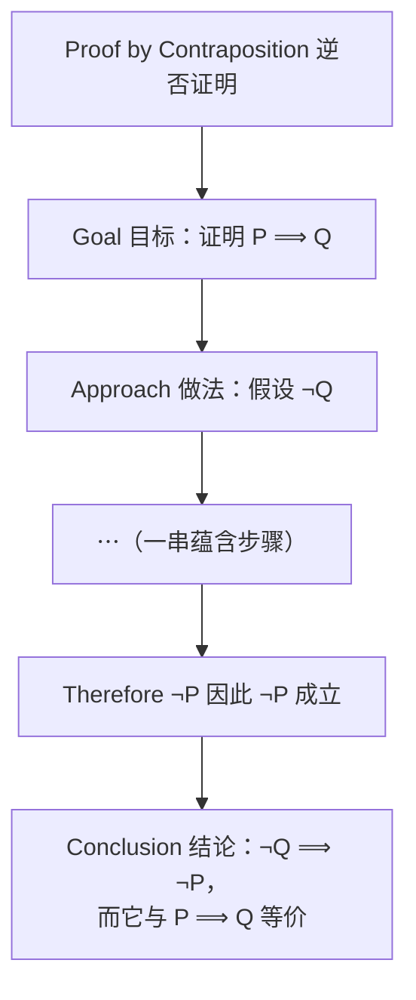
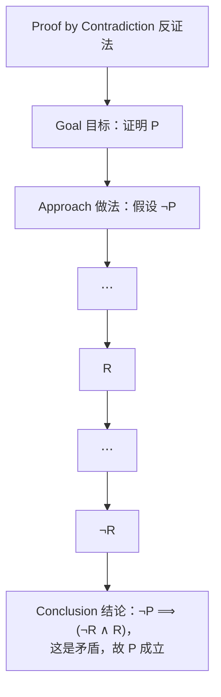
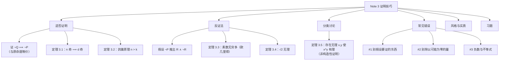

# Note 3 逆否证明、反证法、分类讨论与证明的写作

> 本笔记对应 CS 70《离散数学与概率论》Fall 2026 Course Notes Note 3（第 1–6 节）。Note 1 讲了第一种技巧——**直接证明**；本讲一口气再讲三种：**逆否证明**、**反证法**、**分类讨论**，最后专门用两节讲**写证明的常见错误**与**风格规范**。如果说 Note 2 给了你逻辑的"语法"，Note 3 就是在教你怎么"写文章"。

---

## 1. 逆否证明（Proof by Contraposition）

我们现在进入**第二种证明技巧**。回忆命题逻辑中的讨论：任何蕴含 $P \Longrightarrow Q$ 都**等价于它的逆否命题** $\neg Q \Longrightarrow \neg P$。

然而，有时 $\neg Q \Longrightarrow \neg P$ 可能比 $P \Longrightarrow Q$ **容易证明得多**。因此，**逆否证明**的做法就是去证明 $\neg Q \Longrightarrow \neg P$，而不是直接证明 $P \Longrightarrow Q$。

### 1.1 逆否证明的骨架

**图意说明**：把这张图和 Note 1 中"直接证明"的骨架图对照看，差别只有两处：**起点从 $P$ 换成了 $\neg Q$**，**终点从 $Q$ 换成了 $\neg P$**。中间的推理方法与直接证明完全一样。原图在 $\neg P$ 下方还标了 Conclusion 一行，用来说明"为什么这样证就够了"——因为逆否命题与原命题逻辑等价。

**⚠️ 注意**：逆否证明**不是**"假设 $P$ 然后推出 $Q$"，也**不是**"假设 $\neg P$ 推出 $\neg Q$"。后者叫作**否命题（inverse）**，它与原命题**并不等价**（否命题是逆命题的逆否，而逆命题与原命题不等价）。请牢牢记住方向：**假设 $\neg Q$，推出 $\neg P$**。

### 1.2 定理 3.1：奇数的因子

> **定理 3.1**：设 $n$ 是正整数，且 $d$ 整除 $n$。若 $n$ 是奇数，则 $d$ 是奇数。

**用直接证明来做这件事似乎很困难**：我们会在第 1 步假设 $n$ 是奇数，然后呢？……就走不下去了。而用**逆否证明**则容易得多。

> **Concept check!** 定理 3.1 的逆否命题是什么？
>
> **答案：若 $d$ 是偶数，则 $n$ 是偶数。**

**为什么这个自测题的答案是对的（补充说明）**：原命题是 $P \Longrightarrow Q$，其中

$$P = \text{"}n\text{ 是奇数"},\qquad Q = \text{"}d\text{ 是奇数"}$$

逆否命题是 $\neg Q \Longrightarrow \neg P$，即"$d$ **不是**奇数 $\Longrightarrow$ $n$ **不是**奇数"，也就是"$d$ 是偶数 $\Longrightarrow$ $n$ 是偶数"。

> **证明（Proof of Theorem 3.1）**

**证明：我们采用逆否证明。** 假设 $d$ 是偶数。

1. **把"偶数"写成定义形式**：由偶数的定义，$d = 2k$，其中 $k \in \mathbb{Z}$。
2. **把"整除"写成定义形式**：因为 $d \mid n$，所以 $n = dl$，其中 $l \in \mathbb{Z}$。
3. **合并两式并做代数变形**：
   $$n = dl = (2k)l = 2(kl)$$
4. **得出结论**：由第 3 步，$n$ 可以写成 $2$ 的整数倍（$kl \in \mathbb{Z}$，因为 $\mathbb{Z}$ 对乘法封闭），故 $n$ 是**偶数**，即 $\neg P$ 成立。

**证毕。** $\blacksquare$

**⚠️ 注意**：注意这次我们在证明的**第一行就声明了所用的证明技巧**（"We proceed by contraposition"）。这是**好习惯**，对任何证明都适用——就像写程序时加注释是好习惯一样。像这样声明你的证明技巧，对读者理解"你的证明接下来要往哪里走"是巨大的帮助。（别忘了：理解了你的证明的读者——例如助教或老师——更可能给你一个好分数！）

### 1.3 定理 3.2：鸽巢原理（Pigeonhole Principle）

作为逆否证明的另一个例子，我们来证明一个著名定理，叫作**鸽巢原理（Pigeonhole Principle）**。虽然定理的陈述看起来很朴素，但它的推论却出人意料。

> **定理 3.2（鸽巢原理）**：设 $n$ 与 $k$ 是正整数。把 $n$ 个物体放进 $k$ 个盒子。若 $n > k$，则**至少有一个盒子必须装有多个物体**。

这个定理的名字来自这样一个想象：把 $n$ 个物体当成**鸽子（pigeons）**，我们试图把它们放进**鸽巢（pigeonholes）**里。

**⚠️ 注意（原文此处的一处笔误）**：上面是鸽巢原理的**标准陈述**（条件为 $n > k$）。原文在这一句里印成了"if $n < k$"，但**紧接着的证明恰好说明了条件必须是 $n > k$**（证明用的逆否命题是"若每个盒子至多一个物体，则 $n \leq k$"，其逆否正是"若 $n > k$，则必有盒子装了多个物体"）。请以 $n > k$ 为准。

> **证明（Proof of Theorem 3.2）**

**证明：我们采用逆否证明。**

1. **写出逆否命题的假设**：假设"所有盒子都至多装有一个物体"（这就是 $\neg Q$：结论"至少一个盒子装多个物体"的反面）。
2. **数一数物体总数的上界**：$k$ 个盒子，每个盒子至多 $1$ 个物体，因此物体的总数至多是盒子的个数，即
   $$n \leq k$$
   这正是 $\neg P$（条件 $n > k$ 的反面）。
3. **结论**：我们由"所有盒子都至多装一个"推出了 $n \leq k$，即证明了 $\neg Q \Longrightarrow \neg P$，它等价于原命题 $P \Longrightarrow Q$。

**证毕。** $\blacksquare$

**这个定理的威力**在于：**无论物体在盒子里如何分布**，它都成立。当物体以复杂的方式被放入盒子时，定理的结论就可以是非平凡的。

#### 例：旧金山居民的头发数

**看一个例子。** 只要在网上快速搜一下就会发现，人的头上的头发数量平均大约是 $100000$ 根。因此我们可以相当有把握地认为，**没有人头上的头发超过 $500000$ 根**。

另一方面，旧金山的人口（截至 2024 年）**超过 $800000$**。如果我们把旧金山居民看作"鸽子"，把"居民头上头发的数量"看作他/她所落入的"盒子"，那么**鸽巢原理**就允许我们得出一个引人入胜的结论：

> **旧金山有两个人头上的头发数量完全相同！**

**逐步核对这个推理（补充说明）**：

1. 头发的可能数量被限定在 $0$ 到 $500000$ 之间，因此"盒子"（可能的头发数）最多有 $500001$ 个，即盒子数 $k \leq 500001$；
2. "鸽子"（旧金山居民）数 $n > 800000$；
3. 由于 $n > 800000 > 500001 \geq k$，满足 $n > k$；
4. 由鸽巢原理，某个"盒子"里装了至少两只"鸽子"，即**至少有两个人头发数相同**。

**（当然，这个论证并没有告诉我们那个数具体是多少。）**

**⚠️ 注意**：鸽巢原理只能保证"**存在**"这样一对人，它是一条**非构造性**的存在性结论。这类"只证存在、不给具体对象"的证明在下一节还会再遇到（定理 3.5）。

**✅ 本节要点总结**
- **逆否证明**：要证 $P \Longrightarrow Q$，就去证 $\neg Q \Longrightarrow \neg P$——两者逻辑等价（依据 Note 2 的 $(P \Longrightarrow Q) \equiv (\neg Q \Longrightarrow \neg P)$）。
- 骨架：**假设 $\neg Q$ $\rightarrow$ 一串推理 $\rightarrow$ 推出 $\neg P$**。
- 别把逆否命题（$\neg Q \Longrightarrow \neg P$，**等价**）与逆命题（$Q \Longrightarrow P$，**不等价**）搞混。
- 好习惯：**证明第一行声明所用技巧**。
- **定理 3.1**：$d \mid n$ 且 $n$ 奇 $\Rightarrow d$ 奇；逆否地，假设 $d = 2k$ 偶数、$n = dl$，得 $n = 2(kl)$ 为偶数。
- **定理 3.2（鸽巢原理）**：$n > k$ 个物体放入 $k$ 个盒子，必有盒子装多个；用逆否证明：每盒至多一个 $\Rightarrow n \leq k$。
- 应用例：旧金山 $n > 800000$ 人、头发数最多 $500001$ 种 $\Rightarrow$ 必有两人头发数相同（**存在性**结论）。

---

## 2. 反证法（Proof by Contradiction）

在我们这篇笔记讨论的所有证明技巧中，也许最难抵抗其魅力的是这一个——毕竟，谁不想用一门叫作 ***reductio ad absurdum***（即"**归谬**"，reduction to an absurdity）的技巧呢？

**反证法的想法**是：**假设你想证明的那个断言是假的**（是的，这看起来是反着来的，但请耐心看下去）。然后，你证明这会导致一个彻底荒谬的结论：一个**矛盾**。于是你断定，你的断言实际上必定是**真**的。

> **Concept check!** 反证法**关键地依赖**这样一个事实：**如果一个命题不是假的，那么它必定是真的**。这个"非黑即白"的解读，来自前面哪一讲中的哪条定律？

**补充说明（答案）**：来自 Note 2 的**排中律（law of the excluded middle）**——对任意命题 $P$，要么 $P$ 为真、要么 $\neg P$ 为真，**但不能两者都真**。正因为不存在"既不为真也不为假"的第三种状态，反证法才能从"假设 $\neg P$ 导致矛盾"推出"$P$ 为真"。

### 2.1 反证法的骨架

**图意说明**：反证法的骨架里有**两条分支**：从假设 $\neg P$ 出发，一路推出命题 $R$，另一路推出它的反面 $\neg R$。两条路一旦相撞，就说明"$\neg P$"这个出发点不可能成立。原文用 $\vdots$ 表示中间步骤可以是任意多条，但整体仍是**有限**步。

**⚠️ 注意**：反证法与逆否证明**看起来像、其实不同**：

| | 假设 | 推出 | 目标命题 |
| :--- | :--- | :--- | :--- |
| **逆否证明** | $\neg Q$ | $\neg P$ | $P \Longrightarrow Q$ |
| **反证法** | $\neg P$（要证命题的否定） | 某个矛盾 $R \wedge \neg R$ | $P$（任意命题，不限于蕴含） |

逆否证明的终点是一个**明确的命题**（$\neg P$，且它的含义通常与原本的假设无关）；反证法的终点是**任何一对互相矛盾的陈述**。此外，反证法可以用于**任何形状**的命题，不限于蕴含。

### 2.2 为什么反证法有效（形式化推理）

如果你还不被上面这种直观解释所说服，这里是**形式化的推理**：

> **反证法有效性的证明**
> 反证法所证明的是
> $$\neg P \Longrightarrow \neg R \wedge R \equiv \textbf{False}$$
> 这句话的**逆否命题**是
> $$\textbf{True} \Longrightarrow P$$
> 这就意味着 $P$ 必定为真。

**逐步核对（补充说明）**：

1. 一个矛盾式 $\neg R \wedge R$ **恒为假**（Note 2 的"矛盾式"定义）；
2. 于是"$\neg P \Longrightarrow \text{False}$"这条蕴含，只在 $\neg P$ 为假时才为真（回顾 $P \Longrightarrow Q$ 只在 T$\to$F 时为假）；
3. 由排中律，$\neg P$ 为假等价于 $P$ 为真；
4. 换个角度看：对"$\neg P \Longrightarrow \text{False}$"取逆否，得到"$\text{True} \Longrightarrow P$"。由于前件 $\mathrm{True}$ 恒真，这蕴含直接给出 $P$。

### 2.3 定理 3.3：素数有无穷多个

让我们把这种证明技巧**试跑一次**。请注意，这样做是在延续一项悠久的传统——**下面这个定理的证明可以追溯到 2000 多年前的古希腊数学家、亚历山大里亚的欧几里得（Euclid of Alexandria）！**

> **定理 3.3**：素数有**无穷多个**。

> 💡 **补充注释（原文脚注）**：也许值得在此暂停，体会一下这句话真正的分量——毕竟，人类遗产中有多少东西能历经数千年仍然有意义？音乐？时尚？这些东西都随着时间迅速过时。但数学，在某种意义上，是**永恒的**。

**为了体会反证法的威力**，让我们先停一下，想一想如果用别的技巧（比如说直接证明）来证定理 3.3 会怎样。看起来非常困难，对吧？**你怎么可能"构造出无穷多个素数"呢？**

而反证法的奇妙之处在于：如果我们假设这个断言是**假**的，即"素数只有有限多个"，那么糟糕的事情就会发生。

**在继续之前**，我们先陈述一个简单的**引理（lemma）**，它在证明定理 3.3 时很好用。（它的证明推迟到将来讲**归纳法**的那一讲。）

> **引理 3.1**：**每个大于一的自然数，要么本身是素数，要么有一个素因子。**

> **证明（Proof of Theorem 3.3）**

**证明：我们采用反证法。**

1. **假设定理为假**：假设定理 3.3 是假的，即**素数只有有限多个**，设有 $k$ 个。
2. **把它们列举出来**：
   $$p_1, p_2, p_3, \dots, p_k$$
3. **构造一个新数**：定义
   $$q := p_1 p_2 p_3 \cdots p_k + 1$$
   也就是"所有素数的乘积再加一"。
4. **说明 $q$ 不可能是素数**：为什么呢？因为按定义，$q$ **比 $p_1$ 到 $p_k$ 中所有的素数都大**！（所有 $p_i \geq 2$，相乘之后再 $+1$，必然大于每一个因子。）而我们已假定 $p_1,\dots,p_k$ **就是全部的素数**，所以 $q$ 不可能出现在这个列表里，也就不可能是素数。
5. **由引理 3.1 得到 $q$ 有一个素因子**：既然 $q$ 不是素数，由引理 3.1 可知 $q$ 有一个素因子，记作 $p$。
   > **这个命题 $p$ 是 $q$ 的素因子，就是我们下面要用的陈述 $R$。**
6. **确定 $p$ 的身份**：因为 $p_1, p_2, p_3, \dots, p_k$ 是**全部**的素数，所以 $p$ 必定等于它们之中的某一个；于是 $p$ 整除
   $$r := p_1 p_2 p_3 \cdots p_k$$
7. **用整除的线性性质得到矛盾**：因此 $p \mid q$ 且 $p \mid r$，从而 $p \mid (q - r)$。
   （依据：Note 1 定理 1.1 与自测题——若 $a \mid b$ 且 $a \mid c$，则 $a \mid (b-c)$。）
8. **算出 $q - r$ 的值**：但
   $$q - r = 1$$
   于是 $p \mid 1$，这迫使 $p = 1$，从而 $p$ **不是**素数。
   > **这正是陈述 $\neg R$。**
9. **矛盾**：我们同时得到了 $R$（第 5 步）与 $\neg R$（第 8 步），即 $R \wedge \neg R$，这是一个矛盾，正是我们所要的。

**证毕。** $\blacksquare$

**⚠️ 注意（第 5 步与第 8 步必须都讲清楚）**：矛盾的两半缺一不可。第 5 步用**引理 3.1** 从"$q$ 不是素数"推出"$q$ 有素因子 $p$"，这就是 $R$；第 8 步用**整除的线性性质**与 $q - r = 1$ 推出 $p = 1$（不是素数），这就是 $\neg R$。如果只写"$p$ 是素因子"而不指出"$p=1$ 不是素数"，矛盾就不成立。

**补充说明（$p \mid 1$ 为什么迫使 $p = 1$）**：$p \mid 1$ 意味着存在整数 $m$ 使 $1 = pm$。由于 $p \geq 2$（我们还把 $p$ 当作素数），$p$ 与 $m$ 都只能是 $\pm 1$；而 $p$ 是正整数，故 $p = 1$。这与"$p$ 是素数（$p \geq 2$）"直接冲突。

### 2.4 定理 3.4：$\sqrt{2}$ 是无理数

**现在热身完毕**，我们来处理另一个涉及反证法的经典证明。

回忆一下，**有理数**是可以表示为两个整数之比的数。例如 $\frac{2}{3}$、$\frac{3}{5}$、$\frac{9}{16}$ 都是有理数。反之，不能表示为分数的数则称为**无理数（irrational）**。

那么 $\sqrt{2}$ 呢？你觉得它是有理数还是无理数？答案如下。

> **定理 3.4**：$\sqrt{2}$ 是**无理数**。

**在给出证明之前，让我们问一个关键问题：为什么反证法在这里是个好的候选技巧？**

**考虑这一点**：定理 3.3 与定理 3.4 共享一个根本特点——**在两种情况下，我们都想证明"某样东西不存在"**。例如定理 3.3 想说明"**不存在**最大的素数"；定理 3.4 想说明"**不存在**满足 $\sqrt{2} = a/b$ 的整数 $a$ 和 $b$"。

**一般而言，证明"某样东西不存在"似乎很困难**（你无法去逐一检查无穷多个候选者）。但这恰恰是**反证法大放异彩**的场合：既然"不存在"很难正面说明，那就假设它存在，然后看它引出什么荒谬结果。

**要证定理 3.4，我们用下面这个简单的引理**（第 6 节将请你证明引理 3.2）。

> **引理 3.2**：若整数 $a$ 是偶数，则 $a^2$ 是偶数。

**⚠️ 注意（$\sqrt{2}$ 作为有理数必须"互素"）**：证明的第 2 步用到了"分数可以约到最简"这一基本事实——任何有理数都能写成 $\frac{a}{b}$，其中 $a, b$ **除 $1$ 以外没有公因子**。这一步绝不能省略，因为最后要产生的矛盾正是"$a$ 与 $b$ 都是偶数，于是有公因子 $2$"。

> **证明（Proof of Theorem 3.4）**

**证明：我们采用反证法。**

1. **假设反面**：假设 $\sqrt{2}$ 是**有理数**。
2. **按有理数定义取最简分数**：由有理数的定义，存在整数 $a$ 与 $b \neq 0$，它们**除 $1$ 之外没有公因子**，使得
   $$\sqrt{2} = \frac{a}{b}$$
   > **令断言 $R$ 表示"$a$ 与 $b$ 没有公因子"。**（这将成为矛盾的一半。）
3. **两边平方**：对任意数 $x$ 和 $y$，我们知道
   $$x = y \Longrightarrow x^2 = y^2$$
   因此
   $$2 = \frac{a^2}{b^2}$$
   （依据：对第 2 步的等式两边平方。）
4. **两边同乘 $b^2$**：
   $$a^2 = 2b^2$$
   （依据：把第 3 步的等式两边乘以 $b^2$。）
5. **推出 $a^2$ 是偶数**：由于 $b$ 是整数，可知 $b^2$ 是整数，于是 $a^2$ 是偶数（依据：偶数的定义——$a^2$ 等于 $2$ 乘上一个整数 $b^2$）。
6. **用引理 3.2 推出 $a$ 是偶数**：把引理 3.2 套用上来，我们得到 $a$ 是**偶数**。换句话说，存在整数 $c$ 使得
   $$a = 2c$$
7. **代回并推出 $b^2$ 是偶数**：综合上面所有事实，我们有
   $$2b^2 = 4c^2, \quad \text{即} \quad b^2 = 2c^2$$
   （依据：把第 6 步的 $a = 2c$ 代入 $a^2 = 2b^2$，得 $4c^2 = 2b^2$，再两边除以 $2$。）由于 $c$ 是整数，$c^2$ 是整数，因此 $b^2$ 是偶数。
8. **再次使用引理 3.2 推出 $b$ 是偶数**：于是（再次套用引理 3.2）我们断定 $b$ 是**偶数**。
9. **得到矛盾**：但我们刚刚证明了 $a$ 与 $b$ **都是偶数**。特别地，这意味着它们**共享公因子 $2$**。
   > **这正意味着 $\neg R$。**
10. 我们于是得到 $R \wedge \neg R$ 成立；因此我们得到了一个矛盾，正是我们所要的。

**证毕。** $\blacksquare$

**⚠️ 注意（本证明的三个易错处）**：

1. **第 6 步与第 8 步都用到引理 3.2**，方向必须正确：引理说的是"$a$ 偶 $\Rightarrow a^2$ 偶"，而其逆否"$a^2$ 偶 $\Rightarrow a$ 偶"正是我们需要的。原文用的正是这条逆否形式，**请自行验证一下这个引理最好用逆否证明去做**（见第 6 节习题 2）。
2. **"$b^2$ 是偶数是显然的"这类跳步要写清**：$b^2 = 2c^2$ 中 $2$ 乘上整数 $c^2$，按定义就是偶数。
3. **矛盾必须是"$a,b$ 有公因子"与"$a,b$ 无公因子"的正面冲突**：如果忘了第 2 步声明"无公因子"，第 9 步就构不成矛盾。

**✅ 本节要点总结**
- **反证法**：要证 $P$，先假设 $\neg P$，推出某个矛盾 $R \wedge \neg R$，从而断定 $P$ 为真。
- 依据：**排中律**（命题非真即假，没有第三种可能）；形式化地，$\neg P \Longrightarrow \text{False}$ 的逆否就是 $\text{True} \Longrightarrow P$。
- **反证法 vs 逆否证明**：逆否证明只处理蕴含且终点是 $\neg P$；反证法适用于任何命题且终点是**任意矛盾**。
- **定理 3.3**：素数有无穷多个（欧几里得）。构造 $q := p_1p_2\cdots p_k + 1$；由**引理 3.1** 得 $q$ 有素因子 $p$（陈述 $R$）；又 $p$ 必是某个 $p_i$，故 $p \mid q$、$p \mid r$，得 $p \mid (q-r) = 1$，迫使 $p = 1$（陈述 $\neg R$）。
- **定理 3.4**：$\sqrt{2}$ 无理。假设 $\sqrt{2} = a/b$ 且 $a,b$ 互素（$R$）；平方得 $a^2 = 2b^2$，由**引理 3.2**（逆否形式）得 $a$ 偶、$a = 2c$，回代得 $b^2 = 2c^2$，再得 $b$ 偶——于是 $a,b$ 都有因子 $2$（$\neg R$）。
- **适用信号**：当命题形如"**某物不存在**"时，反证法往往是首选。

---

## 3. 分类讨论（Proof by Cases）

**这里有一个有趣的证明**；它依赖另一种证明技巧，叫作**分类讨论（proof by cases）**，本节只作非正式介绍。

**具体来说**，分类讨论背后的想法是这样的：**有时我们想证明一个断言，却不知道某一组可能情形中究竟哪一种为真，但我们知道至少有一种情形为真。那么我们可以做的事就是：在每一种情形下都证明该结论成立。这样一来，一般性的命题就显然成立了。**

> **定理 3.5**：**存在**无理数 $x$ 和 $y$，使得 $x^y$ 是**有理数**。

> **证明（Proof）**

**证明：我们采用分类讨论。**

1. **先明确目标的形式**：注意定理的陈述是用**存在量词**量化的。因此，要证明我们的断言，**只需找出单独一组 $x$ 和 $y$** 使得 $x^y$ 是有理数即可。
2. **先设一组候选**：为此，令
   $$x = \sqrt{2}, \qquad y = \sqrt{2}$$
3. **把证明分成两种情形**（其中恰好一种必为真）：
   - **(a)** $\sqrt{2}^{\sqrt{2}}$ 是**有理数**；或
   - **(b)** $\sqrt{2}^{\sqrt{2}}$ 是**无理数**。
4. **情形 (a)**：先假设 $\sqrt{2}^{\sqrt{2}}$ 是有理数。但这**立刻**就给出了我们的断言：因为此时 $x = \sqrt{2}$ 与 $y = \sqrt{2}$ 都是无理数，而 $x^y$ 是有理数。
5. **情形 (b)**：现在假设 $\sqrt{2}^{\sqrt{2}}$ 是**无理数**。我们最初对 $x$ 和 $y$ 的猜测（都取 $\sqrt{2}$）并不完全对，但现在我们手上有了一个新的无理数可以玩——就是 $\sqrt{2}^{\sqrt{2}}$ 本身。于是让我们试着设
   $$x = \sqrt{2}^{\sqrt{2}}, \qquad y = \sqrt{2}$$
   那么
   $$x^{y} = \left(\sqrt{2}^{\sqrt{2}}\right)^{\sqrt{2}} = \sqrt{2}^{\,\sqrt{2}\cdot\sqrt{2}} = \sqrt{2}^{\,2} = 2$$
   其中第二个等号依据**指数运算的公理** $(x^{y})^{z} = x^{yz}$。但这样一来，我们又一次从两个无理数 $x$ 和 $y$ 出发，得到了有理数 $x^y$。
6. **合并两种情形**：由于情形 (a) 或情形 (b) **必有一个成立**，我们因此断定定理 3.5 成立。

**证毕。** $\blacksquare$

**逐步核对第 5 步的指数计算（补充说明）**：

$$\left(\sqrt{2}^{\sqrt{2}}\right)^{\sqrt{2}} = \sqrt{2}^{\sqrt{2}\cdot\sqrt{2}} = \sqrt{2}^{2} = 2$$

这里 $\sqrt{2}\cdot\sqrt{2} = 2$，所以结果是 $2$，而 $2$ 显然是有理数。

### 3.1 一个奇特之处：非构造性证明

**在结束之前**，让我们指出上面这个证明的一个**奇特之处**。**定理 3.5 中真正满足断言的 $x$ 和 $y$ 到底是哪两个数？**

- 是 $x = \sqrt{2}$ 与 $y = \sqrt{2}$ 吗？
- 还是 $x = \sqrt{2}^{\sqrt{2}}$ 与 $y = \sqrt{2}$ 吗？

**因为我们是做了一次分类讨论，所以并不清楚这两种选择中究竟哪一个是正确的。** 换句话说，我们刚刚展示了一件相当了不起的事情，叫作**非构造性证明（non-constructive proof）**：

> **我们证明了某个对象 $X$ 存在，却没有明确揭示 $X$ 本身是什么！**

**⚠️ 注意（这是分类讨论的典型"副作用"）**：分类讨论时，如果**事先不知道哪种情形为真**，那么每个情形各自给出的"见证对象"可能互不相同，于是证明结束时你并没有一个具体的答案。这不影响证明的**合法性**——存在性命题只需要"至少有一条路通向结论"。**补充说明**：事实上后人已经知道 $\sqrt{2}^{\sqrt{2}}$ 是**无理数**（这是 Gelfond–Schneider 定理的推论），因此真正生效的是情形 (b)——但定理 3.5 的证明故意回避了这一点，所以它依然是一个漂亮的非构造性证明。

**✅ 本节要点总结**
- **分类讨论**：当不知道哪种情形为真、但知道**至少一种必为真**时，就在**每一种**情形下都证明结论，从而得到一般结论。
- 关键前提：所分的情形必须**穷尽所有可能**（即 $\vee$ 起来是重言式），否则证明有漏洞。
- **定理 3.5**：存在无理数 $x, y$ 使 $x^y$ 有理。令 $x = y = \sqrt{2}$，对"$\sqrt{2}^{\sqrt{2}}$ 有理 / 无理"分两种情形：
  - 情形 (a)：直接取 $x = y = \sqrt{2}$；
  - 情形 (b)：取 $x = \sqrt{2}^{\sqrt{2}}$、$y = \sqrt{2}$，由 $(x^y)^z = x^{yz}$ 得 $x^y = \sqrt{2}^{2} = 2$。
- 这是一个**非构造性证明**：证明了对象存在，却没有指出它是哪一个。

---

## 4. 写证明时的常见错误（Common Errors）

写出干净、简洁的证明是一种了不起的能力，可以说是人所能达到的最高形式的智识启蒙之一。它要求你的心智**批判性地反思自己的内部运作**（即你的思考过程），并把它们重组为连贯而有逻辑的思想序列。换句话说，**你的心智正在一个非常根本的层面上改进自身，超越了计算机科学或任何特定学科的边界。**

和任何如此根本的成就一样，培养写出严格证明的能力大概会是你在大学里遇到的最困难的学习挑战之一。**所以如果它让你困扰，不要绝望，你并不孤单。** 这里**没有任何东西可以替代大量的练习**：多读证明，在你发展自己方法的过程中努力模仿它们的风格与形式。

为了帮你起步，我们下面提出一些关于写证明时常见陷阱的**警示红旗**。让我们从一个简单但常见的错误开始。

### 4.1 错误一：假设了你要证明的东西

> **断言 3.1**：$-2 = 2$。

> **"证明"？** 假设 $-2 = 2$。两边平方，得 $(-2)^2 = 2^2$，即 $4 = 4$，这是真的。于是我们断定 $-2 = 2$，正如所愿。$\spadesuit$

**这个定理显然是假的，那我们做错了什么？**

我们的算术是正确的，每一步都严格地从上一步推出。所以，错误必定位于证明的**最开始**，我们在那里做出了一个**厚颜无耻的假设**：$-2 = 2$。

**但等一下——这不正是我们想要证明的那个断言吗？** **正是如此。**

换句话说，要证明命题 $P \equiv \text{"}-2 = 2\text{"}$，我们只是证明了

$$P \Longrightarrow \mathrm{True}$$

**这与证明 $P$ 本身不是一回事。**

> **⚠️ 教训 #1**：**写证明时，绝不假设你想要证明的那个断言！**

**为什么 $P \Longrightarrow \mathrm{True}$ 不算证明 $P$（补充说明）**：回顾 Note 2 —— 当后件为真时，蕴含**恒为真**，无论前件是什么。所以任何人都能"证明"$P \Longrightarrow \mathrm{True}$：这没有任何信息量。原文定理 1.1 的做法（先假设 $P$，再推出 $Q \neq \mathrm{True}$）之所以有效，是因为它推出的是**特定内容**，而不是自动为真的东西。

### 4.2 错误二：忘记考虑变量等于零的情形

**教训 #2 是关于数字零的**：特别地，**永远不要忘记考虑你的变量取值为 $0$ 的情形**。否则就会发生下面这种事：

> **断言 3.2**：$1 = 2$。

> **"证明"？** 假设对整数 $x, y \in \mathbb{Z}$ 有 $x = y$。那么
> $$
> \begin{aligned}
> x^2 - xy &= x^2 - y^2 && \text{（因为 } x = y\text{）}\\
> x(x - y) &= (x + y)(x - y) \\
> x &= x + y && \text{（两边除以 } x - y\text{）}\\
> x &= 2x \\
> \end{aligned}
> $$
> 令 $x = y = 1$，即得所证断言。$\spadesuit$

**但显然 $1 \neq 2$**，除非你的小学老师一直在骗你。我们哪里做错了？

**在推导第三个等式时，我们除以了 $(x - y)$。而在我们的设定中 $(x - y)$ 的值是多少？零。** 除以零是**没有定义**的；因此第三个等式不成立。

> **⚠️ 教训 #2**：**考虑变量取 $0$ 的情形；绝不要除以一个可能为零的量！**

**补充说明（第一行等式怎么来的）**：由 $x = y$ 得 $x^2 = xy$，故 $x^2 - xy = 0$。同时 $x^2 - y^2 = (x-y)(x+y)$ 也是 $0$。于是 $x^2 - xy = x^2 - y^2$ 成立，正好可以用来"伪装"出后面的荒谬推导。**真正的病灶只有一个：第三步除以了 $x - y = 0$。**

### 4.3 错误三：负数与不等式混用

**教训 #3 说：把负数与不等式混在一起时要小心。** 例如：

> **断言 3.3**：$4 \leq 1$。

> **"证明"？** 我们知道 $-2 \leq 1$；把这个不等式两边平方，就得到 $4 \leq 1$。$\spadesuit$

> **Concept check!** 要看这个证明为什么失败，请问自己：**如果 $a \leq b$，是否必然有 $|a| \leq |b|$？你能给出一个反例吗？**

**补充说明（这道自测题的答案）**：**不必然。** 反例就是本题中的 $-2 \leq 1$：此时 $|a| = |-2| = 2$，$|b| = |1| = 1$，而 $2 \leq 1$ 为假。一般地，$a \leq b$ 只能保证 $|a|$ 与 $|b|$ 之间满足 $|a| \leq |b|$ **当且仅当** $|a|$ 与 $|b|$ 中至少有一个"离原点更远"的那一侧符号关系正确；对负数平方会"翻转"大小关系。

**此外，不要忘记：把一个不等式乘以一个负数，会翻转不等号的方向！** 例如，把 $-2 < 5$ 两边同乘 $-1$，得到 $2 > -5$，正如你所预期。

> **⚠️ 教训 #3**：**给不等式两边平方、或乘以负数时，先核对不等号方向是否改变；涉及负数时优先考虑取绝对值。**

**✅ 本节要点总结**
- **教训 #1**：绝**假设**你要证明的断言。用"假设 $P$"出发推出 $\mathrm{True}$，只证明了 $P \Longrightarrow \mathrm{True}$，毫无信息量。
- **教训 #2**：绝**除以一个可能为零的量**；永远单独考虑变量取 $0$ 的情形。
- **教训 #3**：负数与不等式混用时小心；**平方不保序**、**乘负数要翻转不等号**。
- 培养写证明的能力只能靠**大量练习**：多读证明、模仿风格；遇到困难是正常的。

---

## 5. 证明的风格与实质（Style and Substance）

**我们用一些一般性的建议来收尾。**

**首先，养成一个习惯：在写下证明的下一句话之前，先仔细思考。如果你无法清楚地解释这一步为什么是有依据的，那你就是在"跳步"，需要回去再想一想。**

**理论上，证明中的每一步都必须通过援引某个定义或一般公理来得到辩护。** 实践中，必须辩护到什么深度是**品味（taste）**问题。例如，我们可以把"因为 $a$ 是整数，所以 $(2a^2 + 2a)$ 是整数"这一步**拆成更多步**。【练习：那些步骤是什么？】

> **一条辩护只有在以下两个条件都满足时，才可以不加证明地陈述**：
> **(1)** 它是正确的；**(2)** 读者会自动同意它是正确的。

**补充说明（"$a$ 是整数 $\Rightarrow 2a^2 + 2a$ 是整数"可以怎么拆）**：

1. $a$ 是整数 $\Rightarrow a^2$ 是整数（$\mathbb{Z}$ 对乘法封闭）；
2. $a^2$ 是整数 $\Rightarrow 2a^2$ 是整数（$2$ 是整数，$\mathbb{Z}$ 对乘法封闭）；
3. $a$ 是整数 $\Rightarrow 2a$ 是整数（同上）；
4. $2a^2$ 与 $2a$ 都是整数 $\Rightarrow 2a^2 + 2a$ 是整数（$\mathbb{Z}$ 对加法封闭）。

**注意**：这四步全都依据 Note 1 里"整数集对加法与乘法封闭"这一条事实，所以实践中通常直接写一步即可——这就是"深度属于品味问题"的意思。

### 5.1 引理（Lemma）的用法

**注意**，在 $\sqrt{2}$ 是无理数的证明中，我们**两次**使用了结论"对任意整数 $n$，若 $n^2$ 是偶数则 $n$ 是偶数"。这提示它可能在许多证明中都是有用的事实。

> **定义（引理）**：在一个更复杂的证明中起作用的一个**附属结论**，称为**引理（lemma）**。

**把一长串证明拆成若干个引理，往往是个好主意。** 这类似于"大型编程任务应当被拆分成更小的子程序"这种做法。此外，**要让每个引理（就像每个子程序一样）尽可能一般（general）**，这样它才能在别处被复用。

**引理与定理之间的分界线并不清晰。** 通常，写论文时，**定理（theorems）是那些你想从论文中"导出"给外部世界的命题**，而**引理是在你的定理的证明中局部使用的命题**。不过，有些引理（例如**泵引理 Pumping Lemma** 与**提升引理 Lifting Lemma**）也许比它们当初用来证明的定理更著名、更重要。

### 5.2 别忘了本讲的真正目的

**最后，你应当记住：本讲的重点不是我们证明的那些具体命题，而是那些不同的证明策略及其逻辑结构。**

**请确保你清楚地理解它们**；你在作业和考试中写自己的证明时会用到它们，当然，在 CS70 之外也远远用得到。

**✅ 本节要点总结**
- 每一步都要**有依据**；无法说明依据的步骤就是跳步。依据的深度属于**品味**问题，但必须"正确"且"读者会自动同意"。
- **引理**：更复杂证明中使用的附属结论；把长证明拆成若干**尽可能一般**的引理，便于复用（类比子程序）。
- **定理 vs 引理**：没有清晰界线——定理是"对外导出"的命题，引理是"局部使用"的命题；少数引理（泵引理、提升引理）比它们服务的定理更著名。
- 本讲真正的收获是**证明策略及其逻辑结构**，而非具体命题本身。

---

## 6. 习题（Exercises）

> **习题 1**：把 Note 1 中"各位数字之和"定理的证明**推广**，使其对**任意正整数 $n$** 都成立。
> **提示**：假设 $n$ 有 $k$ 位数字，用 $a_i$ 表示 $n$ 的各位数字，于是 $n = \sum_{i=0}^{k-1}\left(a_i \cdot 10^{i}\right)$。

**补充说明（这道题的思路）**：Note 1 的定理只处理了 $0 < n < 1000$（即至多三位）。推广的关键是把 $n = 100a + 10b + c$ 换成一般的位数展开

$$n = \sum_{i=0}^{k-1} a_i \cdot 10^{i}$$

再把每个 $10^i$ 写成 $9 \cdot \underbrace{11\cdots1}_{i\text{ 个 }1} + 1$（即 $10^i = 9 \cdot \frac{10^i - 1}{9} + 1$）。于是 $n = 9 \cdot (\text{某个整数}) + \sum_{i=0}^{k-1} a_i$，其中 $\sum_i a_i$ 正是各位数字之和。剩下的推理与 Note 1 完全一致，只是把"$99a + 9b$"换成了"所有 $10^i$ 的 $9$ 的倍数部分之和"。

> **习题 2**：证明**引理 3.2**：若 $a$ 是偶数，则 $a^2$ 是偶数。
> **提示**：先试**直接证明**，再试**逆否证明**。哪一种证明方式更适合证明这个引理？

**补充说明（答案与比较）**：

- **直接证明**：假设 $a$ 是偶数，则 $a = 2k$（$k \in \mathbb{Z}$）。于是 $a^2 = 4k^2 = 2(2k^2)$，而 $2k^2 \in \mathbb{Z}$，故 $a^2$ 是偶数。**非常干净，三行搞定。**
- **逆否证明**：逆否命题是"若 $a^2$ 是奇数，则 $a$ 是奇数"。假设 $a^2$ 是奇数，则 $a^2 = 2m + 1$……要从"$a^2$ 是奇数"直接推出"$a$ 是奇数"反而**更麻烦**（需要用到奇偶性的除法讨论）。

**因此：直接证明更适合这个引理。** 这正好说明第 1 节开头那句话——"有时逆否命题更容易证"，但**并非总是如此**；选择技巧需要判断。而在定理 3.4 的证明里，我们真正使用的是**引理的逆否形式**（$a^2$ 偶 $\Rightarrow$ $a$ 偶），这正说明了引理值得被单独提炼出来。

---

## 7. 全篇总结

**四种技巧对照速查表**

| 技巧 | 何时用 | 目标 | 起点（假设） | 终点 |
| :--- | :--- | :--- | :--- | :--- |
| **直接证明**（Note 1） | 结论能由假设"顺着推"出来 | $P \Longrightarrow Q$ | $P$ | $Q$ |
| **逆否证明** | 已知 $\neg Q$ 更容易展开 | $P \Longrightarrow Q$ | $\neg Q$ | $\neg P$ |
| **反证法** | 结论形如"**不存在**"；或不知从何下手 | 任意命题 $P$ | $\neg P$ | 某个矛盾 $R \wedge \neg R$ |
| **分类讨论** | 不知道哪种情形为真，但知道**至少一种**为真 | 任意命题 | 各情形假设 | 每种情形下同一结论 |

**关键关系与提醒**

- **逆否证明**的全部合法性来自 Note 2 的 $(P \Longrightarrow Q) \equiv (\neg Q \Longrightarrow \neg P)$；**不要**误用成逆命题 $Q \Longrightarrow P$（不等价）。
- **反证法**的全部合法性来自**排中律**；终止信号是"**出现了自相矛盾的陈述**"。
- **分类讨论**必须**穷尽**所有可能情形，否则证明不完整；它常带来**非构造性**结论。
- **写证明的三条教训**：不假设结论、不除以可能为零的量、小心负数与不等式的方向。
- **风格**：第一行声明所用技巧；每一步都要有依据；把长证明拆成**尽可能一般**的**引理**（类比子程序）。
- **本讲的真正收获是策略与逻辑结构**，而不是具体的那几个定理——它们将直接用于作业、考试与 CS70 之外。
