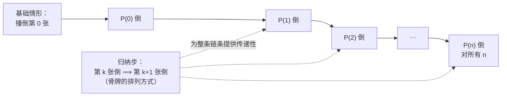
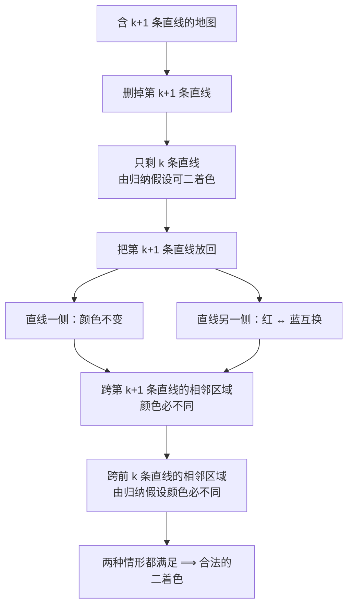
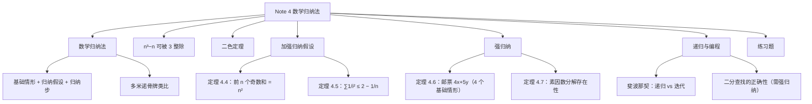

# Note 4 数学归纳法

> 本笔记对应 CS 70《离散数学与概率论》Fall 2026 Course Notes Note 4: *Mathematical Induction*。Note 1–3 教的证明技巧有一个共同前提：待证命题的"情形数"是**有限**的。可是数学里大量命题要对**无穷多个自然数**成立（例如"对任意 $n$，$0+1+\cdots+n = \frac{n(n+1)}{2}$"）。**数学归纳法（mathematical induction）**正是用**有限步骤**处理**无穷多情形**的标准工具。

---

## 1. 数学归纳法（Mathematical Induction）

**引言。** 本笔记介绍**数学归纳法**这一证明技巧。归纳法是一件强大的工具，用于确立某个陈述**对所有自然数**成立。自然数当然有无穷多个——而归纳法提供了一种**用有限手段讨论它们**的方式。

### 1.1 一个例子：前 $n$ 个整数之和

让我们用一个例子来说明归纳法背后的直觉。假设我们希望证明这个陈述：

> 对所有自然数 $n$，$0 + 1 + 2 + 3 + \cdots + n = \dfrac{n(n+1)}{2}$。

更正式地，用 Note 2 中的全称量词，我们可以把它写成：

$$\forall n \in \mathbb{N},\quad \sum_{i=0}^{n} i = \frac{n(n+1)}{2} \tag{1}$$

**你打算怎么证明它？** 你可以先检查它对 $n = 0, 1, 2, \dots$ 成立。**但是需要检查的 $n$ 有无穷多个！** 而且，只检查前几个 $n$ 的值**并不足以**推出该陈述对所有 $n \in \mathbb{N}$ 成立——下面这个例子说明了这一点：

> **Concept check!** 考虑陈述：$\forall n \in \mathbb{N}$，$n^2 - n + 41$ 是素数。请检查它对前几个自然数成立。（事实上，你可以一路检查到 $n = 40$ 都找不到反例！）现在检查 $n = 41$ 的情形。

**补充说明（这道自测题的答案）**：当 $n = 41$ 时，

$$n^2 - n + 41 = 41^2 - 41 + 41 = 41^2 = 1681$$

它等于 $41 \times 41$，**不是**素数，因此该陈述为假。**这正是本节的引子**："验证了前 40 个（甚至前 100 万个）情形"与"对所有情形成立"之间隔着一道鸿沟——只有证明才能跨越它。

### 1.2 归纳法的核心观察

在数学归纳法中，我们通过一个有趣的观察来绕开这个难题：

**假设该陈述对某个取值 $n = k$ 成立**，即

$$\sum_{i=0}^{k} i = \frac{k(k+1)}{2}$$

（这被称为**归纳假设（induction hypothesis）**。）**那么**：

$$\sum_{i=0}^{k} i + (k+1) = \frac{k(k+1)}{2} + (k+1) = \frac{(k+1)(k+2)}{2} \tag{2}$$

也就是说，**该断言对 $n = k+1$ 也成立！** 换句话说，**如果该陈述对某个 $k$ 成立，那么它必定对 $k+1$ 也成立。**

**让我们把上面这个论证称为归纳步（inductive step）。**

**归纳步是一件极其强大的工具**：

1. 如果我们能说明该陈述对 $k$ 成立，那么归纳步就允许我们断定它对 $k+1$ 也成立；
2. 而现在它既然对 $k+1$ 成立了，归纳步又意味着它对 $k+2$ 也成立；
3. 以此类推。事实上，我们可以**无限地重复这个论证**，得到它对所有 $n \geq k$ 都成立。

**所以就这样了吗？我们证明了 (1) 吗？几乎是的！**

问题在于：**为了应用归纳步，我们首先必须确立 (1) 对某个初始值 $k$ 成立。** 既然我们的目标是证明该陈述对**所有自然数**成立，那么显然的选择是 $k = 0$。我们把这个 $k$ 的选择称为**基础情形（base case）**。

于是，**如果基础情形成立，数学归纳法公理（the axiom of mathematical induction）就告诉我们：归纳步允许我们断定 (1) 确实对所有 $n \in \mathbb{N}$ 成立。**

让我们现在把这一证明正式重写一遍。

> **定理 4.1**
> $$\forall n \in \mathbb{N},\quad \sum_{i=0}^{n} i = \frac{n(n+1)}{2}$$

### 1.3 定理 4.1 的证明

> **证明（Proof）**

**证明：我们对变量 $n$ 作归纳。**

**基础情形（$n = 0$）**：此时

$$\sum_{i=0}^{0} i = 0 = \frac{0(0+1)}{2}$$

因此基础情形是正确的。

**归纳假设**：对任意的 $n = k \geq 0$，假设

$$\sum_{i=0}^{k} i = \frac{k(k+1)}{2}$$

用文字来说，归纳假设的意思是"**让我们假设我们已经对某个任意的取值 $n = k \geq 0$ 证明了该陈述**"。

**归纳步**：证明该陈述对 $n = (k+1)$ 成立，即证明

$$\sum_{i=0}^{k+1} i = \frac{(k+1)(k+2)}{2}$$

推导如下：

$$
\sum_{i=0}^{k+1} i
= \sum_{i=0}^{k} i + (k+1)
= \frac{k(k+1)}{2} + (k+1)
= \frac{k(k+1) + 2(k+1)}{2}
= \frac{(k+1)(k+2)}{2} \tag{3}
$$

**其中第二个等号依据归纳假设。** 由数学归纳法原理，该断言成立。

**证毕。** $\blacksquare$

**逐步标注每个等号的依据（补充说明）**：

| 等号 | 依据 |
| :--- | :--- |
| 第 1 个 | 把 $\sum_{i=0}^{k+1} i$ 拆成"前 $k$ 项之和"加上"第 $k+1$ 项" |
| 第 2 个 | **归纳假设**：把 $\sum_{i=0}^{k} i$ 替换为 $\frac{k(k+1)}{2}$ |
| 第 3 个 | 通分：$(k+1) = \frac{2(k+1)}{2}$ |
| 第 4 个 | 提出公因子 $(k+1)$：$\frac{(k+1)(k+2)}{2}$ |

> **Concept check!** 归纳假设到底是如何帮助我们得到 (3) 中第二个等号的？（提示：我们用它把 $\sum_{i=0}^{k} i$ 替换成了某个有用的东西。）

**补充说明（答案）**：$\sum_{i=0}^{k+1} i$ 这个和式里**含有** $\sum_{i=0}^{k} i$ 这一整块。归纳假设正是关于这一块的**定量结论**，于是我们可以把它直接换成 $\frac{k(k+1)}{2}$，剩下的只是初等代数。**这就是归纳法的全部诀窍：归纳假设是唯一"来自过去"的燃料，我们必须把目标表达式改造成"含有归纳假设所指对象"的形状，才能点燃它。**

### 1.4 小结：归纳法的三个步骤

**小结（Recap）**：到目前为止我们学到了什么？令 $P(n)$ 表示陈述 $\sum_{i=0}^{n} i = \frac{n(n+1)}{2}$，我们的目标是证明 $\forall n \in \mathbb{N},\ P(n)$。**归纳法原理断言，要证明它需要三个简单步骤：**

> **性质 4.1（数学归纳法原理）**
> 1. **基础情形（Base Case）**：证明 $P(0)$ 为真。
> 2. **归纳假设（Induction Hypothesis）**：对任意的 $k \geq 0$，假设 $P(k)$ 为真。
> 3. **归纳步（Inductive Step）**：在归纳假设成立的前提下，证明 $P(k+1)$ 为真。

**⚠️ 注意（三步缺一不可）**：

- 只有**基础情形**没有归纳步：你只证明了 $P(0)$，无法"传染"出去；
- 只有**归纳步**没有基础情形：你证明了"$P(k) \Rightarrow P(k+1)$"，但链条**从未启动**，什么也没证出来（例如 $P(n)$ 若是"$n = n+1$"，归纳步会完美成立，但基础情形不成立，命题为假）。

### 1.5 多米诺骨牌类比

让我们用**多米诺骨牌**来可视化这三个步骤如何互相配合。

把陈述 $P(i)$ 表示为编号为 $0, 1, 2, \dots, n$ 的一排多米诺骨牌，使 $P(0)$ 对应第 $0$ 张骨牌、$P(1)$ 对应第 $1$ 张，依此类推。这些骨牌被排成这样的阵型：**如果第 $k$ 张骨牌被撞倒，那么它接着就把第 $k+1$ 张撞倒。**

- 撞倒第 $k$ 张骨牌 $\leftrightarrow$ **证明 $P(k)$ 为真**；
- 归纳步 $\leftrightarrow$ **骨牌的排列方式**，它保证"若第 $k$ 张倒下，则它会接着撞倒第 $k+1$ 张"；
- **基础情形（$n = 0$）撞倒第 $0$ 张骨牌，从而引发一场连锁反应，把所有骨牌都撞倒！**



**图意说明**：图中**横线**代表"连锁反应"（需要基础情形启动），**虚线**代表归纳步提供的"传递性"（保证相邻骨牌之间不会断链）。两者结合的产物就是"所有骨牌都倒"——也就是 $\forall n\, P(n)$。

**⚠️ 注意**：类比中"骨牌的排列"是在**证明之前就固定好**的。归纳步必须对**任意**的 $k \geq 0$ 成立（而不能只对某些 $k$ 成立），否则链上就会出现一个缺口，后面的骨牌全都不倒。

### 1.6 关于基础情形的选择

**最后，关于选择合适的基情形说一句**：在这个例子里我们选了 $k = 0$，但在一般情况下，**基础情形的选择将自然地取决于你想证明的断言**。

**⚠️ 注意（这几点以后会反复用到）**：

- 如果断言只对 $n \geq 1$ 有意义（例如含 $\frac{1}{n}$），基础情形就取 $n = 1$；
- 如果归纳步需要用到**前两项**（例如 $P(k+1)$ 依赖 $P(k)$ 与 $P(k-1)$），往往需要**两个基础情形**（例如定理 4.6 与斐波那契数列的练习）；
- 基础情形的个数必须**恰好覆盖归纳步所依赖的"回看距离"**。这一点在第 3 节讲强归纳法时会看得更清楚。

**✅ 本节要点总结**
- **归纳法**用有限步骤论证无穷多个自然数上的命题，核心是"**基础情形 + 归纳步**"。
- 三步骤：**(1)** 证 $P(0)$；**(2)** 对任意 $k \geq 0$ 假设 $P(k)$；**(3)** 由 $P(k)$ 推出 $P(k+1)$。
- 归纳步的关键动作是：把目标表达式 $P(k+1)$ **改造成含 $P(k)$ 的形状**，再用归纳假设代入。
- **基础情形与归纳步缺一不可**：没有基础情形链条不启动，没有归纳步链条传不下去。
- 多米诺骨牌类比：基础情形撞倒第 $0$ 张，归纳步保证"倒一张带动下一张"。
- 基础情形取哪个值**由命题本身决定**；需要回看多项时就要**多个基础情形**。

---

## 2. 又一个归纳证明

**让我们再做一个归纳证明。** 回忆 Note 1：对整数 $a$ 与 $b$，我们说 **$a$ 整除 $b$**（记作 $a \mid b$），当且仅当存在整数 $q$ 满足 $b = aq$。

> **定理 4.2**：对所有 $n \in \mathbb{N}$，$n^3 - n$ 能被 $3$ 整除。

### 2.1 定理 4.2 的证明

> **证明（Proof）**

**证明：我们对 $n$ 作归纳。** 令 $P(n)$ 表示"$n^3 - n$ 能被 $3$ 整除"这一陈述。

**基础情形（$n = 0$）**：$P(0)$ 断言 $3 \mid (0^3 - 0)$，即 $3 \mid 0$，这是真的，因为**任何非零整数都整除 $0$**。

**归纳假设**：假设对 $n = k \geq 0$，$P(k)$ 为真。也就是说，$3 \mid (k^3 - k)$，或者等价地，$k^3 - k = 3q$，其中 $q$ 是某个整数。

**归纳步**：我们要证明 $P(k+1)$ 为真，即 $3 \mid ((k+1)^3 - (k+1))$。为证明这一点，我们把数 $(k+1)^3 - (k+1)$ 展开如下：

$$
\begin{aligned}
(k+1)^3 - (k+1) &= k^3 + 3k^2 + 3k + 1 - (k+1) && \text{（展开 } (k+1)^3\text{）}\\
&= (k^3 - k) + 3k^2 + 3k && \text{（把 } k^3 - k \text{ 单独归并出来）}\\
&= 3q + 3(k^2 + k) && \text{（由归纳假设，对某个 } q \in \mathbb{Z}\text{）}\\
&= 3(q + k^2 + k) && \text{（提取公因子 } 3\text{）}
\end{aligned}
$$

我们由此断定 $3 \mid ((k+1)^3 - (k+1))$。因此，由归纳法原理，$\forall n \in \mathbb{N},\ 3 \mid (n^3 - n)$。

**证毕。** $\blacksquare$

> **Concept check!** 归纳假设究竟是如何帮助我们得到上面这个推导中第三个等号的？

**补充说明（答案）**：展开后的式子中本来就**含有** $k^3 - k$ 这一块（第 2 行就是把 $k^3$ 与 $-k$ 从各项中"捡"出来凑成的）。归纳假设告诉我们 $k^3 - k = 3q$，于是整块被替换为 $3q$，剩下的 $3k^2 + 3k$ 也都带因子 $3$，两者一起就能提出公因子 $3$，从而完成"$3 \mid \cdots$"的证明。

**⚠️ 注意（这一步是本证明的技巧所在）**：为什么要特意把 $(k+1)^3 - (k+1)$ 改写为 $(k^3 - k) + 3k^2 + 3k$？因为**只有这个形状才能和归纳假设对上**。归纳证明中"凑出归纳假设所指的那一块"是标准动作，几乎每道题都要做一次。

**✅ 本节要点总结**
- **定理 4.2**：$\forall n \in \mathbb{N}$，$3 \mid (n^3 - n)$。
- 基础情形 $n=0$ 用到"任何非零整数整除 $0$"。
- 归纳步的核心变形：$(k+1)^3 - (k+1) = (k^3-k) + 3k^2 + 3k$，再用归纳假设 $k^3 - k = 3q$ 得 $3(q+k^2+k)$。
- 通用手法：**把 $P(k+1)$ 改写为"含 $P(k)$ 的部分 + 显然被整除的部分"**。

---

## 3. 二色定理（Two Color Theorem）

**我们现在考虑一个更进阶的归纳证明**，它确立了著名**四色定理（four color theorem）**的一个简化版本。

**四色定理**说：任何地图都可以用**四种颜色**着色，使得任何两个**相邻**的国家颜色不同。

> 💡 **补充注释（原文脚注）**：**相邻**的定义是两个国家共享任何**非平凡**的边界，即比一个点更多的东西（共享一个孤立点不算相邻）。

**四色定理非常难证**，自 1852 年问题首次提出以来，曾有多份错误的证明被宣称。事实上，直到 **1976 年**，Appel 与 Haken 才终于给出了一个**计算机辅助的证明**。（关于这个问题的有趣历史，以及一份虽然仍极具挑战性但属于最新水平的证明，见 www.math.gatech.edu/~thomas/FC/fourcolor.html。）

**在本笔记中**，我们考虑该定理的一个**更简单的版本**：我们的"地图"是一个**矩形**，通过**画直线**把它划分为若干区域，并且**每条直线都把矩形分成两个区域**。

**我们能否用不超过两种颜色**（比如红与蓝）给这样一幅简化地图着色，使得任何两个相邻区域颜色不同？

**为说明这一点，下面是一个二着色地图的例子**（原文此处配有一幅示意图，图中可见若干区域分别标着 `R` 与 `B`）：

**图的含义说明**：图中的矩形被若干条直线切割成多边形区域，每个区域内部标有 `R`（红）或 `B`（蓝）。**这张图的意义在于示范"二着色是可能的"**：相邻区域（共享一段边界的两块）的标号总是不同，因此整幅地图只用了两种颜色。

> **定理 4.3**：令 $P(n)$ 表示陈述"任何形如上述、含 $n$ 条直线的地图都是二可着色的"。则 $\forall n \in \mathbb{N}\ P(n)$ 成立。

### 3.1 定理 4.3 的证明

> **证明（Proof）**

**证明：我们对 $n$ 作归纳。**

**基础情形（$n = 0$）**：显然 $P(0)$ 成立，因为若我们有 $n = 0$ 条直线，就可以用**单一颜色**给整幅地图着色。

**归纳假设**：对某个任意的 $n = k \geq 0$，假设 $P(k)$ 成立。

**归纳步**：我们要证明 $P(k+1)$。具体地说，给定一幅含 $k+1$ 条直线的地图，希望证明它可以二着色。**让我们看看删掉一条直线会发生什么。** 地图上只有 $k$ 条直线时，归纳假设告诉我们这幅地图可以二着色。

**让我们做如下观察**：给定一个合法的着色方案，如果我们把**红 $\leftrightarrow$ 蓝互换**，我们仍然得到一个合法的着色方案。

**考虑到这一点**，让我们把刚才删掉的那条直线**放回去**，并把直线**一侧的颜色保持不变**；在直线的**另一侧，把红 $\leftrightarrow$ 蓝互换**。这在**图 1**（Figure 1）中作了说明。**我们断言这就是含 $k+1$ 条直线的地图的一个合法的二着色方案。**

**⚠️ 注意（原文图 1 的说明）**：原文 Figure 1 分为左右两幅：**左图为"删掉第 $(k+1)$ 条直线后的地图"**，**右图为"把第 $(k+1)$ 条直线以虚线画出的地图"**（即放回直线并翻转了一侧颜色的结果）。原图中还用 `R`、`B` 标出了若干区域的颜色。由于该图是插图，下面我们用 Mermaid 复现其**操作逻辑**，这一步才是证明的关键。



**图意说明**：这张图把原文 Figure 1 的"左图 $\to$ 右图"这个变换拆成了可执行的步骤。核心技巧只有一句：**先按归纳假设给出 $k$ 条直线的着色，再沿着新加的那条直线"把一侧的颜色整体翻转"**，从而让新增的那条边界两侧颜色必然不同，而原有的所有边界不受影响。

**为什么这能行？** 考虑任何两个被共享边界分开的区域。那么两种情形必有一种成立：

- **情形 1**：共享的边界是那条被删掉又放回的直线，即第 $k+1$ 条直线。但**由构造方式**，我们把这条直线一侧的颜色翻转了，使得任何被它分开的两个区域颜色**不同**。
- **情形 2**：共享的边界是前 $k$ 条直线中的一条。这里，**归纳假设保证**被这条边界分开的两个区域颜色**不同**。

**因此，在两种情形下，被共享边界分开的区域都具有不同的颜色，正如要求的那样。**

**证毕。** $\blacksquare$

**⚠️ 注意（为什么"整体翻转一侧"不会破坏已有边界）**：翻转颜色是一个**全局的双射**（红变成蓝、蓝变成红），它保持"不同/相同"的关系完全不变。所以只要一条边界的两侧**原本**颜色不同，翻转**之后**仍然不同——无论这条边界被翻转了几侧（0 侧、1 侧还是 2 侧）。

**补充说明（分类讨论与归纳法的结合）**：本证明的收尾用的是 Note 3 的**分类讨论**（按共享边界是不是第 $k+1$ 条线分两种情形）。**归纳法很少单独出现**，它常与分类讨论、反证法、逆否证明配合使用。

**✅ 本节要点总结**
- **四色定理**：任何地图可用四色着色使相邻国家异色；1852 年提出，1976 年由 Appel 与 Haken 给出计算机辅助证明。
- **简化版（定理 4.3）**：由"每条直线把矩形分成两块"生成的地图是**二可着色**的。
- 证明思路：删掉第 $k+1$ 条线 $\to$ 用归纳假设二着色 $\to$ 放回该线并**把一侧颜色整体翻转** $\to$ 分类讨论（新增边界 / 原有边界）验证合法性。
- 关键技术点：**颜色互换是保持"相邻异色"关系的双射**，所以只翻转一侧是安全的。

---

## 4. 加强归纳假设（Strengthening the Induction Hypothesis）

**使用归纳法时，选择正确的待证陈述可能非常重要。** 例如，假设我们希望证明这个陈述：

> **对所有 $n \geq 1$，前 $n$ 个奇数之和是一个完全平方数。**

**下面是第一次归纳证明的尝试。**

### 4.1 一次失败的尝试

> **证明尝试。**

**证明尝试：我们对 $n$ 作归纳。**

**基础情形（$n = 1$）**：第一个奇数是 $1$，它是一个完全平方数。

**归纳假设**：假设前 $k$ 个奇数之和是一个完全平方数，比如说 $m^2$。

**归纳步**：第 $(k+1)$ 个奇数是 $2k+1$。因此由归纳假设，前 $k+1$ 个奇数之和是

$$m^2 + 2k + 1$$

**但现在我们卡住了。为什么 $m^2 + 2k + 1$ 应该是一个完全平方数呢？**

**看起来我们的归纳假设太"弱"了；它没有给我们足够的信息结构，来对 $k+1$ 的情形说出任何有意义的话。**

所以让我们后退一步，先做一个初步检查，以确保我们的断言不是显然为假的：让我们计算前几个情形的值。也许在这个过程中，我们还能**发现一些此前没有识别出来的隐藏结构**。

- $n = 1$：$1 = 1^2$ 是完全平方数。
- $n = 2$：$1 + 3 = 4 = 2^2$ 是完全平方数。
- $n = 3$：$1 + 3 + 5 = 9 = 3^2$ 是完全平方数。
- $n = 4$：$1 + 3 + 5 + 7 = 16 = 4^2$ 是完全平方数。

### 4.2 发现隐藏结构

**看起来我们有好消息和更好的消息：**

- **好消息**是我们还没有找到该断言的任何反例；
- **更好的消息**是浮现出了一个令人惊讶的规律：**前 $n$ 个奇数之和不仅是一个完全平方数，而且恰好等于 $n^2$！**

**受这一发现的启发**，让我们尝试一件**反直觉**的事：让我们试着证明下面这个**更强**的断言。

> **定理 4.4**：对所有 $n \geq 1$，前 $n$ 个奇数之和等于 $n^2$。

**证明：我们对 $n$ 作归纳。**

**基础情形（$n = 1$）**：第一个奇数是 $1$，它等于 $1^2$。

**归纳假设**：假设前 $k$ 个奇数之和等于 $k^2$。

**归纳步**：第 $(k+1)$ 个奇数是 $2k+1$。应用归纳假设，前 $k+1$ 个奇数之和是

$$k^2 + (2k+1) = (k+1)^2$$

**因此，由归纳法原理，该定理成立。**

**证毕。** $\blacksquare$

### 4.3 为什么"加强"反而更容易证明？

**那么让我们把这件事理清楚**：我们**无法**证明原来的陈述，于是我们转而假设了一个**更强**的陈述，并且成功证明了它。**这到底为什么会奏效？**

**原因是**：我们原来的断言**没有捕捉到**我们试图证明的那个底层事实的**真正结构**——它太**含糊**了。结果是，我们的归纳假设不够强，无法证明我们想要的结论。

**相比之下**，虽然我们的第二个断言**先验地（a priori）更强**，但它**也含有更多的结构**；这反过来使我们的**归纳假设更强**——我们可以使用这样一个事实：前 $k$ 个奇数之和不仅是一个完全平方数，而且**实际上等于 $k^2$**。

**正是这额外的结构，构成了我们完成证明所必需的东西。**

**总结一下**：我们展示了一个例子，其中——尽管断言本身是真的——**归纳假设的确切表述方式，决定了证明是失败还是成功**。

**⚠️ 注意（"加强归纳假设"听起来荒谬，但完全合理）**：请仔细区分两件不同的事：

| | 命题本身 | 归纳假设 |
| :--- | :--- | :--- |
| 原尝试 | "和是**某个**完全平方数 $m^2$" | 只知道"存在 $m$，和 $= m^2$"，$m$ 与 $k$ **没有关系** |
| 加强后 | "和**恰好**等于 $n^2$" | 知道"和 $= k^2$"，**$m$ 被钉死为 $k$** |

"更强的命题" $\Rightarrow$ "更强的归纳假设" $\Rightarrow$ **更容易推进归纳步**。这就是所谓的"**加强归纳假设**"（有时也叫"归纳加载"、induction loading）。

### 4.4 第二个例子：$\sum \frac{1}{i^2} \leq 2$

**例子。** 现在我们试第二个例子；**这一次，我们让你来做一部分工作！** 假设我们希望证明这个断言：

> **对所有 $n \geq 1$，$\displaystyle\sum_{i=1}^{n} \frac{1}{i^2} \leq 2$。**

> **Concept check!** "显然"的归纳假设选择是这样说的：假设对 $n = k$，有 $\sum_{i=1}^{k} \frac{1}{i^2} \leq 2$。**为什么这不足以证明 $n = k+1$ 的断言**，即证明 $\sum_{i=1}^{k} \frac{1}{i^2} + \frac{1}{(k+1)^2} \leq 2$？（提示：有没有可能 $\sum_{i=1}^{k} \frac{1}{i^2}$ 实际上**正好等于** $2$？）

**补充说明（答案）**：归纳假设只告诉我们 $\sum_{i=1}^{k} \frac{1}{i^2} \leq 2$，这是**一个上界，没有余量**。如果这个和恰好等于 $2$，那么再加上一项正数 $\frac{1}{(k+1)^2}$ 之后，和就**严格大于 $2$** 了，结论立刻失败。**要从 $\leq 2$ 走到 $\leq 2$，归纳假设必须提供一点"空格"（slack）。** 这正是下面加强命题要补上的东西。

**现在让我们再次做那件反直觉的事**——让我们证明下面这个**更强**的陈述，也就是说，让我们**加强归纳假设**。

> **定理 4.5**：对所有 $n \geq 1$，$\displaystyle\sum_{i=1}^{n} \frac{1}{i^2} \leq 2 - \frac{1}{n}$。

> **证明（Proof）**

**证明：我们对 $n$ 作归纳。**

**基础情形（$n = 1$）**：我们有

$$\sum_{i=1}^{1} \frac{1}{i^2} = 1 \leq 2 - \frac{1}{1} = 1$$

正如要求的那样。

**归纳假设**：假设该断言对 $n = k$ 成立。

**归纳步**：由归纳假设，我们有

$$\sum_{i=1}^{k+1} \frac{1}{i^2} = \sum_{i=1}^{k} \frac{1}{i^2} + \frac{1}{(k+1)^2} \leq 2 - \frac{1}{k} + \frac{1}{(k+1)^2}$$

（依据：第一个等号是把和式拆出最后一项；不等号依据归纳假设 $\sum_{i=1}^{k} \frac{1}{i^2} \leq 2 - \frac{1}{k}$。）

因此，为证明我们的断言，**只需**证明

$$2 - \frac{1}{k} + \frac{1}{(k+1)^2} \leq 2 - \frac{1}{k+1} \tag{4}$$

**而这个不等式对所有 $k \geq 0$ 都很容易看出成立。**

> **Exercise.** 请用简单的代数证明 (4) 成立。

**由数学归纳法原理，该断言成立。**

**证毕。** $\blacksquare$

**补充说明（不等式 (4) 的验证）**：两边同时减去 $2$，等价于证明

$$-\frac{1}{k} + \frac{1}{(k+1)^2} \leq -\frac{1}{k+1}$$

移项整理：

$$\frac{1}{k} - \frac{1}{k+1} \geq \frac{1}{(k+1)^2}$$

左边通分得 $\frac{(k+1) - k}{k(k+1)} = \frac{1}{k(k+1)}$，于是只需

$$\frac{1}{k(k+1)} \geq \frac{1}{(k+1)^2}$$

两边同乘正数 $k(k+1)^2$，得 $(k+1) \geq k$，恒成立。**故 (4) 成立。**

**⚠️ 注意（加强的形式是怎么想出来的）**：加强项 $-\frac{1}{n}$ 不是凭空出现的。它的作用是**留出恰好够用的余量**：在第 $k$ 步我们"存下"$-\frac{1}{k}$ 这份余量，恰好抵消掉加上第 $k+1$ 项所带来的增量。这与定理 4.4 中"把 $m^2$ 钉死为 $k^2$"是同一个道理——**加强归纳假设，本质上是在归纳假设里"预存"下一步要用的信息**。

**✅ 本节要点总结**
- 归纳法的**陈述选择**至关重要：命题太弱会**卡在归纳步**。
- 定理 4.4：原命题"和是完全平方数"太含糊（$m$ 与 $k$ 无关），加强为"和 $= n^2$"后就顺利了。
- 定理 4.5：原命题"$\sum \frac{1}{i^2} \leq 2$"没有余量，加强为"$\leq 2 - \frac{1}{n}$"后余量恰好够用。
- 一般原理：**更强的命题 $\Rightarrow$ 更强的归纳假设 $\Rightarrow$ 更容易的归纳步**；这叫**加强归纳假设**。
- 不等式的收尾常化为一个**纯代数的小引理**（如本题的 $\frac{1}{k(k+1)} \geq \frac{1}{(k+1)^2}$）。

---

## 5. 简单归纳 vs. 强归纳（Simple Induction vs. Strong Induction）

**至此，我们一直在使用一种叫作简单归纳（simple induction）或弱归纳（weak induction）的归纳概念。**

**现在我们讨论另一种归纳概念，叫作强归纳（strong induction）。**

后者与简单归纳类似，只是归纳假设略有不同：**我们不再只假设 $P(k)$ 为真（像简单归纳那样），而是假设更强的陈述：$P(0), P(1), \dots, P(k)$ 全都为真**（即 $\bigwedge_{i=0}^{k} P(i)$ 为真）。

### 5.1 强归纳与弱归纳的证明力相同

**强归纳与弱归纳在证明力上有区别吗？也就是说，强归纳能证明弱归纳证不了的陈述吗？**

**不能！** 直观地看，只需回到第 1 节的多米诺骨牌类比即可。

- 在这个图像中，**弱归纳**说的是"若第 $k$ 张骨牌倒下，则第 $(k+1)$ 张也倒"；
- 而**强归纳**说的是"若第 $1$ 到第 $k$ 张骨牌都倒下，则第 $(k+1)$ 张也倒"。

**但这两个情景是等价的**：如果第一张骨牌倒下，那么反复应用弱归纳，我们可以断定第一张骨牌依次推倒第 $2$ 到第 $k$ 张，从而为第 $k+1$ 张的情形做好了铺垫——**正与强归纳所给的条件一样**。

**话虽如此，强归纳确实有一个吸引人的优势——它可以让证明更容易，因为我们可以假设一个更强的归纳假设。** 这该怎么理解呢？考虑一下**螺丝刀与电动螺丝刀**的类比——它们完成同样的任务，但后者用起来容易得多！

**⚠️ 注意（"证明力相同"要说准）**：强归纳与弱归纳能证明的**命题集合完全相同**，但**写出证明的难易程度**可以差很多。所以在作业里，能选哪个就选哪个——只要能证出来就是对的；但选对那个通常省一半力气。

**补充说明（形式化的等价性）**：想要更形式化地理解为什么弱归纳与强归纳等价，可以考虑如下构造。令

$$Q(n) = P(0) \wedge P(1) \wedge \cdots \wedge P(n)$$

那么，"**对 $P$ 作强归纳**"等价于"**对 $Q$ 作弱归纳**"。请试着自己说服自己这一点。**（关键观察：$Q(k+1) \equiv Q(k) \wedge P(k+1)$，于是"由 $Q(k)$ 推出 $P(k+1)$、再合起来得到 $Q(k+1)$"正好就是弱归纳的标准形式。）**

### 5.2 定理 4.6：邮票问题（Postage Stamp Problem）

让我们试一个强归纳的简单例子。**作为额外收获，这是我们第一个需要多个基础情形的归纳证明。**

> **定理 4.6**：对每个自然数 $n \geq 12$，都存在 $x, y \in \mathbb{N}$ 使得 $n = 4x + 5y$。

> 💡 **补充注释（原文脚注）**：这个问题也称为**邮票问题（Postage Stamp Problem）**，它说的是：**任何 12 分或以上的邮资，都可以只用 4 分和 5 分的邮票付清。**

> **证明（Proof）**

**证明：我们对 $n$ 作归纳。**

**基础情形（$n = 12$）**：$12 = 4 \cdot 3 + 5 \cdot 0$。

**基础情形（$n = 13$）**：$13 = 4 \cdot 2 + 5 \cdot 1$。

**基础情形（$n = 14$）**：$14 = 4 \cdot 1 + 5 \cdot 2$。

**基础情形（$n = 15$）**：$15 = 4 \cdot 0 + 5 \cdot 3$。

**归纳假设**：固定任意的 $k \geq 15$，假设该断言对所有 $12 \leq n \leq k$ 成立。

**归纳步**：我们证明 $n = k+1$ 时的断言。首先注意 $k+1 \geq 16$，因此 $(k+1) - 4 \geq 12$；于是归纳假设给出

$$(k+1) - 4 = 4x' + 5y'$$

其中 $x', y' \in \mathbb{N}$。**令 $x = x' + 1$、$y = y'$，证明即完成。**

**证毕。** $\blacksquare$

**逐步核对归纳步（补充说明）**：

1. 由 $k \geq 15$ 得 $k+1 \geq 16$；
2. 于是 $(k+1) - 4 \geq 12$，且 $(k+1) - 4 < k+1$，所以它落在归纳假设的覆盖范围 $[12, k]$ 之内；
3. 归纳假设给出 $(k+1) - 4 = 4x' + 5y'$；
4. 两边加 $4$：$k+1 = 4x' + 5y' + 4 = 4(x'+1) + 5y'$；
5. 取 $x = x' + 1$、$y = y'$ 即可。

> **Concept check!** 如果我们在上面的证明中用**弱**归纳而不是**强**归纳，证明为什么会失败？

**补充说明（答案）**：弱归纳只能假设 $P(k)$（即"$k$ 可以用 4 和 5 表示"），但它**无法告诉我们** $P((k+1)-4) = P(k-3)$ 是否成立——而我们的归纳步恰恰需要用到 $k-3$ 这个**更早**的值。强归纳允许我们回看到 $[12,k]$ 中的**任何一个**值，因而可以"退回 4 步"再往前推 4 分。**注意基础情形的个数（4 个）正好等于"回看距离"（退 4）**——这不是巧合。

### 5.3 定理 4.7：素因数分解的存在性

让我们试第二个、更进阶的例子。为此，回忆一下：数 $n \geq 2$ 是**素数（prime）**，如果它唯一的因子是 $1$ 与 $n$。

> **定理 4.7**：每个自然数 $n > 1$ 都可以写成一个或多个素数的**乘积**。

> **证明（Proof）**

**证明：我们对 $n$ 作归纳。** 令 $P(n)$ 表示"$n$ 可以写成若干素数之积"这一命题。我们将证明 $P(n)$ 对所有 $n \geq 2$ 成立。

**基础情形（$n = 2$）**：我们从 $n = 2$ 开始。显然 $P(2)$ 成立，因为 $2$ 本身就是一个素数。

**归纳假设**：假设 $P(n)$ 对所有 $2 \leq n \leq k$ 成立。

**归纳步**：证明 $n = k+1$ 可以写成若干素数之积。我们有两种情形：要么 $k+1$ 是素数，要么它不是。

- **第一种情形**：如果 $k+1$ 是素数，那么我们就完成了，因为 $k+1$ 平凡地是**一个**素数的乘积（就是它自己）。
- **第二种情形**：如果 $k+1$ 不是素数，那么按定义 $k+1 = xy$，其中 $x, y \in \mathbb{Z}^{+}$ 且满足 $1 < x, y < k+1$。由归纳假设，$x$ 与 $y$ 各自都可以写成若干素数之积（因为 $x$ 与 $y$ 都 $\leq k$）。但这意味着 $k+1$ 也可以写成若干素数之积。

**证毕。** $\blacksquare$

> **Concept check!** 如果我们改用**简单**归纳，这个证明为什么会失败？（提示：假设 $k+1 = 42$。因为 $42 = 6 \times 7$，在归纳步中我们希望使用 $P(6)$ 与 $P(7)$ 为真这一事实。但弱归纳**不**给我们这个——在这个情形下，弱归纳允许我们假设哪个 $P$ 的值为真？）

**补充说明（答案）**：弱归纳只允许假设 $P(k)$，即 $P(41)$。可是 $42 = 6 \times 7$ 需要的是 $P(6)$ 与 $P(7)$，它们**远早于** $k = 41$。**这与定理 4.6 的情形完全一样**：只要归纳步需要回看**两个或更多个更早的值**，就必须用强归纳。

**⚠️ 注意（"存在性"的重要区别）**：定理 4.7 只断言**分解存在**，**并不**断言分解**唯一**。（唯一性是算术基本定理的另一半，需要额外的论证。）**做归纳证明时，务必分清你证的是"存在"还是"唯一"。**

**✅ 本节要点总结**
- **强归纳**的归纳假设：假设 $P(0) \wedge P(1) \wedge \cdots \wedge P(k)$（而非仅 $P(k)$）。
- **两者证明力相同**（多米诺类推：能推倒 $1..k$ 就能推倒 $k$），但**强归纳写起来更容易**——类比"螺丝刀 vs 电动螺丝刀"。
- 形式化等价：令 $Q(n) = P(0) \wedge \cdots \wedge P(n)$，则"对 $P$ 作强归纳" $=$ "对 $Q$ 作弱归纳"。
- **需要强归纳的信号**：归纳步要回看**多个**（或不确定多少个）更早的值。
- **定理 4.6（邮票问题）**：$n \geq 12 \Rightarrow n = 4x + 5y$（$x,y \in \mathbb{N}$）；**4 个基础情形**（$12,13,14,15$），归纳步退回 4 再用归纳假设，取 $x = x' + 1$。
- **定理 4.7**：$n > 1$ 可写成若干素数之积；对"$k+1$ 是否为素数"分类讨论，非素数时用强归纳作用于两个更小的因子（如 $42 = 6 \times 7$ 需要 $P(6), P(7)$）。该定理只保证**存在性**，不保证唯一性。

---

## 6. 递归、编程与归纳（Recursion, programming and induction）

**归纳法与递归（recursion）之间有密切的联系**，我们在此通过两个例子来探讨。

### 6.1 例 1：斐波那契的兔子

**13 世纪**有一位著名的意大利数学家名叫 **Fibonacci**（又名比萨的列奥纳多），他在 **1202 年**考虑了下面这个谜题：

> 从一对兔子开始，如果每个月每对兔子都会生出一对新兔子，而新生的一对从**第二个月**起就变得能生育，那么**一年之后**有多少对兔子？

这个种群增长模型可以用一个**递归定义的函数**来建模；由此得到的数列如今被称为**斐波那契数（Fibonacci numbers）**。

**为了递归地为我们的兔子种群建模**，令 $F(n)$ 表示第 $n$ 个月兔子的**对数**。按上述规则，初始条件如下：

- 显然 $F(0) = 0$；
- 在第 $1$ 个月引入了一对兔子，所以 $F(1) = 1$；
- 最后，由于新兔子需要一个月才能变得能生育，我们还有 $F(2) = 1$。

**在第 3 个月，好戏开始了。** 例如 $F(3) = 2$，因为最初那对兔子繁殖出了一对新兔子。

**但对于一般的 $n$，$F(n)$ 是多少呢？** 看起来很难给出 $F(n)$ 的一个显式公式。**不过，我们可以如下递归地定义 $F(n)$：**

在第 $n-1$ 个月，按定义我们有 $F(n-1)$ 对兔子。**其中有多少对是能生育的？** 只有那些在上个月就已经活着的，也就是 $F(n-2)$ 对。因此，在第 $n$ 个月，除了已有的 $F(n-1)$ 对之外，我们还有 $F(n-2)$ 对新兔子。于是我们得到

$$F(n) = F(n-1) + F(n-2)$$

**总结如下：**

> **定义（斐波那契数）**
> - $F(0) = 0$；
> - $F(1) = 1$；
> - 对 $n \geq 2$，$F(n) = F(n-1) + F(n-2)$。

**这挺妙的**，只是你可能会想：我们**究竟为什么要关心兔子的繁殖**呢！

**事实是**，这个简化的种群增长模型揭示了一条**基本原理**：**如果不加约束，种群会随时间以指数方式增长。**

> 💡 **补充注释（原文脚注）**：斐波那契数实际上还描述了许多其他、相当不相关的现象，例如某些植物中的**螺旋生长模式**。

**下面的练习给出了这个指数增长率的一个下界**（真正的增长率其实更大，大约是 $1.6^n$）。

> **Exercise.** 用归纳法证明斐波那契数对所有 $n \geq 3$ 满足
> $$F(n) \geq 2^{(n-1)/2}$$
> 注意你需要**两个基础情形**：$n = 3$ 与 $n = 4$。（为什么？）

**补充说明（为什么需要两个基础情形，以及证明思路）**：

**为什么两个**：归纳步会用到递推式 $F(n) = F(n-1) + F(n-2)$，它同时回看 $n-1$ 与 $n-2$。**基础情形必须覆盖"回看距离为 2"**，所以需要 $n = 3$ 与 $n = 4$ 两个起点（若只给 $n=3$，推到 $n=4$ 时就需要 $P(2)$，而那不在假设范围内）。

**检查基础情形**：

- $n = 3$：$F(3) = 2$，而 $2^{(3-1)/2} = 2^1 = 2$，故 $2 \geq 2$ 成立；
- $n = 4$：$F(4) = 3$，而 $2^{(4-1)/2} = 2^{1.5} = 2\sqrt{2} \approx 2.83$，故 $3 \geq 2.83$ 成立。

**归纳步**：设 $n \geq 5$，并假设结论对所有 $3 \leq m < n$ 成立。由递推式

$$F(n) = F(n-1) + F(n-2)$$

对两项分别使用归纳假设：

$$F(n-1) \geq 2^{(n-2)/2}, \qquad F(n-2) \geq 2^{(n-3)/2}$$

于是

$$F(n) \geq 2^{(n-2)/2} + 2^{(n-3)/2} = 2^{(n-3)/2}\left(2^{1/2} + 1\right)$$

**现在只差最后一步放缩。** 注意 $2^{1/2} + 1 \approx 1.414 + 1 = 2.414 \geq 2$，因此

$$F(n) \geq 2^{(n-3)/2} \cdot 2 = 2^{(n-3)/2 + 1} = 2^{(n-1)/2}$$

这正是我们要证的结论。

**⚠️ 注意（放缩只要"够用"就行）**：这里的关键是 $2^{1/2} + 1 \geq 2$。**不必**去追求最紧的界（否则还得证明 $F(n) \ge \sqrt2 \cdot 2^{(n-2)/2}$ 之类的更强形式，反而更麻烦）。归纳证明中的不等式**只需够用**——这与定理 4.5 中"把不等式化成目标形式即止"是同一个套路。

**再补一句（为什么归纳假设的指标要对齐）**：本证明中 $F(n-1) \geq 2^{(n-2)/2}$ 用的是 $m = n-1$ 的情形，$F(n-2) \geq 2^{(n-3)/2}$ 用的是 $m = n-2$ 的情形。**两个指标 "$(m-1)/2$" 分别代入 $m = n-1$ 与 $m = n-2$**，必须仔细核对，这是本题最容易写错的地方（写成 $2^{(n-1)/2}$ 或 $2^{n/2}$ 都会前功尽弃）。

**事实上，理解这种不加约束的指数式种群增长的意义，是引导达尔文形成进化论的关键一步。** 引用达尔文的话：

> "每一样有机体都以如此高的速率增殖，这一点没有例外——如果不被消灭，地球很快就会被动物的后代所覆盖，而那可能仅仅来自一对亲代。"

#### 递归程序与它的低效

**现在，我们在本节标题里承诺过"编程"，所以它来了**——一个用来求 $F(n)$ 的**平凡的递归程序**：

```text
function F(n)
    if n = 0 then return 0
    if n = 1 then return 1
    else return F(n-1) + F(n-2)
```

> **Exercise.** 这个程序计算 $F(n)$ 需要多长时间，也就是需要多少次对 $F$ 的调用？**你应该能够用归纳法证明调用次数至少是 $F(n)$ 本身！**

**上面的练习应该能让你相信，这是计算第 $n$ 个斐波那契数的非常低效的方法。**

**下面是一个能完成同样任务、要快得多的迭代算法**（这应该是一个你很熟悉的"把尾递归转成迭代算法"的例子）：

```text
function F2(n)
    if n = 0 then return 0
    if n = 1 then return 1
    a = 1
    b = 0
    for k = 2 to n do
        temp = a
        a = a + b
        b = temp
    return a
```

> **Exercise.** 这个迭代算法计算 $F2(n)$ 需要多长时间，也就是需要多少次循环迭代？**你能用归纳法证明这个新函数满足 $F2(n) = F(n)$ 吗？**

**补充说明（两个练习的答案）**：

- **递归版调用次数**：令 $C(n)$ 为计算 $F(n)$ 所需的调用次数。由程序结构可得 $C(0) = C(1) = 1$，且 $C(n) = 1 + C(n-1) + C(n-2)$（$n \geq 2$）。用归纳法可证 $C(n) \geq F(n)$——事实上 $C(n)$ 增长得**比** $F(n)$ **还快**（大约是 $2F(n)$ 的量级）。而 $F(n)$ 本身是指数增长的，所以这个递归程序耗时**指数级**——对 $n = 50$ 就已经慢得无法接受。
- **迭代版耗时**：循环从 $k = 2$ 跑到 $n$，共 $n - 1$ 次迭代，每次只做常数时间的加法，故总时间是 $O(n)$——**从指数级降到线性级**。
- **$F2(n) = F(n)$ 的归纳证明**：循环的**不变量**是"每一轮开始时，$a = F(k-1)$、$b = F(k-2)$"。$k = 2$ 时初值 $a = 1 = F(1)$、$b = 0 = F(0)$ 成立；若 $k$ 步成立，则更新后 $a' = a + b = F(k-1) + F(k-2) = F(k)$、$b' = a = F(k-1)$，$k+1$ 步依然成立。循环结束时 $k = n+1$，故 $a = F(n)$，与返回语句一致。**这正是"归纳法 = 递归/循环的正确性证明"的典型范例。**

**⚠️ 注意**：从指数级到线性级的改进，正是本节要传达的观念——**归纳法不只是证明自然数命题的工具，它还是分析递归算法（时间与正确性）的标准工具**。

### 6.2 例 2：二分查找（Binary Search）

**接下来我们用归纳法来分析一个连你祖母大概都熟悉的递归算法——二分查找！**

让我们在"从字典里查一个单词"的语境下讨论二分查找：

1. 要查单词 $W$，我们翻开字典的**中间那一页**；
2. 如果该页的**第一个单词排在 $W$ 之后**，我们就在字典的**前半部分**（中间页之前）递归；
3. 否则，我们在字典的**后半部分**（从中间页开始往后）递归。
4. （当字典有偶数 $2m$ 页时，我们把中间页定义为第 $(m+1)$ 页。）
5. 一旦我们把字典缩小到**单页**，就改用**暴力搜索**在该页上查找 $W$。

在伪代码中，我们有：

```text
 1  // precondition: W is a word and D is a subset of the
 2  //               dictionary with at least 1 page.
 3  // postcondition: Either the definition of W is returned,
 4  //                or "W not found" is returned.
 5  findWord(W, D) {
 6      // Base case
 7      if (D has precisely one page)
 8          Look for W in D by brute force.
 9          If found, return its definition; else, return "W not found".
10
11      // Recursive case
12      Let W' be the first word on the middle page of D.
13      if (W comes before W')
14          return findWord(first half of D)
15      else
16          return findWord(second half of D)
17  }
```

> **译注**：以上伪代码中的注释依次为——**前置条件（precondition）**：$W$ 是一个单词，$D$ 是字典的一个子集且至少含 $1$ 页。**后置条件（postcondition）**：要么返回 $W$ 的定义，要么返回"$W$ not found"（未找到 $W$）。

**让我们用归纳法证明 `findWord()` 是正确的**，也就是说：如果 $W$ 在字典 $D$ 中，它就返回 $W$ 的定义。

**作为额外收获，这个证明需要我们使用强归纳而不是简单归纳！**

> **证明（Proof of correctness of findWord()）**

**证明：我们对 $D$ 中的页数 $n$ 作强归纳。**

**基础情形（$n = 1$）**：如果 $D$ 只有一页，第 8 行（原文作 "Section 4"，指伪代码中的暴力搜索那一行）用暴力法查找 $W$。因此，如果 $W$ 存在，它就会被找到并返回；否则我们返回"$W$ not found"，正如要求的那样。

**归纳假设**：假设 `findWord()` 对所有 $1 \leq n \leq k$ 都是正确的。

**归纳步**：我们证明 `findWord()` 对 $n = k+1$ 是正确的。执行完第 12 行（"$W$ 在 $W'$ 之前吗？"）之后，我们就知道了 $W'$；因此我们能够判断 $W$ 必定位于 $D$ 的**前半部分**还是**后半部分**。

在第一种情形中，我们在第 14 行对 $D$ 的前半部分递归；在第二种情形中，我们在第 16 行对 $D$ 的后半部分递归。**由归纳假设，递归调用能够正确地在前半部分或后半部分中找到 $W$，或者返回"$W$ not found"**——因为这两个部分都至多含有 $k$ 页。既然我们返回的是递归调用的答案，我们断定 `findWord()` 能正确地在大小为 $n = k+1$ 的 $D$ 中找到 $W$。

**由归纳法，`findWord()` 因此是正确的。**

**证毕。** $\blacksquare$

> **Concept check!** 为什么我们在上面的证明中需要**强**归纳？

**补充说明（答案）**：递归调用的子问题规模**不一定是 $k$**。$D$ 有 $k+1$ 页时，前半部分与后半部分的页数分别约为 $\lceil (k+1)/2 \rceil$ 与 $\lfloor (k+1)/2 \rfloor$（具体取决于奇偶），**两者都可能严格小于 $k$**。弱归纳只允许我们假设 $P(k)$ 成立，**完全无法覆盖**这些更小的规模；而强归纳允许我们对**所有** $1 \leq m \leq k$ 的规模都使用归纳假设，正好够用。

**⚠️ 注意（这是理解"何时必须用强归纳"的最清晰的判据）**：**只要归纳步里的子问题规模不是"恰好 $k$"，而是"某个小于等于 $k$ 的数"，就必须用强归纳。** 二分查找、归并排序、快速排序的正确性分析都属于这一类；而像定理 4.6、4.7 那种"回看固定距离"的情形也属于这一类。

**✅ 本节要点总结**
- **斐波那契数**：$F(0)=0$、$F(1)=1$、$F(n)=F(n-1)+F(n-2)$（$n \geq 2$），来自 1202 年斐波那契的兔子问题。
- 兔子模型揭示的**基本原理**：不加约束时种群**指数增长**；这启发了达尔文的进化论。
- 递归版计算 $F(n)$ 需**指数次**调用（$C(n) = 1 + C(n-1) + C(n-2) \geq F(n)$）；迭代版（尾递归转迭代）只需 **$O(n)$** 时间。
- **归纳法与递归的关系**：程序结构对应递推关系，正确性证明对应归纳步，**循环不变量**对应归纳假设。
- **二分查找**：伪代码含**前置条件/后置条件**、基础情形（单页暴力搜索）与递归情形；其正确性需**强归纳**，因为子问题规模"至多 $k$"而非"恰为 $k$"。
- **判据**：子问题规模不固定 $\Rightarrow$ 用强归纳。

---

## 7. 练习题（Practice Problems）

> **习题 1**：证明对任何自然数 $n$，
> $$1^2 + 2^2 + 3^2 + \cdots + n^2 = \frac{1}{6}n(n+1)(2n+1)$$

**补充说明（思路）**：这是定理 4.1 的直接类比。**基础情形** $n = 0$：左边 $= 0$，右边 $= \frac16 \cdot 0 \cdot 1 \cdot 1 = 0$。**归纳步**：设 $\sum_{i=1}^{k} i^2 = \frac16 k(k+1)(2k+1)$，则

$$\sum_{i=1}^{k+1} i^2 = \frac{k(k+1)(2k+1)}{6} + (k+1)^2 = \frac{(k+1)\left[k(2k+1) + 6(k+1)\right]}{6}$$

而 $k(2k+1) + 6(k+1) = 2k^2 + 7k + 6 = (k+2)(2k+3)$，故

$$\sum_{i=1}^{k+1} i^2 = \frac{(k+1)(k+2)(2(k+1)+1)}{6}$$

正好是 $n = k+1$ 的形式。

> **习题 2**：在实分析中，**伯努利不等式（Bernoulli's Inequality）**是一个近似 $1+x$ 的幂的不等式。请证明这个不等式：**若 $n$ 是自然数且 $1 + x > 0$，则**
> $$(1+x)^n \geq 1 + nx$$

**补充说明（思路与易错点）**：

**基础情形** $n = 0$：$(1+x)^0 = 1 \geq 1 + 0 = 1$，成立。

**归纳步**：设 $(1+x)^k \geq 1 + kx$。因为 $1 + x > 0$，可以把不等式两边**同乘** $(1+x)$（正数不改变不等号方向）：

$$(1+x)^{k+1} \geq (1+kx)(1+x) = 1 + (k+1)x + kx^2 \geq 1 + (k+1)x$$

最后一步用到 $kx^2 \geq 0$。

**⚠️ 注意**：条件 $1 + x > 0$ 是**必需的**，它正是"归纳步可以同乘 $(1+x)$ 而不翻号"的依据。若 $1+x \leq 0$，命题不成立（例如 $x = -3$、$n = 2$ 时 $(1-3)^2 = 4$ 而 $1 + 2(-3) = -5$，这回反而成立；但 $n=1$ 时两边都是 $-2$；真正失效的是 $1+x<0$ 且 $n$ 为奇数等情形，以及不能做"同乘正数"这一步）。

> **习题 3**：一个常见的递归定义函数是**阶乘（factorial）**，对非负数 $n$ 定义为 $n! = n(n-1)(n-2)\cdots 1$，基础情形为 $0! = 1$。让我们通过下面这个关于阶乘的定理来巩固对"递归与归纳之间的联系"的理解。
>
> **定理 4.8**：对所有 $n \in \mathbb{N}$，$n > 1 \Longrightarrow n! < n^n$。
>
> 请用归纳法证明该定理。（提示：在归纳步中把 $(n+1)! = (n+1)\cdot n!$ 写出来，并使用归纳假设。）

**补充说明（思路）**：**基础情形** $n = 2$：$2! = 2 < 4 = 2^2$，成立。**归纳步**：设 $k! < k^k$（$k \geq 2$）。则

$$(k+1)! = (k+1)\cdot k! < (k+1)\cdot k^k < (k+1)\cdot (k+1)^k = (k+1)^{k+1}$$

第一个不等号用归纳假设；第二个不等号用 $k < k+1$（从而 $k^k < (k+1)^k$）。**注意归纳步中两次"升级"分别来自归纳假设与 $k<k+1$，都要写清依据。**

> **习题 4**：派对上的**名人（celebrity）**是这样一个人：**所有人都认识他，而他不认识任何人**。假设你在一个有 $n$ 个人的派对上。对派对上的任意一对人 $A$ 与 $B$，你都可以问 $A$ 是否认识 $B$，并得到诚实的回答。请给出一个**递归算法**来判断派对上是否有名人，如果存在则指出是谁，并且**最多问 $3n - 4$ 个问题**。（注：就本题而言，你只是来派对提问题的访客。你要判断的是：实际出席派对的这 $n$ 个人当中是否包含一位名人。）
>
> 请用归纳法证明你的算法**总能正确识别名人**（若存在），并且**问题数至多 $3n - 4$**。

**补充说明（思路要点）**：

- **关键观察**：问"$A$ 认识 $B$ 吗？"这一个问题就足以**排除一个人**：若回答"认识"，则 $A$ **不是**名人（名人谁都不认识）；若回答"不认识"，则 $B$ **不是**名人（名人被所有人认识）。
- **递归结构**：用 $1$ 个问题排除 $1$ 个人，把规模从 $n$ 降到 $n-1$；递归求剩下的候选名人，最后用至多 $2(n-1)$ 个问题**验证**该候选（问其余每个人是否都认识他，以及他是否都不认识他们）。
- **问题数**：$T(n) = T(n-1) + 3$，解出 $T(n) = 3n - 4$（以 $n=2$ 时需 $2$ 个问题作为基础情形，$3\cdot 2 - 4 = 2$，吻合）。
- **验证的必要性**：递归只能给出**唯一候选**，必须再验证一遍才能确定"是否真的有名人"。**⚠️ 注意**：若只有一个人（$n=1$），他平凡地是名人——这属于单独处理的基础情形。

> **习题 5**：请利用定理 4.6 的证明，设计一个算法：给定任意不少于 12 分的邮资，输出构成该邮资的 4 分与 5 分邮票的**张数**。你的算法最多会用到多少张 5 分邮票？

**补充说明（答案）**：

- **算法**：由定理 4.6 的归纳步"退回 4 分"，可以直接把它写成一个**递归程序**：若 $n = 12, 13, 14, 15$，直接查表（分别是 $3\cdot4$、$2\cdot4+1\cdot5$、$1\cdot4+2\cdot5$、$3\cdot5$）；否则递归求 $n - 4$ 的方案，再把 $4$ 分的张数加一。
- **5 分邮票的张数**：在上述递归中，5 分邮票只在**基础情形**被引入，而基础情形中的 5 分张数分别为 $0, 1, 2, 3$。从 $n$ 一路减 4 直到落入 $[12,15]$，最多经历到基础情形 $15$（此时用 $3$ 张 5 分票）。故**最多用 3 张 5 分邮票**。

---

## 8. 全篇总结



**核心速查表**

| 概念 | 要点 |
| :--- | :--- |
| **归纳法三步骤** | 基础情形 $P(0)$；归纳假设（对任意 $k$，假设 $P(k)$）；归纳步（$P(k) \Rightarrow P(k+1)$） |
| **缺一不可** | 没有基础情形则链条不启动；没有归纳步则链条传不下去 |
| **通用手法** | 把 $P(k+1)$ **改写成含 $P(k)$ 的形状**，再代入归纳假设 |
| **基础情形个数** | 取决于归纳步的"回看距离"：回看 1 项→1 个；回看 2 项→2 个；退回固定距离 $d$→$d$ 个 |
| **加强归纳假设** | 命题太弱会卡住；换成更强的命题可提供更多结构（定理 4.4、4.5） |
| **弱归纳 vs 强归纳** | 证明力**相同**；强归纳假设 $P(0)\wedge\cdots\wedge P(k)$，**写起来更容易** |
| **何时必须用强归纳** | 归纳步需要回看**多个**更早的值，或子问题规模**不是恰为 $k$** |
| **等价形式** | 令 $Q(n) = P(0)\wedge\cdots\wedge P(n)$，则对 $P$ 强归纳 = 对 $Q$ 弱归纳 |
| **与递归的关系** | 程序结构 = 递推关系；正确性证明 = 归纳；循环不变量 = 归纳假设 |
| **经典结论** | $\sum_{i=0}^{n} i = \frac{n(n+1)}{2}$；$3 \mid (n^3-n)$；前 $n$ 个奇数和 $=n^2$；$\sum_{i=1}^{n}\frac{1}{i^2} \le 2-\frac1n$；$n \ge 12 \Rightarrow n=4x+5y$；$F(n)=F(n-1)+F(n-2)$ |
