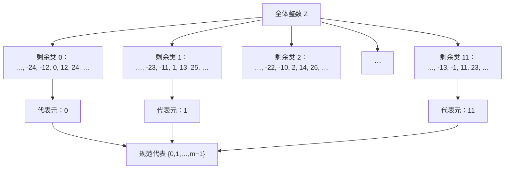
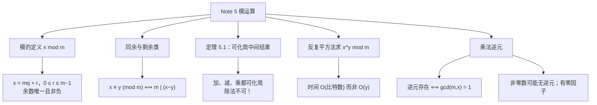

# Note 5 模运算

> 本笔记对应 CS 70《离散数学与概率论》Fall 2026 Course Notes Note 5: *Modular Arithmetic*。前面几讲都在讨论"证明"。从本讲开始，我们进入 CS 70 的第一块真正的"数学机器"：**模运算（modular arithmetic）**。它是**纠错码（error-correcting codes）**与**密码学（cryptography）**的算术基础——RSA、素性检测等全都建立在它之上。

---

## 1. 模运算（Modular Arithmetic）

**在若干场景中**（例如**纠错码**与**密码学**），我们有时希望**在一个更小的数值范围内工作**。模运算在这些场景中很有用：它把数限制在一个**预先给定的范围** $\{0, 1, \dots, N-1\}$ 内，并且**一旦你试图离开这个范围就会"绕回来（wrap around）"**——就像钟表的指针（此时 $N = 12$）或者星期几（此时 $N = 7$）。

### 1.1 例子：计算时间

**当你计算时间时，你已经在不知不觉地使用模运算了。**

例如，如果有人问你"从下午 1 点起 13 小时之后是几点"，你会说**凌晨 2 点**，而不是"14 点"。假设我们的钟表把 12 显示为 0，这就意味着把数限制在预先给定的范围 $\{0,1,2,\dots,11\}$ 内。**每当你在这种设定下把两个数相加，你就除以 12，然后拿余数作为答案。**

如果我们想知道从下午 2 点起 24 小时之后是几点，答案很简单：还是下午 2 点。这不仅对 24 小时成立，对**任何 12 的倍数**小时都成立（忽略上午/下午这一细节）。

那么从下午 2 点起 **25** 小时之后呢？既然从下午 2 点起 24 小时之后仍是下午 2 点，那么 25 小时之后就是下午 3 点。**换一种说法**：我们加上 1 小时，而 1 正是 25 除以 12 所得的**余数**。

**这个例子说明**：在某些情形下，**在某个特定数（本例中是 12）的框架内做算术是有意义的**。也就是说，我们只跟踪除以 12 之后的**余数**；当需要把两个数相加时，我们转而只把余数相加。这种方法在"让中间值尽可能小"这个意义上**相当高效**，我们将在后面的讲座中看到它有多大用处。

### 1.2 定义 $x \bmod m$

**更一般地**，我们可以定义 $x \bmod m$（读作"$x$ 模 $m$"）为**用 $x$ 除以 $m$ 所得的余数 $r$**。即：

> **定义（模，$\bmod$）**：若 $x \equiv r \pmod m$，则
> $$x = mq + r$$
> 其中 $0 \leq r \leq m-1$，且 $q$ 是整数。

于是 $29 \equiv 5 \pmod{12}$，并且 $13 \equiv 3 \pmod 5$。

**⚠️ 注意（$r$ 的范围是硬性要求）**：定义中 $0 \leq r \leq m-1$ 这一条**绝不能省**。它保证余数是**唯一**的。正因如此，"$x \bmod m$"才是一个**确定的函数值**，而不是"随便一个差 $m$ 的倍数"。举例：$29 = 12 \cdot 2 + 5$（余数 5，符合范围），但 $29 = 12 \cdot 1 + 17$ 也是成立的等式——后者**不是**模运算的答案，因为 $17$ 超出了范围。

**⚠️ 注意（$x$ 为负数时）**：约定 $0 \leq r \leq m-1$ 还有一个重要后果：**余数永远是非负的**。例如 $-1 \bmod 12$ 应当等于 $11$（因为 $-1 = 12 \cdot (-1) + 11$），而**不是** $-1$。这一点在编程实现中特别容易出错（有些语言的 `%` 会返回负值）。

### 1.3 计算（Computation）

**如果我们想计算 $x + y \pmod m$**，我们会**先算 $x + y$，然后计算把结果除以 $m$ 所得的余数**。

例如，若 $x = 14$、$y = 25$、$m = 12$，我们就计算 $x + y = 14 + 25 = 39$ 除以 $12$ 的余数，得到答案 **$3$**。

**注意**：如果我们先计算 $2 \equiv x \pmod{12}$ 与 $1 \equiv y \pmod{12}$，再把结果模 $12$ 相加，也会得到同样的答案 $3$。

**减法**也一样：$x - y \pmod{12}$ 就是 $-11 \pmod{12}$，也就是 **$1$**。同样地，我们本可以通过**先化简**直接得到这个结果，即 $(x \bmod 12) - (y \bmod 12) \equiv 2 - 1 \equiv 1 \pmod{12}$。

**这个想法在乘法上替我们省下更多功夫**：要计算 $xy \pmod{12}$，我们可以先算 $xy = 14 \times 25 = 350$，然后计算它除以 $12$ 的余数，得到 $2$。**注意**：如果我们先计算 $2 \equiv x \pmod{12}$ 与 $1 \equiv y \pmod{12}$，然后直接把结果模 $12$ 相乘，会**容易得多**地得到同一个答案。

**更一般地**：在执行任何一串加法、减法或乘法（模 $m$）的过程中，**如果我们把任何中间结果模 $m$ 化简，都会得到相同的答案**。这可以**相当程度地简化计算**。我们将在下面的**定理 5.1** 中正式证明这一论断的正确性。

**⚠️ 注意（原文在此处留下的伏笔）**：注意上面这段话**只提到加法、减法、乘法，没有提到除法**。这不是疏忽——**除法在模运算里完全是另一回事**，要等到第 3 节才处理。请务必记牢这一点：**"可以任意化简中间结果"这条性质，目前只对加、减、乘成立。**

### 1.4 集合视角（Set Representation）

**关于模运算还有一种替代视角**，它有助于更好地理解这一切。

> **定义（同余）**：对任何整数 $m$，我们说 $x$ 与 $y$ **模 $m$ 同余（congruent modulo $m$）**，如果它们相差 $m$ 的某个倍数。用符号表示：
> $$x \equiv y \pmod m \iff m \text{ 整除 } (x - y)$$

**例**：$29$ 与 $5$ 模 $12$ 同余，因为 $12$ 整除 $29 - 5$。我们也可以写 $22 \equiv -2 \pmod{12}$。

**注意**：$x$ 与 $y$ 模 $m$ 同余**当且仅当**它们除以 $m$ 的余数相同；换句话说，

$$x \equiv y \pmod m \iff x \bmod m = y \bmod m$$

**⚠️ 注意（两种记号的分工，最容易混）**：

| 记号 | 名称 | 含义 | 结果是什么 |
| :--- | :--- | :--- | :--- |
| $x \equiv y \pmod m$ | **同余式** | $m \mid (x-y)$，即两者余数相同 | 一个**命题**（真或假） |
| $x \bmod m$ | **模运算** | 除以 $m$ 的**余数** $r \in \{0,\dots,m-1\}$ | 一个**数** |

请务必区分：$\equiv$ 是**关系**，$\bmod$ 是**运算**。

**同余 $0 \pmod{12}$ 的数是哪些？** 它们是 $12$ 的所有倍数：

$$\{\dots, -36, -24, -12, 0, 12, 24, 36, \dots\}$$

**同余 $1 \pmod{12}$ 的数集呢？** 它们是所有除以 $12$ 余 $1$ 的数：

$$\{\dots, -35, -23, -11, 1, 13, 25, 37, \dots\}$$

**类似地**，同余 $2 \pmod{12}$ 的数集是

$$\{\dots, -34, -22, -10, 2, 14, 26, 38, \dots\}$$

**注意**：这样我们得到了 **$12$ 个**这样的整数集合，而**每个整数都属于且仅属于**其中之一。

**一般地**，如果我们模 $m$ 工作，就会得到 **$m$ 个**这样的**互不相交**的集合，它们的**并集**是全部整数：这些集合通常被称为**模 $m$ 的剩余类（residue classes mod $m$）**。

我们可以把每个集合看成由它在范围 $(0, \dots, m-1)$ 中所包含的**那个唯一元素**来代表。**由元素 $i$ 代表的那个集合**就是所有满足"存在整数 $q$ 使 $z = mq + i$"的 $z$。**注意**：这些数除以 $m$ 的余数都是 $i$；因此它们模 $m$ 同余。

**我们可以用这些集合来理解加法、减法与乘法**。当我们把两个数相加，比如说 $x \equiv 2 \pmod{12}$ 与 $y \equiv 1 \pmod{12}$，我们**从这两个集合里各挑哪个 $x$、哪个 $y$ 都无所谓**，因为结果**永远是**那个包含 $3$ 的集合的元素。**减法与乘法也是如此。**

**现在应该清楚了**：在模 $m$ 计算时，**每个集合内部的元素是可以互相替换的**，而这正是我们能够把任何中间结果模 $m$ 化简的原因。



**图意说明**：这张图刻画了"**整数被分成 $m$ 个互不相交的剩余类**"这一结构（图中以 $m = 12$ 为例）。任意一个整数都恰好落入其中一个类；每个类可以用它在 $\{0,1,\dots,m-1\}$ 中的那个唯一元素作为**代表元**。**"模运算就是把每个整数替换成它所在类的代表元"**——这正是"化简中间结果不改变答案"的几何解释。

### 1.5 定理 5.1：化简的合法性

**下面是更正式地陈述这一观察的方式：**

> **定理 5.1**：若 $a \equiv c \pmod m$ 且 $b \equiv d \pmod m$，则
> $$a + b \equiv c + d \pmod m, \qquad a \cdot b \equiv c \cdot d \pmod m$$

> **证明（Proof）**

**证明：** 我们知道 $c = a + k \cdot m$、$d = b + \ell \cdot m$，其中 $k, \ell$ 是整数（依据：同余的定义 $m \mid (c - a)$ 与 $m \mid (d - b)$）。于是

$$c + d = a + k \cdot m + b + \ell \cdot m = a + b + (k + \ell) \cdot m$$

**这意味着 $a + b \equiv c + d \pmod m$**（依据：$c+d$ 与 $a+b$ 相差 $m$ 的整数倍）。

**乘法的证明是类似的，留作练习。**

**证毕。** $\blacksquare$

> **Exercise.** 请补全定理 5.1 关于**乘法**的证明。

**补充说明（乘法部分的做法）**：由 $c = a + km$、$d = b + \ell m$，得

$$c\,d = (a + km)(b + \ell m) = ab + a\ell m + kmb + k\ell m^2 = ab + m\left(a\ell + kb + k\ell m\right)$$

括号里的量是**整数**（由 $\mathbb{Z}$ 对加法与乘法的封闭性），因此 $cd$ 与 $ab$ 相差 $m$ 的整数倍，即 $ab \equiv cd \pmod m$。**注意这里用到了 $km \cdot \ell m = k\ell m^2$ 也是 $m$ 的倍数**——这一步是乘法情形比加法情形多的内容。

### 1.6 这个定理告诉我们什么

**这个定理告诉我们**：我们**总是可以把任何算术表达式模 $m$ 化简为范围 $\{0,1,\dots,m-1\}$ 中的一个数**。

**作为一个例子**，考虑表达式 $(13 + 11)\cdot 18 \pmod 7$。使用上面的定理若干次，我们可以写：

$$
\begin{aligned}
(13 + 11) \cdot 18 &\equiv (6 + 4) \cdot 4 && \pmod 7 && \text{（}13 \equiv 6,\ 11 \equiv 4,\ 18 \equiv 4 \pmod 7\text{）}\\
&= 10 \cdot 4 && \pmod 7 && \text{（先算括号内的和）}\\
&\equiv 3 \cdot 4 && \pmod 7 && \text{（}10 \equiv 3 \pmod 7\text{）}\\
&= 12 && \pmod 7 && \text{（乘法）}\\
&\equiv 5 && \pmod 7 && \text{（}12 \equiv 5 \pmod 7\text{）}
\end{aligned}
$$

**⚠️ 注意（"$\equiv$"与"$=$"混用的读法）**：原文在这个推导里交替使用 $=$ 与 $\equiv$。**读法是**：只要等式两边在**同一层**模 $7$ 意义下相等，写 $=$ 或 $\equiv$ 都可以；关键是**每一步要么是同余化简，要么是普通的整数运算**。最后一行 $12 \equiv 5 \pmod 7$ 是**唯一**的最终答案（因为 $12 = 7\cdot1 + 5$）。**建议自己动手时每一步都标上 $\pmod 7$，避免中途"忘记自己在模几"。**

**总结一下**：我们总是可以通过**把中间结果模 $m$ 化简**，来完成基本的算术（乘法、加法、减法）计算，模 $m$。

> **⚠️ 注意（原文的提醒）**：**注意我们还没有提到除法**——关于除法，后面还有大量内容要讲！

**✅ 本节要点总结**
- **模运算**把数限制在 $\{0,1,\dots,m-1\}$，超出就"绕回来"（钟表 $N=12$、星期 $N=7$）。
- **定义**：$x \equiv r \pmod m$ 意味着 $x = mq + r$，且 $0 \le r \le m-1$（$r$ 的范围保证**唯一性**，并保证余数非负）。
- **同余**（关系，$\equiv$）vs **模运算**（运算，$\bmod$）：$x \equiv y \pmod m \iff m \mid (x-y) \iff x \bmod m = y \bmod m$。
- **剩余类**：模 $m$ 把 $\mathbb{Z}$ 分成 $m$ 个互不相交的集合，每个有唯一代表元；每个整数落入且仅落入一个类。
- **定理 5.1**：$a \equiv c$ 且 $b \equiv d \Rightarrow a+b \equiv c+d$ 且 $ab \equiv cd \pmod m$——这就是"**可以任意化简中间结果**"的合法性依据。
- **应用**：$(13+11)\cdot 18 \equiv 5 \pmod 7$，全程只需处理 $0$ 到 $6$ 之间的数。
- **⚠️ 加、减、乘都可以化简；除法还没有定义。**

---

## 2. 指数运算（Exponentiation）

**算术算法中的另一个标准运算**（例如在**素性检测**与 **RSA** 中被大量使用）是"**把一个数取幂，再模另一个数**"。也就是说：**如何计算 $x^y \pmod m$**，其中 $x, y, m$ 是自然数且 $m > 1$？

**一种朴素的作法**是算出序列 $x^2 \pmod m$、$x^3 \pmod m$、$\dots$ 直到第 $y$ 项，但这需要的**时间与 $y$ 的比特数成指数关系**（因为要乘 $y$ 次，而 $y$ 可能是天文数字）。

**我们可以用"反复平方法（repeated squaring）"这一技巧做得好得多：**

```text
algorithm mod-exp(x, y, m)
    if y = 0 then return (1)
    else
        z = mod-exp(x, y div 2, m)
        if y (mod 2) ≡ 0 then return (z * z (mod m))
        else return (x * z * z (mod m))
```

### 2.1 算法为什么正确

**这个算法利用了这样的事实**：任何 $y > 0$ 都可以写成 $y = 2a$ 或 $y = 2a+1$，其中 $a = \left\lfloor \dfrac{y}{2} \right\rfloor$（在上面的伪代码中我们把它写作 `y div 2`）。再加上下面这些事实：

$$x^{2a} = \left(x^{a}\right)^{2}; \qquad x^{2a+1} = x \cdot \left(x^{a}\right)^{2}$$

> **Exercise.** 请用上面的两个事实，**对 $y$ 作归纳**证明该算法**总是返回正确的值**。

**补充说明（归纳证明的骨架）**：

- **基础情形 $y = 0$**：算法返回 $1$，而 $x^0 = 1$，正确。
- **归纳假设**：假设对**所有** $0 \leq y' < y$，`mod-exp`$(x, y', m)$ 都返回正确的 $x^{y'} \bmod m$。
- **归纳步**：令 $a = \lfloor y/2 \rfloor$，则 $a < y$（当 $y > 0$ 时成立），故由归纳假设，$z = x^a \bmod m$ 是正确的。
  - 若 $y = 2a$（偶数）：算法返回 $z^2 \bmod m = \left(x^a\right)^2 \bmod m = x^{2a} \bmod m = x^y \bmod m$，正确；
  - 若 $y = 2a+1$（奇数）：算法返回 $x z^2 \bmod m = x \cdot x^{2a} \bmod m = x^{2a+1} \bmod m = x^y \bmod m$，正确。
- **⚠️ 注意**：这里必须用**强归纳**（假设所有 $y' < y$），因为递归调用给的是 $y \text{ div } 2$，而不是 $y - 1$。**这与 Note 4 中二分查找的情形完全一样。**

### 2.2 运行时间

**它的运行时间是多少？** 对递归算法来说，主要任务照例是弄清**做了多少次递归调用**。但我们可以看到，第二个参数 $y$ 在每次调用中都被（整数地）**除以 2**，因此**递归调用的次数恰好等于 $y$ 的比特数 $n$**。（如果我们让 $n$ 表示 $y$ 的**十进制位数**，结论在相差一个小的常数因子的意义下同样成立。）

因此，**如果我们每次算术运算（`div`、`mod` 等）只计常数时间，那么 `mod-exp` 的运行时间是 $O(n)$**。

**注意这是非常高效的**：它意味着我们可以处理**至少有几千个比特**的指数！

**在更现实的模型里**（我们按**比特级别**来计算运算代价），我们需要更仔细地考察每次递归调用的代价。**首先注意**：`if` 语句中对 $y$ 的测试只涉及**看 $y$ 的最低有效位**，而 $\left\lfloor \frac{y}{2} \right\rfloor$ 的计算在比特表示中**只是一次移位**。因此这些操作各自都只花常数时间。**每次递归调用的代价因而主要由最后一次结果中的 `mod` 运算所主导。**

> 💡 **补充注释（原文脚注）**：你可能想分析一下小学里学的"二进制长除法"，以理解一次 `mod` 运算究竟要花多长时间。由于所有算术都是模 $m$ 进行的，这个运算的代价**只取决于 $m$ 与 $x$ 的比特数（而不取决于 $y$）**。

**这类算法更完整的分析在 CS170 中进行。**

**⚠️ 注意（"$O(n)$ 中的 $n$ 到底是什么"）**：这是最容易含糊的一点。$n$ 是**输入 $y$ 的比特数**（即 $\lceil \log_2 y \rceil$ 量级），**不是 $y$ 本身**。因此"$O(n)$ 次递归调用"意味着调用次数与 $\log y$ 成正比——这就是为什么它能处理**几千比特**的指数：$y$ 可以有 $2^{1000}$ 那么大，而递归深度只有约 $1000$。

**✅ 本节要点总结**
- **问题**：计算 $x^y \bmod m$。朴素做法要乘 $y$ 次，时间与 $\log y$ 成指数关系（不可行）。
- **反复平方法**：递归计算 $a = \lfloor y/2 \rfloor$ 的结果 $z = x^a$，再按 $y$ 的奇偶返回 $z^2$ 或 $x z^2$（都模 $m$）。
- **依据**：$x^{2a} = (x^a)^2$ 与 $x^{2a+1} = x\cdot(x^a)^2$。
- **正确性**：对 $y$ 作**强归纳**（因为递归到 $y \text{ div } 2$，不是 $y-1$）。
- **时间复杂度**：每次调用 $y$ 减半，故递归次数 $= y$ 的**比特数** $n$，即 $O(n)$——**与 $\log y$ 成正比，而非与 $y$ 成正比**。
- 在比特级模型中，判奇偶只看最低位、除以 2 只是移位，都是常数时间；单次调用代价由 `mod` 主导，完整分析见 CS170。

---

## 3. 逆元（Inverses）

**到目前为止**，我们讨论了加法、乘法与指数运算。**减法**是加法的逆运算，只需注意"模 $m$ 减去 $b$"就等于"加上 $-b \equiv m - b \pmod m$"。

**那么除法呢？这要难一些。**

在实数上，除以一个数 $x$ 等于乘以 $y = 1/x$。这里的 $y$ 就是那个满足 $x \cdot y = 1$ 的数。当然，当 $x = 0$ 时我们必须小心，因为这样的 $y$ **不存在**。

**类似地**，当我们想在模 $m$ 下除以 $x$ 时，我们需要找到 $y \pmod m$ 使得

$$x \cdot y \equiv 1 \pmod m$$

这样"模 $m$ 除以 $x$"就等同于"模 $m$ 乘以 $y$"。

> **定义（乘法逆元）**：这样的 $y$ 称为 $x$ **模 $m$ 的乘法逆元（multiplicative inverse of $x$ modulo $m$）**。

**在我们目前的模运算设定下**，我们能确保 $x$ 有模 $m$ 的逆元吗？如果有，它是否唯一（模 $m$ 意义下）？我们能算出它吗？

### 3.1 两个例子：有逆元与没有逆元

**第一个例子**：取 $x = 8$、$m = 15$。那么

$$2x = 16 \equiv 1 \pmod{15}$$

所以 **$2$ 是 $8$ 模 $15$ 的一个乘法逆元**。

**第二个例子**：取 $x = 12$、$m = 15$。那么序列 $\{ax \pmod m : a = 1, 2, 3, \dots\}$ 是**周期的**，取值依次为

$$(12,\ 9,\ 6,\ 3,\ 0,\ 12,\ 9,\ 6,\ \dots)$$

【练习：验证这一点！】因此 **$12$ 没有模 $15$ 的乘法逆元**，因为数 $1$ **从来没有在这个序列里出现过**。

**补充说明（验证序列）**：$1 \cdot 12 = 12$；$2 \cdot 12 = 24 = 15 + 9 \equiv 9$；$3 \cdot 12 = 36 = 30 + 6 \equiv 6$；$4 \cdot 12 = 48 = 45 + 3 \equiv 3$；$5 \cdot 12 = 60 = 60 + 0 \equiv 0$；$6 \cdot 12 = 72 \equiv 12$（从 $60$ 起加 $12$，模 $15$ 回到 $12$），于是以 $5$ 为周期循环。**$1$ 确实不出现**。

### 3.2 模运算与小学算术的第一个重大分歧

**这是第一个警示信号：在模运算中工作，可能实际上与小学算术非常不同。**

**有两件奇怪的事正在发生：**

1. **可能存在非零的数却没有逆元。**（在普通算术里，唯一没有逆元的数只有零。）
2. **一个非零数的"乘法表"里会出现零！** 所以，例如 $12$ 乘 $5$ 在模 $15$ 下等于**零**。（在普通算术里，除了零以外的任何数，其乘法表里永远不会出现零。）

**⚠️ 注意（第 2 点就是"零因子"现象）**：$12 \cdot 5 = 60 = 4 \cdot 15 \equiv 0 \pmod{15}$，而 $12$ 与 $5$ 都**不是** $0$。这叫作**零因子（zero divisor）**。它出现的**原因**是 $\gcd(12, 15) = 3 > 1$——$12$ 与 $15$ 有公因子。**只要 $\gcd(x,m) > 1$，就必然出现这种"乘积归零"的现象**，而下文会证明此时 $x$ 一定没有逆元。

### 3.3 何时存在逆元？

**那么 $x$ 什么时候才有模 $m$ 的乘法逆元？答案是：当且仅当 $m$ 与 $x$ 的最大公因数为 $1$。而且当逆元存在时，它是唯一的。**

**回忆一下**：两个自然数 $x$ 与 $y$ 的**最大公因数（greatest common divisor）**记作 $\gcd(x,y)$，是同时整除它们的最大自然数。例如 $\gcd(30,24) = 6$。

**若 $\gcd(x,y) = 1$**，就意味着 $x$ 与 $y$ **没有公因子**（除 $1$ 之外）。这通常用"$x$ 与 $y$ **互素（relatively prime / coprime）**"来表达。

> **定理 5.2**：设 $m, x$ 是正整数且 $\gcd(m,x) = 1$。则 $x$ 有模 $m$ 的乘法逆元，且它是唯一的（模 $m$ 意义下）。

### 3.4 定理 5.2 的证明

> **证明（Proof）**

**证明：** 考虑由 $m$ 个数组成的序列

$$0,\ x,\ 2x,\ \dots,\ (m-1)x$$

**我们断言这些数模 $m$ 两两不同（all distinct modulo $m$）。** 由于模 $m$ 只有 $m$ 个不同的取值，那么必定恰好存在**一个** $a \pmod m$ 使得 $ax \equiv 1 \pmod m$。**这个 $a$ 就是 $x$ 的唯一乘法逆元。**

**为验证上述断言**，假设反设存在两个不同的值 $a, b$ 落在范围 $0 \leq b \leq a \leq m-1$ 内，使得 $ax \equiv bx \pmod m$。那么我们会有

$$(a - b)x \equiv 0 \pmod m$$

或者等价地，对某个整数 $k$（可能为零）有

$$(a - b)x = km$$

**然而，$x$ 与 $m$ 互素，所以 $x$ 不能与 $m$ 共享任何因子。这意味着 $a - b$ 必须是 $m$ 的整数倍。** 但这是**不可能的**，因为 $a - b$ 的取值范围在 $1$ 到 $m-1$ 之间。

**证毕。** $\blacksquare$

**逐步核对关键推理（补充说明）**：

**第 1 步：为什么"两两不同"就能给出逆元？** 序列 $0, x, 2x, \dots, (m-1)x$ 共有 $m$ 个数，模 $m$ 两两不同，而模 $m$ 的可取值恰好只有 $m$ 个（即 $0,1,\dots,m-1$），所以这些数模 $m$ 之后**恰好把 $m$ 个取值各占一次**——这就是原文脚注所说的"**乘以 $x$ 是模 $m$ 整数集合上的一个双射**"。既然值 $1$ 一定被取到，就有某个 $a$ 满足 $ax \equiv 1 \pmod m$。

**第 2 步：为什么"$a-b$ 必须是 $m$ 的整数倍"？** 由 $(a-b)x = km$ 知 $m \mid (a-b)x$。由于 $\gcd(m,x) = 1$，$m$ 必须整除 $a-b$。

> **⚠️ 注意（这里用到了一条关键数论事实："$m \mid xz$ 且 $\gcd(m,x)=1$ $\Rightarrow$ $m \mid z$"）**
> 这条性质叫作**欧几里得引理（Euclid's Lemma）**。它的直观含义是：既然 $x$ 与 $m$ 没有公共因子，$x$ 就不可能"分担"任何 $m$ 的因子，于是 $m$ 的所有因子都必须由 $z$ 来提供。
> **补充说明**：严格证明需要用到第 3.5 节末尾提到的 **Bézout 等式**（存在整数 $s,t$ 使 $sm + tx = \gcd(m,x) = 1$）。由 $m \mid xz$ 得 $xz = mw$；两边乘 $t$ 得 $txz = tmw$，即 $(1 - sm)z = tmw$，于是 $z = smz + tmw$，两项都被 $m$ 整除，故 $m \mid z$。

**第 3 步：为什么"$1 \leq a-b \leq m-1$"？** 因为 $0 \leq b \leq a \leq m-1$ 且 $a \neq b$，所以 $a - b \geq 1$；又 $a \leq m-1$、$b \geq 0$，所以 $a - b \leq m-1$。**这个区间里唯一的 $m$ 的倍数是……没有**（$0$ 和 $m$ 都不在其中）。**矛盾。**

### 3.5 逆元存在的必要性

**实际上，$\gcd(m,x) = 1$ 也是逆元存在的必要条件**：也就是说，**若 $\gcd(m,x) > 1$，则 $x$ 模 $m$ 没有乘法逆元**。

> **Exercise.** 验证这一论断。【提示：反设 $x$ 确实有一个逆元，比如说 $a$。那么写出 $x$、$m$ 与 $a$ 必须满足的一个（非模的）等式。最后，由"$x$ 与 $m$ 有一个公因子 $d > 1$"这一点导出一个矛盾。】

**补充说明（这道练习的解答）**：

1. 反设 $x$ 有模 $m$ 的逆元 $a$，即 $ax \equiv 1 \pmod m$；
2. 按定义，存在整数 $k$ 使 $ax = 1 + km$，也就是
   $$a x - k m = 1$$
3. 令 $d = \gcd(x, m)$。因为 $d \mid x$ 且 $d \mid m$，所以 $d$ 整除左边的每一项，因此 $d \mid (ax - km) = 1$；
4. 于是 $d = 1$，与假设 $\gcd(m,x) > 1$ **矛盾**。$\blacksquare$

**⚠️ 注意（这个论证的漂亮之处）**：它的关键是一个**线性组合** $ax - km = 1$——**左边被 $d$ 整除，右边是 $1$，于是 $d$ 只能等于 1**。这个手法在数论中反复出现；反向用它（Bézout 等式）就能构造出逆元。

### 3.6 逆元的记法与计算

**既然我们知道当 $\gcd(m,x) = 1$ 时乘法逆元是唯一的**，我们就把 $x$ 的逆元写作

$$x^{-1} \pmod m$$

**能够计算一个数的乘法逆元对许多应用至关重要**，所以理想情况下所用算法应当是**高效**的。**事实证明**，我们可以使用**欧几里得算法（Euclid's algorithm）的一个扩展版本**——它本来用于计算两个数的 $\gcd$——来计算乘法逆元；**我们将在下一讲看到具体做法**。

> 💡 **补充注释（原文脚注）**：这个性质还有一种表述方式：**乘以 $x$ 的运算，是"模 $m$ 整数集合"到其自身的一个双射（bijection）**。也就是说，乘以 $x$ 把每个模 $m$ 的整数映射到一个**不同**的模 $m$ 整数。

**✅ 本节要点总结**
- **减法**毫无新意：模 $m$ 减去 $b$ 就是加上 $-b \equiv m-b \pmod m$。
- **除法**需要**乘法逆元**：$y$ 是 $x$ 模 $m$ 的逆元 $\iff xy \equiv 1 \pmod m$。
- **两个警示**：① 非零的数**可能没有**逆元；② 非零数的乘法表里**可能出现零**（$12 \cdot 5 \equiv 0 \pmod{15}$，这叫**零因子**）。
- **存在性判据**：$x$ 有模 $m$ 的逆元 $\iff \gcd(m,x) = 1$（即 $x$ 与 $m$ **互素**）。
- **唯一性**：当 $\gcd(m,x)=1$ 时逆元在模 $m$ 意义下唯一，记作 $x^{-1} \pmod m$。
- **定理 5.2 的证明思路**：序列 $0, x, 2x, \dots, (m-1)x$ 模 $m$ **两两不同**（用反证 + 欧几里得引理 + 范围 $1 \le a-b \le m-1$），于是 $1$ 必被取到，对应唯一的 $a$。
- **必要性证明**：若 $a$ 是逆元则 $ax - km = 1$；令 $d = \gcd(x,m)$，则 $d \mid 1$，故 $d = 1$。
- **计算方法**：用**扩展欧几里得算法**（下一讲）。

---

## 4. 全篇总结



**概念速查表**

| 概念 | 定义 / 结论 | 易错点 |
| :--- | :--- | :--- |
| $x \bmod m$ | $x = mq + r$，$0 \le r \le m-1$ | $r$ 必须非负；$x<0$ 时也要取正余数 |
| $x \equiv y \pmod m$ | $m \mid (x-y)$，等价于余数相同 | 这是**命题**，不是数值 |
| 剩余类 | 模 $m$ 把 $\mathbb{Z}$ 分成 $m$ 个互不相交的类，各有唯一代表元 | 每类都含负整数 |
| 加减乘 | 都可以任意化简中间结果（定理 5.1） | **除法不能**随意化简 |
| $x^y \bmod m$ | 反复平方法，$O(\log y)$ 次乘法级 | 递归参数是 $y \text{ div } 2$，需强归纳 |
| 逆元 $x^{-1}$ | $xy \equiv 1 \pmod m$ | 非零数也**可能无**逆元 |
| 逆元存在性 | $\iff \gcd(m,x) = 1$ | $\gcd > 1$ 时必出现零因子（如 $12\cdot 5 \equiv 0 \pmod{15}$） |
| 逆元唯一性 | 存在则模 $m$ 唯一 | 计算靠**扩展欧几里得算法**（下一讲） |

**通向下一讲**：本讲留下了两个悬念——**(1) 如何高效计算 $x^{-1} \pmod m$**（答案：扩展欧几里得算法）；**(2) 除法在模运算中的完整理论**。此外，$x^y \bmod m$ 的高效算法将在素性检测与 RSA 中扮演核心角色。
