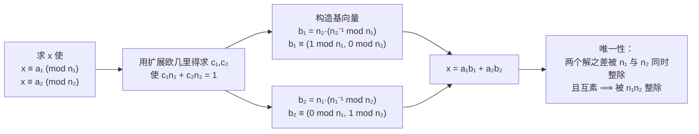
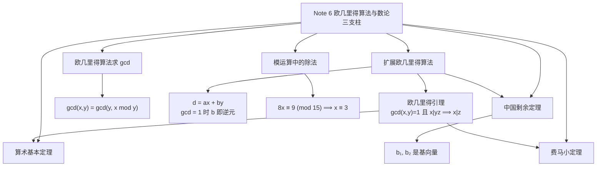

# Note 6 欧几里得算法、算术基本定理与中国剩余定理

> 本笔记对应 CS 70《离散数学与概率论》Fall 2026 Course Notes Note 6（第 1–4 节）。Note 5 留下了两个悬念：逆元什么时候存在、**怎么算出来**。本讲用**欧几里得算法（Euclid's Algorithm）**一举解决它，并顺势证明三条数论支柱：**算术基本定理**、**中国剩余定理**、**费马小定理**。

---

## 1. 计算逆元：欧几里得算法

**让我们先讨论**"计算 $x$ 模 $m$ 的乘法逆元"与"求 $\gcd(x, m)$"有什么关系。

对任何一对数 $x, y$，**假设我们不仅能算出 $\gcd(x,y)$，还能找出整数 $a, b$ 使得**

$$d = \gcd(x,y) = ax + by \tag{1}$$

（**注意**：这**不是**一个模方程；而且整数 $a, b$ 可以是**零或负数**。）

例如，我们可以写

$$1 = \gcd(35, 12) = -1 \cdot 35 + 3 \cdot 12$$

所以在这里 $a = -1$、$b = 3$ 就是 $a, b$ 可能的取值。

### 1.1 从 Bézout 表示到逆元

**如果我们能做到这一点，那么我们就能如下计算逆元。**

我们先找出整数 $a$ 与 $b$ 使得

$$1 = \gcd(m, x) = am + bx$$

**但这意味着 $bx \equiv 1 \pmod m$，所以 $b$ 就是 $x$ 模 $m$ 的一个乘法逆元。** 把 $b$ 模 $m$ 化简，就得到我们要找的**那个唯一的逆元**。

在上面的例子里，我们看到 **$3$ 是 $12$ 模 $35$ 的乘法逆元**。

**于是，我们把"计算逆元"这个问题归约成了"找出满足 (1) 的整数 $a,b$"这个问题。**

**值得注意的是**，欧几里得求 $\gcd$ 的算法**同时也允许我们找出上面所描述的整数 $a$ 与 $b$**。所以**计算 $x$ 模 $m$ 的乘法逆元，就简单到"在输入 $x$ 与 $m$ 上跑一遍欧几里得 $\gcd$ 算法"而已！**

> **⚠️ 注意（(1) 式为何是逻辑枢纽）**：形如 $d = ax + by$ 的表示叫 **Bézout 表示（Bézout's identity）**。它是把"整除性"这种**乘法性质**翻译成"线性组合"这种**加法性质**的桥梁。**Note 5 里"$m \mid xz$ 且 $\gcd(m,x)=1 \Rightarrow m \mid z$"这条欧几里得引理，以及本讲后面的算术基本定理、中国剩余定理，用的都是这一招。**

### 1.2 欧几里得算法的思想

**如果我们想计算两个数 $x$ 与 $y$ 的 $\gcd$，该怎么做？**

**作为基础情形**，若 $x$ 或 $y$ 是 $0$，那么计算 $\gcd$ 很容易：它**就是另一个数**，因为 $0$ 被一切数整除（虽然 $0$ 当然**不整除**任何数）。

**其他情形的算法非常古老**；虽然它与欧几里得的名字联系在一起，但几乎可以肯定它是一个**民间算法**，由工匠们（他们那个时代的工程师）因为其**极强的实用性**而发明出来。

计算 $\gcd(x,y)$ 的算法使用下面这个定理，最终把问题**归约到"其中一个数为 $0$"的基础情形**。

> **定理 6.1**：设 $x \geq y > 0$。则
> $$\gcd(x,y) = \gcd(y,\ x \bmod y)$$

> **证明（Proof）**

**证明：** 该定理立即可由下述事实推出：**一个数 $d$ 是 $x$ 与 $y$ 的公因子，当且仅当 $d$ 是 $y$ 与 $x \bmod y$ 的公因子。**

**为看出这一点**，写出

$$x = qy + r$$

其中 $q$ 是整数、$r = x \bmod y$。

- **正向**：若 $d$ 整除 $x$ 与 $y$，那么它也整除 $x$ 与 $qy$，因此它也整除它们的差
  $$r = x - qy$$
  （依据：Note 1 中证明的"若 $a \mid b$ 且 $a \mid c$，则 $a \mid (b-c)$"）。
- **反向**：反之，若 $d$ 整除 $y$ 与 $r$，那么它也整除 $qy$ 与 $r$，因此也整除它们的和
  $$x = qy + r$$

**证毕。** $\blacksquare$

**⚠️ 注意（为什么这条定理"显然"却至关重要）**：它说的是 $\gcd$ 在替换 $(x,y) \to (y, x \bmod y)$ 下**保持不变**。这一步既**缩小了数值**（因为 $x \bmod y < y$），又**不改变答案**——这正是算法能够终止且正确的原因。**两个性质必须同时具备，缺一不可。**

### 1.3 一个计算实例

**有了这个定理，我们来看看如何计算 $\gcd(16,10)$：**

$$
\begin{aligned}
\gcd(16,10) &= \gcd(10, 6) && (16 \bmod 10 = 6)\\
&= \gcd(6, 4) && (10 \bmod 6 = 4)\\
&= \gcd(4, 2) && (6 \bmod 4 = 2)\\
&= \gcd(2, 0) && (4 \bmod 2 = 0)\\
&= 2 && (\text{基础情形：}\gcd(2,0) = 2)
\end{aligned}
$$

**在每一行中**，我们把参数对 $(x,y)$ 替换为 $(y, x \bmod y)$，直到**第二个参数变为 $0$**。此时 $\gcd$ 就是**第一个参数**。**由上述定理，每一次替换都保持 $\gcd$ 不变。**

### 1.4 递归写法

这个算法可以如下**递归地**写出。该算法假设输入是满足 $x \geq y \geq 0$ 且 $x > 0$ 的自然数 $x, y$。

```text
algorithm gcd(x, y)
    if y = 0 then return (x)
    else return (gcd(y, x (mod y)))
```

> **定理 6.2**：上面的算法**正确地**计算 $x$ 与 $y$ 的 $\gcd$。

> **证明（Proof）**

**证明：正确性通过对 $y$（两个输入中较小的那个）作（强）归纳来证明。**

对每个 $y \geq 0$，令 $P(y)$ 表示命题"**该算法对所有满足 $x \geq y$（且 $x > 0$）的 $x$，都能正确计算 $\gcd(x,y)$**"。

1. **基础情形**：显然 $P(0)$ 成立，因为 $\gcd(x,0) = x$，而算法在 `if` 分支中正确地计算了它。
2. **归纳假设**：在归纳步中，我们可以假设 $P(z)$ 对所有 $z < y$ 成立。
3. **要证**：$P(y)$。
4. **关键观察**：这里的关键观察是 $\gcd(x,y) = \gcd(y, x \bmod y)$——也就是说，**把 $x$ 替换为 $x \bmod y$ 不改变 $\gcd$**。这已在**定理 6.1** 中证明。
5. **因此**，只要递归调用 `gcd(y, x mod y)` 正确算出了 $\gcd(y, x \bmod y)$，算法的 `else` 分支就会返回正确的值。
6. **由归纳假设收尾**：但**因为 $x \bmod y < y$**，由归纳假设我们知道第 5 点确实成立！

**这就完成了对 $P(y)$ 的验证，从而完成了归纳证明。**

**证毕。** $\blacksquare$

**⚠️ 注意（这里为什么必须用强归纳）**：递归调用 `gcd(y, x mod y)` 的第二个参数是 $x \bmod y$，它是**某个小于 $y$ 的数**，而**不一定是 $y - 1$**。弱归纳只能假设 $P(y-1)$，完全不够用。**这与 Note 4 中二分查找、Note 5 中反复平方法是同一类情形：子问题规模"至多 $k$"而非"恰为 $k$" $\Rightarrow$ 必须用强归纳。**

### 1.5 运行时间

**这个算法的运行时间是多少？** 我们将看到，就整数上的算术运算而言，它耗时 $O(n)$，其中 $n$ 是输入 $(x,y)$ 的**总比特数**。这**又一次非常高效**。

这个论证与我们先前用于指数运算的论证类似，但**稍微更微妙一些**：

**显然**，递归调用的参数会越来越小（因为 $y \leq x$ 且 $x \bmod y < y$）。**问题在于：缩小得多快？**

**我们将证明的关键点是**：在计算 $\gcd(x,y)$ 的过程中，**经过两次递归调用之后，第一个（较大的）参数至少比 $x$ 小一半**（假设 $x > 0$）。（**注意**：我们无法对"仅仅一次调用之后"的缩小幅度作多少断言。）**有两种情形**：

1. **$y \leq \dfrac{x}{2}$**。那么下一次递归调用中的第一个参数 $y$，已经比 $x$ 小了一半（因子 $2$），因此在下一次递归调用中它会变得更小。
2. **$x \geq y > \dfrac{x}{2}$**。那么在两次递归调用之后，第一个参数将是 $x \bmod y$，而它**小于 $\dfrac{x}{2}$**。
   **补充说明（第 2 种情形的依据）**：既然 $y > \frac{x}{2}$，那么 $x$ 除以 $y$ 的商只能是 $q = 1$，于是 $x \bmod y = x - y < x - \frac{x}{2} = \frac{x}{2}$。

**因此，在两种情形下，第一个参数每两次递归调用都至少缩小一半。** 于是在**至多 $2n$ 次递归调用**之后（$n$ 是 $x$ 的比特数），递归必然停止。（**注意**：第一个参数始终是自然数。）

**注意**：上面的论证只表明计算中的**递归调用次数**是 $O(n)$。如果我们假设**每次调用只需常数时间**，我们就能对运行时间作出同样的断言——因为每次调用只涉及**一次整数比较**与**一次 mod 运算**，所以把它算作常数时间是合理的。

**然而，在更现实的计算模型中**，我们真的应该让这些运算的时间**取决于所涉及数的大小**。这将在 **CS170** 中讨论。

**✅ 本节要点总结**
- **核心归约**：若能求 $d = \gcd(x,y) = ax+by$ 中的 $a,b$，则当 $\gcd(m,x)=1$ 时，$b \bmod m$ 就是 $x^{-1} \pmod m$（因为 $bx \equiv 1 \pmod m$）。
- **定理 6.1**：$x \ge y > 0 \Rightarrow \gcd(x,y) = \gcd(y, x \bmod y)$；证明靠"公因子在替换下不变"（双向论证）。
- **算法**：`if y = 0 then return x else return gcd(y, x mod y)`；每步把 $x \bmod y < y$ 作为新参数。
- **定理 6.2 的正确性**：对**较小参数 $y$ 作强归纳**（因为新参数是 $x \bmod y$，不一定是 $y-1$）。
- **运行时间**：每**两次**递归调用第一个参数至少减半，故调用次数 $O(n)$（$n$ 为比特数）；现实模型见 CS170。
- **例**：$\gcd(16,10) = \gcd(10,6) = \gcd(6,4) = \gcd(4,2) = \gcd(2,0) = 2$。

---

## 2. 扩展欧几里得算法（Extended Euclid's Algorithm）

**回忆一下**，为了计算乘法逆元，我们需要一个**同时返回整数 $a$ 与 $b$** 的算法，使得

$$\gcd(x,y) = ax + by \tag{2}$$

**那么特别地**，当 $\gcd(x,y) = 1$ 时，我们可以推出 **$b$ 是 $y$ 模 $x$ 的逆元**。

**既然这个问题是基本 $\gcd$ 问题的一个推广**，那么我们可以用一个相当直接的扩展版欧几里得算法来解决它，也许就并不太令人意外了。

### 2.1 算法

下面的递归算法 **`extended-gcd`** 沿用与欧几里得原算法相同的递归结构，但在**递归返回（unwind）的过程中追踪 (2) 所需的系数 $a, b$**。

具体地说，该算法像欧几里得算法一样接受一对自然数 $x \geq y$ 作为输入，并返回一个整数三元组 $(d, a, b)$，使得

$$d = \gcd(x,y), \qquad d = ax + by$$

```text
algorithm extended-gcd(x, y)
    if y = 0 then return (x, 1, 0)
    else
        (d, a, b) := extended-gcd(y, x (mod y))
        return ((d, b, a - (x div y) * b))
```

**在这个算法中**，`x div y` 表示通常的**截断整数除法**，数学上写作 $\left\lfloor \dfrac{x}{y} \right\rfloor$。

### 2.2 执行实例

下面是输入 $(x,y) = (16,10)$（与前面 $\gcd$ 例子相同）时的**递归调用序列（上面一行）**以及它们**返回的三元组序列（下面一行）**：

$$
\begin{aligned}
&\texttt{egcd(16,10)} \longrightarrow \texttt{egcd(10,6)} \longrightarrow \texttt{egcd(6,4)} \longrightarrow \texttt{egcd(4,2)} \longrightarrow \texttt{egcd(2,0)}\\
&(2,2,-3) \longleftarrow (2,-1,2) \longleftarrow (2,1,-1) \longleftarrow (2,0,1) \longleftarrow (2,1,0)
\end{aligned}
$$

> **Exercise.** 请检查上面这个执行序列。

**最终返回的三元组是 $(d, a, b) = (2, 2, -3)$**，意思是 $(x,y) = (16,10)$ 的 $\gcd$ 是 $d = 2$，并且它可以表示为

$$d = ax + by = 2 \cdot 16 - 3 \cdot 10$$

而我们很容易看出这是正确的。

**（事实上**，返回的三元组序列中，每一个都把 $d = 2$ 表示为**对应那次递归调用的输入**的线性组合：所以我们可以检验

$$d = 1\cdot 2 + 0\cdot 0 = 0\cdot 4 + 1\cdot 2 = 1\cdot 6 - 1\cdot 4 = -1\cdot 10 + 2\cdot 6 = 2\cdot 16 - 3\cdot 10$$

**补充说明（这个等式链怎么读）**：链条上每一段都对应递归栈的一层，形式统一为"$\alpha \times (\text{该层的 } x) + \beta \times (\text{该层的 } y) = 2$"。**最右端的 $2\cdot16 - 3\cdot10$ 就是最终答案**，因为它作用在原始输入上。**请务必自己动手验算一遍——这是理解"系数沿递归返回方向翻转"的唯一办法。**

**由于 $\gcd(16,10) \neq 1$，$10$ 在模 $16$ 下没有逆元**，所以算法返回的系数 $a, b$ 对"计算逆元"这件事**毫无用处**。**不过**，下一个练习给出了一个能让我们"读出逆元"的例子，正如此前所描述的那样。

> **Exercise.** 请你亲自在输入 $(x,y) = (35,12)$ 上手工推演这个算法，验证它返回三元组 $(1,-1,3)$。由此推断 **$12$ 模 $35$ 的逆元是 $3$**。

**补充说明（这道练习的做法与结论）**：$\gcd(35,12) = 1$，返回 $d = 1 = -1\cdot 35 + 3\cdot 12$，即 $b = 3$。由第 1.1 节的推理，$3$ 就是 $12$ 模 $35$ 的逆元。**验证**：$3 \times 12 = 36 = 35 + 1 \equiv 1 \pmod{35}$，正确。

### 2.3 算法为什么正确（逆向工程）

**让我们现在把算法"逆向工程"一遍**，理解它**为什么**可行、以及**为什么被设计成这样**。

**基础情形（$y = 0$）**：算法像以前一样返回 $\gcd$ 值 $d = x$，同时给出系数 $a = 1$、$b = 0$；显然它们满足 $ax + by = d$，正如所要求的那样。

**当 $y > 0$ 时**，算法先递归地算出满足下式的值 $(d, a, b)$：

$$d = \gcd(y, x \bmod y) \quad\text{并且}\quad d = ay + b(x \bmod y) \tag{3}$$

**然后它返回三元组 $(d, A, B)$，其中**

$$A = b, \qquad B = a - \left\lfloor \frac{x}{y} \right\rfloor b$$

**正像我们先前对原始 $\gcd$ 算法的分析那样**，我们知道递归算出的 $d$ 将等于 $\gcd(x,y)$。**所以算法返回的三元组的第一个分量是正确的。**

**那么另外两个分量 $A$ 与 $B$ 呢？** 按算法的规格说明，它们应当是满足下式的整数：

$$d = Ax + By \tag{4}$$

**为了弄清楚 $A$ 与 $B$ 应当如何用此前返回的 $a$ 与 $b$ 表示**，我们可以把 (3) 重新整理如下：

$$
\begin{aligned}
d &= ay + b(x \bmod y)\\
&= ay + b\left(x - \left\lfloor \frac{x}{y} \right\rfloor y\right) && \text{（依据：}x \bmod y = x - \lfloor x/y\rfloor y\text{——请核对！）}\\
&= bx + \left(a - \left\lfloor \frac{x}{y} \right\rfloor b\right) y && \text{（按 } x, y \text{ 归并同类项）}
\end{aligned} \tag{5}
$$

**现在把 (5) 与 (4) 比较**：比较 $x$ 与 $y$ 的系数，我们看到需要取

$$A = b, \qquad B = a - \left\lfloor \frac{x}{y} \right\rfloor b$$

**而这正是算法最后一行所做的事——这就是它可行的原因！**

> **Exercise.** 请把上面的论证变成一个**形式化的归纳证明**，证明算法 `extended-gcd` 是正确的。

**补充说明（形式化归纳证明的骨架）**：对较小参数 $y$ 作强归纳。

- **基础情形 $y = 0$**：返回 $(x, 1, 0)$，满足 $1 \cdot x + 0 \cdot 0 = x = \gcd(x,0)$。
- **归纳假设**：假设对所有 $z < y$，`extended-gcd` 在第二个参数为 $z$ 时正确，即返回的 $(d,a,b)$ 满足 $d = \gcd(\cdot,z)$ 且 $d = a\cdot(\text{第一参数}) + b\cdot z$。
- **归纳步**：因 $x \bmod y < y$，递归调用正确返回 $(d,a,b)$ 满足 (3)。由定理 6.1 知 $d = \gcd(x,y)$；又由 (5) 的恒等变形，取 $A = b$、$B = a - \lfloor x/y\rfloor b$ 便有 $d = Ax + By$。**故返回三元组正确。** $\blacksquare$

**由于扩展 $\gcd$ 算法与原始版本有完全相同的递归结构**，它的运行时间在常数因子意义下相同（该常数因子反映了每次递归调用代价的增加）。所以**在 $n$ 比特输入上，运行时间同样是 $O(n)$ 次算术运算**。这意味着**我们可以非常高效地求出乘法逆元**。

**✅ 本节要点总结**
- **目标**：求 $(d,a,b)$ 使 $d = \gcd(x,y) = ax + by$；当 $\gcd(x,y)=1$ 时，$b \bmod x$ 即 $y^{-1} \pmod x$。
- **递归结构**：与普通 $\gcd$ 完全相同，但在**递归返回时**把系数变换为 $(A,B) = \left(b,\ a - \lfloor x/y\rfloor b\right)$。
- **正确性的关键变形**：$d = ay + b(x - \lfloor x/y\rfloor y) = bx + \left(a - \lfloor x/y\rfloor b\right)y$，与 $d = Ax + By$ 比较系数即得。
- **实例**：$(16,10)$ 返回 $(2,2,-3)$，即 $2 = 2\cdot16 - 3\cdot10$；$(35,12)$ 返回 $(1,-1,3)$，故 $12^{-1} \equiv 3 \pmod{35}$。
- **运行时间**：与普通 $\gcd$ 同阶，$O(n)$ 次算术运算（$n$ 为比特数）。

### 2.4 模运算中的除法（Division in modular arithmetic）

**既然我们现在知道如何计算 $x$ 模 $m$ 的逆元**（假定 $x$ 与 $m$ 互素），**我们怎么用它来做算术呢？**

**最简单的场景**是求解如下形式的**模方程**：

$$8x \equiv 9 \pmod{15} \tag{6}$$

**要在有理数上求解类似的方程 $8x = 9$**，我们会把两边都乘以 $8^{-1}$ 得到 $x = 9/8$。**让我们在模 $15$ 的算术中做同样的事。**

回忆一下，**$8$ 模 $15$ 的逆元是 $2$**（因为 $2 \cdot 8 = 16 \equiv 1 \pmod{15}$）。因此我们可以把 (6) 的两边都乘以 $8^{-1} \equiv 2$，得到

$$x \equiv 18 \equiv 3 \pmod{15}$$

也就是说，**模方程 (6) 的解是 $x = 3$，而且这个解模 $15$ 是唯一的。**

**⚠️ 注意（用逆元解模方程的三步套路）**：

1. **先确认逆元存在**：$\gcd(8, 15) = 1$，所以 $8^{-1} \pmod{15}$ 存在（这一步绝不能跳过！若 $\gcd \neq 1$，方程可能无解或有多个解）；
2. **求出逆元**（用扩展欧几里得算法）：$8^{-1} \equiv 2 \pmod{15}$；
3. **两边同乘逆元**：$x \equiv 2 \cdot 9 = 18 \equiv 3 \pmod{15}$。

**⚠️ 注意（唯一性来自逆元的唯一性）**：Note 5 证明了 $\gcd(m,x)=1$ 时逆元**唯一**，所以上述解**模 $15$ 唯一**。若 $\gcd(m,x) > 1$，则 $x$ 无逆元，不能用这种方法，方程的解的个数也会改变。

---

## 3. 算术基本定理（Fundamental Theorem of Arithmetic）

**你可能记得**：任何大于 $1$ 的正整数都可以**唯一地**表示为若干素数之积（不计因子的顺序）。这就是所谓的**算术基本定理（Fundamental Theorem of Arithmetic）**。例如

$$12 = 2 \cdot 2 \cdot 3$$

**我们怎么知道这是真的？** 结果证明，**扩展欧几里得算法正是证明它的关键！**

**我们先证明一条关于整除性的重要事实。**

### 3.1 关键引理（欧几里得引理）

> **断言**：设 $x, y, z$ 是正整数且 $\gcd(x,y) = 1$。若 $x \mid yz$，则 $x \mid z$。

> **证明（Proof）**

**证明：由扩展欧几里得算法**，既然 $\gcd(x,y) = 1$，就存在整数 $a$ 与 $b$ 使得

$$1 = \gcd(x,y) = ax + by$$

**两边同乘 $z$**，得到

$$z = axz + byz$$

**我们知道 $x \mid axz$**（因为它是 $x$ 的倍数），**并且 $x \mid byz$**，因为 $x \mid yz$。**因此 $x$ 整除它们的和**，换句话说 $x \mid axz + byz$。**由于 $axz + byz = z$，我们断定 $x \mid z$。**

**证毕。** $\blacksquare$

**⚠️ 注意（这条引理为什么必须靠 Bézout 表示才能证）**：仅凭"$x$ 与 $y$ 没有公因子"这一定义，无法直接推出 $x \mid z$——你必须**把 $1$ 写成 $x$ 与 $y$ 的线性组合**，然后整个式子乘以 $z$，才能让"$x \mid yz$"这个前提真正被用上（体现在 $byz$ 这一项上）。**这正是第 1 节强调 Bézout 表示是逻辑枢纽的地方。**

**补充说明（回顾 Note 5 的用法）**：Note 5 证明"若 $\gcd(m,x) > 1$ 则 $x$ 无模 $m$ 逆元"时用的是这条引理的**反向用途**：由 $ax - km = 1$ 与 $d = \gcd(x,m)$ 推出 $d \mid 1$。可见这条引理在模运算里到处都是。

### 3.2 定理的陈述

**回忆一下**，素数 $p$ 是**只有 $1$ 与 $p$ 两个正因子**的数。

> **定理（算术基本定理）**：每个正整数 $n > 1$ 都可以**唯一地**表示为形式
> $$p_1 p_2 \cdots p_k$$
> 其中每个 $p_i$ 都是（**不必互不相同**的）素数，**且这种表示在重排素因子顺序的意义下是唯一的**。

例如，我们可以写 $12 = 2 \cdot 2 \cdot 3$。$12$ 的任何其他素因数分解都只是 $2, 2, 3$ 的某种重排。

### 3.3 唯一性的证明

> **证明（Proof）**

**证明：**

**第一部分（存在性）**：我们在 **Note 4** 中已经用**归纳法**证明了：**每个正整数 $n$ 都可以表示为 $p_1 p_2 \cdots p_k$ 的形式**，其中每个 $p_i$ 都是（不必互不相同的）素数。

**因此，只需证明这种形式在重排因子顺序的意义下是唯一的。**

**换句话说**，假设我们能用两种素因数分解表示 $n$：

$$n = p_1 p_2 \cdots p_k = q_1 q_2 \cdots q_l$$

其中所有 $p_i$ 与 $q_j$ 都是素数。**我们需要证明 $k = l$，并且 $p_i$ 是 $q_j$ 的某种重排。**

**不失一般性（without loss of generality）**，假设 $k \leq l$。（若 $k \geq l$，我们只要把两个分解交换一下即可。）**我们的目标是证明每个 $p_i$ 都是某个 $q_j$。**

**第二部分（逐一配对）**：首先考虑 $p_1$。

1. 因为 $p_1 \mid n$，我们必定有 $p_1 \mid q_1 q_2 \cdots q_l$；
2. **若 $p_1$ 是 $q_1, q_2, \dots, q_{l-1}$ 之一，那我们就完成了。**
3. **否则**，若对 $1 \leq j \leq l-1$ 都有 $p_1 \neq q_j$，那么对 $1 \leq j \leq l-1$ 有 $\gcd(p_1, q_j) = 1$——因为它们**共同拥有的唯一因子就是 $1$**（两个不同的素数除了 $1$ 没有公因子）；
4. **套用前面的引理**，我们断定 $p_1 \mid q_l$；
5. **由于 $1$ 不是素数，$p_1 \neq 1$，所以 $p_1 = q_l$**（依据：$q_l$ 是素数，其正因子只有 $1$ 与 $q_l$；而 $p_1 > 1$ 又是 $q_l$ 的因子）。

**于是我们断定 $p_1 = q_j$（对某个 $j$）。** 于是我们可以**把两边都除以 $p_1$**，从而把两边的素数个数各减少 $1$。

**第三部分（重复）**：我们现在对 $p_2, p_3, \dots$ 一直重复这个过程，直到 $p_k$。

**最后**，左边将变成 $1$，而右边将是 $l - k$ 个素数之积。**每个素数都至少是 $2$，所以要使两边相等，必须有 $l - k = 0$，即 $k = l$。**

**而且**，在这个过程中我们把**每个 $p_i$ 与一个唯一的 $q_j$ 配了对**。因此 $p_i$ 就是 $q_j$ 的某种重排，正如所愿。

**证毕。** $\blacksquare$

**补充说明（第 3 步为什么"两个不同的素数互素"）**：设 $p \neq q$ 都是素数，$d = \gcd(p,q)$。$d \mid p$ 且 $p$ 素数，故 $d \in \{1, p\}$；同理 $d \in \{1, q\}$。若 $d = p$ 则 $p \mid q$，由 $q$ 素数得 $p \in \{1, q\}$，而 $p > 1$ 且 $p \neq q$，矛盾。**故 $d = 1$。** 这一步看似显然，但它是唯一性证明的支点。

**⚠️ 注意（第 2 步与第 3 步的"否则"必须写清）**：原文在这里做了一个**分类讨论**：$p_1$ 要么已经是某个前面的 $q_j$，要么不是。**只有"不是"的情形才能对 $q_1,\dots,q_{l-1}$ 逐个使用"互素 + 引理"得到 $p_1 \mid q_l$。** 若跳过这个分类，证明就断链了。

### 3.4 这个证明的"钥匙"是什么？

**上面这个证明的关键是什么？**

- 为了证明素因数分解**存在**（这是我们在 Note 4 中证过的），我们用了**强归纳**；
- 为了证明这种分解**唯一**，我们用了**欧几里得算法的一个推论**（即 3.1 节的引理）；
- 而**欧几里得算法的关键**，是**带余除法的存在性与唯一性**；换句话说，对整数 $x$ 与 $m \neq 0$，存在唯一的整数 $q$ 与 $r$ 使得
  $$x = mq + r, \qquad 0 \leq r \leq m - 1$$

> 💡 **补充注释（原文脚注）**：如果我们有别的算术系统也能模拟这种"除法算法"，我们就可以沿用同类证明，得到该系统的某种"唯一素因数分解"。这在数论中是一个**重要的推广**。（详见 https://en.wikipedia.org/wiki/Euclidean_domain 。）

**⚠️ 注意（为什么"带余除法的唯一性"是根基）**：整个链条是"**带余除法唯一** $\Rightarrow$ **欧几里得算法** $\Rightarrow$ **Bézout 表示 / 引理** $\Rightarrow$ **分解唯一**"。所以算术基本定理**并不是**关于素数的一条孤立事实，而是"整数上带余除法良定义"这一结构的**必然产物**。

**✅ 本节要点总结**
- **引理（欧几里得引理）**：$\gcd(x,y)=1$ 且 $x \mid yz$ $\Rightarrow$ $x \mid z$。证明靠 Bézout 表示 $1 = ax+by$，两边乘 $z$ 得 $z = axz + byz$，两项都被 $x$ 整除。
- **算术基本定理**：每个 $n>1$ 可唯一地（不计顺序）写成素数之积。
- **存在性**：由 Note 4 的**强归纳**给出。
- **唯一性**：设 $p_1\cdots p_k = q_1\cdots q_l$，不妨 $k \le l$；用"$p_1$ 是否等于某个 $q_1,\dots,q_{l-1}$"分类讨论，否则由互素 + 引理得 $p_1 \mid q_l$，从而 $p_1 = q_l$；逐一配对并约去，最后比较剩余个数得 $k = l$。
- **根基**：带余除法的**存在性与唯一性**。

---

## 4. 中国剩余定理（Chinese Remainder Theorem）

**我们现在介绍模运算的一个有趣的侧面**，它体现在**中国剩余定理**之中——之所以这样命名，是因为它已知最早的陈述出自中国数学家**孙子**（公元 3 世纪）。

### 4.1 最简单的情形（$k = 2$）

> **断言**：设 $\gcd(n_1, n_2) = 1$，则**恰好存在一个** $x \pmod{n_1 n_2}$ 满足方程组
> $$x \equiv a_1 \pmod{n_1}, \qquad x \equiv a_2 \pmod{n_2} \tag{7}$$

> **证明（Proof）**

**证明：**

**第一部分（构造解）**。既然 $\gcd(n_1, n_2) = 1$，由**扩展欧几里得算法**我们知道存在整数 $c_1, c_2$ 使得

$$c_1 n_1 + c_2 n_2 = 1 \tag{8}$$

**现在断言整数**

$$x = a_1 c_2 n_2 + a_2 c_1 n_1$$

满足方程组 (7)。**为检查这一点**，我们可以写

$$
\begin{aligned}
x &= a_1 c_2 n_2 + a_2 c_1 n_1\\
&= a_1 (1 - c_1 n_1) + a_2 c_1 n_1 && \text{（由 (8) 得 } c_2 n_2 = 1 - c_1 n_1\text{）}\\
&= a_1 + (a_2 - a_1) c_1 n_1 && \text{（整理成"含 } n_1 \text{ 的项 + 常数"）}
\end{aligned}
$$

**因此我们看到 $x \equiv a_1 \pmod{n_1}$，正如所要求的那样**（因为右边含 $n_1$ 的项模 $n_1$ 为 $0$）。

**用完全相同的论证、把下标 $1$ 与 $2$ 互换**，我们也看到 $x \equiv a_2 \pmod{n_2}$。**因此 $x$ 确实同时满足方程组 (7) 的两个方程。**

**第二部分（唯一性）**。为完成证明，我们需要验证 $x$ 是**唯一的**（模 $n_1 n_2$）。

为此，假设整数 $x$ 与 $y$ **都**满足方程组 (7)。那么特别地 $x \equiv y \pmod{n_1}$ 且 $x \equiv y \pmod{n_2}$。**这意味着 $(x-y)$ 既能被 $n_1$ 整除、也能被 $n_2$ 整除。** 但既然 $\gcd(n_1,n_2) = 1$，这意味着 **$(x-y)$ 必定能被 $n_1 n_2$ 整除**，因此 $x \equiv y \pmod{n_1 n_2}$，正如所要求的那样。

**证毕。** $\blacksquare$

**⚠️ 注意（"互素 $\Rightarrow$ 乘积整除"这一步的依据）**：由 $n_1 \mid (x-y)$、$n_2 \mid (x-y)$ 且 $\gcd(n_1,n_2)=1$ 推出 $n_1n_2 \mid (x-y)$，用的正是一般形式的**欧几里得引理**：若 $n_1 \mid n_2 \cdot w$ 且 $\gcd(n_1,n_2)=1$，则 $n_1 \mid w$（这里取 $w = (x-y)/n_2$）。**若 $n_1, n_2$ 不互素，这条推理就失效**——例如 $x \equiv y \pmod 4$ 且 $x \equiv y \pmod 6$ 只能推出 $x \equiv y \pmod{12}$，而不是模 $24$。

### 4.2 从"逆元"看这个构造（"坐标"视角）

**回顾上面这个证明**，注意在 $x$ 的定义中出现的整数 $c_1, c_2$ **实际上有一个具体的含义：它们是逆元**。

具体地说，回忆我们关于扩展欧几里得的讨论：在方程 (8) 中，**$c_1$ 是 $n_1$ 模 $n_2$ 的逆元**；**类似地，$c_2$ 是 $n_2$ 模 $n_1$ 的逆元**。（这两个逆元都存在，因为 $\gcd(n_1,n_2) = 1$。）

**补充说明（逆元方向的核对）**：把 (8) 模 $n_1$ 化简：$c_2 n_2 \equiv 1 \pmod{n_1}$，故 $c_2 \equiv n_2^{-1} \pmod{n_1}$。同理把 (8) 模 $n_2$ 化简得 $c_1 \equiv n_1^{-1} \pmod{n_2}$。**所以"$c_1$ 是 $n_1$ 模 $n_2$ 的逆元"这句话是对的。**

**因此，我们在证明中构造的解 $x$ 具有这种形式**

$$x = a_1 b_1 + a_2 b_2$$

**其中**

$$b_1 = n_2 \left(n_2^{-1} \bmod n_1\right), \qquad b_2 = n_1 \left(n_1^{-1} \bmod n_2\right)$$

**注意**，这意味着

$$b_1 \equiv \begin{cases} 1 \pmod{n_1}\\ 0 \pmod{n_2}\end{cases}, \qquad b_2 \equiv \begin{cases} 0 \pmod{n_1}\\ 1 \pmod{n_2}\end{cases}$$

**补充说明（核对 $b_1$）**：$b_1 = n_2 \cdot n_2^{-1}$ 模 $n_1$ 等于 $1$（因为 $n_2^{-1}$ 正是使 $n_2 \cdot n_2^{-1} \equiv 1$ 的那个数）；而 $b_1$ 显然含因子 $n_2$，故模 $n_2$ 等于 $0$。$b_2$ 同理。

**因此我们可以把 $b_1, b_2$ 视为"基向量（basis vectors）"**，意义是：**$b_1$ 在"$n_1$ 方向"上的坐标为 $1$、在"$n_2$ 方向"上的坐标为 $0$；$b_2$ 则相反。**

**于是为了满足方程组 (7)，我们的解 $x$ 就应当是 $b_1, b_2$ 的线性组合，系数分别取 $a_1$ 与 $a_2$。**



**图意说明**：这张图把中国剩余定理的 $k=2$ 情形拆成"**求系数 $\to$ 造基向量 $\to$ 线性组合 $\to$ 验唯一性**"四步。**"基向量"这个类比是本节的核心直觉**：$b_1, b_2$ 之于模 $n_1n_2$ 的算术，正如标准基 $\mathbf{e}_1, \mathbf{e}_2$ 之于普通的向量空间——它们分别"只在一个方向上是 1"。

### 4.3 完整形式（$k$ 个模数）

**上面的结果可以顺势推广到完整形式的中国剩余定理**，其陈述如下。

> **定理（中国剩余定理，Chinese Remainder Theorem）**：设 $n_1, n_2, \dots, n_k$ 是**两两互素**的正整数，并令
> $$N = \prod_{i=1}^{k} n_i$$
> 则对**任意**整数序列 $a_1, a_2, \dots, a_k$，存在**唯一的**整数 $x \pmod N$ 同时满足所有同余式
> $$\begin{cases} x \equiv a_1 \pmod{n_1}\\ \quad\vdots\\ x \equiv a_i \pmod{n_i}\\ \quad\vdots\\ x \equiv a_k \pmod{n_k}\end{cases}$$

**我们不会在这里详细证明完整定理**，但会**勾画两种途径**。

**途径一（迭代 $k=2$ 的结果）**：也就是**迭代**上面证明过的 $k = 2$ 版本的结论。具体地说：

1. 我们先用那个版本找出一个满足**前两个**同余式（模 $n_1$ 与 $n_2$）的 $x$；
2. 这个 $x$ 有一个确定的（唯一的）值 $\pmod{n_1 n_2}$，我们把它记为 $a_{12}$；
3. 现在我们可以把前两个同余式**替换成单个同余式** $x \equiv a_{12} \pmod{n_1 n_2}$；
4. **注意 $n_1 n_2$ 也与所有其他的 $n_i$ 互素**；
5. 于是我们现在有一个同余式个数为 $k-1$（而非 $k$）的**更小的问题**，可以继续迭代直到完成。

**途径二（推广"坐标"视角）**：也就是把我们先前对 $k = 2$ 的"坐标"视角**推广**开。也就是说，我们像以前一样**用逆元为每个 $i$ 构造基向量 $b_i$**，然后把解

$$x = \sum_{i} a_i b_i$$

推导为这些基向量的**线性组合**。

**依照我们先前的构造，每个 $b_i$ 的正确定义应当是**

$$b_i = \left(\frac{N}{n_i}\right)\left(\left(\frac{N}{n_i}\right)^{-1} \bmod n_i\right)$$

**如果你有兴趣，可以自己验证一下这个解确实像以前那样有效。**

**补充说明（核对 $b_i$）**：对任意 $j \neq i$，$b_i$ 含有因子 $N/n_i$，而 $n_j \mid N/n_i$（因为 $n_j$ 是 $N$ 的因子且 $j \neq i$），所以 $b_i \equiv 0 \pmod{n_j}$；而 $b_i$ 模 $n_i$ 等于 $(N/n_i)(N/n_i)^{-1} \equiv 1 \pmod{n_i}$。于是 $x = \sum_i a_i b_i$ 满足 $x \equiv a_i \cdot 1 + \sum_{j \neq i} a_j \cdot 0 \equiv a_i \pmod{n_i}$。**这正是"$k$ 维基向量"的完整类比。**

**⚠️ 注意（完整定理必须要求"两两互素"）**：$n_1,\dots,n_k$ **两两互素**是必需的。若某个 $\gcd(n_i,n_j) > 1$，则解**可能不存在**（例如 $x \equiv 0 \pmod 2$ 与 $x \equiv 1 \pmod 4$ 无解），**也可能不唯一**。这正是 Note 5 中"逆元存在 $\iff$ 互素"这条判据在此处的体现——中国剩余定理的一切构造都建立在逆元之上。

**✅ 本节要点总结**
- **$k=2$ 情形**：$\gcd(n_1,n_2)=1$ 时，方程组 $x \equiv a_1 \pmod{n_1}$、$x \equiv a_2 \pmod{n_2}$ 恰有唯一解模 $n_1n_2$。
- **构造**：由 Bézout 表示 $c_1n_1 + c_2n_2 = 1$ 得 $x = a_1c_2n_2 + a_2c_1n_1$；验证 $x \equiv a_1 \pmod{n_1}$ 靠代入 $c_2n_2 = 1 - c_1n_1$。
- **唯一性**：两解之差被 $n_1$、$n_2$ 同时整除 + 互素 $\Rightarrow$ 被 $n_1n_2$ 整除。
- **逆元的含义**：$c_1$ 是 $n_1^{-1} \pmod{n_2}$，$c_2$ 是 $n_2^{-1} \pmod{n_1}$。
- **"基向量"视角**：$b_1 = n_2(n_2^{-1}\bmod n_1)$ 满足 $b_1 \equiv 1 \pmod{n_1}$、$b_1 \equiv 0 \pmod{n_2}$；$b_2$ 对称；解 $x = a_1b_1 + a_2b_2$。
- **完整定理**：$n_i$ 两两互素、$N = \prod n_i$，则对任意 $a_i$ 存在唯一 $x \pmod N$；两种途径为**迭代 $k=2$** 与**构造 $b_i = (N/n_i)\left((N/n_i)^{-1} \bmod n_i\right)$**。
- **⚠️ 互素不可少**：否则解可能不存在或不唯一。

---

## 5. 费马小定理（Fermat's Little Theorem）

**作为本笔记的结尾**，我们将证明一个在后续讲座中会很有用的定理，叫作**费马小定理（Fermat's Little Theorem）**。

**这是一条标准数论事实**，它告诉我们：**当一个指数运算在模素数意义下进行时，它是周期的，且该周期比那个素数小 1。**

**证明如下：**

> **定理 6.3（费马小定理）**：对任意素数 $p$ 与任意 $a \in \{1, 2, \dots, p-1\}$，有
> $$a^{p-1} \equiv 1 \pmod p$$

### 5.1 证明

> **证明（Proof）**

**证明：**

令 $S$ 表示**模 $p$ 的非零整数集合**，即

$$S = \{1, 2, \dots, p-1\}$$

**考虑数列**

$$a,\ 2a,\ 3a,\ \dots,\ (p-1)a \pmod p$$

**我们在上一讲笔记中已经看到**：只要 $\gcd(p,a) = 1$（即 $p, a$ 互素——由于 $p$ 是素数，这里当然成立），**这些数全都两两不同**。

**因此**，既然它们**没有一个为 $0$**，且共有 $p-1$ 个，它们必定**恰好把 $S$ 的每个元素各取一次**（依据：$p-1$ 个互不相同的数落在恰好 $p-1$ 个可能值中，只能是恰好占满）。

**因此**，数集

$$S' = \{a \bmod p,\ 2a \bmod p,\ \dots,\ (p-1)a \bmod p\}$$

**与 $S$ 完全相同**（只是顺序不同而已）！

**现在假设我们把 $S$ 中所有数乘起来（模 $p$）**。显然这个乘积是

$$1 \times 2 \times \cdots \times (p-1) \equiv (p-1)! \pmod p \tag{9}$$

**另一方面，如果我们把 $S'$ 中所有数乘起来呢？** 显然这是

$$a \times 2a \times \cdots \times (p-1)a \equiv a^{p-1}(p-1)! \pmod p \tag{10}$$

**但是，根据我们在上一段中的观察——$S$ 与 $S'$ 中的数集完全相同（模 $p$）——(9) 与 (10) 中的乘积实际上必定模 $p$ 相等。** 因此我们有

$$(p-1)! \equiv a^{p-1}(p-1)! \pmod p \tag{11}$$

**最后**，由于 $p$ 是素数，我们知道**每个非零整数都有模 $p$ 的逆元**，因此 $(p-1)!$ 有模 $p$ 的逆元。于是我们可以把 (11) 两边同乘 $(p-1)!$ 的逆元，得到

$$a^{p-1} \equiv 1 \pmod p$$

正如所要求的那样。

**证毕。** $\blacksquare$

**逐步核对关键推理（补充说明）**：

| 步骤 | 依据 |
| :--- | :--- |
| "$a, 2a, \dots, (p-1)a$ 模 $p$ 两两不同" | Note 5 定理 5.2 的证明（$0,x,2x,\dots,(m-1)x$ 两两不同），此处取 $m=p$、$x=a$，条件 $\gcd(p,a)=1$ 成立 |
| "它们没有一个为 $0$" | 若 $ka \equiv 0 \pmod p$，则 $p \mid ka$，由 $p$ 素数且 $p \nmid a$ 得 $p \mid k$；但 $1 \le k \le p-1$，矛盾 |
| "$S' = S$（作为集合）" | 恰有 $p-1$ 个互不相同的非零值，而 $S$ 恰有 $p-1$ 个元素 |
| "两边的乘积相等" | 集合相同，则其全部元素的乘积相同（乘法可交换、与顺序无关） |
| "可以在 (11) 两边同乘 $(p-1)!$ 的逆元" | $p$ 素数 $\Rightarrow$ $1,\dots,p-1$ 都与 $p$ 互素 $\Rightarrow$ $(p-1)!$ 是这些数的乘积，也与 $p$ 互素（由 Note 5 的存在性判据），故逆元存在 |

**⚠️ 注意（为什么"同乘逆元"这一步绝不能省）**：在模运算中**不能随意约去因子**——只有当被约去的量**有逆元**时才可以。这里能约掉 $(p-1)!$，完全依赖 $p$ 是素数。**若 $p$ 不是素数，费马小定理就不成立**（例如 $p = 15$、$a = 12$：$12^{14} \bmod 15$ 绝不会是 $1$，事实上 $12$ 连逆元都没有）。这是"模素数的算术"与"一般模运算"之间的**本质差别**。

**⚠️ 注意（定理的条件 $a \not\equiv 0 \pmod p$）**：定理要求 $a \in \{1,\dots,p-1\}$，即 $p \nmid a$。若 $a \equiv 0 \pmod p$，则 $a^{p-1} \equiv 0$ 而非 $1$。**使用这条定理前必须先确认 $p \nmid a$。**

### 5.2 例

**补充说明（两个小例子）**：

- $p = 7$、$a = 3$：$3^6 = 729$，而 $729 = 7 \times 104 + 1$，故 $3^6 \equiv 1 \pmod 7$。✓
- $p = 5$、$a = 2$：$2^4 = 16 \equiv 1 \pmod 5$。✓

**✅ 本节要点总结**
- **费马小定理**：$p$ 素数、$a \in \{1,\dots,p-1\}$ $\Rightarrow$ $a^{p-1} \equiv 1 \pmod p$。
- **含义**：模素数时指数运算是**周期**的，周期整除 $p-1$。
- **证明思路**：$S = \{1,\dots,p-1\}$；因 $\gcd(p,a)=1$，$S' = \{a, 2a, \dots, (p-1)a\} \bmod p$ **是 $S$ 的重排**；两边取全乘积得 $(p-1)! \equiv a^{p-1}(p-1)! \pmod p$；再由 $(p-1)!$ **可逆**（$p$ 素数）约去它，得 $a^{p-1} \equiv 1$。
- **两处必须检查**：① $p \nmid a$（否则 $a^{p-1} \equiv 0$）；② 约去 $(p-1)!$ 依赖 $p$ 为**素数**。

---

## 6. 全篇总结



**五个关键结论速查表**

| 结论 | 内容 | 依赖 |
| :--- | :--- | :--- |
| **定理 6.1** | $\gcd(x,y) = \gcd(y,\ x \bmod y)$（$x \ge y > 0$） | 公因子在替换下不变 |
| **定理 6.2** | `gcd` 算法正确 | 对较小参数**强归纳** + 定理 6.1 |
| **扩展欧几里得** | 返回 $(d,a,b)$ 使 $d = ax+by$；$\gcd=1$ 时 $b \bmod m$ 即逆元 | 递归返回时取 $A=b$、$B=a-\lfloor x/y\rfloor b$ |
| **算术基本定理** | $n>1$ 的素因数分解存在（Note 4 强归纳）且唯一（用欧几里得引理） | 带余除法的存在性与唯一性 |
| **中国剩余定理** | $n_i$ 两两互素、$N=\prod n_i$ 时，$x \equiv a_i \pmod{n_i}$ 有唯一解模 $N$ | 扩展欧几里得 + 互素性 |
| **费马小定理** | $a^{p-1} \equiv 1 \pmod p$ | 定理 5.2（互素 $\Rightarrow$ 无零因子）+ $(p-1)!$ 可逆 |

**贯穿全篇的一条主线**：**带余除法 $\Rightarrow$ 欧几里得算法 $\Rightarrow$ Bézout 表示 $d = ax+by$**。这条主线同时给出了**逆元的高效算法**、**唯一分解定理**、**中国剩余定理**与**费马小定理**——它是整份笔记真正的骨架。下一讲（Note 7）将用这套工具建造 **RSA 公钥密码系统**。
