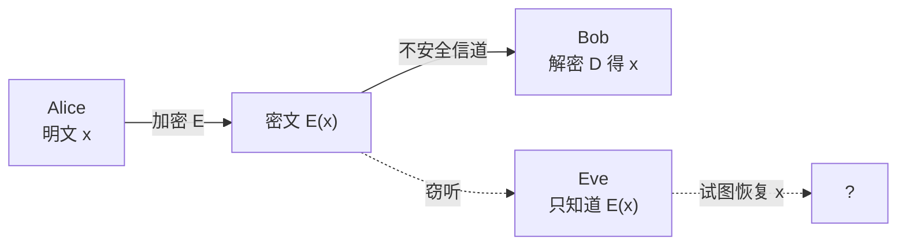
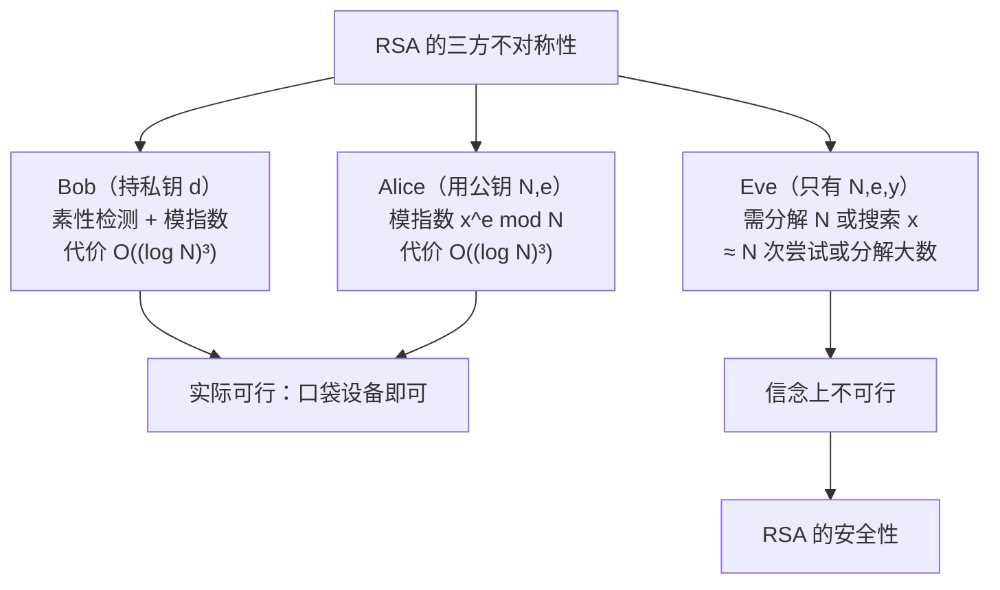
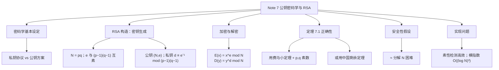

# Note 7 公钥密码学与 RSA

> 本笔记对应 CS 70《离散数学与概率论》Fall 2026 Course Notes Note 7: *Public Key Cryptography*。（原文注明：本笔记部分基于 S. Dasgupta, C. Papadimitriou, U. Vazirani 所著 *Algorithms*（McGraw-Hill, 2007）第 1.4 节。）
>
> 这是 Note 5 与 Note 6 全部工具（模运算、逆元、扩展欧几里得算法、费马小定理）的**集大成应用**：**RSA 公钥密码系统**。

---

## 1. 密码学的基本设定（Basic Setting）

**在本笔记中**，我们讨论模运算的一个非常好而且重要的应用：**RSA 公钥密码系统（RSA public-key cryptosystem）**，它以三位发明者 Ronald Rivest、Adi Shamir 与 Leonard Adleman 命名。

> 💡 **补充注释（原文脚注）**：密码学是一门古老的学科，它真正绽放出**现代形态**的时间，与信息科学/工程领域其他几场伟大革命同期发生。**现实中的密码学还牵扯到一些同样的人物**：Alan Turing 与 Claude Shannon 都在二战期间积极从事密码破译工作，而 Shannon 有一篇经典论文被视为"对保密性的信息论理解的诞生"，它与他另一篇更著名的、开创了现代信息论通信观的论文相辅相成。**密码学与通信都以令人惊讶的方式把信息、计算与随机性编织在一起。** 在 CS70 中，你只能尝到这些极其优美的领域的**一点点味道**。

### 1.1 三位角色：Alice、Bob 与 Eve

密码学的基本设定通常用三位角色来描述：

- **Alice** 与 **Bob**：希望在某条（**不安全的**）信道上进行**保密通信**；
- **Eve**：一个**窃听者（eavesdropper）**，她在旁听并试图弄清他们在说什么。

让我们假设 Alice 想把一条消息 $x$（以二进制书写）传给 Bob。她会把**加密函数 $E$** 作用于 $x$，并把加密后的消息 $E(x)$ 通过信道发送出去；**Bob 收到 $E(x)$ 后，会把他的解密函数 $D$ 作用于它**，从而恢复原始消息：

$$D(E(x)) = x$$

**由于信道不安全**，Alice 与 Bob 必须假设 Eve 可能拿到 $E(x)$。（把 Eve 想成网络上的一个"**嗅探器（sniffer）**"。）

**因此理想情况下**，我们希望确知：加密函数 $E$ 的选择方式使得**仅仅知道 $E(x)$（而不知道解密函数 $D$）无法让人发现关于原始消息 $x$ 的任何信息**。

**图意说明**：这张图刻画了密码学的基本威胁模型。**关键的不对称在于**：Bob 掌握解密函数 $D$，而 Eve 只看到密文 $E(x)$。**一切安全性论证最终都要回答同一个问题：Eve 从 $E(x)$ 能否有效地算出 $x$？**

### 1.2 私钥协议 vs 公钥方案

**几个世纪以来**，密码学都建立在此后被称为**私钥协议（private-key protocols）**的基础之上。在这种方案中，Alice 与 Bob **事先见面**，共同选择一本**秘密密码本（secret codebook）**，用它来加密他们之间今后的一切通信。（这本密码本扮演的就是上面 $E$ 与 $D$ 两个函数的角色。）**此时 Eve 唯一的希望**就是搜集一些加密消息，并利用它们**至少部分地**推断出这本密码本。

**像 RSA 这样的公钥方案（public-key schemes）**最早于 **1970 年代**发明，它们要**微妙且棘手得多**：**它们允许 Alice 在从未与 Bob 见过面的情况下给 Bob 发送消息！**

**这听起来几乎是不可能的**，因为在这种场景下 Bob 与 Eve 之间存在一种**对称性**：凭什么 Bob 在"能够理解 Alice 的消息"这件事上比 Eve 更有优势？

> **RSA 密码系统背后的核心想法是：Bob 能够实现一把"数字锁（digital lock）"，而只有他拥有这把锁的钥匙。通过把这把数字锁公之于众，他就给了 Alice（事实上也给了任何其他人）一条给他发送只有他能打开的保密消息的途径。**

### 1.3 数字锁如何实现

**下面是 RSA 方案中这把数字锁的实现方式。**

**每个人**都有一个**为全世界所知的公钥（public key）**，以及一个**只有他/她自己知道的私钥（private key）**。

当 Alice 想给 Bob 发送消息 $x$ 时，她**用 Bob 的公钥**对它进行编码。Bob 随后**用他的私钥**解密，从而取回 $x$。

**Eve 可以随意观看尽可能多发给 Bob 的加密消息，但她无法解码它们**（在本文后面解释的某些基本假设之下）。

**✅ 本节要点总结**
- 设定：Alice 与 Bob 在不安全信道上保密通信，Eve 窃听；加密 $E$、解密 $D$ 满足 $D(E(x)) = x$。
- **私钥协议**：双方必须**事先共享**秘密密码本（如一次性密码本、对称加密）。
- **公钥方案**（1970 年代起）：**无需事先见面**；核心思想是 Bob 公开一把"数字锁"，只有他持有钥匙。
- 安全目标：仅知 $E(x)$ 无法有效恢复 $x$。

---

## 2. RSA 方案的构造

**RSA 方案高度依赖模运算。**

> **⚠️ 注意（下面每一步都要留意"公开"与"保密"的分界）**

### 2.1 密钥生成

1. 令 $p$ 与 $q$ 是两个**大素数**（通常各约 **512 比特**），并令
   $$N = pq$$
2. 我们**把发给 Bob 的消息看作模 $N$ 的数**，但要**排除平凡值 $0$ 与 $1$**。（更长的消息总是可以拆成更小的片段分别发送。）
3. 令 $e$ 是**任何与 $(p-1)(q-1)$ 互素**的数。（通常把 $e$ 选成一个小值，例如 $3$。）
4. **Bob 的公钥是数对 $(N, e)$。** 这个数对**向全世界公布**。（**但要注意：$p$ 与 $q$ 并不公开；这一点至关重要，我们下面还会回到它。**）

**Bob 的私钥是什么？** 它将是数 $d$，即 **$e$ 模 $(p-1)(q-1)$ 的逆元**。（这个逆元**保证存在**，因为 $e$ 与 $(p-1)(q-1)$ 互素——依据 Note 5 的定理 5.2。）

**⚠️ 注意（为什么 $p, q$ 必须保密）**：整个 RSA 的安全性都压在"$p$ 与 $q$ 是秘密的"这一点上。一旦 Eve 知道了 $p$ 与 $q$，她就能算出 $(p-1)(q-1)$，进而用扩展欧几里得算法求出 $d$，**密码系统立即彻底失效**。因此"$N$ 公开"与"$p,q$ 保密"之间的落差，就是 RSA 的全部防线。

### 2.2 加密与解密

**现在我们可以描述加密与解密函数了：**

> **性质 2.1（加密与解密）**
> - **【加密】**：当 Alice 想把消息 $x$（假定是模 $N$ 的整数）发给 Bob 时，她计算
>   $$E(x) \equiv x^{e} \pmod N$$
>   并把它发给 Bob。
> - **【解密】**：收到值 $y = E(x)$ 后，Bob 计算
>   $$D(y) \equiv y^{d} \pmod N$$
>   它将等于原始消息 $x$。

### 2.3 一个完整的小例子

**例**：令 $p = 5$、$q = 11$、$N = pq = 55$。（实际上 $p$ 与 $q$ 会大得多。）

- 我们可以选 $e = 3$，它与 $(p-1)(q-1) = 40$ 互素；
- 因此 **Bob 的公钥是 $(55, 3)$**；
- **他的私钥是** $d \equiv 3^{-1} \pmod{40} \equiv 27$。
- 对 Alice（或其他任何人）想发给 Bob 的任何消息 $x$，**$x$ 的加密是** $y \equiv x^3 \pmod{55}$，**$y$ 的解密是** $x \equiv y^{27} \pmod{55}$。

**所以，例如**，如果消息是 $x = 13$，那么加密得到

$$y = 13^3 \equiv 52 \pmod{55}$$

而它被解密为

$$52^{27} \equiv 13 \pmod{55}$$

**逐步核对（补充说明）**：

1. **求 $d$**：$3 \cdot 27 = 81 = 2 \cdot 40 + 1$，故 $3 \cdot 27 \equiv 1 \pmod{40}$，即 $d = 27$。✓
2. **加密**：$13^2 = 169 = 3 \cdot 55 + 4 \equiv 4$；$13^3 \equiv 4 \cdot 13 = 52 \pmod{55}$。✓
3. **解密**：$52^{27} \equiv 13 \pmod{55}$。这一步手算较繁（需反复平方），**但可以不作计算而直接验证**：
   $$52^{27} \cdot 13 \equiv 13^{3 \cdot 27} \cdot 13 = 13^{81} = 13^{2 \cdot 40 + 1} = \left(13^{40}\right)^2 \cdot 13$$
   而 $13$ 与 $55$ 互素，由 Note 6 的费马小定理可得 $13^{4} \equiv 1 \pmod 5$ 与 $13^{10} \equiv 1 \pmod{11}$，于是 $13^{40} = (13^4)^{10} \equiv 1 \pmod 5$、$13^{40} = (13^{10})^{4} \equiv 1 \pmod{11}$，由中国剩余定理 $13^{40} \equiv 1 \pmod{55}$。故 $52^{27} \cdot 13 \equiv 13 \pmod{55}$，两边约去 $13$（它可逆）即得 $52^{27} \equiv 13 \pmod{55}$。✓

**⚠️ 注意（这个例子为什么不能当作真实密码系统）**：$N = 55$ 小到**用试除法一秒就能分解**。这个例子的作用只是**把 RSA 的流程走通**，毫无安全性可言。真正的 RSA 用 512 比特（乃至更大）的素数。

**✅ 本节要点总结**
- **密钥生成**：取大素数 $p, q$，$N = pq$；取 $e$ 与 $(p-1)(q-1)$ 互素（常取 $e = 3$）；$d \equiv e^{-1} \pmod{(p-1)(q-1)}$。
- **公钥** $(N, e)$ 公开；**私钥** $d$ 保密；**$p, q$ 必须保密**（否则 $d$ 立刻可算）。
- **加密** $E(x) = x^e \bmod N$；**解密** $D(y) = y^d \bmod N$。
- **消息空间**：$\{0,1,\dots,N-1\}$，**排除平凡值 $0$ 与 $1$**；长消息需分片。
- **小例子**：$p=5,q=11,N=55,e=3,d=27$；$13 \to 52 \to 13$。

---

## 3. 定理 7.1：RSA 的正确性

**我们怎么知道这个方案是可行的？** 我们需要验证 Bob 确实能恢复原始消息 $x$。**下面的定理确立了这一事实。**

> **定理 7.1**：在上面关于加密与解密函数 $E$ 与 $D$ 的定义下，对**每一个**可能的消息 $x \in \{0, 1, \dots, N-1\}$，都有
> $$D(E(x)) \equiv x \pmod N$$

**这个定理的证明用到了数论中一条标准事实，叫作费马小定理**——它告诉我们模素数时指数运算是周期的，且该周期比那个素数小 $1$；我们已在 **Note 6 的末尾**证明了它。

**有了费马小定理**，我们现在可以回过头来证明 RSA 的正确性。

### 3.1 证明（第一种：按 $p$、$q$ 分别验证）

> **证明（Proof of Theorem 7.1）**

**证明：**

**要证明这个断言，我们必须证明**

$$(x^{e})^{d} \equiv x \pmod N \quad \text{对每个 } x \in \{0,1,\dots,N-1\} \tag{1}$$

**让我们考虑指数 $ed$。** 由 $d$ 的定义，我们知道

$$ed \equiv 1 \pmod{(p-1)(q-1)}$$

因此我们可以写出

$$ed = 1 + k(p-1)(q-1)$$

其中 $k$ 是某个整数，于是

$$x^{ed} - x = x^{1 + k(p-1)(q-1)} - x = x\left(x^{k(p-1)(q-1)} - 1\right) \tag{2}$$

**回顾 (1)，我们的目标就是证明 (2) 中最后这个表达式对每个 $x$ 都等于 $0 \bmod N$。**

**现在断言：(2) 中的表达式 $x\left(x^{k(p-1)(q-1)} - 1\right)$ 能被 $p$ 整除。** 为看出这一点，我们考虑**两种情形**：

> **情形 1：$x$ 不是 $p$ 的倍数。**
> 在这种情形下，由于 $x \not\equiv 0 \pmod p$，我们可以**用费马小定理**推出 $x^{p-1} \equiv 1 \pmod p$，于是
> $$x^{k(p-1)(q-1)} = \left(x^{p-1}\right)^{k(q-1)} \equiv 1^{k(q-1)} = 1 \pmod p$$
> 因此 $x^{k(p-1)(q-1)} - 1 \equiv 0 \pmod p$，正如所要求的那样。

> **情形 2：$x$ 是 $p$ 的倍数。**
> 在这种情形下，(2) 中的表达式**以 $x$ 为因子**，因此显然能被 $p$ 整除。

**用一个完全对称的论证**，$x\left(x^{k(p-1)(q-1)} - 1\right)$ **也能被 $q$ 整除**。

**因此**，它同时能被 $p$ 与 $q$ 整除；而由于 $p$ 与 $q$ 是素数，**它必定能被它们的乘积 $pq = N$ 整除**。**但这意味着该表达式模 $N$ 等于 $0$，而这正是我们想要证明的。**

**证毕。** $\blacksquare$

**⚠️ 注意（情形划分是本证明的枢纽）**：**费马小定理要求 $x \not\equiv 0 \pmod p$**，所以在"$x$ 是 $p$ 的倍数"的情形下**不能**用它。原文的处理方式是：**换一个理由**——此时 (2) 的表达式直接含因子 $x$，被 $p$ 整除是平凡的。**这个"一分为二"是每次用费马小定理时都要做的例行检查。**

**⚠️ 注意（"$p, q$ 都是素数 $\Rightarrow$ 被 $p$、$q$ 同时整除 $\Rightarrow$ 被 $pq$ 整除"）**：这一步用的是**互素性**（两个不同素数互素）与 Note 6 的欧几里得引理。**这条推理对一般的合数不成立**——这正是定理 7.1 要求 $p, q$ 为素数的原因。

**补充说明（"$(x^{e})^{d} \equiv x$ 与 $D(E(x)) \equiv x$ 是同一件事"）**：因为 $E(x) \equiv x^e$，所以 $D(E(x)) \equiv (x^e)^d = x^{ed}$。**注意"先取模再取幂"是合法的**，依据是 Note 5 定理 5.1 关于乘法的同余保持性。

### 3.2 另一种证明（用中国剩余定理）

**定理 7.1 的另一种证明。** 用**中国剩余定理**可以得到一个密切相关的证明。

**首先注意**

$$x^{ed} = x^{k(p-1)(q-1)+1} = \left(x^{q-1}\right)^{k(p-1)} x \equiv x \pmod p$$

**这里最后的同余式**：当 $x \not\equiv 0 \pmod p$ 时由**费马小定理**给出；当 $x \equiv 0 \pmod p$ 时则**平凡地**成立。

**通过一个对称的计算**，我们同样有

$$x^{ed} \equiv x \pmod q$$

**由中国剩余定理**，满足这两个同余式的唯一解（模 $pq$）就是 $x$。

**证毕。** $\blacksquare$

**补充说明（两种证明的关系）**：第一种证明是"**显式地验证 $N \mid (x^{ed} - x)$**"；第二种是"**分别验证模 $p$ 与模 $q$ 的同余，再引用中国剩余定理断言模 $pq$ 唯一**"。两者用的是同一批工具（费马小定理 + 互素性），只是**最后一步的组织方式不同**。**第二种更简洁，也更能说明中国剩余定理为什么是 RSA 的天然语言**（$N = pq$ 的模算术"拆成"了模 $p$ 与模 $q$ 两个坐标）。

**✅ 本节要点总结**
- **定理 7.1**：$D(E(x)) \equiv x \pmod N$ 对所有 $x \in \{0,\dots,N-1\}$ 成立。
- **起点**：由 $ed \equiv 1 \pmod{(p-1)(q-1)}$ 写 $ed = 1 + k(p-1)(q-1)$，得 $x^{ed} - x = x\left(x^{k(p-1)(q-1)} - 1\right)$。
- **证明一**：对该表达式**按"$x$ 是否为 $p$ 的倍数"分类讨论**验证 $p \mid$ 它（情形 1 用费马小定理，情形 2 因含因子 $x$）；对 $q$ 对称；由 $p,q$ 素数得 $N = pq \mid$ 它。
- **证明二**：分别证 $x^{ed} \equiv x \pmod p$ 与 $\pmod q$，再用**中国剩余定理**断言模 $pq$ 的唯一解就是 $x$。
- **两处关键检查**：费马小定理要求 $p \nmid x$（否则走"平凡"分支）；"被 $p$、$q$ 同时整除 $\Rightarrow$ 被 $pq$ 整除"依赖 $p,q$ 互素。

---

## 4. 安全性：RSA 为什么是安全的？

**我们已经看到 RSA 协议是正确的**，意思是 Alice 能够以某种方式加密消息，使 Bob 能可靠地再次解密它们。

**但我们怎么知道它是安全的**，即 Eve 无法通过观察加密消息获得任何有用信息？

> **RSA 的安全性取决于下面这条基本假设（basic assumption）：**
>
> **给定 $N$、$e$ 与 $y \equiv x^{e} \pmod N$，不存在确定 $x$ 的高效算法。**

### 4.1 这条假设为什么是合理的

**这条假设相当可信。Eve 可能怎样尝试猜出 $x$ 呢？**

- **攻击方式一：暴力搜索。** 她可以对 $x$ 的所有可能取值做试验，每次都检查是否 $x^{e} \equiv y \pmod N$；**但她将不得不尝试大约 $N$ 个 $x$ 的取值，而如果 $N$ 是一个（比如说）512 比特的数，那完全不现实。**
- **攻击方式二：分解 $N$。** 她也可以尝试**分解 $N$** 以取回 $p$ 与 $q$，然后通过计算 $e$ 模 $(p-1)(q-1)$ 的逆元来求出 $d$；**但这种方式要求 Eve 能够把 $N$ 分解为它的素因子，而这个问题被认为对大的 $N$ 无法高效求解。**

**我们应该指出：RSA 的安全性尚未被形式化地证明**：它建立在两条假设之上——**攻破 RSA 本质上等价于分解 $N$**，以及**分解是困难的**。

**⚠️ 注意（安全性论证的"假设链"要数清楚）**：请把这段话读成一条明确的依赖链：

$$\text{RSA 安全} \;\Longleftarrow\; \text{分解 } N \text{ 困难} \;+\; \text{攻破 RSA 等价于分解 } N$$

**这两条都是"信念"，不是定理。** 任何一条被推翻（例如量子计算机上的 Shor 算法就能高效分解），RSA 就失效。**这与定理 7.1（那是被严格证明的）性质完全不同**——请务必区分"已证明的正确性"与"基于假设的安全性"。

### 4.2 实现问题（Implementation Issues）

**我们用简短讨论 RSA 的实现问题来结束本笔记。**

既然我们已经论证"攻破 RSA 是不可能的，因为分解要花非常长的时间"，**我们就应当检查一下 Alice 与 Bob 自己必须进行的计算要简单得多、可以高效完成**。

**Alice 与 Bob 真正只需做两件非平凡的事：**

1. **Bob 必须找出素数 $p$ 与 $q$，各有许多（比如说 512）比特；**
2. **Alice 与 Bob 都必须计算模 $N$ 的指数。**（Alice 需计算 $x^{e} \pmod N$，Bob 需计算 $y^{d} \pmod N$。）

**我们依次简要讨论这两件事的实现。**

#### 4.2.1 找大素数

**为找出大素数**，我们利用这样一个事实：**给定一个正整数 $n$，存在一个高效算法判定 $n$ 是否为素数**。

（**这里的"高效"是指运行时间为 $O((\log n)^k)$（对某个小的 $k$）**，也就是 $n$ 的**比特数的低次幂**。）

> **⚠️ 注意（原文强调的对比）**：**这里与分解问题形成戏剧性的对比**——**我们能高效判断 $n$ 是否为素数，但在 $n$ 不是素数时却无法高效找出它的因子。RSA 的成功关键地取决于这一区别。**

**既然我们能做素性检测**，Bob 只需生成一些**位数正确的随机整数 $n$**，并不断检测它们，直到找到两个素数 $p$ 与 $q$。

**这样做可行的原因**是下面这条数论基本事实（其证明超出本课程范围），**它说相当大比例的正整数是素数**：

> **定理 7.2（素数定理，Prime Number Theorem）**：令 $\pi(n)$ 表示**不超过 $n$ 的素数个数**。则对所有 $n \geq 17$，有
> $$\pi(n) \geq \frac{n}{\ln n}$$
> （事实上，还有 $\displaystyle\lim_{n\to\infty} \frac{\pi(n)}{n/\ln n} = 1$。）

**例如取 $n = 2^{512}$**，素数定理说**在全部 512 位整数中大约每 355 个就有一个是素数**。**因此**，如果我们不断随机挑选 512 位数并检测它们，我们**期望只需尝试大约 355 个数**就能找到一个素数。

**补充说明（355 这个数是怎么来的）**：在 $2^{512}$ 附近，"相邻素数之间的平均间隔"约为 $\ln(2^{512}) = 512 \ln 2 \approx 512 \times 0.693 \approx 355$。**这就是"每 355 个里有一个素数"的来源**——由此也看出，**位数越多，找素数越慢（但只慢对数级）**。

#### 4.2.2 模指数运算

**我们现在转向上面第二件事：模指数运算。**

**这其实是我们已经在上一讲笔记中讨论过的东西。** 回忆那一讲：我们可以用**反复平方法（repeated squaring）**计算指数表达式 $x^{y} \pmod N$，所用的乘法次数只有 $O(n)$，其中 $n$ 是 $y$ 的**比特数**（即 $y$ 的二进制表示的**长度**）。

**由于在 RSA 应用中**，Alice 与 Bob 需要计算的表达式的指数（分别是 $e$ 与 $d$）**都小于 $N$**，所需乘法次数是 $O(\log N)$（因为 $N$ 的比特数是 $O(\log N)$）。

**此外**，由于所有乘法都是在模 $N$ 下进行的，我们可以保证**所有计算涉及的数都至多含 $O(\log N)$ 个比特**；而众所周知（从小学的长乘法可知），**两个 $m$ 比特数相乘需要 $O(m^2)$ 次运算**（实际上还可以做得更快：见 CS170）。

**因此**，Alice 与 Bob 的指数运算的**总代价只有 $O((\log N)^3)$**。

**于是**，在 RSA 的实际实现中**完全可以使用非常大的数（具有数百个比特）**。

**逐步核对这个 $O((\log N)^3)$ 是怎么来的（补充说明）**：

1. **反复平方法的乘法次数** $= O(\text{$y$ 的比特数}) = O(\log N)$（因为 $y = e$ 或 $d$ 都小于 $N$）；
2. **每次乘法**是两个至多 $O(\log N)$ 比特的数相乘，代价 $O\left((\log N)^2\right)$；
3. **总代价** $= O(\log N) \times O\left((\log N)^2\right) = O\left((\log N)^3\right)$。

**⚠️ 注意**：这个分析属于"**比特级代价模型**"，与 Note 5 中"每次算术运算算常数时间"的粗略模型不同。**两种模型的差别正是"$O(n)$ 次运算"与"$O((\log N)^3)$ 次比特操作"的差别**——它们并不矛盾，只是计费方式不同。

### 4.3 总结：不对称性

**总结一下**：在 RSA 协议中，**Bob 只需执行乘法、指数运算与素性检测这类简单计算**就能实现他的数字锁。**同样地**，Alice 与 Bob 只需执行简单计算就能分别加密与解密消息——**这些操作任何口袋计算设备都能处理**。

**相比之下**，要在没有钥匙的情况下打开消息，**Eve 就必须执行诸如分解大数之类的运算**；而（至少按照广泛接受的信念）**这需要的计算能力超过全世界最精密计算机的总和！**

**这种"无需私钥即可保证安全"的令人信服的保证，解释了为什么 RSA 密码系统是密码学中如此革命性的进展。**

**图意说明**：这张图把 RSA 的安全性归结为一条**计算代价的不对称**：合法用户的计算是 $(\log N)$ 的多项式级，而攻击者的计算被认为需要 $N$ 的量级（或等价于分解 $N$）。**注意"被认为"三个字**——这正是 RSA 安全性只是"假设"而非"定理"的原因。

**✅ 本节要点总结**
- **安全性假设**：给定 $N, e, y \equiv x^e \pmod N$，不存在高效算法确定 $x$。
- **两种攻击思路**：① 暴力搜索约 $N$ 个 $x$；② **分解 $N$** 得 $p,q$ 后求 $d$。
- **⚠️ 安全性未经证明**：它依赖"攻破 RSA $\approx$ 分解 $N$"与"分解困难"这两条信念。
- **素性检测 vs 分解**：**判断 $n$ 是否为素数可以高效完成**（$O((\log n)^k)$），**但分解合数被认为困难**——RSA 的成功关键取决于这一区别。
- **找素数**：素数定理 $\pi(n) \geq n/\ln n$ 表明约每 $\ln n$ 个数有一个素数；$n = 2^{512}$ 时约每 **355** 个有一个。
- **模指数**：反复平方法 $O(\log N)$ 次乘法，每次 $O((\log N)^2)$，总共 **$O((\log N)^3)$**。
- **不对称性**：合法用户做多项式时间计算，攻击者需要超多项式资源。

---

## 5. 全篇总结

**RSA 全流程速查表**

| 步骤 | 谁做 | 内容 | 依据 |
| :--- | :--- | :--- | :--- |
| 选素数 | Bob | 取 512 比特素数 $p, q$ | 素性检测高效 + 素数定理 |
| 算模数 | Bob | $N = pq$ | — |
| 选公钥指数 | Bob | $e$ 与 $(p-1)(q-1)$ 互素（常取 $3$） | — |
| **公开** | Bob | $(N, e)$ | — |
| 算私钥 | Bob | $d \equiv e^{-1} \pmod{(p-1)(q-1)}$ | 扩展欧几里得算法（Note 6） |
| 加密 | Alice | $y \equiv x^e \pmod N$ | 反复平方法（Note 5） |
| 解密 | Bob | $x \equiv y^d \pmod N$ | — |
| **正确性** | — | $x^{ed} \equiv x \pmod N$ | 费马小定理（Note 6）+ $p,q$ 素数（或中国剩余定理） |
| **安全性** | — | 由 $N,e,y$ 求 $x$ 无高效算法 | **假设**：分解 $N$ 困难 |
| **保密项** | — | $p,\ q,\ d$（以及 $\varphi = (p-1)(q-1)$） | 泄露任一即失效 |

**历史与意义的收束**：RSA 是"**用数学结构换取信任**"的典范——不需要事先共享密钥，不需要秘密信道来传递密钥，一个人只要公开自己的**数字锁**（公钥），世界上任何人都能给他发保密消息。**支撑这一切的，只是 Note 5 与 Note 6 里那几件看似朴素的小工具：模运算、逆元、扩展欧几里得算法与费马小定理。**
