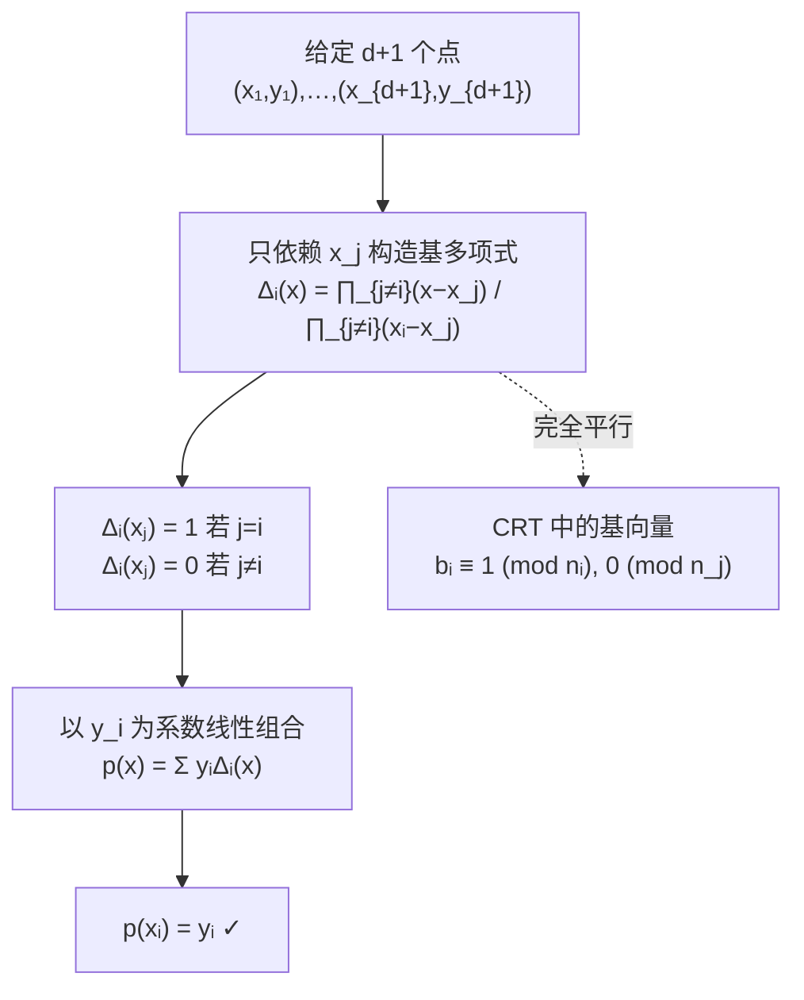
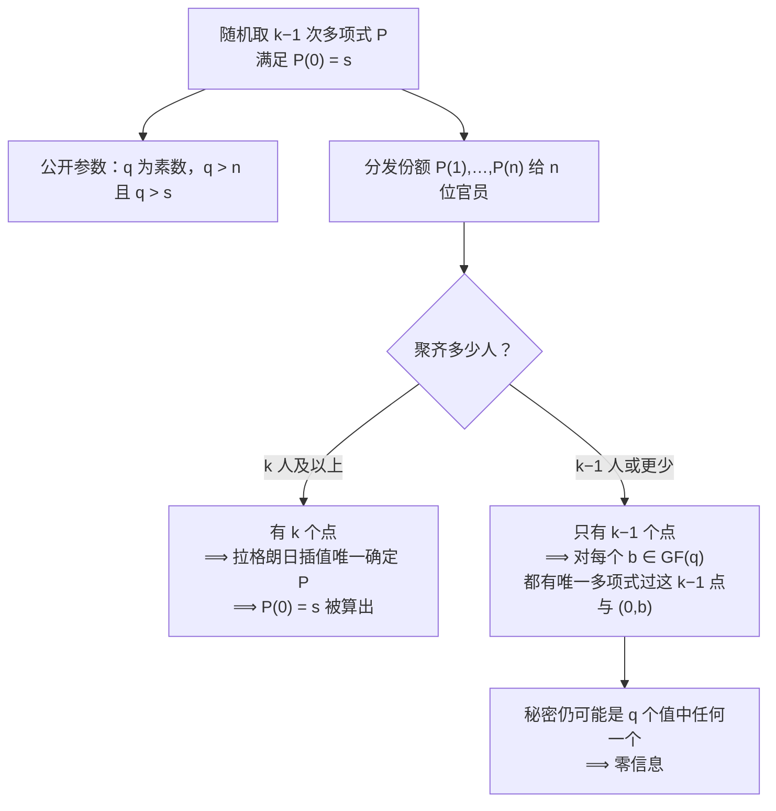
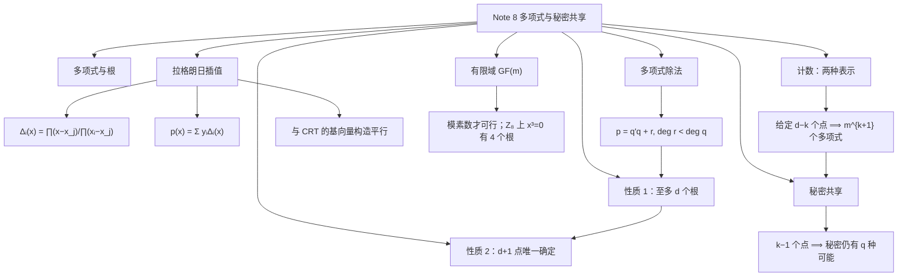

# Note 8 多项式、拉格朗日插值、有限域与秘密共享

> 本笔记对应 CS 70《离散数学与概率论》Fall 2026 Course Notes Note 8（第 1–5 节）。前面几讲都在做"数"的算术；从本讲开始我们处理**多项式**。多项式是一类**既容易描述、又用途极广**的函数。**关键想法是：把你在实数与复数上已经知道的多项式性质，推广到模运算上。**

---

## 1. 多项式（Polynomials）

**多项式构成了一类丰富的函数**，它们既易于描述，又广泛适用于从**傅里叶分析、密码学与通信**，到**控制论与计算几何**的诸多主题。在本笔记中，我们将讨论多项式的若干进一步性质——正是这些性质让它们如此有用。

**这里的关键想法**，是把你已经知道的**实数与复数上的多项式**推广到**模运算**。然后我们将描述如何利用这些性质来设计一个**秘密共享（secret-sharing）方案**。

### 1.1 基本定义

**回忆一下中学数学**：一元**多项式（polynomial）**是形如

$$p(x) = a_d x^{d} + a_{d-1} x^{d-1} + \cdots + a_1 x + a_0$$

的表达式。这里变量 $x$ 与系数 $a_i$ 通常是**实数**。

**例**：$p(x) = 5x^3 + 2x + 1$ 是一个**次数（degree）**为 $d = 3$ 的多项式。它的系数是

$$a_3 = 5, \quad a_2 = 0, \quad a_1 = 2, \quad a_0 = 1$$

多项式有一些**极其简单、优雅且强大**的性质，我们将在本笔记中探讨。

**多项式表示一个函数**，可以用加法与乘法以自然的方式求值。例如 $p(x) = 5x^3 + 2x + 1$ 可以在 $x = 3$ 处求值，得到

$$p(3) = 5(3^3) + 2(3) + 1 = 142$$

**⚠️ 注意（"零系数也不能省"）**：这个例子里 $a_2 = 0$，但它在**系数表示**中占据关键位置。写 $p(x) = 5x^3 + 2x + 1$ 时，$x^2$ 项是**存在但系数为零**——**判断次数必须看最高次非零系数**，而"一个次数不超过 $d$ 的多项式有 $d+1$ 个系数"这句话里，$a_2 = 0$ 依然算一个系数。

### 1.2 根（Roots）

> **定义（根）**：我们说 $a$ 是多项式 $p(x)$ 的一个**根（root）**，如果 $p(a) = 0$。

**例**：次数为 $2$ 的多项式 $p(x) = x^2 - 4$ 有两个根，即 $2$ 与 $-2$，因为 $p(2) = p(-2) = 0$。

**如果我们在 $x$-$y$ 平面上画出多项式 $p(x)$**，那么多项式的**根就是曲线穿过 $x$ 轴的那些位置**。

**补充说明（原文配图的含义）**：原文在此处给出了一幅 $p(x) = x^2 - 4$ 的图像：一条开口向上的抛物线，纵轴刻度为 $4, 2, -2, -4$，横轴刻度为 $-4, -2, 2, 4$。曲线在 $x = -2$ 与 $x = 2$ 处**穿过 $x$ 轴**（这两点就是两个根），顶点在 $(0, -4)$。**这张图要传达的核心信息是：根的个数（$2$ 个）等于次数（$2$），不超过它。**

### 1.3 两条基本性质

**我们现在陈述两条基本的多项式性质，它们将在适当的时候被证明。**

> **性质 1**：一个**非零**的 $d$ 次多项式**至多有 $d$ 个根**。

> **性质 2**：给定 $d+1$ 对数对 $(x_1, y_1), \dots, (x_{d+1}, y_{d+1})$，其中所有 $x_i$ **互不相同**，则**存在唯一**的次数**至多**为 $d$ 的多项式 $p(x)$，使得
> $$p(x_i) = y_i \quad (1 \leq i \leq d+1)$$

### 1.4 $d = 1$ 的情形：直线

**让我们看看这两条性质在 $d = 1$ 时说的是什么。**

在实数上，一个**线性（次数为 $1$）多项式** $y = a_1 x + a_0$ 的图像是一条**直线**。

- **性质 1** 说：如果一条直线**不是 $x$ 轴**（即如果这个多项式不是 $y = 0$），那么它**至多与 $x$ 轴相交于一点**。
- **性质 2** 说：**两点唯一确定一条直线**。

**补充说明（原文配图的含义）**：原文此处配有一幅坐标图（横轴 $0$ 到 $4$，纵轴 $0$ 到 $4$），画出穿过两点的唯一直线。**这张图要传达的是性质 2 的几何图像：给定两个不同的横坐标，只有一条直线同时穿过这两个点。**

**⚠️ 注意（性质 1 中"非零"二字不能省）**：若 $p(x) \equiv 0$（零多项式），那么**每个** $a$ 都是它的根——根有无穷多个，它不受"至多 $d$ 个根"的约束。**所以性质 1 必须限定"非零多项式"。** 这一点在后面证明唯一性时会精确地用到。

**✅ 本节要点总结**
- **多项式**：$p(x) = a_dx^d + \cdots + a_1x + a_0$；次数 $d$ 由**最高次非零系数**决定；"次数 $\le d$"蕴含 $d+1$ 个系数。
- **根**：满足 $p(a) = 0$ 的 $a$；几何上对应曲线与 $x$ 轴的交点。
- **性质 1**：非零 $d$ 次多项式**至多 $d$ 个根**（零多项式除外）。
- **性质 2**：$d+1$ 个横坐标互异的点**唯一确定**一个次数 $\le d$ 的多项式。
- $d = 1$：性质 1 = 直线至多交 $x$ 轴一点；性质 2 = 两点确定一条直线。

---

## 2. 多项式插值（Polynomial Interpolation）

**性质 2 说的是**：两点唯一确定一个 $1$ 次多项式（一条直线），三点唯一确定一个 $2$ 次多项式（抛物线），四点唯一确定一个 $3$ 次多项式（三次曲线），依此类推。

**给定 $d+1$ 对数对 $(x_1,y_1), \dots, (x_{d+1},y_{d+1})$**，我们如何确定多项式 $p(x) = a_dx^d + \cdots + a_1x + a_0$ 使得 $p(x_i) = y_i$（$1 \leq i \leq d+1$）？

**我们将给出一个重建系数 $a_0, \dots, a_d$（从而重建多项式 $p(x)$）的算法。**（另一种更明显地属于**线性代数**的标准算法将在**下一讲**描述，因为它在另一个应用中会很有用。）

### 2.1 先解一个更容易的问题

这里的方法叫作**拉格朗日插值（Lagrange interpolation）**，它应当让你想起**中国剩余定理**。

**让我们从解一个更容易的问题开始。** 假设有人告诉我们 $y_1 = 1$，并且对 $2 \leq j \leq d+1$ 有 $y_j = 0$。**现在我们能重建 $p(x)$ 吗？**

**能，这很容易！** 考虑

$$q(x) = (x - x_2)(x - x_3)\cdots(x - x_{d+1})$$

这是一个 $d$ 次多项式（$x_i$ 都是常数，而 $x$ 出现了 $d$ 次）。**而且**我们显然有 $q(x_j) = 0$（对 $2 \leq j \leq d+1$）。

**但 $q(x_1)$ 是什么呢？** 我们有

$$q(x_1) = (x_1 - x_2)(x_1 - x_3)\cdots(x_1 - x_{d+1})$$

它是某个**不为 $0$ 的常数**（因为 $x_1$ 不等于任何其他 $x_i$）。

**因此**，如果我们令

$$p(x) = \frac{q(x)}{q(x_1)}$$

（**可以做除法**，因为 $q(x_1) \neq 0$），我们就得到了想要的多项式。

**例**：假设给你数对 $(1,1)$、$(2,0)$、$(3,0)$。那么我们可以通过令

$$q(x) = (x-2)(x-3) = x^2 - 5x + 6, \qquad q(x_1) = q(1) = 2$$

来构造 $d = 2$ 次多项式 $p(x)$。于是我们可以构造

$$p(x) = \frac{q(x)}{q(x_1)} = \frac{x^2 - 5x + 6}{2}$$

**⚠️ 注意（"除以 $q(x_1)$"是什么意思）**：在模运算中，"除以 $q(x_1)$"实际上是**乘以 $q(x_1)$ 的模逆元**。这正是为什么我们**必须工作在域上**（见第 3 节）：在 $\mathrm{GF}(m)$ 中，只要 $q(x_1) \not\equiv 0 \pmod m$ 且 $m$ 是素数，逆元就存在。**在整数上做这件事是不行的**——比如上面这个例子里 $q(1) = 2$，但若换成 $q(1) = 3$ 而模数是 $6$，除法就无从下手了。

### 2.2 基多项式 $\Delta_i(x)$

**当然**，如果我们不是挑出下标 $1$、而是挑出某个任意的下标 $i$，问题也一样不难：即 $y_i = 1$，而对 $j \neq i$ 有 $y_j = 0$。

**让我们引入一些记号**：把穿过这 $d+1$ 个点的 $d$ 次多项式记作 $\Delta_i(x)$。那么

$$\Delta_i(x) = \frac{\prod_{j \neq i}(x - x_j)}{\prod_{j \neq i}(x_i - x_j)}$$

**⚠️ 注意（分子分母的对称性）**：分子的每个因子是 $(x - x_j)$，分母把 $x$ 换成 $x_i$。**分母恰好是把分子在 $x = x_i$ 处求值的结果**，所以分母 $= \prod_{j\neq i}(x_i - x_j)$ 正是我们上面例子里 $q(x_1)$ 的角色。**记住这个结构，就不必背公式。**

### 2.3 回到原问题

**我们现在回到原来的问题。** 给定 $d+1$ 个数对 $(x_1,y_1), \dots, (x_{d+1},y_{d+1})$，我们先按上面的描述构造这 $d+1$ 个多项式 $\Delta_1(x), \dots, \Delta_{d+1}(x)$。

**现在我们断言可以写成**

$$p(x) = \sum_{i=1}^{d+1} y_i \Delta_i(x)$$

**为什么这是对的？**

1. **首先注意 $p(x)$ 是一个 $d$ 次多项式，正如要求的那样**，因为它是 $d$ 次多项式之和（次数不会因相加而升高）。
2. **并且当它在 $x_i$ 处求值时**，和式里的 $d$ 项求值为 $0$，而**第 $i$ 项求值为 $y_i$ 乘以 $1$**，正如要求的那样。

**补充说明（$\Delta_i$ 的"筛选"性质）**：由定义立即可得

$$\Delta_i(x_j) = \begin{cases} 1, & j = i\\ 0, & j \neq i\end{cases}$$

**这就是关键**：把 $p$ 在 $x_i$ 处求值时，只有 $i$ 那一项"活下来"，贡献恰好 $y_i$。**这个性质与 Note 6 中国剩余定理中的"基向量"完全平行。**

### 2.4 "自然基"与 CRT 的类比

**在上面这个构造中**，我们可以把多项式 $\Delta_i(x)$ 看成"所有在点集 $\{x_j\}$ 上取值被指定的多项式"的一个**"自然基（natural basis）"**。

**注意这些基多项式只依赖于 $x_j$，而不依赖于这些点上的值 $y_j$。** 然后我们**以值 $y_i$ 为系数**把这些基多项式 $\Delta_i$ 求和，构造出想要的多项式 $p(x)$。

**注意这里与我们在中国剩余定理的证明中所用的构造的相似之处**：**"基"多项式 $\Delta_i(x)$ 扮演的角色，与 CRT 中"基"数 $u_i$ 的角色是类似的。**

**图意说明**：这张图把拉格朗日插值的逻辑与 Note 6 的中国剩余定理并列。**两者的共同结构是**："先造一组**只依赖位置**的基（与要填的值无关），再用目标值作系数线性组合"。理解了其中一个，就理解了另一个。

### 2.5 一个完整的例子

**作为一个例子**，假设我们想找出穿过三个点

$$(x_1, y_1) = (1,1), \qquad (x_2, y_2) = (2,2), \qquad (x_3, y_3) = (3,4)$$

的 $2$ 次多项式 $p(x)$。三个多项式 $\Delta_i$ 如下：

$$
\begin{aligned}
\Delta_1(x) &= \frac{(x-2)(x-3)}{(1-2)(1-3)} = \frac{(x-2)(x-3)}{2} = \frac{1}{2}x^2 - \frac{5}{2}x + 3\\[4pt]
\Delta_2(x) &= \frac{(x-1)(x-3)}{(2-1)(2-3)} = \frac{(x-1)(x-3)}{-1} = -x^2 + 4x - 3\\[4pt]
\Delta_3(x) &= \frac{(x-1)(x-2)}{(3-1)(3-2)} = \frac{(x-1)(x-2)}{2} = \frac{1}{2}x^2 - \frac{3}{2}x + 1
\end{aligned}
$$

**因此多项式 $p(x)$ 由下式给出：**

$$p(x) = 1 \cdot \Delta_1(x) + 2 \cdot \Delta_2(x) + 4 \cdot \Delta_3(x) = \frac{1}{2}x^2 - \frac{1}{2}x + 1$$

**你应当验证这个多项式确实穿过上面这三个点。**

**补充说明（逐点验证）**：

- $p(1) = \frac12 - \frac12 + 1 = 1$ ✓
- $p(2) = \frac12 \cdot 4 - \frac12 \cdot 2 + 1 = 2 - 1 + 1 = 2$ ✓
- $p(3) = \frac12 \cdot 9 - \frac12 \cdot 3 + 1 = \frac{9}{2} - \frac{3}{2} + 1 = 3 + 1 = 4$ ✓

**注意这里 $\frac12 x^2 - \frac12 x + 1 = \frac{x(x-1)}{2} + 1$**，在整数 $x$ 上恰好给出整数——**一个漂亮的巧合，但请勿因此以为"系数是分数"有问题**。在有限域中，$\frac12$ 就是 $2^{-1}$。

### 2.6 性质 2 的证明

**我们现在有条件证明前面陈述的性质 2 了**，即：

> **性质 2**：给定 $d+1$ 个数对 $(x_1,y_1), \dots, (x_{d+1},y_{d+1})$，其中所有 $x_i$ 互不相同，则存在唯一的次数至多为 $d$ 的多项式 $p(x)$ 使得 $p(x_i) = y_i$（$1 \leq i \leq d+1$）。

> **证明（Proof of Property 2）**

**证明：**

**第一部分（存在性）**：我们在上面已经展示了如何找出一个多项式 $p(x)$ 使得 $p(x_i) = y_i$（对 $d+1$ 个数对）。**这证明了性质 2 的一部分——多项式的存在性。**

**第二部分（唯一性）**：我们如何证明第二部分，即**多项式是唯一的**？

**反设**存在另一个多项式 $q(x)$ 使得对上面所有 $d+1$ 个数对都有 $q(x_i) = y_i$。

**现在考虑多项式**

$$r(x) = p(x) - q(x)$$

**由于我们假设 $q(x)$ 与 $p(x)$ 是不同的多项式，$r(x)$ 必定是一个非零的、次数至多为 $d$ 的多项式。** 因此，**性质 1**（将在下文证明）蕴含它**至多有 $d$ 个根**。

**但另一方面**，在 $d+1$ 个互不相同的点 $x_i$ 上都有

$$r(x_i) = p(x_i) - q(x_i) = 0$$

**所以 $r(x)$ 至少有 $d+1$ 个根。矛盾。**

**因此，$p(x)$ 是穿过这 $d+1$ 个点的唯一多项式。**

**证毕。** $\blacksquare$

**⚠️ 注意（为什么必须说 $r$ 非零）**：性质 1 只对**非零**多项式成立。这里"$p \neq q$"这一假设正是为了保证 $r \neq 0$；如果 $r \equiv 0$，那 $p = q$，本来就没有矛盾可言。**这个"反设 $p\neq q$，得 $r \neq 0$，再由性质 1 得根数 $\le d$，却又有 $d+1$ 个根"的三步结构，是数学中证明唯一性的标准套路。**

**⚠️ 注意（性质 2 与性质 1 的依赖顺序）**：性质 2 的唯一性**依赖**性质 1。因此下面必须先证性质 1，而性质 1 又要用到多项式除法。**原文的编排顺序（先给出两条性质、再补证明）是有意的：先建立直觉，再补技术细节。**

**✅ 本节要点总结**
- **拉格朗日插值的两步**：① 对每个 $i$ 造基多项式 $\Delta_i(x)$，它在 $x_i$ 处为 $1$、在其他 $x_j$ 处为 $0$；② 用 $y_i$ 作系数线性组合：$p(x) = \sum_i y_i\Delta_i(x)$。
- **$\Delta_i$ 公式**：$\Delta_i(x) = \dfrac{\prod_{j\neq i}(x-x_j)}{\prod_{j\neq i}(x_i-x_j)}$；分母就是分子在 $x_i$ 处求值。
- **基只依赖 $x_j$，不依赖 $y_j$**——与 CRT 的基向量构造完全平行。
- **例**：$(1,1),(2,2),(3,4)$ 插值得 $p(x) = \frac12x^2 - \frac12x + 1$。
- **性质 2 的存在性**由插值构造给出；**唯一性**由"反设 $p \neq q$ $\Rightarrow$ $r = p-q$ 非零但根数 $> d$"推出，**依赖性质 1**。
- 在模运算中"除以 $q(x_1)$"必须理解为**乘以模逆元**，因此需要工作在**域**上。

---

## 3. 多项式除法与性质 1 的证明

### 3.1 多项式除法（Polynomial Division）

**让我们先做一段简短的插叙**，讨论多项式除法——它在性质 1 的证明中会很有用。

**如果我们有一个 $d$ 次多项式 $p(x)$**，我们可以用**长除法**除以一个次数 $\leq d$ 的多项式 $q(x)$。结果将是

$$p(x) = q'(x)q(x) + r(x)$$

其中 $q'(x)$ 是**商（quotient）**、$r(x)$ 是**余式（remainder）**。**$r(x)$ 的次数必须小于 $q(x)$ 的次数。**

**我们可以用多项式的长除法计算商与余式**，如下例所示。

> **例**：我们希望用 $q(x) = x - 1$ 除 $p(x) = x^3 + x^2 - 1$。

**逐步过程**：

1. **先减去因子 $x^2(x-1)$**，写出
   $$p(x) = x^2(x-1) + (2x^2 - 1)$$
   （依据：$x^2(x-1) = x^3 - x^2$，而 $p(x) - (x^3 - x^2) = 2x^2 - 1$。）
2. **再减去因子 $2x(x-1)$**，把余式写成
   $$2x^2 - 1 = 2x(x-1) + (2x - 1)$$
3. **再减去因子 $2(x-1)$**，把余式写成
   $$2x - 1 = 2(x-1) + 1$$
4. **最后把上面三行合在一起**，我们得到
   $$p(x) = (x^2 + 2x + 2)(x-1) + 1$$

**用你可能熟悉的记号写出来：**

$$
\begin{array}{rrrr}
& x^2 & +2x & +2\\
\hline
x-1 \;\big)\; & x^3 & +x^2 & +0x & -1\\
& -(x^3 & -x^2) & & \\
\hline
& & 2x^2 & & \\
& & -(2x^2 & -2x) & \\
\hline
& & & 2x & -1\\
& & & -(2x & -2)\\
\hline
& & & & 1
\end{array}
$$

**因此，商是 $q'(x) = x^2 + 2x + 2$，余式是 $r(x) = 1$。**

**⚠️ 注意（长除法在模运算中同样可用）**：多项式长除法只用加法、乘法与"除以首项系数"三种操作。**只要首项系数可逆，长除法就能在 $\mathrm{GF}(m)$ 中进行**（$m$ 素数时一切非零元可逆）。这是第 4 节"有限域上性质 1、2 仍成立"的关键技术前提。

### 3.2 性质 1 的证明

**现在让我们证明性质 1**，我们把它从前面重述一遍：

> **性质 1**：一个非零的 $d$ 次多项式**至多有 $d$ 个根**。

**证明的想法如下。我们将证明下面两个断言：**

> **断言 1**：如果 $a$ 是一个 $d \geq 1$ 次多项式 $p(x)$ 的根，那么 $p(x) = (x-a)q(x)$，其中 $q(x)$ 是一个 $d-1$ 次多项式。

> **断言 2**：一个具有互异根 $a_1, \dots, a_d$ 的 $d$ 次多项式 $p(x)$ 可以写成
> $$p(x) = c(x-a_1)\cdots(x-a_d)$$
> 其中 $c$ 是一个实数。

**注意断言 2 立即蕴含性质 1**：我们只需说明 $a \neq a_i$（$i = 1, \dots, d$）的 $a$ **不可能是** $p(x)$ 的根。**但这由断言 2 立即得到**，因为

$$p(a) = c(a-a_1)\cdots(a-a_d) \neq 0$$

（每个因子 $a - a_i \neq 0$，$c \neq 0$，故乘积非零。）**所以一个 $d$ 次非零多项式最多只有 $d$ 个根。**

#### 3.2.1 断言 1 的证明

> **证明（Proof of Claim 1）**

**证明：用 $(x-a)$ 除 $p(x)$ 得到**

$$p(x) = (x-a)q(x) + r(x)$$

其中 $q(x)$ 是商（次数为 $d-1$）、$r(x)$ 是余式。

**$r(x)$ 的次数必然小于除数 $(x-a)$ 的次数**（这是多项式除法的性质）。**因此 $r(x)$ 的次数必须是 $0$，也就是说它是某个常数 $c$。**

**但现在令 $x = a$**，我们得到 $p(a) = c$。**而由于 $a$ 是根，$p(a) = 0$。** 因此 $c = 0$，于是

$$p(x) = (x-a)q(x)$$

**证毕。** $\blacksquare$

**⚠️ 注意（这一步的"信息量"在哪里）**：把除法的余式**在 $x = a$ 处求值**，就把它"钉死"成了 $p(a)$。**这是整条论证的枢纽**——它把"$a$ 是根"这个条件精确地转译成了"余式为零"。这个结论通常称为**因式定理（factor theorem）**。

#### 3.2.2 断言 2 的证明

> **证明（Proof of Claim 2）**

**证明：对 $d$ 作归纳。**

- **基础情形 $\boldsymbol{d = 0}$**：如果 $p(x)$ 是一个 $0$ 次多项式，那么它就是一个常数 $c$，因此它可以平凡地写成所要求的形式。
- **归纳假设**：对某个 $d \geq 0$，任何具有互异根 $a_1, \dots, a_d$ 的 $d$ 次多项式都可以写成
  $$p(x) = c(x-a_1)\cdots(x-a_d)$$
- **归纳步**：令 $p(x)$ 是一个具有互异根 $a_1, \dots, a_{d+1}$ 的 $d+1$ 次多项式。

  **由断言 1**，$p(x) = (x - a_{d+1})q(x)$，其中 $q(x)$ 是某个 $d$ 次多项式。

  **由于对一切 $i \neq d+1$ 有**
  $$0 = p(a_i) = (a_i - a_{d+1})q(a_i)$$
  **并且 $a_i - a_{d+1} \neq 0$**（根互异），所以必须有 $q(a_i) = 0$。

  **因此 $q(x)$ 是一个具有互异根 $a_1, \dots, a_d$ 的 $d$ 次多项式。** 我们现在可以对 $q(x)$ 应用归纳假设，写成
  $$q(x) = c(x-a_1)\cdots(x-a_d)$$

  **把它代入 $p(x) = (x-a_{d+1})q(x)$**，我们得到
  $$p(x) = c(x-a_1)\cdots(x-a_{d+1})$$
  正如所愿。

**证毕。** $\blacksquare$

**✅ 本节要点总结**
- **多项式除法**：$p(x) = q'(x)q(x) + r(x)$，$\deg r < \deg q$；长除法在模运算中同样可用（只要首项系数可逆）。
- **例**：$x^3 + x^2 - 1$ 除以 $x-1$ 得商 $x^2+2x+2$、余 $1$；即 $p(x) = (x^2+2x+2)(x-1)+1$。
- **性质 1 的证明路线**：断言 1（因式定理）$+$ 断言 2（因式分解）$\Rightarrow$ 性质 1。
- **断言 1**：$a$ 是根 $\Rightarrow$ $p(x) = (x-a)q(x)$；关键是把余式在 $x=a$ 处求值，得 $r(a) = p(a) = 0$ 故 $r \equiv 0$。
- **断言 2**：对 $d$ 作**归纳**；用断言 1 提出 $(x-a_{d+1})$，再用"根互异 $\Rightarrow a_i - a_{d+1}\neq 0$"把根传给 $q$。

---

## 4. 有限域（Finite Fields）

**性质 1 与性质 2 在系数与变量 $x$ 取自复数、乃至有理数（而非实数）时也成立。**

**然而，如果取值被限制为自然数或整数，这些证明就行不通了。** 让我们更仔细地理解这些事实。

**我们在多项式插值以及性质 1、2 的证明中所用到的数的唯一性质是**：**只要不做除以 $0$ 的运算，我们可以对任何一对数做加、减、乘、除。**

（**你应当回头检查这一论断！**）**因此**，一切在**复数**与**有理数**上同样成立。

**另一方面**，我们**无法**保证两个自然数相减的结果仍是自然数，而两个整数相除一般也不产生整数，**所以对自然数与整数而言一切都崩塌了**。

> 💡 **补充注释（原文脚注 1）**：确实，**性质 1** 对整系数（或自然数系数）且定义域限制为整数（或自然数）的多项式**仍然成立**。这是因为我们**通过走到有理数或实数上证明了更强的东西**：如果一个多项式不超过 $d$ 个**实**根，它当然不超过 $d$ 个**整数**根——毕竟每个整数都是实数！**另一方面，性质 2 在所有涉及数都限制为整数时完全不成立。** 要看出这一点，试着找出穿过 $(0,0)$ 与 $(2,1)$ 的直线：**它没有整数系数。**

**补充说明（脚注 1 的验证）**：穿过 $(0,0)$ 与 $(2,1)$ 的直线是 $y = \frac{1}{2}x$，其系数 $\frac12$ 不是整数，所以**在整数范围内不存在**这样的直线。**这正是"性质 2 需要除法"的直接后果**——插值公式里出现了 $1/2$。

### 4.1 模素数：有限域

**然而，如果我们在模素数 $m$ 下工作**，那么我们可以**加、减、乘、除**（除以任何模 $m$ 非零的数）。

**为核实这一点**，回忆 $x$ 在模 $m$ 下有逆元当且仅当 $\gcd(m,x) = 1$，**所以如果 $m$ 是素数，所有数 $\{1, \dots, m-1\}$ 都有模 $m$ 的逆元**（依据 Note 5 的定理 5.2）。

**所以，如果系数与变量 $x$ 都被限制为模 $m$ 取值，性质 1 与性质 2 都成立。**

> **这个非凡的事实——即使把自己限制在一个有限的值集合上，这些性质依然成立——是若干应用的关键，我们马上就会看到。**

> 💡 **补充注释（原文脚注 2，关于 $m$ 不是素数）**：再次，考虑 $m$ **不是素数**时会发生什么。**性质 1 会怎样？** 考虑 $m = 8$ 与方程 $x^3 = 0$。**它有几个根？** $0$ 肯定是一个根，但 $2, 4, 6$ **也是**（因为 $2^3 = 8 \equiv 0$、$4^3 = 64 = 8\cdot8 \equiv 0$、$6^3 = 216 = 27\cdot 8 \equiv 0$）。**这就是一个 $3$ 次多项式有 $4$ 个互异根。** 这意味着**性质 1 不成立，性质 2 也不成立**。

**⚠️ 注意（"模素数"是硬条件，不是技术性便利）**：脚注 2 给出了**反例**：在 $\mathbb{Z}_8$（不是域！）上，$x^3 = 0$ 有 $4$ 个根，$3$ 次多项式突破了"至多 $3$ 个根"的限制。**根本原因是 $8$ 不是素数，存在零因子**（例如 $2 \cdot 4 = 8 \equiv 0$，而 $2,4 \neq 0$），除法不再可行。**这就是为什么本讲一切结论都必须加上"$m$ 为素数"这个前提。**

### 4.2 模 $5$ 的例子

**让我们考虑 $d = 1$ 的多项式模 $5$ 的例子。** 令

$$p(x) = 2x + 3 \pmod 5$$

**这个多项式的根是那些使 $2x + 3 \equiv 0 \pmod 5$ 成立的 $x$。** 解出 $x$，我们得到 $2x = -3 \equiv 2 \pmod 5$，因此

$$x = 1 \pmod 5$$

**注意这与性质 1 是一致的**，因为我们对一个 $1$ 次多项式只得到了**一个**根。

**现在考虑多项式**

$$p(x) = 2x + 3 \pmod 5, \qquad q(x) = 3x - 2 \pmod 5$$

**我们可以把每个多项式的值 $y$ 作为 $x$ 的函数画在 $x$-$y$ 平面上。** 由于我们在模 $5$ 下工作，$x$ 只有 $5$ 种可能选择，$y$ 也只有 $5$ 种可能选择。

**补充说明（正确的图像：$x$ 与 $y$ 都是模 $5$ 的非负代表）**：

| $x$ | $p(x) = 2x+3 \bmod 5$ | $q(x) = 3x-2 \bmod 5$ |
| :---: | :---: | :---: |
| $0$ | **$3$** | **$3$** |
| $1$ | $0$ | $1$ |
| $2$ | $2$ | $4$ |
| $3$ | $4$ | $2$ |
| $4$ | $1$ | $0$ |

**注意这两条"直线"恰好相交于一个点 $(0,3)$**，**尽管这幅图像看起来与欧几里得平面中的直线毫无相似之处！**

> **⚠️ 注意（原文这处例子的细节）**：原文说"这两条'直线'恰好相交于一个点 $(0,3)$"，按上表核对，$p(0) = 3$、$q(0) = 3$，**交点是 $(0,3)$ 无疑**；但表中还显示 $p(1) = q(3) = 0$ 这类"同值"现象，容易让人误以为有别的交点——**请注意"交点"指的是同一个 $x$ 处两函数取值相同**，按此定义这两条线**确实只有一个交点 $(0,3)$**，与性质 2（两点确定一条直线，两条不同的直线**至多**交于一点）一致。

**看着这些图像，可能会觉得"性质 1 与性质 2 在模任意素数 $m$ 下都成立"这件事很了不起。** 但正如我们上面所说，**证明性质 1、2 所需的全部东西，只是"对任何一对数做加、减、乘、除（只要不除以 $0$）"的能力**。因此，它们**在任何"模素数 $m$ 的整数"上**都成立。

### 4.3 有限域 $\mathbb{F}_m$ / $\mathrm{GF}(m)$

> **定义（有限域）**：当我们在模素数 $m$ 下处理数时，我们说我们**在一个有限域（finite field）上工作**，记作
> $$\mathbb{F}_m \quad \text{或} \quad \mathrm{GF}(m)$$
> （GF 代表 "Galois Field"，伽罗瓦域。）

**为了让一个集合成为域（field），它必须满足某些公理**——这些公理是让上述性质（以及其他性质）得以成立的**基础构件**。

**如果你想更多地了解域及其满足的公理**，可以阅读关于域的维基百科条目：https://en.wikipedia.org/wiki/Field_(mathematics) 。

**⚠️ 注意（为什么"域"这个词如此重要）**：本节说的一切可以概括成一句话——**性质 1 与性质 2 是"域"的公理的产物，而不是"数"的产物。** 只要一个系统能加减乘除（除零除外），插值、求根、秘密共享就全部照常工作。**这正是本讲标题里"把多项式推广到模运算"的真正含义。** 反过来，"模合数"不是域（有零因子），一切立刻失效。

**✅ 本节要点总结**
- 性质 1、2 所需的**唯一**代数能力是"加、减、乘、除（不除以 $0$）"。
- 因此它们在 $\mathbb{Q}$、$\mathbb{R}$、$\mathbb{C}$ 上都成立；在 $\mathbb{N}$、$\mathbb{Z}$ 上**崩塌**（不能任意减/除）。
- **脚注 1**：性质 1 在整数上**仍成立**（因为整数根也是实根，而实数上已证更强结论）；**性质 2 完全不成立**（$(0,0)$ 与 $(2,1)$ 的连线 $y = \frac12x$ 无整数系数）。
- **模素数 $m$**：$\{1,\dots,m-1\}$ 全部可逆（Note 5 定理 5.2），故可作为**域** $\mathbb{F}_m = \mathrm{GF}(m)$ 使用，性质 1、2 成立。
- **⚠️ 模合数不行**：$\mathbb{Z}_8$ 上 $x^3 = 0$ 有 $4$ 个根（$0,2,4,6$），性质 1、2 双双失效（存在零因子）。
- **例**：$2x + 3 \equiv 0 \pmod 5$ 的根唯一（$x = 1$）；$p(x) = 2x+3$ 与 $q(x) = 3x-2$ 模 $5$ 恰交于 $(0,3)$。

---

## 5. 计数（Counting）

**模 $m$ 下次数至多为 $2$ 的多项式有多少个？** 这很容易：有 $3$ 个系数，每个可以取 $m$ 个值之一，**总共 $m^3$ 个多项式**。

**把 $p(x)$ 写成** $p(x) = a_dx^d + a_{d-1}x^{d-1} + \cdots + a_0$、**通过指定它的 $d+1$ 个系数 $a_i$ 来描述它，这叫作 $p(x)$ 的系数表示（coefficient representation）**。**还有没有别的方式描述 $p(x)$ 呢？**

### 5.1 值表示（Value Representation）

**有的！** 我们的次数至多为 $2$ 的多项式可以由它在**任意三个点**（比如 $x = 0,1,2$）上的取值**唯一指定**。同样地，多项式在每个这样的点上可以取 $m$ 个值中的任意一个，**总共 $m^3$ 种可能**。

**一般地**，我们可以通过指定一个 $d$ 次多项式 $p(x)$ 在 $d+1$ 个点（比如 $x = 0,1,\dots,d$）上的取值来指定它，**总共 $m^{d+1}$ 种可能**。

> **定义（值表示）**：这 $d+1$ 个值 $(y_0, y_1, \dots, y_d)$ 称为 $p(x)$ 的**值表示（value representation）**。

**系数表示可以通过在 $0,1,\dots,d$ 处求值转换为值表示。** 而正如我们已经看到的，**拉格朗日插值可以用来把值表示转换回系数表示。**

**⚠️ 注意（两种表示的双向转换与计数一致）**：

| 表示 | 数据 | 数量 |
| :--- | :--- | :--- |
| **系数表示** | $d+1$ 个系数 $(a_0,\dots,a_d)$ | $m^{d+1}$ |
| **值表示** | $d+1$ 个点上的取值 $(y_0,\dots,y_d)$ | $m^{d+1}$ |

**数量相同不是巧合**：性质 2（唯一性）保证了"值表示 $\to$ 系数表示"是**双射**，所以两边必须一样多。

### 5.2 指定点更少时有多少个多项式？

**如果我们只给定两个数对 $(x_1,y_1), (x_2,y_2)$ 呢？穿过这两个点的互异的 $2$ 次多项式有多少个？**

**注意 $y_3$ 恰好有 $m$ 种选择**，而对每一种选择，都**唯一**（且互异）地存在一个穿过三点 $(x_1,y_1), (x_2,y_2), (x_3,y_3)$ 的 $2$ 次多项式。**由此可知，穿过两点 $(x_1,y_1), (x_2,y_2)$ 的次数至多 $2$ 的多项式恰好有 $m$ 个。**

**如果你只给定一个点 $(x_1,y_1)$ 呢？** 那么 $y_2$ 与 $y_3$ 各有 $m$ 种选择，**产生 $m^2$ 个穿过该点的次数至多 $2$ 的多项式**。

**一个规律浮现出来了**，如下表所总结：

> **表格：$\mathbb{F}_m$ 上次数 $\leq d$ 的多项式**

| 给定点的个数 | 多项式个数 |
| :---: | :---: |
| $d+1$ | $1$ |
| $d$ | $m$ |
| $d-1$ | $m^2$ |
| $\vdots$ | $\vdots$ |
| $d-k$ | $m^{k+1}$ |
| $\vdots$ | $\vdots$ |
| $0$ | $m^{d+1}$ |

**注意：我们之所以能在这个设定下"数出"多项式的个数，正是因为我们工作在有限域上。** 如果我们工作在像实数这样的**无限域**上，那么穿过 $d$ 个点的 $d$ 次多项式会有**无穷多个**！

（想想一条直线，它是 $1$ 次的。**如果你只给定一个点，第二个点就有无穷多种可能，而每一种都唯一确定一条直线。**）

**补充说明（表格的推导）**：给定 $d-k$ 个点后，还剩 $k+1$ 个"自由"的 $y$ 值（即还差 $k+1$ 个点才能凑够 $d+1$ 个），每个有 $m$ 种选择，**所以是 $m^{k+1}$**。特别地，"$0$ 个给定点"给出 $m^{d+1}$，与 5.1 节的计数吻合。

**⚠️ 注意（这张表是秘密共享的数学核心）**：把表中的"给定点数"读成"掌握份额的人数"、"多项式个数"读成"可能的秘密个数"，**你就得到了秘密共享的安全性证明**：$k-1$ 个人掌握 $k-1$ 个点，可能的秘密有 $m$ 个——**与他们完全不知道时一样多**。这正是下一节要说的内容。

**✅ 本节要点总结**
- **系数表示**：$d+1$ 个系数 $\Rightarrow$ $m^{d+1}$ 个多项式。
- **值表示**：$d+1$ 个点上的值；两种表示数量相同（性质 2 给出双射），且可**双向转换**（求值 / 拉格朗日插值）。
- **指定点数与多项式个数**：给定 $d-k$ 个点 $\Rightarrow$ 恰有 $m^{k+1}$ 个次数 $\leq d$ 的多项式。
- **无限域的反差**：在 $\mathbb{R}$ 上给定 $d$ 个点会有**无穷多个** $d$ 次多项式——**"有限"是能计数、能精确量化安全性的前提**。

---

## 6. 秘密共享（Secret Sharing）

### 6.1 背景：核按钮问题

**在 1950 年代末到 1960 年代**，冷战期间，Dwight D. Eisenhower 总统批准了相关指令，并授权最高指挥官在**非常严重的紧急状况**下使用核武器。**设立这类措施**是为了在"来不及与总统商议并决定适当反应"的遭受攻击情形下保卫美国。这将允许在对美国本土的苏联攻击时作出快速反应。

**这是一个使用秘密共享方案的完美场景**：它可以确保**必须有一定数量的官员共同到场**才能成功发动核打击，从而例如**没有任何单个人拥有对如此毁灭性武器的权力与控制**。

**假设美国政府决定**：只有当**至少 $k > 1$ 位**主要官员同意时，才能发动核打击。

**我们希望设计一个方案，使下面两条性质同时成立：**

> **性质 6.1（秘密共享的两条要求）**
> 1. **这 $k$ 位官员中的任何一组**都能汇聚他们的信息，算出**发射密码**并发起打击。
> 2. **任何 $k-1$ 位或更少官员的组**都**对该发射密码一无所知**，即使他们汇聚了各自的知识。例如，他们**不应**得知该秘密是奇数还是偶数、是不是素数、能否被某个数 $a$ 整除，或者该秘密的最低有效位是什么。

### 6.2 方案：Shamir 门限秘密共享

**我们怎样才能做到这一点？** 假设有 $n$ 位官员，编号从 $1$ 到 $n$，发射密码是某个自然数 $s$。

**令 $q$ 是一个大于 $n$ 与 $s$ 的素数。从现在起我们在 $\mathrm{GF}(q)$ 上工作。**

> **现在随机选一个 $k-1$ 次多项式 $P(x)$，使得 $P(0) = s$；把 $P(1)$ 给第一位官员，$P(2)$ 给第二位，……，$P(n)$ 给第 $n$ 位。**

**于是我们有：**

> **1. 任何 $k$ 位官员**持有该多项式在 $k$ 个点上的值，**可以用拉格朗日插值找出 $P$**；一旦他们知道 $P$ 是什么，就能计算 $P(0) = s$ 从而得知秘密。
> 换一种说法：**任何 $k$ 位官员合起来拥有一份该多项式的值表示**，他们可以把它转换成系数表示，从而可以求值 $P(0) = s$。

> **2. 任何 $k-1$（或更少）位官员的组合对 $s$ 一无所知！**
> 要看出这一点，注意他们只知道 $k-1$ 个点，而 $P(x)$（一个未知的 $k-1$ 次多项式）穿过这些点。他们希望重建 $P(0) = s$。**但按照我们在上一节的讨论，对每一个可能的取值 $P(0) = b$，都存在唯一一个 $k-1$ 次多项式，穿过这些官员所拥有的 $k-1$ 个点，同时也穿过 $(0,b)$。**
> **因此秘密可以是 $q$ 个可能取值 $\{0,1,\dots,q-1\}$ 中的任何一个**，所以这些官员**在一个非常精确的意义上**对 $s$ **没有任何信息**。
> 另一种说法是：**这些官员所掌握的信息与 $q$ 种不同的值表示都相容**（对秘密的每一个可能取值各一种），因此这些官员对 $s$ 没有信息。

> 💡 **补充注释（原文脚注 3）**：注意，这是**我们选择在有限域上（而不是比如说在实数上）工作的一个主要原因**——在实数上，基本的秘密共享方案仍然可行。**因为我们的域中只有有限多个值，我们就可以精确地量化"秘密还剩多少种可能取值"，并说明这个数目与"官员们完全没有信息"时一样。** 另一个主要原因是**保持计算精确**：在有限范围内使用整数算术，而不是在实数上做浮点运算（后者可能遭受数值不稳定）。

**图意说明**：这张图刻画秘密共享的"门限（threshold）"结构。**全部安全性只来自一个事实**：$k-1$ 个点**不足以**唯一确定一个 $k-1$ 次多项式（还差一个点），而这"欠缺的一个自由度"恰好对应 $P(0)$ 的 $q$ 种可能。**门限 $k$ 与多项式次数 $k-1$ 之间那种"差一"的关系，就是整个方案的密码学核心。**

### 6.3 完整例子

> **例**：假设你负责建立一个秘密共享方案，秘密 $s = 1$，你要把 $n = 5$ 份份额分给 $5$ 个人，使得**任何 $k = 3$ 人或更多人**能算出秘密，而**两人或更少**不能。

**假设我们在 $\mathrm{GF}(7)$ 上工作**（注意 $7 > s$ 且 $7 > n$），你**随机**选了下面这个 $k-1 = 2$ 次多项式：

$$P(x) = 3x^2 + 5x + 1 \qquad (\text{这里 } P(0) = 1 = s\text{，即秘密})$$

**所以你知道关于秘密与多项式的一切**，但收到份额的人呢？

**分发出去的份额是**：

| 官员 | $1$ | $2$ | $3$ | $4$ | $5$ |
| :--- | :---: | :---: | :---: | :---: | :---: |
| 份额 | $P(1) = 2$ | $P(2) = 2$ | $P(3) = 1$ | $P(4) = 6$ | $P(5) = 3$ |

**补充说明（份额的验算，全部在 $\mathrm{GF}(7)$ 中）**：

- $P(1) = 3+5+1 = 9 \equiv 2$
- $P(2) = 3\cdot4 + 10 + 1 = 23 \equiv 2$
- $P(3) = 3\cdot9 + 15 + 1 = 43 \equiv 1$
- $P(4) = 3\cdot16 + 20 + 1 = 69 \equiv 6$
- $P(5) = 3\cdot25 + 25 + 1 = 101 \equiv 3$

（$\bmod 7$：$9\to2$，$23\to2$，$43\to1$，$69\to6$，$101\to3$。✓）

#### 6.3.1 三位官员成功恢复秘密

**假设第 $3$、$4$、$5$ 位官员聚在一起**（我们期望他们能恢复秘密）。**利用拉格朗日插值**，他们计算如下基函数：

$$
\begin{aligned}
\Delta_3(x) &= \frac{(x-4)(x-5)}{(3-4)(3-5)} = \frac{(x-4)(x-5)}{2} = 4(x-4)(x-5)\\[4pt]
\Delta_4(x) &= \frac{(x-3)(x-5)}{(4-3)(4-5)} = \frac{(x-3)(x-5)}{-1} = 6(x-3)(x-5)\\[4pt]
\Delta_5(x) &= \frac{(x-3)(x-4)}{(5-3)(5-4)} = \frac{(x-3)(x-4)}{2} = 4(x-3)(x-4)
\end{aligned}
$$

> **（注意：上面所有的除法都要理解为"乘以相应的模 $7$ 逆元"；例如在 $\Delta_3$ 的第一行里，除以 $2$ 实际上是乘以 $2^{-1} = 4 \pmod 7$。）**

**补充说明（三个系数的来源）**：

- $(3-4)(3-5) = (-1)(-2) = 2$，而 $2^{-1} \equiv 4 \pmod 7$（$2\cdot4 = 8 \equiv 1$）→ 系数 $4$ ✓
- $(4-3)(4-5) = (1)(-1) = -1$，而 $(-1)^{-1} \equiv -1 \equiv 6 \pmod 7$ → 系数 $6$ ✓
- $(5-3)(5-4) = (2)(1) = 2$，而 $2^{-1} \equiv 4 \pmod 7$ → 系数 $4$ ✓

**然后他们计算 $\mathrm{GF}(7)$ 上的多项式：**

$$P(x) = (1)\Delta_3(x) + (6)\Delta_4(x) + (3)\Delta_5(x) = 3x^2 + 5x + 1$$

**（请验证这个计算！）**

**最后，他们只需计算 $P(0)$，就发现秘密是 $1$。**

**补充说明（完整验算，请务必亲手做一遍）**：

$$
\begin{aligned}
\Delta_3(x) &= 4(x^2 - 9x + 20) = 4x^2 - 36x + 80 \equiv 4x^2 - 1x + 3 \pmod 7\\
\Delta_4(x) &= 6(x^2 - 8x + 15) = 6x^2 - 48x + 90 \equiv 6x^2 - 6x + 6 \pmod 7\\
\Delta_5(x) &= 4(x^2 - 7x + 12) = 4x^2 - 28x + 48 \equiv 4x^2 + 0x + 6 \pmod 7
\end{aligned}
$$

（$\bmod 7$ 化简：$-36 \equiv -1 \equiv 6$；$80 \equiv 3$；$-48 \equiv -6 \equiv 1$；$90 \equiv 6$；$-28 \equiv 0$；$48 \equiv 6$。）

于是

$$
\begin{aligned}
P(x) &= 1\cdot\Delta_3 + 6\cdot\Delta_4 + 3\cdot\Delta_5\\
&= \left(4x^2 + 6x + 3\right) + \left(36x^2 - 36x + 36\right) + \left(12x^2 + 0x + 18\right)\\
&\equiv \left(4x^2 + 6x + 3\right) + \left(1x^2 + 6x + 1\right) + \left(5x^2 + 0x + 4\right)\\
&= (4+1+5)x^2 + (6+6+0)x + (3+1+4)\\
&= 10x^2 + 12x + 8 \equiv 3x^2 + 5x + 1 \pmod 7
\end{aligned}
$$

（$10 \equiv 3$，$12 \equiv 5$，$8 \equiv 1$。）**与 $P(x)$ 完全一致** ✓，故 $P(0) = 1 = s$ ✓。

#### 6.3.2 两位官员无法恢复秘密

**让我们看看如果两位官员试图聚在一起会发生什么**，比如说第 $1$ 位与第 $5$ 位。

**他们都知道该多项式形如** $P(x) = a_2x^2 + a_1x + s$。**他们还知道下面这些方程：**

$$P(1) = a_2 + a_1 + s = 2$$
$$P(5) = 4a_2 + 5a_1 + s = 3$$

**但他们只有这些——两个方程、三个未知数——因此他们无法得知秘密。**

**无论哪两位官员聚在一起，情况都是如此。**

**注意**：由于我们在 $\mathrm{GF}(7)$ 上工作，这两个人**本来可以猜测秘密**（$0 \leq s \leq 6$）**并（由性质 2）构造出唯一的 $2$ 次多项式**。但**两个人合起来猜中秘密的机会，与各自单独猜中的机会完全相同**。

**这一点很重要**，因为它意味着：**两个人对秘密所拥有的信息并不比一个人多。**

**⚠️ 注意（"零信息"的精确含义）**：这里的"没有信息"**不是**含糊的说法，而是一个可验证的陈述：对 $s$ 的**每一个**候选值 $b \in \{0,\dots,6\}$，都存在**恰好一个** $2$ 次多项式**同时**穿过他们手里的两个点与 $(0,b)$。**"$7$ 种可能性各配一个多项式"意味着他们手里的数据无法排除任何一种 $s$ 的取值**——这就是零信息。**关键在于 $q$ 必须是素数**：若 $q$ 是合数，"每类点恰好配一个多项式"这一计数就不成立。

**✅ 本节要点总结**
- **问题背景**：核打击授权需要 $k$ 位官员共同同意，任何 $k-1$ 位都不得知道密码。
- **两条要求**：① 任意 $k$ 人可恢复秘密；② 任意 $k-1$ 人（或更少）**零信息**（连奇偶性、是否为素数、最低位都不得泄露）。
- **Shamir 方案**：取素数 $q > \max(n, s)$，在 $\mathrm{GF}(q)$ 上取随机 $k-1$ 次多项式 $P$ 使 $P(0) = s$，把 $P(i)$ 给第 $i$ 位官员。
- **为什么可行**：$k$ 个点由性质 2 唯一确定 $k-1$ 次多项式；$k-1$ 个点**不足以**确定它，此时对每个 $b$ 都有唯一多项式过这 $k-1$ 点与 $(0,b)$。
- **计数视角**：$k-1$ 个人掌握 $k-1$ 个点 $\Rightarrow$ 秘密仍有 $q$ 种可能 $\Rightarrow$ 与完全无知**完全等价**。
- **为什么要有限域**：① 能**精确量化**剩余可能性；② **整数算术精确无浮点误差**（见原文脚注 3）。
- **完整例子**：$\mathrm{GF}(7)$、$s=1$、$k=3$、$n=5$、$P(x) = 3x^2+5x+1$；份额 $(2,2,1,6,3)$；官员 3、4、5 用 $\Delta_3 = 4(x-4)(x-5)$、$\Delta_4 = 6(x-3)(x-5)$、$\Delta_5 = 4(x-3)(x-4)$ 恢复出 $P(0) = 1$；官员 1、5 只有两个方程三个未知数，无法得知 $s$。

---

## 7. 全篇总结

**核心结论速查表**

| 概念 | 内容 | 关键条件 |
| :--- | :--- | :--- |
| **性质 1** | 非零 $d$ 次多项式至多 $d$ 个根 | **非零**；工作在**域**上 |
| **性质 2** | $d+1$ 个横坐标互异的点唯一确定次数 $\leq d$ 的多项式 | 横坐标互异；工作在**域**上 |
| **拉格朗日插值** | $p(x) = \sum_i y_i\Delta_i(x)$，$\Delta_i(x) = \frac{\prod_{j\neq i}(x-x_j)}{\prod_{j\neq i}(x_i-x_j)}$ | 分母可逆 $\Rightarrow$ 需域 |
| **多项式除法** | $p = q'q + r$，$\deg r < \deg q$ | 首项系数可逆 |
| **性质 1 的证明** | 断言 1（因式定理）+ 断言 2（归纳分解） | 断言 1 靠"余式在根处求值为 $0$" |
| **性质 2 的证明** | 存在性靠插值；唯一性靠"$p-q$ 非零但根数 $> d$" | 依赖性质 1 |
| **有限域** | $\mathbb{F}_m = \mathrm{GF}(m)$，$m$ **素数** | $m$ 为合数则失效 |
| **计数** | 给定 $d-k$ 个点 $\Rightarrow$ $m^{k+1}$ 个多项式 | 需**有限**域 |
| **秘密共享** | $k-1$ 次多项式、$P(0) = s$、每人一份 $P(i)$ | $q > \max(n,s)$ 且 $q$ 素数 |

**下一讲的衔接**：本讲建立了"多项式 + 有限域 + 插值"这套工具；**Note 9** 将把它变成**纠错码**——用多项式插值来对抗信道上的**丢失（erasure）**与**篡改（error）**，后者需要一套更精巧的算法（**Berlekamp–Welch**）。
