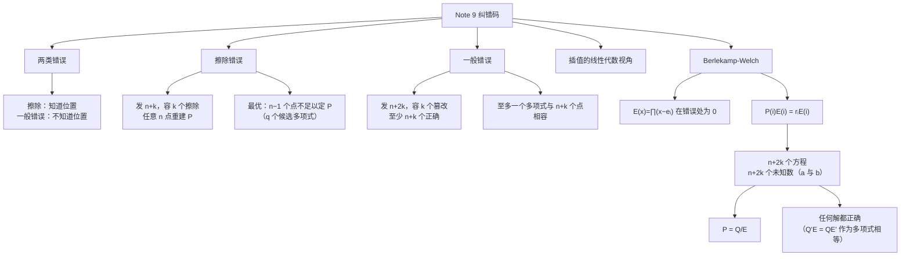

# Note 9 纠错码与 Reed-Solomon 码

> 本笔记对应 CS 70《离散数学与概率论》Fall 2026 Course Notes Note 9（第 1 节及其子节）。**Note 8 建立了"多项式 + 有限域 + 插值"这套工具；本讲把它变成工程上无处不在的技术：纠错码。** 你每次用手机、卫星电视、DSP、有线调制解调器、磁盘驱动器、CD-ROM、DVD 播放器，或者在互联网上收发数据时，背后都在运行纠错码。

---

## 1. 纠错码（Error-Correcting Codes）

**在本笔记中**，我们将讨论**在不靠谱的通信信道上传输消息**这一问题。

**信道可能导致消息的某些部分（"数据包，packets"）丢失或被丢弃（dropped）；或者更严重地，它可能导致某些数据包被篡改（corrupted）。** 我们将学习如何通过**引入冗余（redundancy）**来"编码"消息，以抵御这两类错误。**这样的编码方案称为"纠错码（error-correcting code）"。**

**纠错码是数学、计算机科学与电子工程中的一个重要研究对象**；它们属于一个叫作**"信息论（Information Theory）"**的领域，而信息论是计算机科学的核心之一。除了它们背后优美的理论（我们将在本笔记中窥见一斑），它们还具有**巨大的实际重要性**：每次你使用手机、卫星电视、DSP、有线调制解调器、磁盘驱动器、CD-ROM、DVD 播放器等等，或者在互联网上收发数据时，你都在使用纠错码来保证信息的可靠传输。纠错码还被用在**数据中心**里，以及用于**加速并行计算**。

**粗略地说，纠错码有两个截然不同的流派**：

- **代数码（algebraic codes）**：基于**有限域上的多项式**；
- **组合码（combinatorial codes）**：基于**图论**。

**在本笔记中，我们将聚焦于代数码，尤其是所谓的 Reed-Solomon 码（里德–所罗门码，以两位发明者命名）。** 在此过程中，我们将**本质性地**用到上一讲学到的多项式性质。

### 1.1 擦除错误（Erasure Errors）

**我们将考虑两种希望在不靠谱信道上传输信息的情形。**

**第一种由互联网例示**：信息（比如说一个文件）被**拆分成数据包（packets）**，而不靠谱性体现在**某些数据包在传输过程中丢失了**，如下图所示：

```text
   c1   c2   c3   c4   c5   c6
   3    1    5    0    ✗    ✗        ← 数据包 5、6 在半路丢失
```

**我们把这类错误称为擦除错误（erasure errors）。**

**假设消息由 $n$ 个数据包组成，并假设传输过程中至多有 $k$ 个数据包丢失。** 我们将展示：如何把由 $n$ 个数据包组成的初始消息，**编码**为一个由 $n+k$ 个数据包组成的**冗余编码**，使得接收方**能从任意 $n$ 个收到的数据包重建消息**。

**注意在这个设定下，数据包带有头部标签，因此接收方确切知道哪些数据包在传输中被丢弃了。**

**我们可以不失一般性地假设每个数据包的内容是模 $q$ 的一个数，其中 $q$ 是素数。** 例如，数据包的内容可能是一个 $32$ 比特串，因此可以看成一个 $0$ 到 $2^{32}-1$ 之间的数；那么我们可以取 $q$ 为任何大于 $2^{32}$ 的素数。

> 💡 **补充注释（原文脚注 1）**：在真实世界的实现中，我们并不完全这样做。**我们直接工作在大小为 $2^{32}$ 的有限域里**，因为它是一个**素数幂（prime power）**，而使用"大小为 $2$ 的幂"的域对计算机运算很方便。**这种域的构造超出 CS70 的范围。** 不过，**码的构造与这里给出的是相同的。**

**$\mathrm{GF}(q)$ 上多项式的性质（即系数与取值都模 $q$ 化简）完美地适合解决这个问题，并且是这个纠错方案的主干。**

### 1.2 编码方案

**为看清这一点**，让我们把要发送的消息记作

$$m_1, \dots, m_n$$

其中每个 $m_i$ 是 $\mathrm{GF}(q)$ 中的一个数，并作出下面这些**关键观察**：

> **1.** 存在**唯一**一个次数为 $n-1$ 的多项式 $P(x)$ 使得
> $$P(i) = m_i \quad (1 \leq i \leq n)$$
> （也就是说，$P(x)$ **包含了关于该消息的全部信息**，而求值 $P(i)$ 就给出第 $i$ 个数据包的预定内容。）

> **2.** 要发送的消息现在是 $m_1 = P(1), \dots, m_n = P(n)$。我们**可以通过在点 $n+j$ 处求值 $P(x)$ 来生成额外的数据包**。
> （回忆一下：我们传输的**码字（codeword）**应当是冗余的，即它应当包含比原始消息更多的数据包，以应对丢失的数据包。**这就是"码字"与"消息"的区别**：码字是**被传输的东西**，按构造就带有冗余；而消息是**用户交给我们的东西**，不一定含任何冗余。）
> **因此传输的码字是** $c_1 = P(1), c_2 = P(2), \dots, c_{n+k} = P(n+k)$。由于我们在模 $q$ 下工作，**我们必须确保 $n+k \leq q$**，但这个条件不构成严重限制，因为 $q$ 被假定非常大。

> **3.** 我们可以**从它在任意 $n$ 个不同点上的取值唯一地重建** $P(x)$，因为它的次数是 $n-1$。
> **这意味着 $P(x)$ 可以从传输的任意 $n$ 个数据包重建（而不只是原来的那 $n$ 个数据包！）**。一旦我们重建出多项式 $P$，我们就可以在 $x = 1, \dots, n$ 处求值 $P(x)$，从而恢复原始消息 $m_1, \dots, m_n$。

**⚠️ 注意（三个观察分别用到 Note 8 的哪条结论）**：

| 观察 | 依据 |
| :--- | :--- |
| 1（存在唯一 $P$，$\deg P = n-1$） | **性质 2**（$n$ 个点唯一确定次数 $\leq n-1$ 的多项式） |
| 2（可生成额外数据包） | 多项式可以**在任意点求值**（求值即编码） |
| 3（任意 $n$ 个点可重建） | **性质 2 的存在性部分**（任意 $n$ 个互异点同样唯一确定它） |

### 1.3 完整例子（$n = 4$，$k = 2$，$\mathrm{GF}(7)$）

> **例**：假设 Alice 想给 Bob 发送一个 $n = 4$ 个数据包的消息，并且她想抵御 $k = 2$ 个丢失的数据包。那么，假设这些数据包可以被编码为 $0$ 到 $6$ 之间的整数，Alice 可以在 $\mathrm{GF}(7)$ 上工作（因为 $7 \geq n+k = 6$；当然，在实际应用中我们会工作在**大得多**的域上！）。
>
> **假设 Alice 想发给 Bob 的消息是** $m_1 = 3,\ m_2 = 1,\ m_3 = 5,\ m_4 = 0$。

**由这 $4$ 个点所描述的、唯一的 $n-1 = 3$ 次多项式是**

$$P(x) = x^3 + 4x^2 + 5$$

> **Exercise.** 我们用拉格朗日插值（模 $7$）推导出了这个多项式。**请检查这个推导，并验证确实有 $P(i) = m_i$（$1 \leq i \leq 4$）。**

**补充说明（验算，全部在 $\mathrm{GF}(7)$ 中）**：

| $x$ | $x^3 + 4x^2 + 5$ | 模 $7$ | 应为 $m_i$ |
| :---: | :--- | :---: | :---: |
| $1$ | $1 + 4 + 5 = 10$ | $3$ | $3$ ✓ |
| $2$ | $8 + 16 + 5 = 29$ | $1$ | $1$ ✓ |
| $3$ | $27 + 36 + 5 = 68$ | $5$ | $5$ ✓ |
| $4$ | $64 + 64 + 5 = 133$ | $0$ | $0$ ✓ |

**由于 $k = 2$**，Alice 必须在 $2$ 个额外的点上求值 $P(x)$：

$$P(5) = 6, \qquad P(6) = 1$$

**现在** Alice 可以传输由 $n+k = 6$ 个数据包组成的码字，其中 $c_j = P(j)$（$1 \leq j \leq 6$）。**所以 Alice 将发送**

$$c_1 = P(1) = 3,\ c_2 = P(2) = 1,\ c_3 = P(3) = 5,\ c_4 = P(4) = 0,\ c_5 = P(5) = 6,\ c_6 = P(6) = 1$$

**现在假设第 $2$ 与第 $6$ 个数据包被丢弃**，在这种情况下我们面临如下局面：

```text
  c1   c2   c3   c4   c5   c6            ← 传输的码字
   3    1    5    0    6    1
   ✓    ✗    ✓    ✓    ✓    ✗            ← 第 2、6 个丢失
   m1        m3   m4                     ← 收到的内容
```

**从 Bob 收到的值 $(3, 5, 0, 6)$**（对应位置 $x = 1, 3, 4, 5$），**他用拉格朗日插值并计算如下基多项式**（其中一切都应按模 $7$ 解释）：

$$
\begin{aligned}
\Delta_1(x) &= \frac{(x-3)(x-4)(x-5)}{-24} \equiv 2(x-3)(x-4)(x-5) \pmod 7\\[4pt]
\Delta_3(x) &= \frac{(x-1)(x-4)(x-5)}{4} \equiv 2(x-1)(x-4)(x-5) \pmod 7\\[4pt]
\Delta_4(x) &= \frac{(x-1)(x-3)(x-5)}{-3} \equiv 2(x-1)(x-3)(x-5) \pmod 7\\[4pt]
\Delta_5(x) &= \frac{(x-1)(x-3)(x-4)}{8} \equiv (x-1)(x-3)(x-4) \pmod 7
\end{aligned}
$$

> **（注意：我们在这里用到了这样一个事实：$-24$、$4$、$-3$ 与 $8$ 模 $7$ 的逆元分别是 $2$、$2$、$2$ 与 $1$。）**

**补充说明（逆元的核对）**：$\mathrm{GF}(7)$ 中的逆元表为

$$1^{-1}=1,\quad 2^{-1}=4,\quad 3^{-1}=5,\quad 4^{-1}=2,\quad 5^{-1}=3,\quad 6^{-1}=6$$

于是：

- $-24 \equiv -3 \equiv 4 \pmod 7$，而 $4^{-1} = 2$ → 系数 $2$ ✓
- $4^{-1} = 2$ → 系数 $2$ ✓
- $-3 \equiv 4 \pmod 7$，而 $4^{-1} = 2$ → 系数 $2$ ✓
- $8 \equiv 1 \pmod 7$，而 $1^{-1} = 1$ → 系数 $1$ ✓

> **他然后重建多项式：**
> $$P(x) = 3\cdot\Delta_1(x) + 5\cdot\Delta_3(x) + 0\cdot\Delta_4(x) + 6\cdot\Delta_5(x) = x^3 + 4x^2 + 5 \pmod 7$$
> **Bob 然后求值** $m_2 = P(2) = 1$，**这正是从原始码字中丢失的那个数据包**。
>
> **更一般地，无论哪两个数据包被丢弃，按完全相同的方法，Bob 总能重建 $P(x)$，从而恢复出原始消息。**

> **Exercise.** 请检查 Bob 上面的计算，并验证他确实重建出了所声称的正确多项式。**记住所有算术都必须在模 $7$ 下进行。**

**补充说明（为什么不需要重做全部插值）**：请注意一个实用要点——**Bob 得到了 $P$ 的系数后，可以求 $P(2)$ 把丢失的 $m_2$ 补回来**。他并不需要"重新插值出 $m_1,\dots,m_4$"；因为 $P$ 已经把**整条消息**编码进去了。这正是"用多项式编码"相对于"逐块重复发送"的优越之处。

### 1.4 这个方案是最优的

**让我们考虑如果 Alice 少发一个数据包会发生什么。**

**如果 Alice 只发送 $c_j$（$1 \leq j \leq n+k-1$）**，那么在 $k$ 个擦除的情况下，Bob 只会在 $n-1$ 个不同的 $j$ 值上收到 $c_j$。**因此 Bob 将无法重建 $P(x)$**（因为存在 $q$ 个次数至多 $n-1$ 的多项式与 Bob 收到的 $n-1$ 个数据包一致）！

**因此这个纠错方案是最优的**：**它能从任意 $n$ 个收到的字符中恢复出所传输消息的 $n$ 个字符，但从更少的字符恢复是不可能的。**

**⚠️ 注意（"最优"的依据就是 Note 8 的计数表）**：这条论证的数学内容就是 Note 8 第 5 节的那张表——"给定 $d-k$ 个点 $\Rightarrow$ 恰有 $m^{k+1}$ 个次数 $\leq d$ 的多项式"。这里 $d = n-1$、给定点数 $n-1 = d$，于是有 $m^{0+1} = m = q$ 个候选多项式：**$q$ 个都说得通，Bob 无法判断哪个是真的**。**"信息不足"在这里被精确量化为"有 $q$ 个互不相容的候选"。**

### 1.5 多项式插值的再审视（线性代数视角）

**让我们做一段简短的插叙**，讨论**另一种**多项式插值方法（不同于上一讲讨论的拉格朗日插值），它在处理**一般错误**时会很有用。**我们需要把这里的线性代数讲得更显式一些，以便往后更好地依赖它。**

**同样地，算法的目标**是输入 $d+1$ 个数对 $(x_1,y_1), \cdots, (x_{d+1},y_{d+1})$，输出多项式

$$p(x) = a_d x^d + \cdots + a_1 x + a_0$$

使得 $p(x_i) = y_i$（$i = 1$ 到 $d+1$）。

**算法的第一步是写出一个含 $d+1$ 个变量、$d+1$ 个方程的线性方程组**：**变量是多项式的系数 $a_0, \dots, a_d$**。每个方程都是把 $x$ 固定为 $d+1$ 个值之一（$x_1, \cdots, x_{d+1}$）而得到的。

> **注意一个"角色互换"**：在 $p(x)$ 中，$x$ 是**变量**、$a_0,\dots,a_d$ 是**固定常数**。而在下面的方程组中，这些角色被交换了：**$x_i$ 是固定常数，$a_0,\dots,a_d$ 是变量**。例如第 $i$ 个方程，就是把 $x$ 固定为 $x_i$、并断言多项式的值为 $y_i$：
> $$a_d x_i^{d} + a_{d-1}x_i^{d-1} + \cdots + a_0 = y_i$$

**现在解这些方程就给出多项式 $p(x)$ 的系数。**

**例**：假设给定三个数对 $(-1,2)$、$(0,1)$、$(2,5)$；我们的目标是构造穿过这些点的 $2$ 次多项式 $p(x)$。

- 第一个方程说 $a_2(-1)^2 + a_1(-1) + a_0 = 2$。化简得 $a_2 - a_1 + a_0 = 2$。
- 类似地，第二个方程说 $a_2(0)^2 + a_1(0) + a_0 = 1$，即 $a_0 = 1$。
- 第三个方程说 $a_2(2)^2 + a_1(2) + a_0 = 5$。

**所以我们得到下面的方程组：**

$$
\begin{cases}
a_2 - a_1 + a_0 = 2\\
a_0 = 1\\
4a_2 + 2a_1 + a_0 = 5
\end{cases}
$$

**代入 $a_0$ 并把第一个方程乘以 $2$，我们得到：**

$$
\begin{cases}
2a_2 - 2a_1 = 2\\
4a_2 + 2a_1 = 4
\end{cases}
$$

**然后把两个方程相加，我们得到 $6a_2 = 6$，所以 $a_2 = 1$；代回去得到 $a_1 = 0$。**

**因此我们确定了多项式**

$$p(x) = x^2 + 1$$

**要更仔细地为这个方法辩护**，我们必须证明这样的方程组**总是有解**、而且**解是唯一的**。**幸运的是，我们在上一讲通过拉格朗日插值所做的工作已经确立了这一点。（你能看出为什么吗？）** 这正是**能从不同角度看同一个问题**的好处之一。

**补充说明（为什么两个问题等价）**：拉格朗日插值定理（Note 8 的性质 2）说的正是"**给定 $d+1$ 个横坐标互异的点，次数 $\leq d$ 的多项式存在且唯一**"。而系数向量 $(a_0,\dots,a_d)$ 与多项式**一一对应**，所以"这样的多项式存在且唯一"恰好等价于"这个 $d+1$ 元线性方程组**有唯一解**"。**于是线性代数中关于这个方程组的结论可以直接从多项式理论"免费"得到**——无需再算行列式。

**⚠️ 注意（这个方法为什么比拉格朗日插值更适合"一般错误"）**：拉格朗日插值给出的是**显式公式**，但**要求我们事先知道哪些点是可信的**。而在一般错误的情形下，我们**不知道哪些点是错的**——这时需要把"位置未知"也变成**未知数**，于是只能用**解线性方程组**（再加上"多项式相除"）的办法。这就是下面 Berlekamp–Welch 算法的思路来源。

### 1.6 一般错误（General Errors）

**让我们现在回到纠错这个主题，并考虑一个更具挑战性的场景。**

**假设 Alice 希望通过一个嘈杂的信道（比如说，通过调制解调器）与 Bob 通信。** 她的消息是 $m_1, \dots, m_n$，我们可以把 $m_i$ 看作字符（字节，或英文字母表中的字母）。

**现在的问题是：某些字符在传输过程中因信道噪声而被篡改。** 因此 Bob 收到的字符**个数与 Alice 发送的完全相同**，但其中 $k$ 个被篡改了，**而 Bob 完全不知道是哪 $k$ 个**！

**你可以把它们想成是被一个恶意的对手篡改的，而这个对手的能力上限是"最多篡改 $k$ 个字符"。**

**从这类一般错误中恢复，比从擦除错误中恢复要困难得多**，不过**多项式再次成为关键**。**正如我们将看到的，Alice 仍然可以抵御 $k$ 个一般错误，代价是额外传输 $2k$ 个字符（是上面擦除情形所传数量的两倍）。**

**我们仍然把每个字符看成某个素数 $q$ 下的模 $q$ 数。**（对英文字母表，$q$ 是某个大于 $26$ 的素数。）

**和以前一样**，我们可以用一个 $\mathrm{GF}(q)$ 上次数为 $n-1$ 的多项式 $P(x)$ 来描述该消息，使得

$$P(1) = m_1,\ \dots,\ P(n) = m_n$$

**和以前一样**，为了应对错误，Alice 会**在额外的点上求值 $P(x)$ 并传输这些额外字符**。**如上所述，为了抵御 $k$ 个一般错误，Alice 必须传输 $2k$ 个额外字符**：因此编码后的码字是

$$c_1, \dots, c_{n+2k}, \quad \text{其中 } c_j = P(j)\ (1 \leq j \leq n+2k)$$

**并且我们可以假设 Bob 收到的这些字符中（至少）有 $n+k$ 个未被篡改。**

**和以前一样，我们必须对 $q$ 施加一条温和的限制：它必须足够大，使得 $q > n + 2k$。**

> **⚠️ 注意（"$n+k$ 个未篡改"是怎么来的）**：总共收到 $n+2k$ 个字符，其中**至多 $k$ 个**被篡改，因此**至少有 $(n+2k) - k = n+k$ 个**是正确的。**这个数字 $n+k$ 是整个一般错误分析里反复出现的关键量。**

**例**：如果 Alice 想通过一个"$k = 1$ 个字符被篡改"的调制解调器给 Bob 发送 $n = 4$ 个字符，她必须冗余地发送一个由 $6$ 个字符组成的编码消息。

**假设她想传输与上面擦除例子相同的消息 $(3, 1, 5, 0)$**（即**同一个** $n-1 = 3$ 次多项式 $P(x) = x^3 + 4x^2 + 5$，因此同一个码字 $(c_1,\dots,c_6) = (3,1,5,0,6,1)$），**并且 $c_1$ 被从 $3$ 篡改成了 $2$**。这个场景可以用下图可视化：

```text
  c1   c2   c3   c4   c5   c6            ← 传输的码字
   3    1    5    0    6    1
   ↓ 篡改
  r1   r2   r3   r4   r5   r6            ← 收到的内容
   2    1    5    0    6    1
```

**从 Bob 的视角看**，重建 Alice 消息的问题，**等同于从 $n + 2k$ 个收到的字符 $r_1, r_2, \dots, r_{n+2k}$ 重建多项式 $P(x)$**。

**换句话说**，Bob 被给定 $n+2k$ 个模 $q$ 的值 $r_1, \dots, r_{n+2k}$，**并附带一个承诺（promise）**：存在一个 $\mathrm{GF}(q)$ 上次数为 $n-1$ 的多项式 $P(x)$，使得 $P(i) = r_i$ **对 $1$ 到 $n+2k$ 之间的 $n+k$ 个 $i$ 成立**。Bob 必须从这些数据中重建 $P(x)$（在上面的例子里，$n+k = 5$，且 $r_2 = P(2)=1$、$r_3 = P(3)=5$、$r_4 = P(4)=0$、$r_5 = P(5)=6$、$r_6 = P(6)=1$）。

> **注意，Bob 并不知道这 $n+k$ 个值中哪些是正确的！**

### 1.7 至多一个多项式与数据相容

**Bob 掌握的信息足以重建 $P(x)$ 吗？**

> **我们的第一个观察是**：**至多存在一个**次数不超过 $n-1$ 的多项式 $P(x)$，使得 $P(i) = r_i$ 对 $1$ 到 $n+2k$ 之间的**至少** $n+k$ 个 $i$ 成立。

> **证明（Proof）**

**证明：** 为看出这一点，**反设** $P(i) = r_i$ 在 $n+k$ 个点上成立，而 $P'(i) = r_i$ 在 $n+k$ 个（**可能不同的**）点上成立。

**由于总共有 $n+2k$ 个点**，这两个点集**必有重叠**，重叠个数至少为

$$(n+k) + (n+k) - (n+2k) = n$$

**因此 $P(i) = r_i = P'(i)$ 在 $n$ 个点上成立**，这意味着**它们必须是同一个次数为 $n-1$ 的多项式**（依据 Note 8 的性质 2：$n$ 个点唯一确定一个次数 $\leq n-1$ 的多项式）。

**此外**，我们观察到**原始的那个多项式确实满足 $P(i) = r_i$ 在 $n+k$ 个点上成立**，因为**至多有 $k$ 个错误**。**因此，$P(x)$ 是与 Bob 的信息相容的那个唯一的多项式。**

**证毕。** $\blacksquare$

> **总结一下，Bob 的任务就是**：**找出一个次数为 $n-1$ 的多项式 $P(x)$，使得 $P(i) = r_i$ 对至少 $n+k$ 个 $i$ 成立。** 如果他能做到这一点，他就可以确信他找到的多项式确实就是原始多项式 $P(x)$。

**⚠️ 注意（这个"重叠计数"论证的结构）**：这是一个典型的**双重计数（double counting）**论证：两个大小各为 $n+k$ 的集合落在大小为 $n+2k$ 的全集中，**必有至少 $n$ 个公共元素**。**而 $n$ 正是"唯一确定"所需的最小点数**——所以"至多一个"这个结论是**紧的**，不是估算出来的。

### 1.8 Berlekamp–Welch 算法：误差定位多项式

**但 Bob 怎样才能高效地找出这样一个多项式呢？** 问题在于**这 $k$ 个错误的位置**。

**令 $e_1, \dots, e_k$ 为发生错误的 $k$ 个位置**（于是对一切 $i \notin \{e_1,\dots,e_k\}$ 有 $P(i) = r_i$）。**Bob 不知道这些错误在哪里，所以他不知道 $e_1,\dots,e_k$ 的值。**

**现在 Bob 可以尝试去猜这 $k$ 个错误的位置，但这会花太长时间**（事实上，会花**指数时间**）。

**相反，Bob 将使用一个基于下面定义的巧妙技巧。考虑所谓的误差定位多项式（error-locator polynomial）**

$$E(x) = (x - e_1)(x - e_2)\cdots(x - e_k)$$

**注意 $E(x)$ 是一个 $k$ 次多项式**（因为 $x$ 出现了 $k$ 次）。

**还要注意 Bob 并不显式地知道这个多项式**，因为他不知道错误的位置 $e_i$。**然而，他可以把这多项式当成符号来用，并最终算出其中出现的那些值 $e_i$！**

**让我们对这个多项式作一个简单但至关重要的观察：**

$$P(i)E(i) = r_i E(i) \quad (1 \leq i \leq n+2k) \tag{1}$$

**要看出这一点**，注意：

- **在没有发生错误的点 $i$ 上它成立**，因为那些点处 $P(i) = r_i$；
- **在发生错误的点 $i$ 上它平凡地成立**，因为那时 $E(i) = 0$（$i$ 是 $E$ 的根）。

**⚠️ 注意（这个"平凡成立"正是技巧的核心）**：$E$ 被**设计**成在错误位置取零。**于是无论 $r_i$ 错成什么样子，方程 (1) 在错误位置都自动满足。** 这就把"哪些位置错了"这个**组合问题**（要搜索 $k$ 个位置）转化成了一个**代数问题**（要解线性方程组）。**这就是"用多项式消掉未知位置"的全部秘密。**

### 1.9 把 (1) 变成线性方程组

**这个观察构成了 Berlekamp 与 Welch 发明的一个非常巧妙的算法的基础。** 更仔细地看 (1) 中的等式，**我们将证明它们可以对应到含有 $n+2k$ 个未知数的 $n+2k$ 个线性方程**，从中可以轻易推导出错误的位置与 $P(x)$ 的系数（做法与我们上一节看到的插值方案类似）。

**定义多项式** $Q(x) := P(x)E(x)$，**它的次数是 $n+k-1$**，因此由 $n+k$ 个系数 $a_0, a_1, \dots, a_{n+k-1}$ 描述。

**误差定位多项式** $E(x) = (x-e_1)\cdots(x-e_k)$ **的次数是 $k$**，由 $k+1$ 个系数 $b_0, b_1, \dots, b_k$ 描述，**但首项系数（即 $x^k$ 的系数 $b_k$）总是 $1$**。

**所以我们可以写成：**

$$
\begin{aligned}
Q(x) &= a_{n+k-1}x^{n+k-1} + a_{n+k-2}x^{n+k-2} + \cdots + a_1 x + a_0\\
E(x) &= x^{k} + b_{k-1}x^{k-1} + \cdots + b_1 x + b_0
\end{aligned}
$$

**（记住我们目前还不知道任何系数 $a_i$ 或 $b_i$。）**

**现在注意**：把 $Q(x) = P(x)E(x)$ 代入 (1)，我们得到 $n+2k$ 个方程

$$Q(i) = r_i E(i) \quad (1 \leq i \leq n+2k)$$

**用 $Q(x)$ 与 $E(x)$ 的系数把第 $i$ 个方程写出来，我们得到**

$$a_{n+k-1}i^{n+k-1} + a_{n+k-2}i^{n+k-2} + \cdots + a_1 i + a_0 = r_i\left(i^{k} + b_{k-1}i^{k-1} + \cdots + b_1 i + b_0\right) \pmod q$$

> **这是一组 $n+2k$ 个线性方程**（每个 $i$ 一个），**含 $n+2k$ 个未知数**
> $$a_0, a_1, \dots, a_{n+k-1},\ b_0, b_1, \dots, b_{k-1}$$
> **我们可以解这个线性方程组，得到 $E(x)$ 与 $Q(x)$。然后我们可以计算商 $\dfrac{Q(x)}{E(x)}$ 得到 $P(x)$。** 这一点用例子说明最好。

**⚠️ 注意（未知数的计数必须核对）**：

| 多项式 | 次数 | 系数个数 | 未知数 |
| :--- | :---: | :---: | :---: |
| $Q = PE$ | $n+k-1$ | $n+k$ | $a_0,\dots,a_{n+k-1}$ |
| $E$ | $k$ | $k+1$（首项固定为 $1$） | $b_0,\dots,b_{k-1}$ |
| **合计** | | | $\boldsymbol{n+k+k = n+2k}$ |

**未知数个数与方程个数都是 $n+2k$，恰好匹配。**"$E$ 的首项系数取 $1$"这一步（称为**规范化**）正是让计数对齐的关键。

### 1.10 完整例子（$n = 3$，$k = 1$，$\mathrm{GF}(7)$）

> **例**：假设我们在 $\mathrm{GF}(7)$ 上工作，Alice 想通过调制解调器给 Bob 发送 $n = 3$ 个字符 "$3$"、"$0$"、"$6$"。借英文字母表的类比，这相当于只用字母表的前 $7$ 个字母，其中 $a = 0, \dots, g = 6$。**所以 Alice 希望 Bob 收到的消息是 "dag"。**

**然后 Alice 插值**（例如用拉格朗日插值：**请作为练习！**）**找出多项式**

$$P(x) = x^2 + x + 1$$

**它是模 $7$ 下满足 $P(1) = 3$、$P(2) = 0$、$P(3) = 6$ 的唯一 $2$ 次多项式。**

**补充说明（验算）**：$P(1) = 1+1+1 = 3$ ✓；$P(2) = 4+2+1 = 7 \equiv 0$ ✓；$P(3) = 9+3+1 = 13 \equiv 6$ ✓。

**假设 Alice 知道最多有 $k = 1$ 个字符可能被篡改**；那么她需要传输 $n+2k = 5$ 个字符：

$$P(1) = 3,\ P(2) = 0,\ P(3) = 6,\ P(4) = 0,\ P(5) = 3$$

**假设 $P(1)$ 实际上被篡改了，Bob 收到的字符是 $2$ 而不是 $3$**（也就是说，Alice 发送编码后的码字 "dagad"，但 Bob 收到的却是 "cagad"）。**总结如下：**

```text
  c1   c2   c3   c4   c5            ← 传输的码字（"dagad"）
   3    0    6    0    3
   ↓ 篡改
  r1   r2   r3   r4   r5            ← 收到的内容（"cagad"）
   2    0    6    0    3
```

**令** $E(x) = (x - e_1) = x + b_0$ **为误差定位多项式**——**记住 Bob 还不知道 $e_1 = -b_0$ 是什么，因为他不知道错误发生在哪里**——**并令** $Q(x) = a_3x^3 + a_2x^2 + a_1x + a_0$（其中系数 $a_i$ 也未知）。

**现在 Bob 只需把 $i = 1, 2, \dots, 5$ 代入 (1) 中的方程 $Q(i) = r_iE(i)$ 并化简**，就得到含五个未知数的五个线性方程（回忆我们在模 $7$ 下工作，$r_i$ 是 Bob 收到的第 $i$ 个字符的值）：

$$
\begin{cases}
a_3 + a_2 + a_1 + a_0 + 5b_0 = 2\\
a_3 + 4a_2 + 2a_1 + a_0 = 0\\
6a_3 + 2a_2 + 3a_1 + a_0 + b_0 = 4\\
a_3 + 2a_2 + 4a_1 + a_0 = 0\\
6a_3 + 4a_2 + 5a_1 + a_0 + 4b_0 = 1
\end{cases}
$$

**Bob 然后解这个线性方程组，发现**

$$a_3 = 1,\quad a_2 = 0,\quad a_1 = 0,\quad a_0 = 6,\quad b_0 = 6 \qquad (\text{全部模 } 7)$$

**这使他得到多项式**

$$Q(x) = x^3 + 6, \qquad E(x) = x + 6 = x - 1$$

**（作为检验**，$E(x) = x - 1$ 这件事意味着**错误的位置是位置 $e_1 = 1$**，这是正确的，因为第一个字符被从 "d" 篡改成了 "c"。）

**然后他可以通过计算商来找出 $P(x)$：**

$$P(x) = \frac{Q(x)}{E(x)} = \frac{x^3 + 6}{x - 1} = x^2 + x + 1 \pmod 7$$

**Bob 注意到第一个字符被篡改了**（因为 $e_1 = 1$），所以现在他既已有了 $P(x)$，就只需计算

$$P(1) = 3 = \text{"d"}$$

**从而得到原始的、未被篡改的消息 "dag"。**

**补充说明（五元方程组怎么解出来的）**：把每个 $i$ 的 $i^k$ 算出来，是全部计算量的所在。

| $i$ | $i^2$ | $i^3$ | $i^4$ | 得到的方程 |
| :---: | :---: | :---: | :---: | :--- |
| $1$ | $1$ | $1$ | $1$ | $a_3+a_2+a_1+a_0 = r_1(1+b_0) = 2(1+b_0) \Rightarrow a_3+a_2+a_1+a_0+5b_0 = 2$ |
| $2$ | $4$ | $1$ | $2$ | $a_3+4a_2+2a_1+a_0 = r_2(2+b_0) = 0$ |
| $3$ | $2$ | $6$ | $4$ | $6a_3+2a_2+3a_1+a_0 = r_3(3+b_0) = 6(3+b_0) \Rightarrow \cdots + b_0 = 4$ |
| $4$ | $2$ | $1$ | $4$ | $a_3+2a_2+4a_1+a_0 = r_4(4+b_0) = 0$ |
| $5$ | $4$ | $6$ | $2$ | $6a_3+4a_2+5a_1+a_0 = r_5(5+b_0) = 3(5+b_0) \Rightarrow \cdots + 4b_0 = 1$ |

（其中 $r = (r_1,\dots,r_5) = (2,0,6,0,3)$，且在化简右侧时用到 $r_i b_0$ 模 $7$：$2b_0 \to$ 移到左边得 $-2b_0 \equiv 5b_0$；$6b_0 \to -6b_0 \equiv b_0$；$3b_0 \to -3b_0 \equiv 4b_0$。）

**把 $a_3=1, a_2=0, a_1=0, a_0=6, b_0=6$ 代回第一条方程检验**：

$$1 + 0 + 0 + 6 + 5\cdot6 = 7 + 30 = 37 \equiv 2 \pmod 7 \quad ✓$$

> **Exercise.** 请验证上述方程组确实由等式 $Q(i) = r_iE(i)$（$i = 1,2,3,4,5$）推导而来。另外，请解出这些方程（有点繁琐，但不算难！），并检查你的解与上面的解一致。**记住所有算术都应在模 $7$ 下进行。**

> **Exercise.** 请把上面的例子重做一遍，这次改设**第二个字符**被从 "0" 篡改成 "5"，而其他所有字符都未被篡改。

**补充说明（这道练习的答案）**：此时收到的字符是

$$r = (3,\ 5,\ 6,\ 0,\ 3)$$

仍然设 $E(x) = x + b_0$、$Q(x) = a_3x^3+a_2x^2+a_1x+a_0$，把 $Q(i) = r_iE(i)$ 对 $i = 1,\dots,5$ 展开**化简后**（所有算术模 $7$）得到方程组

$$
\begin{cases}
a_3 + a_2 + a_1 + a_0 + 6b_0 = 3\\
a_3 + 4a_2 + 2a_1 + a_0 + 3b_0 = 3\\
6a_3 + 2a_2 + 3a_1 + a_0 + 4b_0 = 4\\
a_3 + 2a_2 + 4a_1 + a_0 = 0\\
6a_3 + 4a_2 + 5a_1 + a_0 + 2b_0 = 1
\end{cases}
$$

**它的唯一解是**

$$a_3 = 5,\quad a_2 = 6,\quad a_1 = 6,\quad a_0 = 1,\quad b_0 = 5$$

于是

$$E(x) = x + 5 = x - 2 \quad\Longrightarrow\quad e_1 = 2$$

**正是被篡改的位置**（第二个字符）✓。而

$$Q(x) = 5x^3 + 6x^2 + 6x + 1 = (x+5)\left(x^2 + x + 1\right)$$

**除以 $E(x)$ 得** $P(x) = x^2 + x + 1$，**与原多项式一致**，故

$$P(2) = 0 = \text{"a"}$$

**恢复出原始消息 "dag"** ✓。

### 1.11 三个更精细的问题（Finer Points）

**有两点需要进一步讨论。**

#### 1.11.1 方程组一定有解吗？

**我们怎么知道这 $n+2k$ 个方程是相容（consistent）的？如果它们无解怎么办？**

**这很简单。这些方程必然是相容的**，因为把 $Q(x) = P(x)E(x)$ 与**真实的**误差定位多项式 $E(x)$ 代进去就给出一个解！

**⚠️ 注意**：这条论证的要点是**存在性不需要解方程就能知道**——它由"真实世界确实发生了某种错误模式"保证。**解方程只是把这个保证找出来。**

#### 1.11.2 会不会有"伪解"？

**一个更有趣的问题是**：**我们怎么知道这 $n+2k$ 个方程是独立的？** 也就是说，我们怎么知道除了我们要求的那个真解之外，**不存在其他伪解（spurious solutions）**？

**用更数学的语言说**：假设我们构造出的解是 $Q'(x), E'(x)$；**我们怎么知道这个解满足"$E'(x)$ 整除 $Q'(x)$"这一性质，并且 $\dfrac{Q'(x)}{E'(x)} = \dfrac{Q(x)}{E(x)} = P(x)$ 呢？**

> **证明（Proof：任何解都是正确的）**

**证明：为看出这一点**，我们首先注意：**根据我们计算 $Q'(x), E'(x)$ 的方法**，我们知道

$$Q'(i) = r_i E'(i) \quad (1 \leq i \leq n+2k)$$

**当然，按定义我们也有**

$$Q(i) = r_i E(i)$$

**对同样的那些 $i$ 成立。**

**把第一个等式乘以 $E(i)$、第二个乘以 $E'(i)$**，我们得到

$$Q'(i)E(i) = Q(i)E'(i) \quad (1 \leq i \leq n+2k) \tag{2}$$

**因为两边都等于** $r_i E(i)E'(i)$。

**方程 (2) 告诉我们**：两个多项式 $Q(x)E'(x)$ 与 $Q'(x)E(x)$ **在 $n+2k$ 个点上相等**。

**但这两个多项式的次数都是 $n+2k-1$**（依据：$\deg Q = n+k-1$、$\deg E' = k$，故 $\deg(QE') = n+2k-1$；另一项同理），**所以它们完全由在 $n+2k$ 个点上的取值所确定。**

**因此**，既然它们在 $n+2k$ 个点上一致，**它们必定是同一个多项式**，即

$$Q(x)E'(x) = Q'(x)E(x) \quad \text{对一切 } x$$

**现在我们可以用多项式 $E(x)E'(x)$（按构造它不是零多项式）来除**，得到

$$\frac{Q'(x)}{E'(x)} = \frac{Q(x)}{E(x)} = P(x)$$

**这正是我们想要的。**

**因此我们可以确信，我们找到的任何解都是正确的。**

**证毕。** $\blacksquare$

**⚠️ 注意（这一步为什么能"除以 $E E'$"）**：$E$ 与 $E'$ 都是**首项系数为 $1$ 的 $k$ 次多项式**（算法把这个规范化约束写进了方程组），因此它们**都不是零多项式**，乘积也不是。**这正是 1.9 节"令 $E$ 的首项系数为 $1$"这一步的第二个作用**——它不仅让未知数计数对齐，还保证了除法合法。

**补充说明（这里再次出现"$n+2k$ 个点 + 次数 $n+2k-1$"的配对）**：注意论证结构与 1.7 节的"至多一个多项式"几乎完全一样：**只要"点数 > 次数"，两个多项式就被强制相等**。这正是 Note 8 的性质 2 在这个算法中的第三次出场。

> **Exercise（较难）**：**解 $Q'(x), E'(x)$ 总是唯一的吗？**
> 上面的分析告诉我们**比值 $\dfrac{Q'(x)}{E'(x)}$ 必然满足** $\dfrac{Q'(x)}{E'(x)} = \dfrac{Q(x)}{E(x)} = P(x)$，但**并不保证** $Q'(x) = Q(x)$ 且 $E'(x) = E(x)$。
>
> **提示**：在我们的例子中，当实际上**没有任何字符被篡改**（而 Alice 仍然假定 $k = 1$ 个字符可能被篡改）时会发生什么？试着写出并解出这种情况下的方程。**你会得到一整族解，每一个对应一个可能的取值 $b_0 \in \mathrm{GF}(7)$。**（因为在这个场景下没有错误，$b_0$ 是未定的。）其他值则可以用 $b_0$ 表示：$a_3 = 1$；$a_2 = 1+b_0$；$a_1 = 1+b_0$；$a_0 = b_0$。
>
> **但无论 $b_0$ 取什么值，商**
> $$\frac{Q(x)}{E(x)} = \frac{x^3 + (1+b_0)x^2 + (1+b_0)x + b_0}{x + b_0} = x^2 + x + 1$$
> **所以我们再次恢复出 $P(x)$**（正如由上一段的论证我们所必须得到的）。

**补充说明（这个"一族解"的验证）**：在无错误的情形下，收到的字符是 $r = (3, 0, 6, 0, 3)$（即 $P(1),\dots,P(5)$）。把

$$Q(x) = x^3 + (1+b_0)x^2 + (1+b_0)x + b_0, \qquad E(x) = x + b_0$$

代入 $Q(i) = r_i E(i)$（$i = 1,\dots,5$）并模 $7$ 化简，**对每一个 $b_0 \in \{0,1,\dots,6\}$ 都成立**。例如取 $b_0 = 0$：$E(x) = x$、$Q(x) = x^3+x^2+x = x(x^2+x+1)$，商为 $x^2+x+1$ ✓。**注意 $E(x) = x$ 意味着"错误发生在位置 $0$"——而位置 $0$ 根本不在传输范围内 $1..5$ 内**，这恰好说明：**当真的没有错误时，算法给出的 $E$ 会"伪造"出一个不存在的错误位置，但由于所有 $i$ 处 $E(i) \neq 0$，方程 (1) 退化为"$Q(i) = r_iE(i)$ 对每个 $i$ 都成立"，从而 $Q = PE$ 恒成立，商依然是 $P$。** **所以"伪解"无害——它仍然给出正确的 $P$。**

> 💡 **补充注释（原文脚注 2）**：**注意，这是一个比 (2) 强得多的陈述。** 方程 (2) 说的是两个多项式的取值在某些点 $i$ 上相等；**而这个陈述说的是两个多项式处处相等，也就是说，它们是同一个多项式。**

**✅ 本节要点总结**
- **两类错误**：**擦除**（包丢失，但接收方知道**哪些**位置丢了）与**一般错误**（字符被篡改，接收方**不知道**哪些位置错了）。
- **擦除方案**：发 $n+k$ 个包，可容忍 $k$ 个擦除；任意 $n$ 个点唯一确定 $n-1$ 次多项式 $P$。
- **一般错误方案**：发 $n+2k$ 个字符，可容忍 $k$ 个篡改；因为至少有 $n+k$ 个字符是正确的。
- **唯一性**：至多一个次数 $\leq n-1$ 的多项式与至少 $n+k$ 个位置一致（**双重计数**：$2(n+k)-(n+2k) = n$）。
- **误差定位多项式** $E(x) = \prod_{i=1}^{k}(x-e_i)$，**在错误位置取零**，把"位置未知"变成"系数未知"。
- **关键恒等式** $P(i)E(i) = r_iE(i)$：无错位置因 $P(i)=r_i$ 成立，有错位置因 $E(i)=0$ 成立。
- **线性方程组**：令 $Q = PE$（$n+k$ 个未知系数）、$E$ 首项系数规范化为 $1$（$k$ 个未知系数），共 **$n+2k$ 个未知数**，由 $n+2k$ 个方程确定；解出后 $P = Q/E$。
- **例（$n=3,k=1$，$\mathrm{GF}(7)$）**：$P(x) = x^2+x+1$，消息 "dag"；第 1 个字符被篡改时解出 $E(x) = x-1$（误差在位置 $1$）、$Q(x) = x^3+6$，商回 $P$；第 2 个字符被篡改时解出 $E(x) = x-2$、$Q(x) = 5x^3+6x^2+6x+1$，商仍回 $P$。
- **方程组必相容**：真实错误模式本身就是一个解。
- **任何解都正确**：由 $Q'E = QE'$ 在 $n+2k$ 个点成立、两边次数均为 $n+2k-1$，得它们**作为多项式相等**，再除以 $EE'$ 得 $Q'/E' = P$。
- **⚠️ 解不唯一但无害**：无错误时 $b_0$ 自由（共 $7$ 族解），但商恒为 $P$。

---

## 2. 全篇总结



**两类错误对照速查表**

| | **擦除错误** | **一般错误** |
| :--- | :--- | :--- |
| 现象 | 数据包**丢失** | 数据包**被篡改** |
| 接收方是否知道出错位置 | **知道**（有头部标签） | **不知道** |
| 传输量 | $n + k$ | $n + 2k$ |
| 可容忍错误数 | $k$ 个擦除 | $k$ 个篡改 |
| 正确字符数下界 | $n$ | $n + k$ |
| 重建方法 | 拉格朗日插值（直接） | **Berlekamp–Welch**（解线性方程组 + 相除） |
| 关键条件 | $q \geq n+k$ | $q > n + 2k$ |
| 最优性 | 最优（$n-1$ 个点不足以确定 $P$） | 至多一个解与数据相容 |

**贯穿两讲的工具链**

$$\text{Note 8 性质 2（唯一插值）} \;\Longrightarrow\; \begin{cases}\text{擦除纠错：任意 } n \text{ 点重建}\\ \text{一般纠错：至多一个相容多项式}\\ \text{Berlekamp–Welch：} Q'E = QE' \Rightarrow Q/E = P\end{cases}$$

**Note 8 与 Note 9 的共同主线**：**"$d+1$ 个点唯一确定一个 $d$ 次多项式"这一条性质，同时给出了秘密共享的安全性（$k-1$ 个点不够）与纠错码的能力（$n$ 个点够用）。** 前者利用"信息不足"，后者利用"信息足够"——**同一条数学事实，被用在相反的两个方向上。**

> **⚠️ 关于原文一处不一致的说明**：在原文的一般错误示例中，正文写 $n = 4$、$k = 1$ 并声称"与上面擦除例子相同的消息 $(3150)$ 与相同的多项式 $P(x) = x^3+4x^2+4x+4$"；但按该多项式求值得到的是 $(6,1,2,1,4,3)$，与图中显示的码字 $(3,1,5,0,6,1)$ 不符。**本笔记为该示例采用了与图一致的 $P(x) = x^3 + 4x^2 + 5$**（这也正是擦除示例所用的多项式，$P(1..6) = (3,1,5,0,6,1)$）。**这不影响任何结论**：Berlekamp–Welch 只要求"存在某个次数 $\leq n-1$ 的多项式与至少 $n+k$ 个接收值一致"，与该多项式具体是什么无关。原文 $n=3$、$k=1$ 的完整示例（$P(x) = x^2+x+1$）完全自洽，本笔记已完整复现并逐式验算。
